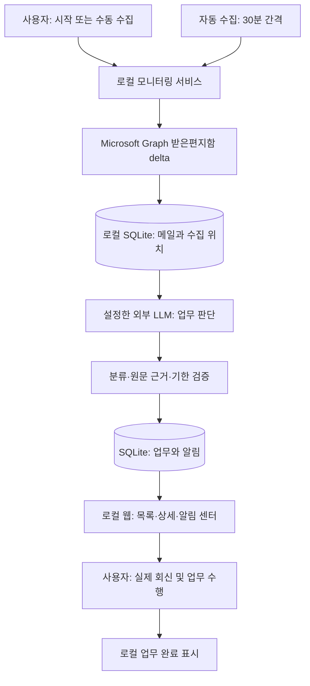

# 현재 구현 내용

> **2026-10-08 기준.** 현재 서비스는 **Outlook 메일 → LLM 분석 → 로컬 웹 업무함**이다. Microsoft To Do에는 등록하지 않는다. 이전 개요·계획 문서의 To Do 구상과 구분한다.

관련 문서: [[4.테스트 및 검증 결과]] · [[5.최종 기능 및 사용 가이드]]

## 1. 목적과 구현 범위

대금 청구·계약·세금계산서·증빙 요청 메일을 놓쳐 업무가 지연되는 문제를 줄인다. 단순히 **읽지 않거나 회신하지 않은 메일 전체**를 나열하지 않고, 내용상 사용자가 수행해야 하는 행동을 추출한다.

| 영역 | 현재 구현 |
|---|---|
| 사용 화면 | Windows에서 실행하는 Python 서버와 `localhost:8765` 웹 화면 |
| 실제 계정 연결 | MSAL 로그인 및 Graph 프로필·받은편지함 읽기 확인 |
| 수집 시작 기준 | **최초 모니터링 시작 이후** 받은편지함에 수신된 메일 |
| 실행 방식 | 30분 간격 자동 실행 및 ‘지금 가져와서 분석’ 수동 실행 |
| 분석 | 요약, 해야 할 행동, 판단 이유, 원문 근거, 기한 추출 |
| 업무함 | 처리할 업무 / 확인 필요 / 완료한 업무 / 제외된 메일 |
| 후속 메일 | 기존 업무와의 중복 판단 및 기한 변경 제안 |
| 알림 | 확정 기한 하루 전 기본 예약, 업무별 시각 지정·해제 |
| 모델 설정 | 호환 프로바이더의 HTTPS 주소·모델 ID·API 키 입력 |
| 목업 | Graph 형태의 합성 메일과 모의 LLM으로 시연 |

## 2. 전체 처리 구조

**자동 처리:** 신규 메일 수집, 분석, 목록 반영, 기한 기반 알림 예약 및 발생 내역 저장.

**사용자 처리:** 초기 연결·모델 설정, 애매한 판단 확인, 실제 회신·서류 발행, 업무 완료 표시, 기한 변경 제안 적용.

## 3. 수집과 재시작·실패 복구

- 처음 모니터링을 시작한 시각을 저장한다. 과거 7일이나 최근 24시간을 매번 소급 분석하지 않는다.
- 재실행·일시 중지 후에도 최초 기준은 유지한다. 활성 상태로 재실행하면 수집을 재개하며, 중단 중 들어온 메일도 다시 수집할 수 있다.
- Graph delta의 페이지를 모두 확보한 뒤 메일과 수집 위치를 같은 DB 트랜잭션에 저장한다. 페이지 조회 실패 시 위치를 앞당기지 않는다.
- delta 토큰 만료 시 최초 기준부터 다시 조회하고 처리된 메일 ID로 중복 분석을 줄인다.
- 분석 실패 건은 대기에 남겨 다음 실행에서 재시도한다. 이미 저장된 대기는 Graph 장애와 별도로 처리할 수 있다.
- 자동·수동 분석은 같은 경로를 사용하며 동시에 중복 실행하지 않는다.

LLM 응답 후 DB 저장에 실패하면 재호출 비용이 발생할 수 있다. 외부 API를 정확히 한 번만 호출하는 구조는 아니다.

## 4. LLM 판단과 기한

LLM은 도구를 자율 실행하는 AI 에이전트가 아니라 **메일마다 구조화된 결과를 반환하는 분석 워크플로우**다. 대상 메일, 수집 범위 안의 관련 대화, 기존 업무를 문맥으로 전달한다.

| 분류 | 기준 예시 |
|---|---|
| 처리할 업무 | 금액 확인 후 회신, 세금계산서 발행일 안내 등 명확한 미완료 요청 |
| 확인 필요 | 실제 담당자 충돌, 충족 여부가 불명확한 조건, 기한 충돌 |
| 제외 | 단순 정보·광고, 명백히 다른 사람만 수행할 업무, 완료된 요청 |

‘확인 후 회신’의 **확인**은 업무 행동이다. 그 단어만으로 확인 필요로 분류하지 않는다. 기한이 없어도 요청이 명확하면 처리할 업무가 될 수 있다.

로그인 주소와 수신 별칭의 불일치는 판단 근거에서 제외했다. LLM 입력에서 로그인 이메일은 제거하되 실제 메일 수신자 정보는 보존한다. 연결 계정 자체의 변경은 별도 계정 ID 검사로 막는다.

기한은 원문의 날짜 표현과 메일 시각을 기반으로 검증한다. 확정되지 않은 날짜를 임의의 마감으로 강제하지 않는다. 후속 메일의 변경 기한은 사용자가 제안을 적용해야 반영된다.

## 5. 알림 구조

**처리할 업무와 확인 필요에 동일한 기본 규칙을 적용한다.**

| 기한 상태 | 기본 알림 |
|---|---|
| 날짜·시간 확정 | 마감 24시간 전 |
| 날짜만 확정 | 전날 오전 9시, 한국 시간 |
| 기한 없음·미확정 | 자동 예약 없음. 알림 시각 직접 지정 가능 |
| 예약 시각이 이미 지남 | 다음 알림 확인 때 1회 안내 |

서버는 5초마다 알림을 확인하고, 브라우저는 2초마다 상태를 조회한다. **현재는 웹 팝업·배너·알림 센터이며 Windows 데스크탑 알림이나 반복 알림은 아니다.**

브라우저를 닫아도 서버가 켜져 있으면 알림 발생 내역을 저장한다. 서버 종료 중에는 처리하지 않으며 재실행 시 지난 예약을 한 번 안내한다. 완료 처리하면 향후 알림을 해제하지만 기존 발생 내역은 남는다. 완료를 되돌린 경우 알림은 직접 다시 켜야 한다.

## 6. 기술 구성과 데이터

| 구성 | 역할 |
|---|---|
| Python 3.12+, 표준 HTTP 서버 | localhost 서버와 실행 관리 |
| HTML/CSS/JavaScript | 업무함·설정·알림 UI |
| MSAL / Microsoft Graph | 위임 로그인 및 메일 읽기 |
| OpenAI 호환 Chat Completions | 선택한 모델로 JSON 업무 분석 |
| SQLite | 메일·분석 대기·업무·기한·알림·수집 위치 저장 |
| Windows DPAPI | 저장 API 키 및 로그인 토큰 보호 |

주요 코드: `web.py`는 HTTP/연결, `monitor.py`는 수집·재시도·예약, `analysis.py`는 프롬프트·결과 검증, `deadlines.py`는 기한 검증, `provider.py`는 URL·키 보호, `demo.py`는 공통 업무 상태를 담당한다.

저장 루트는 `%LOCALAPPDATA%/AIOutlookReminder`다. 실제 상태는 `web-live/state.sqlite`, 목업은 `web-monitor/mock.sqlite`, 연결 설정은 `web-connection.json`에 저장한다.

**메일 본문과 분석 결과는 로컬 DB에 평문 저장된다.** 실제 분석 시 제목·본문·발신/수신자·관련 대화·기존 업무가 설정한 외부 LLM 서버로 전달된다. 외부 보관 정책은 공급자 정책에 따른다. 자동 보관기한·삭제·비용 상한 기능은 없다.

## 7. 현재 경계

- 단일 Windows 사용자·단일 사서함 PoC다. 회사 테넌트, 공동메일함, 다중 사용자 운영은 추가 검증·구현이 필요하다.
- 받은편지함만 수집한다. 첨부파일 내용, 보낸편지함 문맥, 다른 폴더로 바로 이동된 메일은 현재 범위 밖이다.
- 실제 회신·메일 수정·자동 완료·To Do 등록은 수행하지 않는다.
- 기한 직접 편집·수동 확정은 미구현이며, **알림 시각 지정과 기한 수정은 다르다.**
- 설치 패키지, Windows 시작 시 자동 실행, 서버 상시 운영, 데스크탑 알림은 미구현이다.
- LLM의 오분류를 완전히 방지하지는 못한다. 목업도 Microsoft 서비스의 모든 동작을 재현하지 않는다.

## 근거

- [저장소 README](C:/Users/염정운/project/AI-outlook-reminder/README.md)
- [최신 분류 및 실제 메일 검증 기록](C:/Users/염정운/project/AI-outlook-reminder/docs/superpowers/verification/inbox-action-prompt.md)
