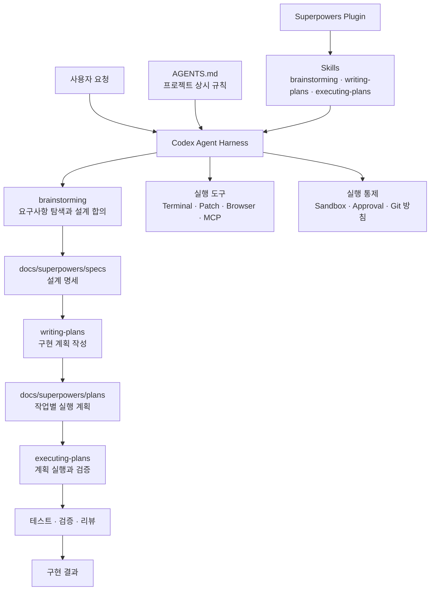
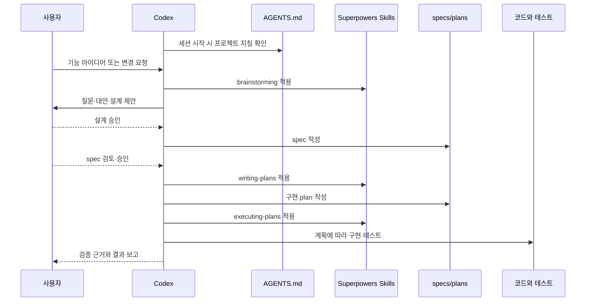
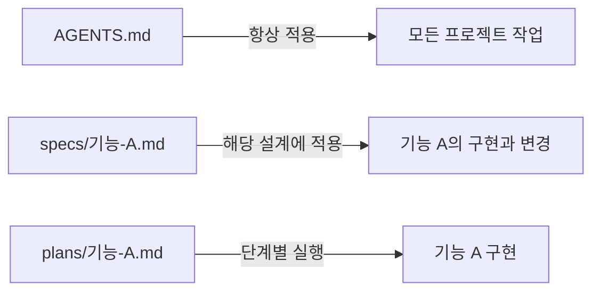

# Codex 하네스 엔지니어링 종합 개요

## 1. 하네스 엔지니어링이란

LLM의 성능만으로는 안정적인 개발 Agent를 만들 수 없다. Agent가 어떤 지침을 읽고, 어떤 절차를 거치며, 어떤 도구를 사용할 수 있고, 결과를 어떻게 검증하는지를 둘러싼 실행 환경이 필요하다. 이 환경을 **Agent Harness**라고 보고, 프로젝트 목적에 맞게 구성하는 일을 **하네스 엔지니어링**이라고 부를 수 있다.

Codex 자체가 Agent Harness라면 다음 요소들은 그 Harness를 조정하는 구성요소다.

- `AGENTS.md`: 프로젝트에서 항상 지켜야 할 작업 규칙
- Skills·Plugins: 특정 종류의 작업에 사용하는 반복 절차와 도구 묶음
- `specs`: 합의된 설계와 요구사항
- `plans`: 설계를 실행 가능한 작업 단위로 분해한 구현 계획
- Terminal·Patch·Browser·MCP: Agent가 실제 행동에 사용하는 도구
- Sandbox·Approval: Agent가 할 수 있는 행동의 경계
- Test·Review·Verification: 결과가 맞는지 판단하는 피드백 장치

## 2. 전체 구조 다이어그램



이 다이어그램에서 `AGENTS.md`와 Superpowers는 서로 대체 관계가 아니다. `AGENTS.md`는 **무엇을 항상 지켜야 하는지**, Superpowers 스킬은 **특정 작업을 어떤 순서로 진행할지**를 정한다.

## 3. 구성요소 비교

| 구성요소 | 분류 | 핵심 질문 | 적용 시점 | 대표 결과 |
|---|---|---|---|---|
| Codex | Agent Harness | 누가 작업을 실행하는가? | 전체 세션 | 도구를 사용하는 Agent 실행 |
| `AGENTS.md` | 프로젝트 지침 | 이 저장소에서 무엇을 지켜야 하는가? | 세션 시작 시 탐색 | 코딩·테스트·Git·보안 규칙 |
| Superpowers | Plugin | 어떤 재사용 Workflow를 추가할 것인가? | 설치·활성화 후 | 여러 Skills 제공 |
| `$brainstorming` | Skill | 무엇을 왜 만들 것인가? | 구현 전 | 승인된 설계, 필요 시 spec |
| `specs` | 설계 산출물 | 합의된 구조와 요구사항은 무엇인가? | 설계 이후 | As-designed/As-built 명세 |
| `$writing-plans` | Skill | 어떤 파일을 어떤 순서로 바꿀 것인가? | 승인된 spec 이후 | 세부 구현 계획 |
| `plans` | 실행 산출물 | 각 작업의 테스트·구현 단계는 무엇인가? | 구현 직전 | 체크박스 기반 작업 목록 |
| `$executing-plans` | Skill | 계획을 어떻게 검증하며 실행할 것인가? | 계획 승인 후 | 코드·테스트·검증 결과 |
| Sandbox·Approval | 실행 통제 | 어디까지 자동으로 행동할 수 있는가? | Tool 실행 시 | 허용·거절·사용자 승인 |

## 4. 일반적인 작업 흐름



작은 수정은 전체 문서를 만들지 않을 수도 있다. Superpowers의 `brainstorming`은 작업을 Spike, Bounded, Architectural로 분류하며, Bounded 작업은 짧은 채팅 설계와 승인만으로 진행할 수 있다. 반대로 새 시스템이나 인터페이스 변경은 spec과 plan을 남기는 Architectural 절차가 적합하다.

## 5. 자동 적용과 수동 호출

활성화된 Skill은 요청 내용이 설명과 일치하면 Codex가 자동으로 선택할 수 있다. 반드시 특정 Skill을 사용하게 만들고 싶다면 Codex에서 `$` 멘션으로 명시한다.

```text
$brainstorming 회의록 Agent에 새로운 요약 기능을 추가하고 싶어.
```

활성화된 Skill이 앱의 Slash command 목록에 표시되는 환경에서는 `/brainstorming`처럼 선택할 수도 있다. 다만 개념적으로는 “일반 명령어”라기보다 **Skill을 명시적으로 호출하는 것**이다.

| 입력 | 의미 |
|---|---|
| 일반적인 자연어 요청 | Codex가 적합한 Skill을 판단하여 적용 가능 |
| `$brainstorming ...` | 해당 Skill을 명시적으로 선택 |
| `/brainstorming` | 앱의 Slash 목록에 노출된 경우 UI에서 선택 |
| `AGENTS.md` 작성 | 특정 Skill 호출이 아니라 프로젝트 상시 규칙 설정 |

중요한 설계 작업에서 절차 적용 여부를 확실히 하고 싶다면 `$brainstorming`처럼 직접 지정하는 편이 안전하다.

## 6. 지침의 우선순위

```text
플랫폼의 안전·권한 제한
→ 현재 사용자의 명시적인 요청
→ 프로젝트의 AGENTS.md
→ 선택된 Skill의 Workflow
→ Codex의 일반적인 작업 방식
```

Skill은 강력한 기본 Workflow를 제공하지만 사용자 지시와 프로젝트 방침을 무시할 수 없다. 예를 들어 Superpowers가 worktree나 Commit을 권장하더라도 `AGENTS.md`에 다음과 같은 POC 방침이 있고 사용자가 이를 요구했다면 해당 방침을 따른다.

```md
- 별도 브랜치와 Git worktree를 생성하지 않는다.
- 사용자의 명시적인 요청 없이 Commit하지 않는다.
- Pull Request와 Draft Pull Request를 생성하지 않는다.
```

## 7. `AGENTS.md`와 `specs`의 차이



| 구분 | `AGENTS.md` | `specs` | `plans` |
|---|---|---|---|
| 수명 | 프로젝트 전반에 지속 | 특정 기능·시스템의 설계가 유효한 동안 | 해당 구현 작업이 완료될 때까지 중심적으로 사용 |
| 내용 | 규칙·금지사항·검증 명령 | 구조·책임·데이터 흐름·요구사항 | 파일·테스트·단계별 구현 절차 |
| 자동 탐색 | Codex가 세션 시작 시 탐색 | 자동 전체 로드를 보장하지 않음 | 자동 전체 로드를 보장하지 않음 |
| 변경 빈도 | 낮음 | 설계 변경 시 | 구현 계획 변경 시 |
| 예시 | API 키 금지, 테스트 명령 | Search→Question Graph 설계 | 테스트 작성→실패 확인→구현→통과 확인 |

## 8. 새 세션을 시작하는 권장 문장

자동 적용에 맡길 때:

```text
이 프로젝트의 AGENTS.md를 따르고 docs/superpowers/specs의 관련 설계를 읽어줘.
회의록 Agent에 새로운 기능을 추가하려고 하니 구현 전에 설계부터 함께 정리해줘.
```

Skill을 명시적으로 고정할 때:

```text
$brainstorming

AGENTS.md와 docs/superpowers/specs의 관련 문서를 읽고,
회의록 Agent의 새로운 기능을 설계해줘.
```

새 세션은 이전 채팅 전체를 자동으로 기억하지 않는다. `AGENTS.md`, specs, plans, 코드와 테스트가 세션 사이의 지속 가능한 인수인계 수단이다.

## 9. 핵심 정리

- Codex는 Agent Harness다.
- `AGENTS.md`는 Claude Code의 `CLAUDE.md`처럼 Harness를 프로젝트에 맞게 조정하는 지침 파일이다.
- Superpowers는 설계·계획·구현·디버깅·검증 절차를 제공하는 Plugin이다.
- `brainstorming`, `writing-plans`, `executing-plans`는 Plugin 내부의 Skills다.
- specs는 합의된 설계를, plans는 실행 순서를 보존한다.
- 자연어 요청으로 Skill이 자동 적용될 수 있고 `$skill-name`으로 명시할 수 있다.
- 프로젝트 지침과 사용자 요청은 Skill의 일반적인 기본값보다 우선한다.

