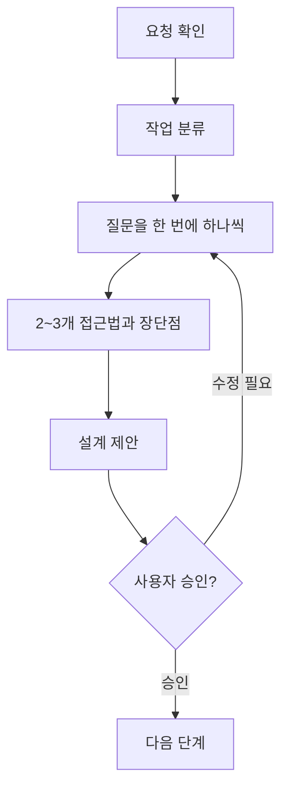

# brainstorming 사용 방법

## 1. 목적

`brainstorming`은 코드부터 작성하지 않고 사용자 의도, 요구사항, 제약과 성공 조건을 먼저 명확하게 만드는 Skill이다. 새로운 기능, 컴포넌트, 동작 변경처럼 창작과 설계 판단이 필요한 작업에서 구현보다 먼저 사용한다.

## 2. 세 가지 작업 경로

| 분류 | 의미 | 설계 산출물 |
|---|---|---|
| Spike | 가능성 조사 또는 빠른 검증 | 조사 결과와 권고, 보존할 구현은 만들지 않음 |
| Bounded | 기존 흐름에 대한 잘 정의된 작은 변경 | 채팅 안의 짧은 설계와 사용자 승인 |
| Architectural | 새 프로젝트·하위 시스템·공용 인터페이스 변경 | 정식 spec과 후속 구현 plan |

복잡성이 애매하면 더 무거운 절차를 선택하고, 작업 중 숨은 복잡성이 발견되면 상위 경로로 전환한다.

## 3. 핵심 원칙



가장 중요한 규칙은 **사용자가 설계를 승인하기 전에 구현하지 않는 것**이다. 작은 변경도 설계의 길이만 짧아질 뿐 승인 단계는 생략하지 않는다.

## 4. Architectural 작업의 결과

Architectural 작업에서는 합의된 설계를 다음 기본 위치에 저장한다.

```text
docs/superpowers/specs/YYYY-MM-DD-<topic>-design.md
```

문서 작성 후에는 Placeholder, 모순, 범위와 모호성을 자체 점검하고 사용자가 spec을 검토하도록 요청한다. 승인 후 다음 Skill은 `writing-plans`다.

## 5. 호출 예시

```text
$brainstorming

AGENTS.md와 기존 회의록 Agent spec을 읽고,
회의별 액션 아이템 추출 기능을 설계해줘.
구현 전에는 나에게 설계 승인을 받아줘.
```

일반 문장으로 같은 의도를 표현해도 자동 적용될 수 있다.

```text
액션 아이템 추출 기능을 만들고 싶어. 바로 코딩하지 말고 요구사항과 설계를 먼저 같이 정리하자.
```

## 6. 주의사항

- 질문은 한 번에 하나씩 진행한다.
- 사용자가 선택할 수 있도록 2~3개 접근법과 Trade-off를 제시한다.
- 설계 승인과 구현 승인을 같은 것으로 가정하지 않는다.
- 이미 존재하는 코드에서는 구조와 최근 변경을 먼저 확인한다.
- 사용자 방침으로 Commit을 금지했다면 spec 작성 뒤에도 Commit하지 않는다.

