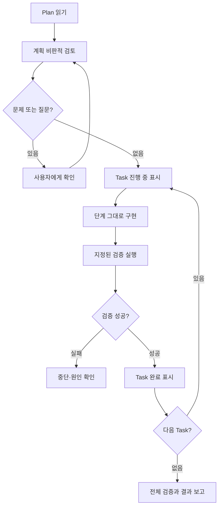

# executing-plans 사용 방법

## 1. 목적

`executing-plans`는 이미 작성된 구현 계획을 읽고, 비판적으로 검토한 다음, Task를 순서대로 실행하고 검증하는 Skill이다. 계획이 있다고 무조건 실행하지 않고 먼저 누락, 모순과 현재 코드와의 충돌을 확인한다.

## 2. 실행 흐름



## 3. 중단해야 하는 경우

- 필수 Dependency 또는 파일이 없음
- 계획에 중요한 누락이나 모순이 있음
- 테스트가 실패하고 원인을 확정하지 못함
- 지시의 의미가 불명확함
- 현재 코드가 plan 작성 시점과 크게 달라짐

이 경우 임의로 밀어붙이지 않고 사용자에게 확인하거나 plan 단계로 돌아간다.

## 4. 호출 예시

```text
$executing-plans

docs/superpowers/plans/2026-08-31-example.md를 읽고 실행해줘.
AGENTS.md의 POC 방침에 따라 현재 작업 디렉터리를 사용하고,
브랜치, worktree, Commit과 PR은 만들지 마.
각 Task의 테스트 결과를 확인해줘.
```

## 5. Subagent 방식과 Inline 방식

Superpowers는 독립 Task가 많고 Subagent를 사용할 수 있을 때 `subagent-driven-development`를 권장할 수 있다. 단일 세션에서 순서대로 실행하려면 `executing-plans`를 사용할 수 있다.

| 방식 | 적합한 상황 | 특징 |
|---|---|---|
| Subagent-Driven | 독립 Task가 여러 개이고 병렬화·리뷰가 유리함 | Task별 새 Agent와 단계별 검토 |
| Inline Execution | 한 세션에서 순차 실행하거나 Task 의존성이 큼 | 계획을 순서대로 실행하고 Checkpoint에서 보고 |

프로젝트 또는 사용자가 Subagent 사용을 요청하지 않았거나 금지했다면 Inline 방식으로 진행한다.

## 6. Git 기본 절차와 프로젝트 예외

Skill은 격리 Workspace와 완료 단계의 Branch 정리를 기본적으로 권장할 수 있다. 하지만 현재 회의록 Agent POC처럼 `AGENTS.md`에 다음이 명시되면 이를 따른다.

- 현재 작업 디렉터리에서 작업
- 자동 worktree·Branch 생성 금지
- 사용자 요청 없는 Commit 금지
- PR·Draft PR 생성 금지

이는 Superpowers를 끄는 것이 아니라 실행 절차를 프로젝트 제약에 맞게 조정하는 것이다.

