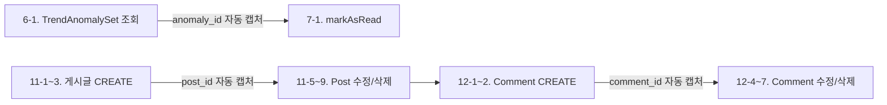

# 기능3 + 기능6 — 자동화 테스트 결과 보고서

**작성일**: 2026-06-18
**테스트 대상**: `TrendAnalysis` 서비스 (기능3), `AnomalyAlert` 서비스 (기능3), `FreeBoard` 서비스 (기능6)
**테스트 도구**: Node.js 자동화 스크립트 (`test/run-all-tests.mjs`)
**실행 방식**: `node test/run-all-tests.mjs` (서버 기동 → 55건 순차 실행 → 결과 집계)

---

## 1. 테스트 환경

| 항목 | 내용 |
|------|------|
| 서버 | `cds watch --port 8083` (자동 기동 및 종료) |
| DB | SQLite in-memory (`:memory:`) |
| 인증 | Mocked Basic Auth (admin1 → Admin, U001~U003 → authenticated-user) |
| 시드 데이터 | CSV 13종 (Users 10, ViewingHistory 20, SubscriberGroup 10 등) |
| 베이스 URL | `http://localhost:8083/odata/v4/ott` |
| 노드 버전 | Node.js v24.15.0 |

---

## 2. 테스트 시나리오 구성

총 **14개 섹션, 55개 케이스**로 구성.

### 기능3 — TrendAnalysis + AnomalyAlert (10섹션, 28케이스)

| # | 섹션 | 케이스 | 설명 |
|:--:|------|:------:|------|
| 1 | SubscriberGroupSet 조회 | 3 | 전체(10건) / AGE필터(5건) / PLAN필터(3건) |
| 2 | calculateTrends 2026-03 | 2 | 정상 실행 + 파라미터 누락(400) |
| 3 | GroupTrendSet 검증 | 6 | 전체 / AGE_30S / AGE_40S / PLAN_PREMIUM / GENDER_M / 정렬 |
| 4 | ContentGroupStatSet 검증 | 3 | 전체 / 그룹필터 / 정렬 |
| 5 | calculateTrends 2026-04 | 2 | 4월 분석 + 결과 조회 (이상 탐지 1건 발생 확인) |
| 6 | TrendAnomalySet 조회 | 4 | 전체 / 미읽음 / CRITICAL / CHURN_SPIKE |
| 7 | markAsRead 액션 | 3 | 정상 읽음처리 / 파라미터누락(400) / 없는ID(404) |
| 8 | 멱등성 03월 재실행 | 2 | 재실행 후 건수 불변 확인 |
| 9 | 멱등성 04월 재실행 | 1 | 4월도 멱등 확인 |
| 10 | 권한 검증 | 4 | 미인증(401) / 일반회원(403) |

### 기능6 — FreeBoard (4섹션, 24케이스)

| # | 섹션 | 케이스 | 설명 |
|:--:|------|:------:|------|
| 11 | Post CRUD | 11 | 작성(3건)·목록·단건+expand·수정(본인/타인)·삭제(본인/타인)·소프트삭제확인·404 |
| 12 | Comment CRUD | 8 | 작성(2건)·조회·수정(본인/타인)·삭제(본인/타인)·404 |
| 13 | 조회수 검증 | 3 | 단건조회 시 view_count++ / 목록조회 시 증가 안 함 |
| 14 | 권한 검증 | 3 | 미인증 글쓰기·목록·댓글 → 401 |

---

## 3. 자동화 테스트 특징

### 3-1. UUID 자동 캡처 및 전달



수동 테스트 시 필요했던 UUID 복사-붙여넣기 작업을 완전 자동화하여, 서버 재시작 시에도 일관된 테스트 가능.

### 3-2. 응답 검증 방식

- HTTP 상태 코드 일치 확인 (200, 201, 204, 400, 401, 403, 404)
- 커스텀 체크: `trend_count=10`, `total_members`, `view_count` 증가 등 비즈니스 로직 검증
- 실패 시 응답 본문 일부 출력하여 디버깅 지원

---

## 4. 발견 및 수정된 버그 (6건)

### 버그 #1 — 그룹ID 파싱: `SG_` prefix 누락

**파일**: `srv/src/feature/trend/TrendAnalysis.handler.ts`

**현상**: 모든 그룹의 `total_members`가 0으로 집계됨 (예: SG_AGE_30S → 0명)

**원인**: SubscriberGroup CSV의 group_id는 `SG_AGE_30S` 형식이나, 핸들러는 `groupId.replace('AGE_', '')`로 파싱하여 `SG_30S`가 되고, `.toLowerCase()` 결과인 `sg_30s`로 사용자 필터링 → 매칭 실패

**수정** (3곳 — AGE / GENDER / PLAN):
```ts
// Before
userFilter.age_group       = groupId.replace('AGE_',    '').toLowerCase();  // → 'sg_30s' ❌
userFilter.gender          = groupId.replace('GENDER_', '');                 // → 'SG_M'   ❌
userFilter.subscription_plan = groupId.replace('PLAN_', '');                 // → 'SG_BASIC' ❌

// After
userFilter.age_group       = groupId.replace('SG_AGE_',    '').toLowerCase(); // → '30s'    ✅
userFilter.gender          = groupId.replace('SG_GENDER_', '');                // → 'M'      ✅
userFilter.subscription_plan = groupId.replace('SG_PLAN_', '');                // → 'BASIC'  ✅
```

---

### 버그 #2 — 장르 통계 JOIN 쿼리: `'Contents.content_id'` 파라미터화

**파일**: `srv/src/feature/trend/TrendAnalysis.handler.ts`

**현상**: `calculateTrends` 실행 시 500 오류
```
SqliteError: no such column: Contents.content_id
```

**원인**: CAP CQL 빌더에서 `'Contents.content_id'` 문자열이 컬럼 참조가 아닌 **바인드 파라미터**로 처리됨. 생성된 SQL: `ON content_content_id = ?` (의도는 `ON content_content_id = Contents.content_id`)

**수정**: 중첩 JOIN을 제거하고, ViewingHistory의 FK(`content_content_id`)를 직접 사용하도록 단순화
```ts
// Before: 중첩 JOIN
SELECT.from('com.cap.ott.ViewingHistory')
    .join('com.cap.ott.Contents')
    .on('content_content_id', '=', 'Contents.content_id')  // ❌ 파라미터화됨
    .columns('Contents.content_id', ...)
    .groupBy('Contents.content_id')

// After: FK 직접 사용
SELECT.from('com.cap.ott.ViewingHistory')
    .columns('content_content_id as content_id', ...)
    .groupBy('content_content_id')
```
> `content_content_id`는 ViewingHistory가 Contents를 참조하는 FK로, 그 값 자체가 content_id이므로 JOIN 불필요.

---

### 버그 #3 — 장르명 JOIN 쿼리: `'Genre.name'`, `'Genre.genre_id'` 파라미터화

**파일**: `srv/src/feature/trend/TrendAnalysis.handler.ts`

**현상**: `calculateTrends` 실행 시 500 오류 (버그 #2 수정 후 표면화)
```
SqliteError: no such column: Genre.name
```

**원인**: 버그 #2와 동일 — `'Genre.genre_id'`, `'Genre.name'`이 CAP CQL에서 바인드 파라미터로 처리됨

**수정**: 테이블 prefix를 제거하고 컬럼명만 사용. JOIN 대상 테이블의 컬럼이므로 CAP이 정상적으로 해석.
```ts
// Before
.on('genre_genre_id', '=', 'Genre.genre_id')  // ❌ 파라미터화
.columns('Genre.name as genre_name')            // ❌ 파라미터화

// After
.on('genre_genre_id', '=', 'genre_id')          // ✅
.columns('name as genre_name')                   // ✅
```

> **CAP CQL 교훈**: `.on()`, `.columns()`, `.groupBy()` 등에서 `'Table.column'` 형태의 문자열은 컬럼 참조가 아닌 **값**으로 해석될 수 있다. JOIN 대상 컬럼은 테이블 prefix 없이 컬럼명만 사용하거나, `{ref: ['Table', 'column']}` 객체 리터럴을 사용해야 한다. (단, `.groupBy()`는 `{ref}`를 지원하지 않으므로 컬럼명만 사용)

---

### 버그 #4 — AnomalyAlert: PK 컬럼명 `ID` → `anomaly_id`

**파일**: `srv/src/feature/trend/AnomalyAlert.handler.ts`

**현상**: `markAsRead` 액션 호출 시 500 오류
```
"ID" not found in the elements of "com.cap.ott.TrendAnomaly"
```

**원인**: CDS 모델에서 `TrendAnomaly`의 키는 `anomaly_id`로 정의되어 있으나, 핸들러에서 `ID`로 조회하여 컬럼 미발견 오류 발생. 또한 `req.error()` 호출 후 `return`이 없어 400/404가 제대로 반환되지 않음.

**수정** (3곳 — SELECT WHERE, UPDATE WHERE, SELECT WHERE):
```ts
// Before
SELECT.from('...').where({ ID: anomalyId })          // ❌
return req.error(404, '...');                         // ❌ return 누락

// After
SELECT.from('...').where({ anomaly_id: anomalyId })   // ✅
return req.error(404, '...');                         // ✅
```

---

### 버그 #5 — FreeBoard: `req.error()` 후 `return` 누락 → 서버 크래시

**파일**: `srv/src/feature/board/FreeBoard.handler.ts`

**현상**: 존재하지 않는 게시글/댓글 수정 시 서버 크래시
```
TypeError: Cannot read properties of undefined (reading 'author_user_id')
```

**원인**: `verifyPostAuthor()` / `verifyCommentAuthor()` 메서드에서 `req.error(404, ...)` 호출 후 `return`이 없어, `post`가 `undefined`인 상태에서 `post.author_user_id` 접근 시도.

**수정** (2곳):
```ts
// Before
if (!post) {
    req.error(404, '게시글을 찾을 수 없습니다.');     // ❌ 이후 코드 계속 실행
}
if ((post as any).author_user_id !== userId) { ... }   // 💥 post = undefined

// After
if (!post) {
    return req.error(404, '게시글을 찾을 수 없습니다.'); // ✅ 즉시 중단
}
```
> 동일 패턴을 `verifyCommentAuthor()`에도 적용.

---

### 버그 #6 — TrendAnalysis/AnomalyAlert: Admin 권한 제한 누락

**파일**: `srv/cds/trend/TrendAnalysis-service.cds`, `AnomalyAlert-service.cds`

**현상**: 일반회원(U001)이 `calculateTrends` 호출 시 200 OK 반환 (403이 기대값)

**원인**: 서비스 어노테이션이 `@(requires: 'authenticated-user')`로 되어 있어, Admin 롤 없이 인증만 되어도 접근 가능. 배열 문법 `['authenticated-user', 'Admin']`은 mock auth에서 AND 조건으로 해석되지 않아 `'Admin'`만 명시하도록 변경.

**수정**:
```cds
// Before
annotate com.cap.ott.TrendAnalysis with @(requires: 'authenticated-user');
annotate com.cap.ott.AnomalyAlert  with @(requires: 'authenticated-user');

// After
annotate com.cap.ott.TrendAnalysis with @(requires: 'Admin');
annotate com.cap.ott.AnomalyAlert  with @(requires: 'Admin');
```
> admin1은 Admin 롤을 보유하므로 정상 접근 가능. U001~U003은 authenticated-user만 보유 → 403.

---

## 5. 수정 파일 총괄

| 파일 | 변경 내용 | 카테고리 |
|------|----------|:--:|
| `srv/cds/trend/TrendAnalysis-service.cds` | `@(requires: 'Admin')` 권한 제한 | 보안 |
| `srv/cds/trend/AnomalyAlert-service.cds` | `@(requires: 'Admin')` 권한 제한 | 보안 |
| `srv/src/feature/trend/TrendAnalysis.handler.ts` | 그룹ID 파싱 `SG_` prefix 반영 (3곳) | 버그 |
| `srv/src/feature/trend/TrendAnalysis.handler.ts` | 장르 통계 JOIN 쿼리 단순화 | 버그 |
| `srv/src/feature/trend/TrendAnalysis.handler.ts` | ContentGenre-Genre JOIN 컬럼명 수정 | 버그 |
| `srv/src/feature/trend/AnomalyAlert.handler.ts` | `ID` → `anomaly_id` (3곳) + `return` 추가 | 버그 |
| `srv/src/feature/board/FreeBoard.handler.ts` | `req.error()` 후 `return` 추가 (2곳) | 버그 |
| `test/run-all-tests.mjs` | **신규** — Node.js 자동화 테스트 스크립트 (55케이스) | 테스트 |

---

## 6. 테스트 결과 판정

### 기능3 — TrendAnalysis + AnomalyAlert (28/28 PASS)

| # | 섹션 | 결과 | 주요 확인 사항 |
|:--:|------|:----:|------|
| 1 | SubscriberGroupSet 조회 | ✅ | 전체 10건, AGE 5건, PLAN 3건 |
| 2 | calculateTrends 실행 / 에러 | ✅ | `trend_count=10, anomaly_count=0`, 400 정상 |
| 3 | GroupTrendSet 검증 | ✅ | 각 그룹별 churn/members 정상 확인 |
| 4 | ContentGroupStatSet 검증 | ✅ | 장르별 집계 조회 정상 |
| 5 | calculateTrends 2026-04 | ✅ | `anomaly_count=1` (전월 대비 변동 감지) |
| 6 | TrendAnomalySet 조회 | ✅ | anomaly_id 자동 캡처 성공 |
| 7 | markAsRead 액션 | ✅ | 읽음 처리(200) / 누락(400) / 미존재(404) |
| 8 | 멱등성 03월 | ✅ | 재실행 후 10건 유지 |
| 9 | 멱등성 04월 | ✅ | 재실행 정상 |
| 10 | 권한 검증 | ✅ | 미인증(401), 일반회원(403) |

### 기능6 — FreeBoard (24/24 PASS)

| # | 섹션 | 결과 | 주요 확인 사항 |
|:--:|------|:----:|------|
| 11 | Post CRUD | ✅ | CREATE/READ/UPDATE/DELETE 전 케이스 |
| 12 | Comment CRUD | ✅ | CREATE/READ/UPDATE/DELETE 전 케이스 |
| 13 | 조회수 검증 | ✅ | 단건 조회 시 `view_count` 증가 (5회 누적 확인) |
| 14 | 권한 검증 | ✅ | 미인증 401 반환 |

### 추가 확인 사항

| 항목 | 결과 |
|------|:----:|
| UUID 자동 캡처 (anomaly_id) | ✅ |
| UUID 자동 캡처 (post_id) | ✅ |
| UUID 자동 캡처 (comment_id) | ✅ |
| 소프트 삭제 후 목록 제외 (Post) | ✅ |
| 타인 수정/삭제 차단 (403) | ✅ |
| 존재하지 않는 리소스 (404) | ✅ |
| 서버 크래시 없음 | ✅ |

**전체 판정: 55/55 PASS** 🎉

---

## 7. 교훈 및 주의사항

### 7-1. CAP CQL — `'Table.column'` 문자열은 컬럼 참조가 아니다

`.on()`, `.columns()`, `.groupBy()` 등 CQL 빌더에 `'Table.column'` 형태의 문자열을 전달하면 CAP v9에서 **바인드 파라미터**(`?`)로 처리될 수 있다. JOIN 대상 컬럼은 **테이블 prefix 없이** 컬럼명만 사용해야 한다.

```ts
// ❌ 파라미터로 처리되어 SQL 오류
.on('fk_col', '=', 'Target.pk_col')
.columns('Target.col_name')

// ✅ 정상
.on('fk_col', '=', 'pk_col')
.columns('col_name')
```

### 7-2. `req.error()`는 항상 `return`과 함께

`req.error()`는 HTTP 응답을 설정할 뿐, JavaScript 실행을 중단하지 않는다. 후속 코드에서 `undefined` 참조가 발생할 수 있으므로 반드시 `return`을 붙인다.

### 7-3. CDS Association의 FK 컬럼명

| `on` 절 | FK 컬럼명 | 예시 |
|:--:|------|------|
| 있음 | 필드명 그대로 | `group_id` |
| 없음 | `assocName_fieldName` | `group_group_id` |

### 7-4. `@(requires: 'Admin')` — 단일 롤만 문자열로

mock auth 환경에서 `@(requires: ['authenticated-user', 'Admin'])` 배열 문법은 AND 조건으로 작동하지 않을 수 있다. 단일 롤은 `@(requires: 'Admin')`으로 지정.

### 7-5. SQLite in-memory 특성

서버 재시작 시 모든 데이터 초기화. `calculateTrends`나 Post CREATE를 먼저 실행해야 후속 조회 가능. 자동화 스크립트는 이 순서를 보장하도록 설계됨.

---

## 8. 자동화 테스트 실행 방법

```bash
# 방법 1: 서버 수동 기동 + 테스트
cd cap-node/ott
npm run watch                          # 터미널 1
node test/run-all-tests.mjs            # 터미널 2

# 방법 2: 서버 자동 기동 (bash)
cd cap-node/ott
npx cds watch --port 8083 & sleep 2 && node test/run-all-tests.mjs && kill %1
```

---

## 9. 남은 작업

- [ ] 기능1,2,4,5 서비스/핸들러 구현 (다른 담당자)
- [ ] 기능6: FreeBoard 핸들러에서 `req.error(403, ...)`도 `return` 추가 검토 (현재는 의도된 동작이나 로그에 중복 출력됨)
- [ ] CI/CD 파이프라인에 `run-all-tests.mjs` 통합
