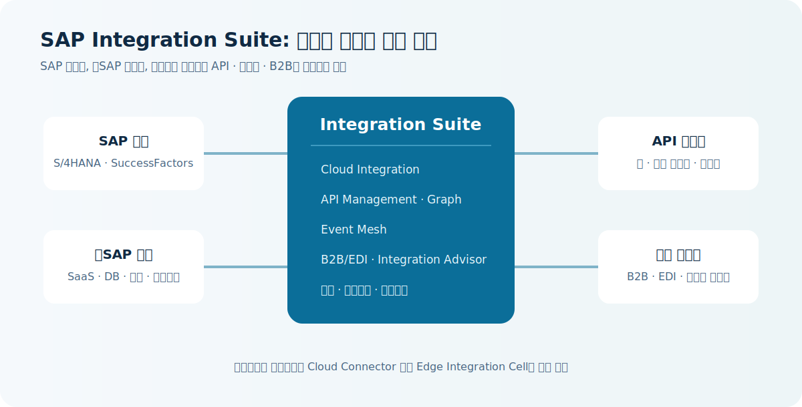
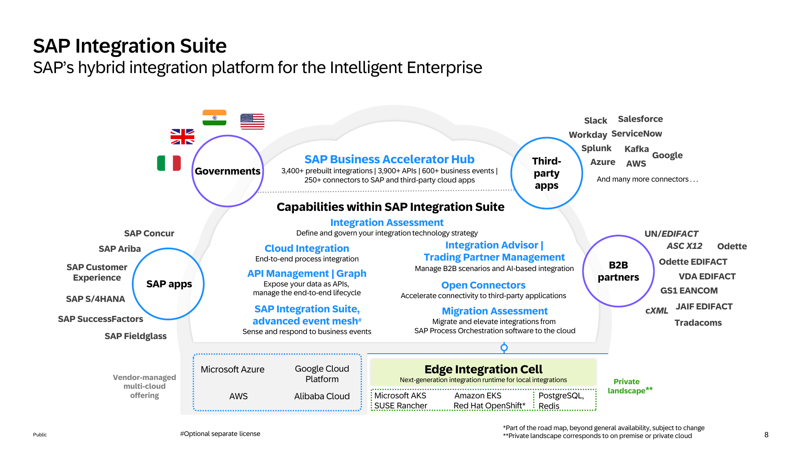

# 1. SAP Integration Suite 정의

## 결론

**SAP Integration Suite는 SAP BTP에서 SAP·비SAP 시스템 사이의 애플리케이션, 데이터, 프로세스, API, 이벤트를 연결하고 관리하는 클라우드 통합 플랫폼(iPaaS)입니다.**

여기서 핵심은 두 가지입니다.

1. SAP S/4HANA, SuccessFactors 같은 SAP 제품뿐 아니라 Salesforce, AWS, 데이터베이스, 파일 서버, 파트너 시스템도 연결 대상으로 삼습니다.
2. 연결 하나를 만드는 것에서 끝나지 않고, API 보안·배포·모니터링·오류 추적·재사용을 함께 다룹니다.

## 업무에서 보는 구조

예를 들어 S/4HANA에서 생성된 고객 주문을 Salesforce, 물류 시스템, 거래처 EDI 시스템에 전달해야 한다고 합시다. Integration Suite는 각 시스템의 통신 방식과 데이터 형식 차이를 처리하고, 필요한 변환·검증·보안 정책을 적용하며, 처리 결과를 운영자가 추적할 수 있게 합니다.

## SAP 공식 소개자료의 참조 아키텍처

아래 그림은 SAP가 2024년 2월에 공개한 소개서의 8쪽입니다. SAP 앱, 타사 앱, B2B 파트너, 정부 시스템을 가운데의 Integration Suite capability로 연결하고, 클라우드 런타임과 프라이빗 랜드스케이프의 Edge Integration Cell을 나란히 보여 줍니다. 우리 가이드의 개념도보다 제품 기능의 배치를 더 구체적으로 확인할 때 참고하기 좋습니다.

> **자료 시점 주의**: 이 그림은 2024년 공개 자료입니다. 그림의 커넥터·콘텐츠 개수와 `roadmap` 표기 항목은 현재 계약상의 기능 보장이 아니며, 최신 범위는 Help Portal과 서비스 플랜을 기준으로 확인해야 합니다.

## iPaaS라는 말의 의미

| 용어 | 이 문서에서의 의미 |
|---|---|
| Integration | 서로 다른 시스템이 정해진 방식으로 데이터와 요청을 주고받게 만드는 것 |
| Platform | 개발, 보안, 운영, 모니터링에 필요한 공통 기능을 제공하는 기반 |
| as a Service | 고객이 서버와 미들웨어를 직접 설치·패치하기보다 SAP가 운영하는 클라우드 서비스를 사용하는 방식 |

따라서 Integration Suite는 단순한 ETL 도구나 API Gateway만을 뜻하지 않습니다. 메시지 기반 프로세스 통합, API 관리, 이벤트, B2B/EDI 등 서로 다른 통합 방식을 함께 다룹니다.

## 무엇이 아닌가

- ERP 자체가 아닙니다. S/4HANA의 업무 기능을 대체하지 않습니다.
- 모든 데이터를 저장하는 데이터 플랫폼이 아닙니다. 필요한 데이터를 이동·변환·연결하는 역할이 중심입니다.
- 코드가 전혀 필요 없는 도구도 아닙니다. 표준 콘텐츠와 그래픽 모델링으로 시작할 수 있으나, 복잡한 변환·오류 처리·보안 요구에는 통합 개발 역량이 필요합니다.

## SAP PI/PO와의 관계

SAP PI/PO가 온프레미스 중심의 SAP 통합 제품군이었다면, Integration Suite는 BTP에서 제공되는 현재의 클라우드 중심 통합 서비스입니다. 온프레미스 시스템도 SAP Cloud Connector 또는 Edge Integration Cell 등 하이브리드 방식으로 연결할 수 있습니다. 다만 PI/PO의 모든 설계가 자동으로 이전되는 것은 아니므로, 마이그레이션은 인터페이스별 평가가 필요합니다.

## 근거

- SAP 제품 개요는 Integration Suite를 SAP 및 타사 환경의 AI 에이전트, 애플리케이션, 데이터, 프로세스를 연결하는 iPaaS로 설명합니다. [SAP 제품 개요](https://www.sap.com/korea/products/technology-platform/integration-suite.html)
- FSD는 Cloud Integration이 클라우드와 온프레미스 애플리케이션 전반의 메시지 기반 종단 간 프로세스 통합을 지원한다고 명시합니다. `FSD_IntegrationSuite.pdf`, pp. 4-6
- `240229_sap_integration_suite.pdf`, p. 8 - SAP 공개 소개자료의 참조 아키텍처
