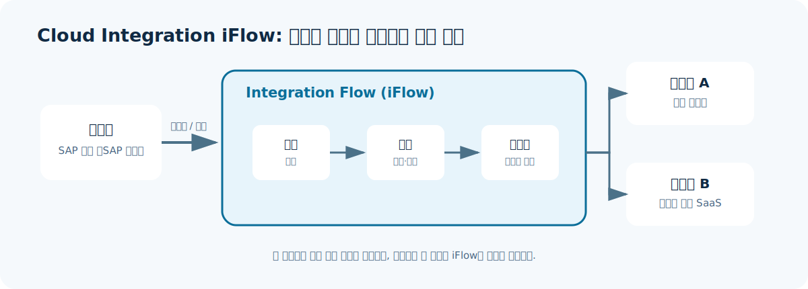
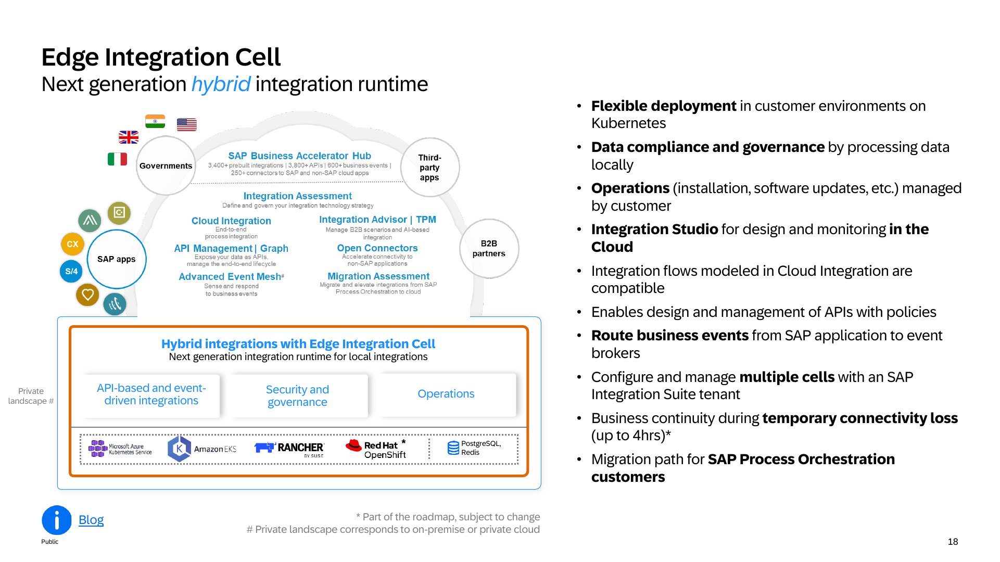

# 2. Integration Suite 기능

아래는 FSD에 명시된 주요 기능을 **무엇을 하는가 / 언제 쓰는가**로 짧게 정리한 표이다. 구매 에디션에 따라 사용 가능 범위가 달라질 수 있다.

| 기능                             | 무엇을 하는가                                      | 언제 사용하는가                                                       |
| ------------------------------ | -------------------------------------------- | -------------------------------------------------------------- |
| **Cloud Integration**          | iFlow로 메시지 수신, 변환, 라우팅, 오류 처리, 전송을 설계·실행한다.  | S/4HANA와 SuccessFactors, 외부 물류, 파일 서버 등 두 시스템의 업무 데이터를 연동할 때   |
| **API Management**             | API를 노출하고 인증·권한·트래픽 정책·분석·개발자 포털을 관리한다.      | 내부/외부 앱이 SAP 또는 기업 데이터를 API로 안전하게 사용해야 할 때                     |
| **API Composition (Graph)**    | 여러 API의 데이터를 하나의 의미 있는 그래프로 노출한다.            | 앱 개발자가 여러 백엔드 API를 조합하지 않고 통합된 API로 데이터를 조회하게 할 때              |
| **Event Mesh**                 | 시스템에서 발생한 이벤트를 비동기적으로 발행·구독하게 한다.            | 주문 생성, 재고 변경처럼 발생 즉시 여러 시스템에 알려야 하지만 호출 시스템을 서로 강하게 묶고 싶지 않을 때 |
| **OData Provisioning**         | 온프레미스 OData 서비스를 BTP에서 안전하게 노출·소비하도록 돕는다.    | SAP Gateway/OData 기반 서비스를 클라우드 앱과 연결할 때                        |
| **Open Connectors**            | SaaS 애플리케이션별 API 차이를 표준화된 방식으로 연결한다.         | Salesforce 등 타사 SaaS와 빠르게 연결하고 인증·커넥터 구현 부담을 줄이고 싶을 때          |
| **Integration Advisor**        | B2B/EDI 메시지 구조와 매핑을 설계하도록 지원한다.              | 거래처마다 다른 EDI 형식을 표준 메시지와 매핑해야 할 때                              |
| **Trading Partner Management** | 거래 파트너의 식별자·통신 설정·계약상 메시지 교환 정보를 관리한다.       | 여러 공급업체·유통사와 B2B 메시지를 운영할 때                                    |
| **Integration Assessment**     | 요구 사항을 바탕으로 적합한 통합 기술을 평가하도록 지원한다.           | 새 인터페이스에 API, 이벤트, Cloud Integration 중 무엇을 쓸지 팀 합의가 필요할 때      |
| **Migration Assessment**       | 기존 SAP PI/PO 인터페이스의 마이그레이션 적합성을 분석한다.        | PI/PO에서 Integration Suite로의 전환 범위와 난이도를 파악할 때                  |
| **Edge Integration Cell**      | 프라이빗 클라우드 또는 온프레미스 환경에 통합 런타임을 배치하는 옵션이다.    | 데이터 처리 위치·네트워크·규제로 인해 런타임을 고객 환경 가까이에 두어야 할 때                  |
| **Data Space Integration**     | 데이터 스페이스 참여자와 자산·정책·계약을 기반으로 데이터를 교환하도록 돕는다. | Catena-X와 같은 데이터 스페이스 생태계에서 참여자 간 데이터 공유를 설계할 때                |

## 가장 자주 보는 네 가지

| 요구 사항 | 우선 검토할 기능 |
|---|---|
| ERP와 SaaS/파일/DB 사이의 업무 데이터 연동 | Cloud Integration |
| 모바일 앱·파트너·내부 시스템에 API 공개 | API Management, 필요 시 API Composition |
| 실시간 알림과 느슨한 결합 | Event Mesh |
| 거래처 주문서·송장 등 EDI 교환 | Integration Advisor, Trading Partner Management, Cloud Integration |

## Cloud Integration의 iFlow는 무엇으로 구성되는가

Cloud Integration에서 실제 메시지 처리 흐름을 정의하는 단위가 **iFlow(Integration Flow)** 이다. iFlow는 코드를 전혀 쓰지 않는다는 뜻이 아니라, 송신·수신 시스템과 연결 방식, 처리 단계를 그래픽 모델로 조합해 정의하는 방식이다.

| 요소 | 역할 |
|---|---|
| 송신자(Sender) | 메시지를 보내는 SAP 또는 비SAP 시스템 |
| 어댑터(Adapter) | 시스템과 Integration Suite가 통신하는 프로토콜·연결 방식(예: HTTPS, SFTP, IDoc)을 정의 |
| 처리 단계(Steps) | 변환, 검증, 라우팅, 예외 처리처럼 메시지에 수행할 작업 |
| 수신자(Receiver) | 처리된 메시지를 받는 하나 이상의 대상 시스템 |

이 구조는 "시스템을 연결한다"는 말을 설계 가능한 단위로 나눠 보여 주므로, 정의 문서보다 **기능 문서**에 두는 것이 적절하다.

## 기능을 혼동하지 않는 방법

- **Cloud Integration과 API Management**: 전자는 시스템 간 처리 흐름을 실행하는 데 초점이 있고, 후자는 API를 제품처럼 공개·보호·관찰하는 데 초점이 있다. 한 시나리오에서 함께 쓸 수 있다.
- **Event Mesh와 Cloud Integration**: 전자는 이벤트를 여러 소비자에게 비동기로 배포하는 기반이고, 후자는 특정 변환·업무 처리 흐름을 구현하는 데 적합하다.
- **Open Connectors와 Cloud Integration**: Open Connectors는 타사 SaaS 연결을 단순화하는 연결 수단이며, 복잡한 변환·라우팅·오류 처리는 Cloud Integration에서 수행할 수 있다.

## Edge Integration Cell을 선택할 때

Edge Integration Cell은 Integration Suite의 모든 기능을 온프레미스에 복제하는 제품이라기보다, 고객이 관리하는 Kubernetes 환경에 두는 **하이브리드 통합 런타임**이다. 설계와 모니터링은 클라우드에서 수행하면서, 특정 통합 흐름의 실행을 프라이빗 랜드스케이프에 배치해야 할 때 검토한다. 데이터 처리 위치, 지연 시간, 망 분리·규제 요구가 주된 판단 기준이다.

> 그림에 포함된 Kubernetes 배포 대상과 일시적 연결 손실 처리 등 일부 내용은 2024년 당시 로드맵 표기가 있다. 실제 지원 범위는 최신 Help Portal과 계약 플랜에서 다시 확인해야 한다.

## 근거

- `FSD_IntegrationSuite.pdf`, 목차 및 pp. 5, 29-38
- [SAP Integration Suite 기능 개요](https://help.sap.com/docs/integration-suite/sap-integration-suite/capabilities?locale=en-US)
- [SAP 제품 페이지의 기능 설명](https://www.sap.com/korea/products/technology-platform/integration-suite.html)
- `240229_sap_integration_suite.pdf`, p. 18 - Edge Integration Cell 소개 그림
- [SAP Help Portal - Elements of an Integration Flow](https://help.sap.com/docs/cloud-integration/sap-cloud-integration/elements-of-integration-flow?locale=en-US)
