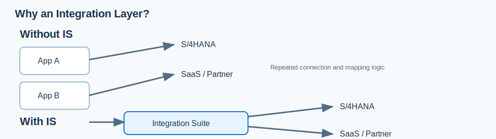

# 3. Integration Suite를 사용하는 이유

## 도입이 필요한 전형적인 상황

| 현장 문제                                | Integration Suite로 하는 일    | 기대 효과                       |
| ------------------------------------ | -------------------------- | --------------------------- |
| 시스템마다 직접 연결이 늘어나 변경 영향 범위를 알기 어렵다    | 연결 흐름과 API를 중앙 플랫폼에서 설계·운영 | 인터페이스의 가시성과 재사용성 향상         |
| SAP와 SaaS, 온프레미스가 섞여 있다              | 어댑터, API, 하이브리드 연결을 사용     | 통신 방식 차이를 개별 개발로 반복하는 부담 완화 |
| 오류 발생 시 어느 구간에서 실패했는지 찾기 어렵다         | 모니터링과 메시지 추적을 운영 절차에 포함    | 장애 분석과 재처리 절차를 표준화          |
| 외부에 API를 제공해야 하지만 보안·인증·사용량 통제가 필요하다 | API 정책, 인증, 분석, 개발자 포털을 적용 | API 공개를 통합 개발과 분리해 관리       |
| 거래처가 늘어 EDI 포맷과 설정을 계속 관리해야 한다       | 파트너 관리·메시지 매핑·B2B 기능 활용    | 온보딩과 변경 관리 부담 감소            |

## SAP 환경에서 특히 고려할 이유

1. **표준 콘텐츠의 재사용**: SAP는 SAP 및 타사 애플리케이션을 위한 사전 구축 통합 콘텐츠를 제공한다. 표준 시나리오와 실제 요구 사항이 맞으면 설계·구현 시간을 줄일 수 있다. 다만 그대로 배포하기보다 데이터 항목, 권한, 오류 처리, 운영 책임을 검토해야 한다.
2. **하이브리드 연결**: 클라우드 서비스이면서도 온프레미스/프라이빗 환경 연결 시나리오를 지원한다. 따라서 ERP를 즉시 클라우드로 옮기지 않아도 통합 계층을 현대화하는 선택지가 된다.
3. **통합 방식의 일관성**: 메시지, API, 이벤트, B2B를 제품별로 따로 운영하지 않고 통합 거버넌스 관점에서 설계할 수 있다.
4. **Clean Core에 유리한 경계 설정**: S/4HANA 내부 수정으로 외부 연동을 해결하기보다, 연동 로직을 외부 통합 계층에 두는 설계를 검토할 수 있다. 이는 업그레이드 영향과 책임 경계를 명확히 하는 데 도움이 된다.

## 도입 효과를 과장하지 않기

Integration Suite를 쓰면 자동으로 비용이 줄거나 개발이 없어지는 것은 아니다. 효과는 다음 조건이 갖춰질 때 크다.

- 인터페이스 목록과 소유 조직이 정리되어 있다.
- 표준 콘텐츠를 그대로 또는 작은 수정으로 쓸 수 있는 시나리오가 있다.
- 공통 오류 처리, 보안, 배포, 모니터링 원칙을 실제로 적용한다.
- 통합 개발·운영 담당자가 있고, API·이벤트·메시지의 책임 경계를 합의한다.

## 먼저 확인할 질문

- 연동 대상은 몇 개인가? 앞으로 얼마나 늘어날 가능성이 있는가?
- 단순 파일 교환인가, 데이터 변환·재시도·승인·실시간 이벤트가 필요한가?
- API를 외부/내부 개발자에게 공개해야 하는가?
- 운영 장애 시 누가 어떤 로그로 재처리할 것인가?

## 근거

- [SAP 제품 개요 - 사전 구축 콘텐츠, 하이브리드 통합, 거버넌스](https://www.sap.com/korea/products/technology-platform/integration-suite.html)
- `FSD_IntegrationSuite.pdf`, pp. 4-6, 39-40
