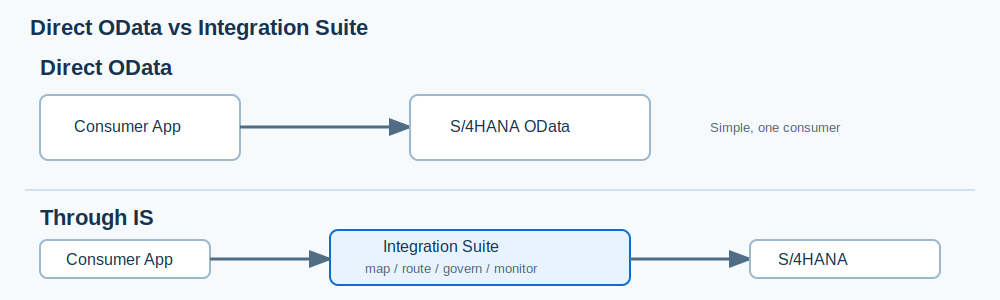
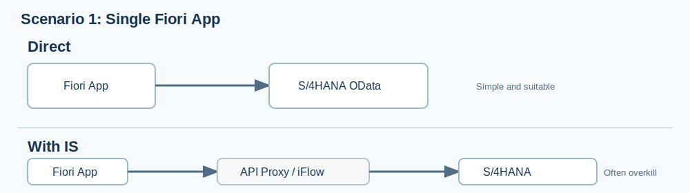
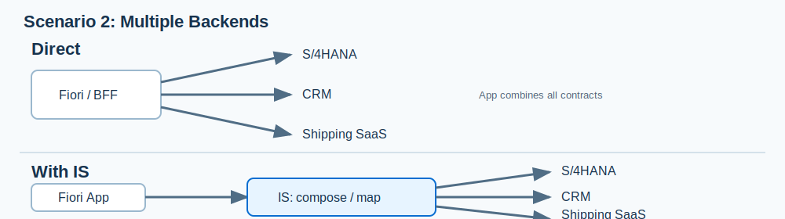
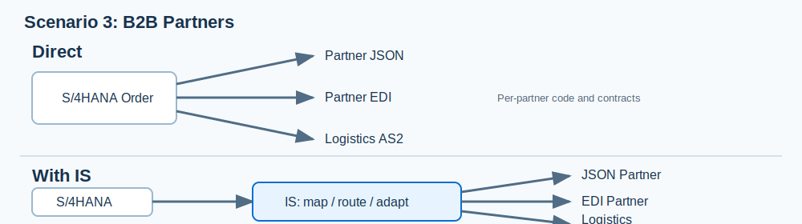
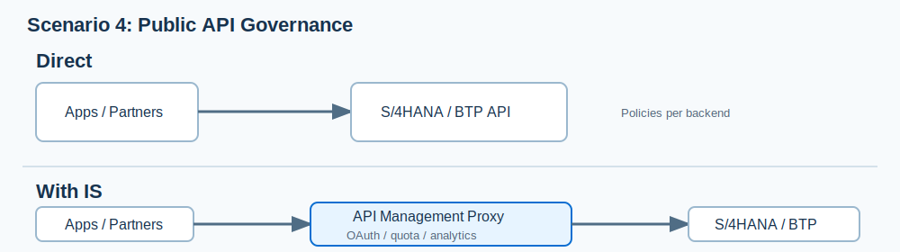
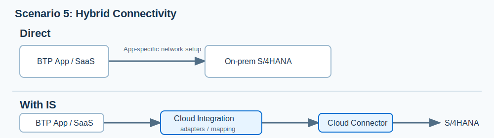
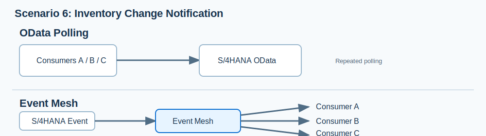
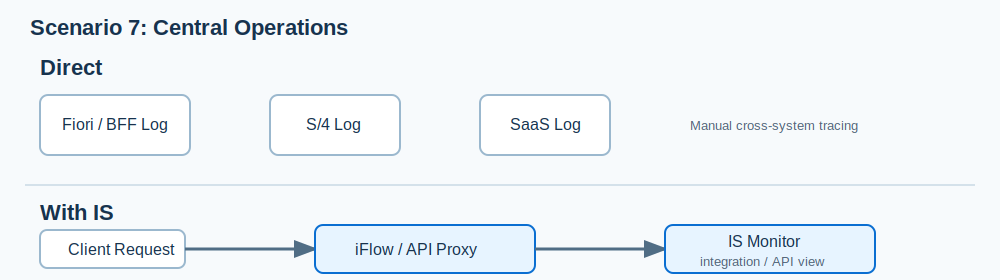

# 4. S/4HANA OData 직접 연계와 Integration Suite 비교

## 한 문장 결론

**S/4HANA OData는 업무 데이터·기능을 제공하는 API이고, SAP Integration Suite는 그 API를 여러 시스템, 메시지 형식, 보안·운영 요구에 맞춰 연결하는 통합 계층이다.**

Integration Suite가 S/4HANA OData를 대체하는 것은 아니다. 소비자가 하나이고 S/4HANA API를 그대로 쓸 수 있다면 직접 호출이 단순할 수 있다. 반대로 변환, 여러 시스템 연결, 공통 API 정책, 통합 모니터링이 필요해지면 Integration Suite의 역할이 커진다.

## 두 방식의 구조

### S/4HANA OData 직접 호출

소비 애플리케이션이 S/4HANA의 endpoint, entity set, OData query, 인증 방식을 직접 사용한다. 이 방식에서는 소비 애플리케이션 또는 별도 API Gateway가 다음 책임을 가진다.

- 요청/응답 형식과 S/4HANA 데이터 모델 처리
- 인증·권한·네트워크 연결
- 오류, timeout, 재시도 처리
- S/4HANA API 변경 시 소비자 수정·배포

### Integration Suite 경유 호출

S/4HANA는 여전히 업무 데이터와 업무 로직을 제공한다. Integration Suite는 소비자의 요청과 S/4HANA API 사이에서 필요한 통합 처리를 수행한다.

| 구성 요소 | Integration Suite가 수행하는 일 | 직접 호출 시 책임 주체 |
|---|---|---|
| HTTPS Sender | 소비자가 호출할 별도 endpoint 제공 | 소비 애플리케이션이 S/4HANA endpoint 직접 사용 |
| Mapping / Converter | JSON, XML 등 데이터 구조·형식 변환 | 소비 애플리케이션이 변환 구현 |
| Content Modifier | 본문 값을 header/property로 추출·준비 | 소비 애플리케이션이 값 추출·요청 조립 |
| Router / Multicast | 조건에 따른 수신 시스템 분기 또는 다중 전달 | 소비 애플리케이션 또는 별도 middleware 구현 |
| Request Reply | 외부 시스템을 동기 호출하고 응답을 다음 단계로 전달 | 소비 애플리케이션이 HTTP/OData client 구현 |
| OData Receiver | S/4HANA 등의 OData endpoint와 OData V2/V4 방식으로 통신 | 소비 애플리케이션이 OData 연결·호출 구현 |
| API Management | API Proxy, 보안 정책, API lifecycle 관리 | S/4HANA 또는 별도 API Gateway 운영 |
| Monitor | iFlow·API 실행 관점의 통합 모니터링 | 시스템별 로그를 개별 수집·연관 분석 |

> Integration Suite를 경유해도 S/4HANA API 자체의 인증·권한·업무 규칙을 대신하지는 않는다. 또한 직접 OData를 쓴다고 해서 보안·권한 설계가 불필요해지는 것도 아니다.

## 현재 상품 조회 iFlow로 보는 차이

[8-1. iFlow 설계와 배포](8-1.%20iFlow%20설계와%20배포.md)의 실습을 S/4HANA OData 조회로 바꾸어 생각하면, iFlow는 아래 일을 맡는다.

1. 소비자가 `/products/details`에 JSON 요청을 보낸다.
2. **JSON to XML Converter**가 메시지 형식을 변환한다.
3. **Content Modifier**가 `productIdentifier`를 추출해 header에 저장한다.
4. **Request Reply + OData Receiver**가 S/4HANA의 Products OData 서비스를 호출한다.
5. API Management를 추가하면, 외부 소비자에게 공개할 API 경로·정책·수명주기를 별도로 관리한다.

직접 호출이라면 소비자 애플리케이션이 위 2~4번을 스스로 처리하고 S/4HANA endpoint를 직접 호출한다. 즉, Integration Suite는 “상품 데이터를 대신 보유하는 시스템”이 아니라 “소비자와 S/4HANA 사이의 통합 처리를 한 곳에 모델링·운영하는 시스템”이다.

## 개발자가 체감하는 시나리오별 차이

아래에서 “직접 구현”은 나쁜 방식이라는 뜻이 아니다. **요구사항이 단순하면 직접 호출이 더 적절하다.** IS의 가치는 각 애플리케이션에 반복해서 들어갈 통합·정책·운영 코드를 중앙화할 때 나타난다.

### 시나리오 1. Fiori 앱 한 개가 S/4HANA 표준 OData를 그대로 조회한다

> **설계 예시/해석**  
> 단일 Fiori 앱과 S/4HANA OData의 조합은 이해를 위한 예시다. “직접 연계가 더 단순할 수 있다”는 평가는 요구사항·운영 조직·보안 기준에 따른 설계 판단이다.

> **SAP 공식 기능 근거**  
> SAP는 backend가 필요한 업무 처리를 이미 수행하고 직접 소비 가능할 때, API artifact가 보안·트래픽·모니터링·lifecycle 거버넌스에 집중하는 *simple governed API* 방식을 안내한다. [API-Centric Integration](https://help.sap.com/docs/integration-suite/isuite-integrations-and-apis/api-centric-integration)

#### 장단점 요약

**직접 연계의 장점**

1. 구성 요소가 Fiori와 S/4HANA API뿐이라 개발·운영 구조가 가장 단순하다.
2. 중간 Proxy/iFlow를 거치지 않아 추가 설정·지연·비용 요인이 적다.
3. Fiori 화면과 S/4HANA OData 모델이 같은 릴리스 주기로 움직일 때 빠르게 개발할 수 있다.

**직접 연계의 한계**

1. 소비자가 늘면 각 소비자가 S/4HANA endpoint·데이터 모델·변경 사항에 직접 결합된다.
2. 공통 API 정책, 사용량 분석, 외부 공개 요구가 생기면 별도 gateway 또는 개별 구현이 필요하다.

**IS 경유의 장점**

1. API Management Proxy만으로도 공개 주소와 backend 주소를 분리할 수 있다.
2. 여러 소비자에 OAuth, 접근 정책, 분석을 공통 적용할 수 있다.

**IS 경유의 한계**

1. 단일 내부 Fiori 화면뿐이라면 추가 계층의 관리 부담이 이득보다 클 수 있다.
2. 단순 조회에 iFlow 변환·조합을 넣으면 구조가 불필요하게 복잡해질 수 있다.

#### 기존 풀스택 구조

1. ABAP/CAP 등의 백엔드에서 S/4HANA 업무 데이터용 OData API를 만든다 또는 표준 API를 사용한다.
2. Fiori 프론트엔드가 그 OData endpoint를 호출해 목록·상세 데이터를 받는다.
3. BTP/Identity 서비스와 S/4HANA 권한으로 인증·인가를 구성한다.
4. 화면과 backend가 같은 데이터 모델·릴리스 주기를 공유한다.

#### 이때 IS가 추가로 주는 가치

대부분의 경우 **크지 않다**. 소비자가 하나이고 OData 모델을 그대로 쓰며, 별도 변환·조합·외부 공개 요구가 없다면 S/4HANA OData를 직접 사용하는 편이 구조·지연·운영 지점이 적다.

IS를 꼭 넣기보다 아래 질문을 먼저 확인한다.

- 이 API를 다른 팀·파트너·모바일 앱에도 제공할 예정인가?
- backend 주소나 OData 모델을 프론트엔드와 분리해야 하는가?
- 호출량 제한, API 버전, 공통 접근 정책, 사용량 분석이 필요한가?

위 요구가 생길 때는 iFlow 전체가 아니라 **API Management의 단순 API Proxy**만 두는 선택이 가능하다. SAP는 backend가 이미 필요한 업무 처리를 수행하고 직접 소비 가능하면, API artifact가 보안·트래픽·모니터링·lifecycle 거버넌스에 집중하는 “simple governed API” 방식이 적합하다고 안내한다.

| 결론 | 권장 형태 |
|---|---|
| 단일 Fiori + 표준 OData + 내부 사용자 | S/4HANA OData 직접 호출 |
| 동일 API를 여러 앱/팀에 안정적으로 제공 | S/4HANA OData + API Management Proxy |

### 시나리오 2. 한 Fiori 화면이 S/4HANA·CRM·배송 SaaS 정보를 함께 보여 준다

> **설계 예시/해석**  
> S/4HANA·CRM·배송 SaaS를 한 화면에 조합하는 것은 설명을 위한 가상 업무 사례다. 실제로 iFlow, API-centric Integration, BFF 중 무엇을 선택할지는 응답 시간·변경 빈도·소유 팀을 함께 고려해야 한다.

> **SAP 공식 기능 근거**  
> SAP는 API-centric Integration의 대표 사용 사례로 여러 backend 데이터 집계, payload 변환·매핑, 순차/조건부 호출, 요청 enrichment를 제시한다. [API-Centric Integration](https://help.sap.com/docs/integration-suite/isuite-integrations-and-apis/api-centric-integration)

#### 장단점 요약

**직접 연계의 장점**

1. 각 backend를 화면 또는 BFF에서 바로 호출하므로 작은 PoC는 빠르게 시작할 수 있다.
2. 단일 backend 장애가 UI에 어떻게 보일지 화면 개발자가 세밀하게 제어할 수 있다.

**직접 연계의 한계**

1. 프론트엔드/BFF가 S/4HANA·CRM·SaaS의 세 계약과 오류 처리를 모두 알아야 한다.
2. 같은 조합 데이터가 다른 앱에도 필요해지면 조합 로직이 중복된다.
3. 하나의 backend API가 바뀌면 소비자 코드도 함께 수정·배포해야 할 수 있다.

**IS 경유의 장점**

1. 소비자는 하나의 업무 중심 API만 호출하고, 여러 backend 조합은 IS에 숨길 수 있다.
2. 데이터 매핑·순차/조건부 호출·enrichment를 통합 artifact에서 재사용한다.
3. backend 변경을 공개 API 계약과 분리해 소비자 영향 범위를 줄일 수 있다.

**IS 경유의 한계**

1. 집계 API의 timeout, 부분 실패, 캐시, 호출 순서를 iFlow/API 설계에서 명확히 정의해야 한다.
2. 화면 전용으로 매우 작은 조합이라면 BFF가 더 적은 구성으로 충분할 수 있다.

### 시나리오 3. S/4HANA 주문을 외부 거래처/물류 파트너에게 전달한다

> **설계 예시/해석**  
> 주문·EDI·AS2·SFTP·물류 파트너라는 조합은 이해를 위한 예시다. 특정 파트너의 실제 프로토콜과 메시지 계약을 SAP가 보장한다는 뜻은 아니다.

> **SAP 공식 기능 근거**  
> SAP FSD는 Cloud Integration iFlow가 adapter와 처리 단계로 sender/receiver를 연결하며, Mapping·Converter·Content Modifier·Request-Reply 기능을 제공한다고 설명한다. [Integration Capabilities](https://help.sap.com/docs/integration-suite/sap-integration-suite/integration-capabilities), `FSD_IntegrationSuite.pdf` pp. 6, 19-21.

#### 장단점 요약

**직접 연계의 장점**

1. 파트너가 한 곳이고 S/4HANA API 모델·보안 방식을 그대로 수용한다면 중간 변환이 없다.
2. 매우 고정된 전용 인터페이스는 커스텀 구현으로도 운영할 수 있다.

**직접 연계의 한계**

1. 파트너별 JSON/EDI/파일/인증서 요구가 S/4HANA 또는 커스텀 프로그램에 누적된다.
2. 새 파트너마다 mapping·protocol·오류 처리 코드를 반복 구현할 가능성이 높다.
3. S/4HANA 내부 모델이 외부 파트너 계약에 과도하게 노출될 수 있다.

**IS 경유의 장점**

1. adapter와 mapping으로 S/4HANA 내부 표현을 거래처별 계약으로 변환한다.
2. Router와 공통 오류 처리로 거래처 확장 시 반복 구현을 줄인다.
3. 외부 계약과 S/4HANA 내부 변경 사이에 완충층을 둔다.

**IS 경유의 한계**

1. 거래처별 업무 규칙과 mapping 책임은 여전히 정의·테스트해야 한다.
2. 적은 파트너만 있는 단순 파일 연계라면 초기 구축 범위가 클 수 있다.

### 시나리오 4. 모바일 앱·외부 파트너에게 S/4HANA API를 공개한다

> **설계 예시/해석**  
> 모바일 앱·외부 파트너 공개는 예시다. 기존 BTP backend, S/4HANA, 다른 API Gateway가 이미 요구사항을 충족하는지에 따라 API Management 도입 필요성이 달라진다.

> **SAP 공식 기능 근거**  
> SAP는 API Proxy의 인증·인가·rate limiting·throttling·요청/응답 변환·분석 기능과, API Management의 보안·traffic management·lifecycle governance를 설명한다. [API Proxy](https://help.sap.com/docs/integration-suite/sap-integration-suite/api-proxy), [API Management](https://help.sap.com/docs/integration-suite/isuite-integrations-and-apis/api-management), [Policies](https://help.sap.com/docs/integration-suite/sap-integration-suite/policies)

#### 장단점 요약

**직접 연계의 장점**

1. 이미 BTP backend 또는 S/4HANA API에 필요한 인증·권한·검증이 완성되어 있다면 경로가 짧다.
2. 소수의 신뢰된 내부 소비자라면 별도 Proxy 운영이 불필요할 수 있다.

**직접 연계의 한계**

1. API마다 OAuth, 접근 제어, 요청 검증, traffic control, 분석을 반복 구현·운영해야 할 수 있다.
2. backend 주소와 공개 API 계약이 결합되어 backend 변경이 소비자에게 직접 영향을 준다.
3. 외부 소비자·호출량이 늘수록 일관된 API lifecycle 관리가 어려워진다.

**IS 경유의 장점**

1. API Proxy가 OAuth·인가·검증·트래픽 정책을 공통 적용하는 진입점이 된다.
2. backend를 바꾸어도 공개 API 경로와 계약을 유지할 수 있다.
3. API 사용량·성능·오류를 API 관점에서 분석하고 버전·소비자 관리를 할 수 있다.

**IS 경유의 한계**

1. Proxy 정책과 backend 권한을 이중으로 관리해야 하므로 책임 경계를 명확히 해야 한다.
2. API Management 기능과 runtime별 제약·서비스 플랜을 도입 전에 확인해야 한다.

### 시나리오 5. 온프레미스 S/4HANA와 BTP/SaaS를 연계한다

> **설계 예시/해석**  
> 온프레미스 S/4HANA와 BTP/SaaS의 연결은 대표적인 hybrid 사례로 구성한 예시다. 실제 네트워크 구성과 접근 권한은 고객의 보안 정책에 따라 설계해야 한다.

> **SAP 공식 기능 근거**  
> SAP는 Cloud Integration이 cloud-to-on-premise를 포함한 end-to-end 통합을 지원하고, adapter로 원격 시스템과의 기술 통신 채널을 구성한다고 설명한다. [Key Features](https://help.sap.com/docs/cloud-integration/sap-cloud-integration/key-features), [Introduction](https://help.sap.com/docs/integration-suite/sap-integration-suite/introduction?locale=en-US)

#### 장단점 요약

**직접 연계의 장점**

1. 사내망의 한 애플리케이션이 같은 망의 S/4HANA를 호출하는 경우는 직접 연결이 단순할 수 있다.
2. 기존 네트워크·보안 표준이 이미 충분하다면 추가 플랫폼 운영이 없다.

**직접 연계의 한계**

1. 클라우드 앱·SaaS마다 온프레미스 경로, 인증서, 접근 제어를 개별 설계할 수 있다.
2. 프로토콜·데이터 형식 차이를 각 애플리케이션에서 중복 처리할 수 있다.

**IS 경유의 장점**

1. adapter, 연결 설정, 변환을 통합 artifact에 모아 cloud-to-on-premise 시나리오를 표준화한다.
2. 같은 S/4HANA 연결 패턴을 여러 통합 흐름에서 재사용하기 쉽다.
3. 연결·메시지 처리 상태를 통합 관점에서 운영할 수 있다.

**IS 경유의 한계**

1. Cloud Connector, 방화벽, 인증서, S/4 권한 설계가 자동으로 사라지지는 않는다.
2. 단일 단순 연결이라면 IS 운영 비용과 추가 홉을 정당화하기 어려울 수 있다.

### 시나리오 6. 재고 변경을 여러 시스템에 거의 실시간으로 알린다

> **설계 예시/해석**  
> 재고 변경 알림은 예시다. polling과 event-driven 방식 중 무엇이 적합한지는 최신성 요구, 데이터 일관성, 소비자 수, 재처리 요구를 기준으로 판단한다.

> **SAP 공식 기능 근거**  
> SAP Event Mesh는 애플리케이션 간 business event를 publish·consume하는 capability로 설명된다. [Event Mesh](https://help.sap.com/docs/SAP_INTEGRATION_SUITE/sap-integration-suite/event-mesh?locale=en-US)

#### 장단점 요약

**직접 OData polling의 장점**

1. 이미 OData 조회 API가 있으면 소비자가 빠르게 구현할 수 있다.
2. 조회 시점에 항상 최신 데이터를 직접 읽는 단순한 모델이다.

**직접 OData polling의 한계**

1. 소비자가 많아질수록 주기적 조회와 중복 호출이 증가한다.
2. 변경 직후 반영이 필요하면 polling 주기를 짧게 해야 하며, 그만큼 부하·비용이 커질 수 있다.
3. 각 소비자가 마지막 조회 시점, 누락, 재처리 방식을 별도로 관리한다.

**IS Event Mesh의 장점**

1. 변경 이벤트를 publish하고 여러 소비자가 독립적으로 구독하는 구조를 만든다.
2. 새 소비자는 S/4HANA OData API를 수정하지 않고 구독을 추가할 수 있다.
3. polling 대신 이벤트 중심 흐름으로 시스템 간 결합도를 낮춘다.

**IS Event Mesh의 한계**

1. 이벤트 발행·구독, 중복 처리, 순서, 최종 일관성 등 event-driven 설계를 추가로 이해해야 한다.
2. 화면에서 임의 조건으로 상세 데이터를 조회하는 기능까지 이벤트가 대체하지는 않는다.

### 시나리오 7. 장애 분석과 운영 책임을 중앙화한다

> **설계 예시/해석**  
> 여러 로그를 사람이 대조하는 상황과 correlation ID 설계 필요성은 일반적인 운영 설계 해석이다. IS Monitor만으로 모든 backend 내부 오류 원인을 분석할 수 있다는 뜻은 아니다.

> **SAP 공식 기능 근거**  
> SAP는 Monitor에서 Cloud Integration과 API Management의 artifact 사용량·성능을 분석할 수 있으며, 각 capability에 해당 Monitor 탭이 제공된다고 설명한다. [Monitor](https://help.sap.com/docs/integration-suite/sap-integration-suite/monitor)

#### 장단점 요약

**직접 연계의 장점**

1. 각 시스템이 기존 관측 도구와 로그 체계를 이미 갖추고 있다면 새 운영 도구가 필요 없다.
2. 각 애플리케이션 팀이 자신의 코드·로그를 직접 통제한다.

**직접 연계의 한계**

1. 하나의 업무 요청이 Fiori/BFF, S/4HANA, SaaS 중 어디에서 실패했는지 여러 로그를 대조해야 한다.
2. 소비자별 오류 처리·재시도 기준이 달라질 수 있다.

**IS 경유의 장점**

1. iFlow/API Proxy를 통과 지점으로 두어 통합·API 실행 관점의 운영 지점을 만든다.
2. Cloud Integration과 API Management Monitor에서 사용량·성능·오류를 같은 플랫폼에서 확인할 수 있다.
3. 공통 correlation ID와 오류 처리 기준을 iFlow/API 설계에 반영하기 쉬워진다.

**IS 경유의 한계**

1. IS Monitor가 S/4HANA 내부의 업무 오류 원인 분석까지 대체하지는 않는다.
2. 의미 있는 추적을 위해 correlation ID, 로그 마스킹, 재처리 절차를 별도로 설계해야 한다.

## 어떤 IS 조합을 선택할지

| 요구 | 최소 선택지 | 이유 |
|---|---|---|
| 단일 내부 Fiori가 표준 OData를 사용 | IS 미사용 | 중간 계층이 제공할 추가 가치가 작음 |
| backend API는 그대로 두고 공개·보호·분석만 필요 | API Management | Proxy, 정책, traffic, lifecycle, analytics |
| 형식 변환·라우팅·다중 시스템 프로세스 필요 | Cloud Integration | adapter와 iFlow 처리 단계 |
| 공개 API이면서 변환·조합도 필요 | API Management + Cloud Integration 또는 API-centric Integration | 정책과 통합 로직을 함께 관리 |
| 비동기·다수 구독자 알림 | Event Mesh | publish/subscribe 기반 event-driven 통합 |

## 어느 경우에 Integration Suite가 특히 유용한가

| 상황 | Integration Suite를 쓰는 이유 |
|---|---|
| 소비자 형식과 S/4HANA API 형식이 다름 | Mapping, Converter, Content Modifier로 차이를 iFlow에 모은다. |
| 한 요청이 S/4HANA와 다른 시스템을 함께 호출 | 여러 receiver, Router, Multicast, 예외 처리를 하나의 프로세스로 구성한다. |
| S/4HANA가 온프레미스이고 소비자는 클라우드 | adapter와 안전한 연결 구성을 통해 cloud-to-on-premise 통합을 설계한다. |
| 여러 소비자에게 API를 제공 | API Proxy와 보안 정책, 버전·lifecycle 관리를 적용한다. |
| 실패 흐름과 성능을 중앙에서 보고 싶음 | Cloud Integration과 API Management의 Monitor를 운영 지점으로 사용한다. |

## 직접 OData 호출이 더 적합할 수 있는 경우

다음 조건이 대부분 맞는다면 직접 호출을 먼저 검토할 수 있다.

- 소비자가 한 개 또는 매우 적다.
- 소비자가 S/4HANA의 표준 OData API와 데이터 모델을 그대로 사용한다.
- 형식 변환, 값 매핑, 프로토콜 변환, 다중 수신자 라우팅이 필요 없다.
- API Proxy 정책·통합 모니터링·프로세스 조합 요구가 작다.
- S/4HANA endpoint 공개에 필요한 보안·네트워크·변경 관리를 직접 운영할 수 있다.

이는 Integration Suite가 불필요하다는 일반 규칙이 아니다. **통합 요구가 복잡해질수록 중간 통합 계층의 가치가 커진다**는 뜻이다.

## 의사결정 질문

아래 중 하나라도 “예”라면 Integration Suite 경유 방식을 우선 검토할 이유가 있다.

1. 소비자와 S/4HANA의 형식 또는 프로토콜이 다른가?
2. 하나의 업무 요청에서 S/4HANA 외 다른 시스템도 호출·조합해야 하는가?
3. 소비자별 인증, 접근 정책, API 경로, 버전을 분리해야 하는가?
4. 온프레미스 S/4HANA와 클라우드 시스템을 안전하게 연결해야 하는가?
5. 실패 메시지·재처리·통합 모니터링을 중앙에서 운영해야 하는가?

## OData Provisioning과 혼동하지 않기

Integration Suite에는 **OData Provisioning**이라는 별도 capability도 있다. 이는 SAP Business Suite의 SAP Gateway 서비스를 탐색하고 OData endpoint로 publish하는 기능이다. Cloud Integration의 OData Receiver로 S/4HANA OData를 호출하는 방식과 목적이 다르다.

- **Cloud Integration + OData Receiver**: 통합 프로세스에서 S/4HANA OData를 수신 시스템으로 호출한다.
- **OData Provisioning**: SAP Business Suite 서비스에 대한 OData endpoint 제공·접근을 다루는 별도 capability다.

## 공식 근거

- [SAP Help Portal — What is SAP Integration Suite?](https://help.sap.com/docs/integration-suite/sap-integration-suite/configuration-guide) — Cloud Integration은 cloud/on-premise 애플리케이션을 연결하고, API Management는 API 생성·관리·거버넌스를 담당한다고 설명한다.
- [SAP Help Portal — Integration Capabilities](https://help.sap.com/docs/integration-suite/sap-integration-suite/integration-capabilities) — Mapping, Content Modifier, Converter, Router 등 iFlow 처리 기능 설명.
- [SAP Help Portal — OData Adapter](https://help.sap.com/docs/integration-suite/sap-integration-suite/odata-adapter?version=CLOUD) — OData adapter가 OData protocol로 통신함을 설명.
- [SAP Help Portal — Key Features](https://help.sap.com/docs/cloud-integration/sap-cloud-integration/key-features) — Cloud Integration의 메시지 처리·변환·라우팅, adapter 기반 연결, 보안 기능 설명.
- [SAP Help Portal — Monitor](https://help.sap.com/docs/integration-suite/sap-integration-suite/monitor) — Cloud Integration과 API Management별 Monitor 탭 설명.
- [SAP Help Portal — API Management](https://help.sap.com/docs/integration-suite/isuite-integrations-and-apis/api-management) — API security, traffic management, lifecycle governance, analytics 설명.
- [SAP Help Portal — API Proxy](https://help.sap.com/docs/integration-suite/sap-integration-suite/api-proxy) — backend와 소비자 분리, 인증·인가, rate limiting·throttling, 요청/응답 변환 설명.
- [SAP Help Portal — API-Centric Integration](https://help.sap.com/docs/integration-suite/isuite-integrations-and-apis/api-centric-integration) — 다중 backend 집계, 형식 변환, 조건부 호출, enrichment에 적합한 경우 설명.
- [SAP Help Portal — Event Mesh](https://help.sap.com/docs/SAP_INTEGRATION_SUITE/sap-integration-suite/event-mesh?locale=en-US) — application 간 business event publish·consume 설명.
- `FSD_IntegrationSuite.pdf` — pp. 6, 14, 19-21, 33: iFlow/adapter/처리 단계, OData Receiver, Mapping·Converter·Content Modifier·Request-Reply, OData Provisioning.
- `240229_sap_integration_suite.pdf` — pp. 8, 11, 14: S/4HANA를 포함한 integration 대상, connectivity, S/4HANA-비SAP 사전 패키지 통합 사례. 2024년 소개 자료이므로 최신 기능 범위 판단에는 Help Portal을 우선한다.
