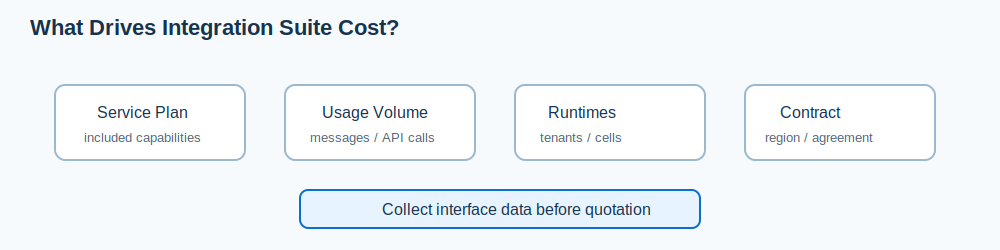

# 6. 가격과 플랜

## 먼저 답: 공개 목록가로는 계산할 수 있지만, 계약 최종가는 다를 수 있다

SAP 한국 가격 페이지는 1테넌트 기준 월 목록가를 공개한다. 2026-07-23 확인값은 Starter **KRW 2,643,486**, Standard **KRW 8,168,372**, Enhanced **KRW 11,763,513**이다. 계약 기간은 3~36개월로 표기되어 있다.

다만 이는 화면에 표시된 목록가다. 실제 견적은 테넌트 수, 메시지량, 옵션, 계약 모델, 할인, 세금에 따라 달라질 수 있다. 따라서 이 문서의 금액은 예산 초안과 시나리오 비교에 쓰고, 구매 승인에는 서면 견적을 사용한다.

## 공식 가격 페이지의 플랜 비교

| 항목 | Starter | Standard | Enhanced |
|---|:---:|:---:|:---:|
| 월 목록가(1테넌트) | KRW 2,643,486 | KRW 8,168,372 | KRW 11,763,513 |
| 연 목록가(월 목록가 × 12) | KRW 31,721,832 | KRW 98,020,464 | KRW 141,162,156 |
| 테넌트 | 1+ | 1+ | 1+ |
| 월 포함 메시지 | 50K | 10K* | 500K |
| 사전 구축 콘텐츠 / SAP-SAP 통합 | 포함 | 포함 | 포함 |
| Cloud Integration | 제한적(사용자 정의 iFlow 10개 한도 표기) | 포함 | 포함 |
| API Management | - | 포함 | 포함 |
| Open Connectors | - | 포함 | 포함 |
| Integration Advisor | - | 포함 | 포함 |
| B2B 전자 교환 라이브러리·TPM | - | 포함 | 포함 |
| Integration Assessment | - | 포함 | 포함 |
| Edge Integration Cell | - | 1+ | 1+ |
| SAP Alert Notification / Cloud Transport Management | - | - | 포함 |

\*공식 페이지에는 Standard의 포함 메시지를 `10K*`로 표시한다. 메시지는 기능을 통해 교환되는 전자 통신이며, 250KB를 넘는 데이터는 250KB(또는 그 일부)마다 추가 메시지로 계산된다고 설명한다. 계약·서비스 카탈로그의 최신 측정 기준을 반드시 확인한다.

## 비용을 만드는 요소

| 요소 | 왜 확인해야 하는가 |
|---|---|
| 선택 플랜 | 기능 범위와 기본 메시지 포함량이 다르다. |
| 테넌트 수 | 개발·테스트·운영을 분리하면 테넌트 요구가 달라질 수 있다. |
| 메시지량과 크기 | 처리량뿐 아니라 250KB 기준의 메시지 계산 방식이 비용에 영향을 준다. |
| Edge Integration Cell 등 옵션 | 데이터 처리 위치와 런타임 요구가 추가 비용/구성에 영향을 줄 수 있다. |
| 계약 모델·리전 | BTP 상용 계약 및 리전별 서비스 계획에서 제공 여부와 조건이 달라질 수 있다. |

## 견적 전에 준비할 정보

1. 인터페이스별 월 메시지 수와 평균/최대 페이로드 크기
2. 운영·개발·테스트 환경의 분리 필요성
3. API, B2B/EDI, 이벤트, Edge Integration Cell 필요 여부
4. 대상 리전과 기존 SAP BTP 계약/크레딧 모델
5. 12개월 이상의 시스템·거래처·트래픽 증가 전망

## 시나리오별 TCO 비교

공개 목록가와 내부 개발비를 함께 놓고 판단하는 방법은 [6-1. 시나리오별 비용 비교와 TCO 판단](6-1.%20%EC%8B%9C%EB%82%98%EB%A6%AC%EC%98%A4%EB%B3%84%20%EB%B9%84%EC%9A%A9%20%EB%B9%84%EA%B5%90%EC%99%80%20TCO%20%ED%8C%90%EB%8B%A8.md)에 정리했다. 이 문서는 목록가와 공식 기능 범위를, 다음 문서는 개별 시나리오의 비교 산식을 다룬다.

## 금액을 확인하는 공식 경로

- [SAP Integration Suite 가격 페이지](https://www.sap.com/korea/products/technology-platform/integration-suite/pricing.html)
- [SAP Discovery Center - 서비스 계획](https://discovery-center.cloud.sap/serviceCatalog/integration-suite?region=all&tab=service_plan)
- SAP 영업 담당자 또는 파트너 견적: 계약 모델, 통화, 리전, 옵션을 포함해 서면으로 확인

## 주의

FSD 자체도 일부 기능의 이용 가능 여부가 라이선스 계약에 좌우된다고 명시한다. 그러므로 이 문서의 표는 공개 목록가와 기능 비교용이며, 견적서가 아니다. `FSD_IntegrationSuite.pdf`, pp. 3, 42
