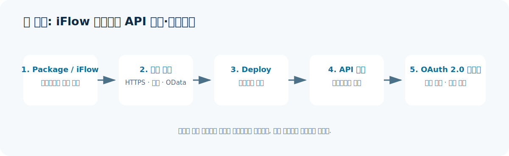

# 7. Integration Suite 사용 방법 - 첫 iFlow와 API 만들기

## 이 가이드의 범위

이 문서는 SAP의 공식 초급 튜토리얼 두 개를 연결해, **첫 번째 Cloud Integration iFlow를 배포하고 그 엔드포인트를 API로 노출하는 흐름**을 설명합니다. 실제 화면의 모든 입력값을 복사하기보다, 무엇을 만들고 왜 하는지 이해하는 데 초점을 둡니다.

> **실습 환경 원칙**: 무료 서비스 플랜 또는 비운영 테넌트, 샘플 데이터, 테스트용 자격 증명을 사용하세요. 실제 운영 API URL, service key, client secret을 문서나 채팅에 붙여 넣지 마세요.

## 시작 전 준비

- SAP BTP 계정과 Integration Suite 구독/테넌트가 준비되어 있어야 합니다.
- Capability를 활성화할 담당자에게는 `Integration_Provisioner` 역할이 필요합니다.
- iFlow를 설계할 사용자와 API를 관리할 사용자에게는 해당 capability의 role collection이 할당되어야 합니다.
- 이 실습은 공식 튜토리얼의 공개 OData 기반 온라인 상점 예시를 사용합니다. 조직의 실제 ERP나 API로 바로 시작하지 마세요.

## 1. iFlow 만들기

목표는 "HTTPS 요청을 받고, 요청 데이터를 처리한 뒤, OData 서비스에서 상품 정보를 조회하여 응답하는" 단순한 동기 흐름을 만드는 것입니다.

| 순서 | Integration Suite에서 하는 일 | 의미 |
|---|---|---|
| 1 | **Design > Integrations and APIs > Create**에서 integration package 생성 | iFlow를 담고 관리할 단위입니다. iFlow는 반드시 package에 속합니다. |
| 2 | Artifacts에서 **Integration Flow**를 추가하고 편집기 열기 | 메시지 처리 과정을 모델링할 캔버스를 만듭니다. |
| 3 | Sender에 **HTTPS adapter** 연결 | 외부 호출자가 iFlow에 요청을 보낼 입구를 정의합니다. |
| 4 | **JSON to XML Converter** 추가 | JSON으로 들어온 데이터를 이후 단계에서 처리할 수 있도록 변환합니다. |
| 5 | **Content Modifier** 추가·설정 | 메시지 본문, 헤더 또는 속성 값을 보완·변경합니다. |
| 6 | **Request Reply** 단계와 Receiver 연결 | 수신 시스템(OData 서비스)에 요청하고 응답을 받아오는 동기 호출을 정의합니다. |
| 7 | iFlow를 **Deploy** | 설계한 내용을 테넌트 런타임에 배포해 엔드포인트를 생성합니다. |

### iFlow 작성 시 확인할 것

- Sender/Receiver가 무엇인지, 각 채널에 어떤 adapter와 인증 방식을 쓸지 정합니다.
- 변환, 검증, 예외 처리, 라우팅을 어떤 순서로 놓을지 정합니다.
- 배포 전에 실제 운영 URL이나 비밀값을 하드코딩하지 않았는지 확인합니다.
- 배포 후에는 **Deployment Status**와 메시지 모니터링에서 상태를 확인합니다.

## 2. 배포된 iFlow를 API로 노출하기

iFlow가 배포되었다고 외부 소비자에게 바로 안전하게 공개하는 것은 아닙니다. API Management는 이 iFlow 엔드포인트 앞에 인증·권한·트래픽 정책 같은 관리 계층을 둡니다.

| 순서 | 하는 일 | 의미 |
|---|---|---|
| 1 | 배포된 iFlow의 **Endpoints**에서 URL 복사 | API가 연결할 백엔드 대상 주소를 확인합니다. |
| 2 | API Management에서 API 정의 | 소비자에게 보일 API의 이름, 경로, 대상 엔드포인트를 설정합니다. |
| 3 | service key에서 필요한 자격 증명 확인 | 정책 또는 테스트 클라이언트가 사용할 OAuth 관련 정보를 준비합니다. |
| 4 | 정책 템플릿 할당 | 공식 튜토리얼은 **OAuth 2.0 Client Credentials** 인증 정책을 적용합니다. |
| 5 | API 호출 테스트 | 토큰을 얻고, 올바른 인증 정보로 API가 응답하는지 확인합니다. |

### 실습 결과로 확인할 것

1. 인증 없이 호출했을 때 차단되는가?
2. 유효한 OAuth 2.0 client credentials로 호출했을 때만 응답하는가?
3. 호출이 API Management와 Cloud Integration 모니터링에 각각 관찰되는가?
4. 오류 응답이 소비자에게 과도한 내부 정보를 노출하지 않는가?

## 실습을 실제 업무로 확장할 때

이 튜토리얼은 동기식 OData 조회 예시입니다. 업무 적용 전에는 다음을 추가로 설계해야 합니다.

- 운영/개발/테스트 환경 분리와 이관 절차
- 인증서·비밀값의 저장 및 갱신 책임
- 재시도, 타임아웃, 오류 메시지, 재처리 절차
- API 버전, 소비자 온보딩, 사용량 정책
- 개인정보·민감정보를 포함한 메시지의 로그 마스킹 및 보관 정책

## 공식 튜토리얼과 출처

- [Design and Deploy Your First Integration Flow](https://developers.sap.com/tutorials/cp-starter-integration-cpi-design-iflow.html) - 초급, 약 40분. 2026-03-03 확인.
- [Expose Integration Flow Endpoint as API and Test the Flow](https://developers.sap.com/tutorials/cp-starter-isuite-api-management.html) - 초급, 약 20분. 2026-03-03 확인.
- [SAP Help Portal - Elements of an Integration Flow](https://help.sap.com/docs/cloud-integration/sap-cloud-integration/elements-of-integration-flow?locale=en-US)
- [SAP Help Portal - Configuring User Access](https://help.sap.com/docs/integration-suite/sap-integration-suite/configuring-user-access?locale=en-US)
