# 8-1. iFlow 설계와 배포

## 이 문서에서 만드는 것

Cloud Integration에서 **HTTPS 요청을 받아 외부 OData 서비스의 상품 정보를 조회하는 iFlow**를 만든다.

S/4HANA OData를 직접 호출하는 방식과, 이 iFlow처럼 Integration Suite를 중간에 두는 방식의 역할 차이는 [4. S/4HANA OData 직접 연계와 Integration Suite 비교](4.%20S4HANA%20OData%20%EC%A7%81%EC%A0%91%20%EC%97%B0%EA%B3%84%EC%99%80%20Integration%20Suite%20%EB%B9%84%EA%B5%90.md)를 참고한다.


> 실습의 외부 URL과 상품 데이터는 테스트용이다. 실제 ERP URL, 사용자 정보, 비밀 값은 화면 캡처나 Markdown에 남기지 않는다.

## 시작 전 확인

- Integration Suite에서 Cloud Integration을 사용할 수 있어야 한다.
- Capability 활성화 담당자에게는 `Integration_Provisioner` 역할이 필요하다.
- iFlow를 설계할 사용자에게 Cloud Integration 관련 role collection이 할당되어야 한다.
- 실습은 운영 시스템이 아닌 테스트 서브계정에서 수행한다.

## 전체 절차

| 단계 | 작업 | 결과 |
|---|---|---|
| 1 | Package와 iFlow 생성 | 설계 캔버스 준비 |
| 2 | HTTPS Sender 연결 | HTTP endpoint 생성 |
| 3 | JSON to XML Converter 추가 | 메시지 형식 변환 |
| 4 | Content Modifier 설정 | 상품 ID를 헤더에 보관 |
| 5 | Request Reply 추가 | 외부 서비스 동기 호출 준비 |
| 6 | OData V2 Receiver 연결 | 상품 상세 조회 구성 |
| 7 | Deploy | 실행 가능한 iFlow 배포 |

---

## 1. Integration Package와 iFlow 만들기

1. **Design > Integrations and APIs > Create**를 선택해 Integration Package를 만든다.
2. **Header** 탭에서 Package의 **Name**과 **Short Description**을 입력하고 저장한다. Technical Name은 자동 생성된다.
3. **Artifacts** 탭에서 **Add > Integration Flow**를 선택한다.
4. iFlow 이름을 입력한 뒤 **Add and Open in Editor**를 선택한다.
5. **Edit**를 눌러 편집 모드로 전환한다.
6. 오른쪽 아래 **Restore**를 눌러 **Property Sheet**를 표시한다. 이후 adapter·주소·메시지 설정은 이 패널에서 입력한다.

**화면 1 — Integration Package의 기본 정보 입력**

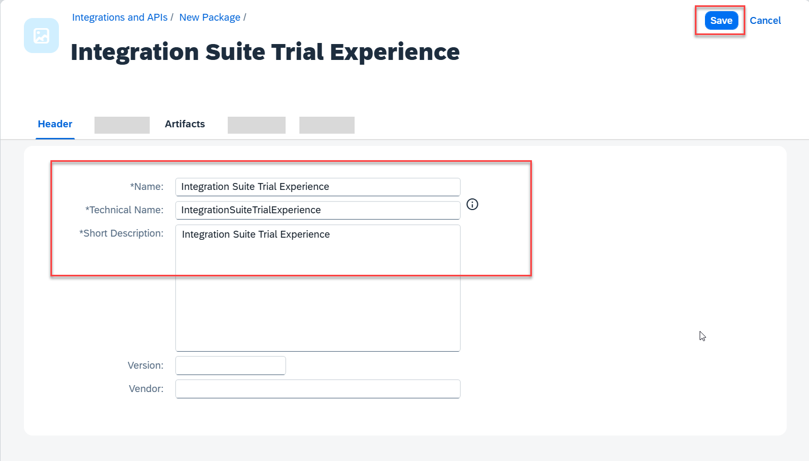

**화면 2 — Artifacts에서 Integration Flow 추가**

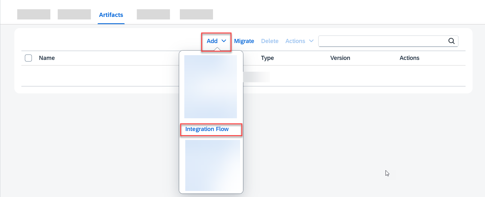

**화면 3 — iFlow 이름 입력**

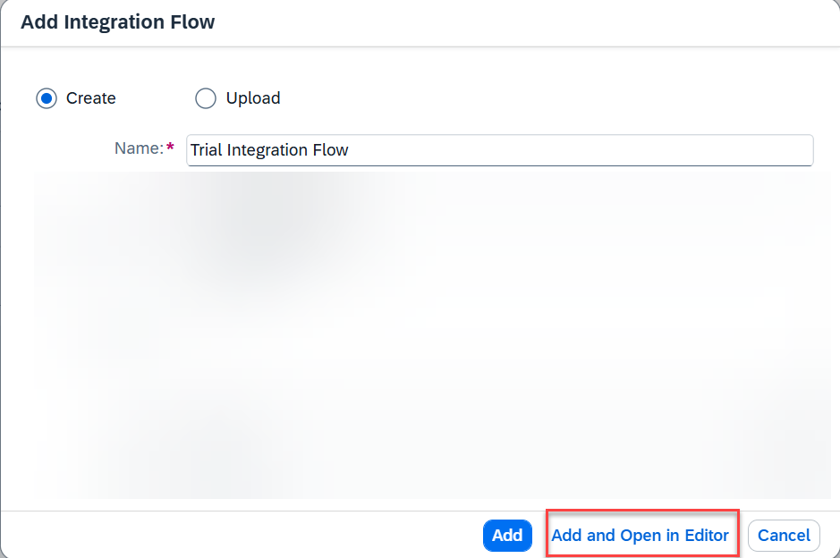

**화면 4 — iFlow 편집 모드와 Property Sheet 표시**

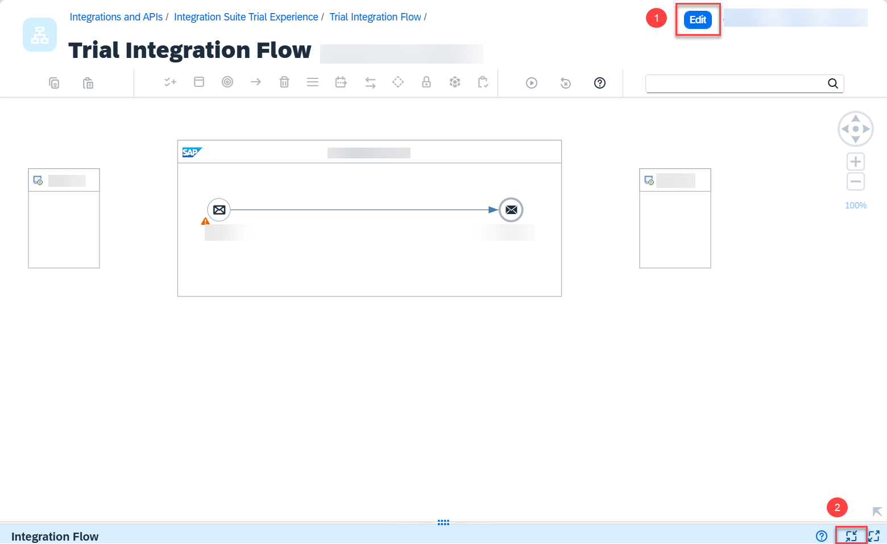

## 2. HTTPS Sender 연결

1. 캔버스의 **Sender**에서 화살표를 Start로 끌어 Sender channel을 만든다.
2. Adapter Type으로 **HTTPS**를 선택한다.
3. Property Sheet의 **Connection** 탭에서 Address에 `/products/details`를 입력한다.
4. 기본 선택된 **CSRF Protected**를 해제한다.

이 설정으로 iFlow의 HTTP endpoint가 만들어진다. endpoint 경로는 `/`로 시작해야 한다. 운영 환경에서는 인증, CSRF, 네트워크 접근 정책을 별도로 설계한다.

**화면 5 — Sender channel 연결**

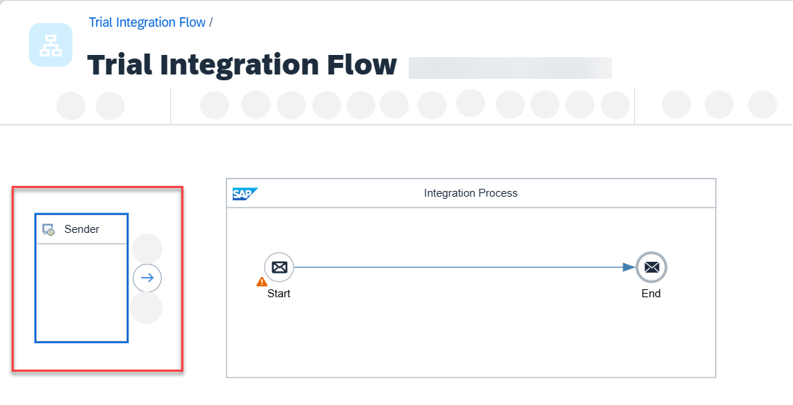

**화면 6 — HTTPS adapter 선택**

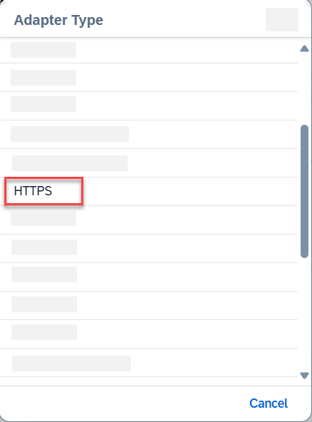

**화면 7 — HTTPS Connection 설정**

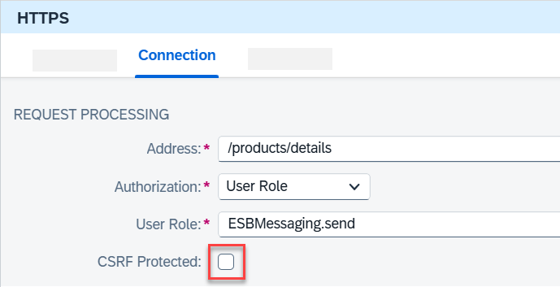

## 3. JSON to XML Converter 추가

1. 팔레트에서 **Message Transformers > Converter > JSON to XML Converter**를 선택한다.
2. Converter를 메시지 경로에 연결한다.

이 실습은 JSON으로 요청을 받지만, 이어서 호출할 OData 서비스는 XML 기반 처리를 사용한다. 변환 후 XPath로 `productIdentifier`를 참조할 수 있다.

**화면 8 — JSON to XML Converter 선택**

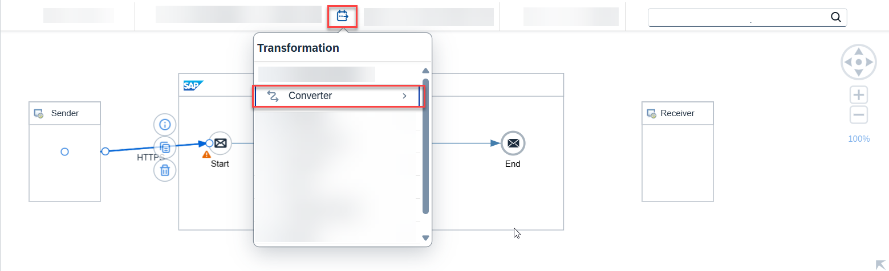

**화면 9 — Converter를 메시지 경로에 연결**

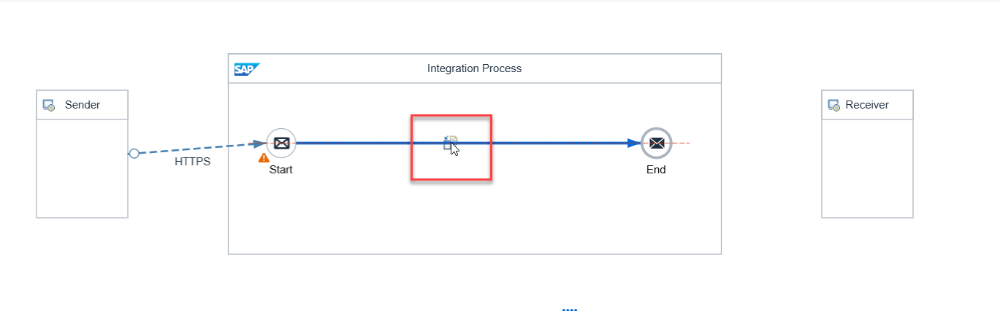

## 4. Content Modifier로 상품 ID를 헤더에 저장

1. **Message Transformers > Content Modifier**를 메시지 경로에 추가한다.
2. Property Sheet에서 **Message Header > Add**를 선택한다.
3. 아래 값을 입력한다.

| 필드 | 값 |
|---|---|
| Action | `Create` |
| Name | `productIdentifier` |
| Source Type | `XPath` |
| Source Value | `//productIdentifier` |
| Data Type | `java.lang.String` |

Content Modifier는 메시지 본문·헤더·속성을 변경할 수 있다. 여기서 만든 `productIdentifier` 헤더는 다음 OData 호출의 필터 값으로 쓰인다. 헤더는 수신 시스템으로 보내는 메시지의 일부가 될 수 있으므로 민감 정보를 넣지 않는다.

**화면 10 — Content Modifier를 메시지 경로에 연결**

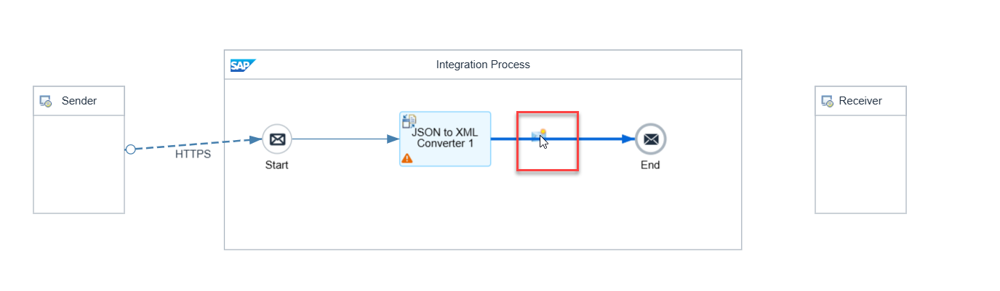

**화면 11 — `productIdentifier` Message Header 설정**

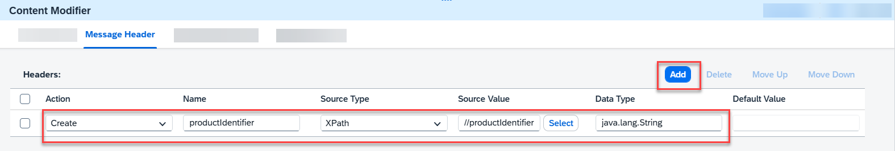

## 5. Request Reply 추가

1. 팔레트에서 **Call > External Call > Request Reply**를 선택한다.
2. 이전 단계 뒤의 메시지 경로에 연결한다.

Request Reply는 iFlow가 외부 서비스를 호출하고 응답을 받은 뒤 다음 처리를 계속하게 하는 동기 호출 단계다. 긴 응답 시간, 재시도, 오류 처리 여부는 실제 연계 요구사항에 맞게 설계한다.

**화면 12 — Request Reply 단계 선택**

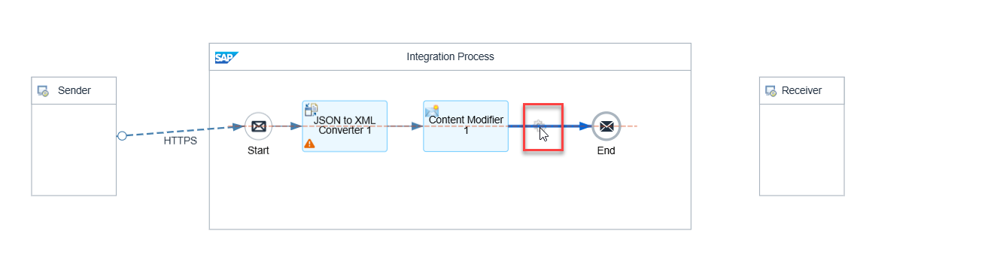

**화면 13 — Request Reply를 메시지 경로에 연결**

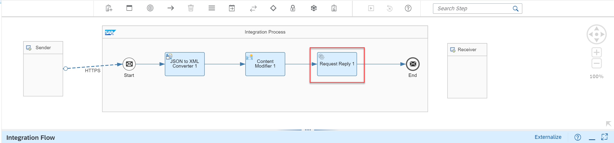

## 6. Receiver와 OData V2 연결

1. **Receiver**를 Request Reply 아래로 이동하고, Request Reply의 화살표를 Receiver로 끌어 연결한다.
2. Adapter Type은 **OData**, Message Protocol은 **OData V2**를 선택한다.
3. **Connection** 탭의 Address에 실습용 URL을 입력한다.

   ```text
   https://refapp-espm-ui-cf.cfapps.eu10.hana.ondemand.com/espm-cloud-web/espm.svc
   ```

4. **Processing** 탭에서 Resource Path의 **Select**를 선택한다.
5. 마법사의 Step 2에서 **Select Entity**를 `Products`로 선택한다.
6. **Select All Fields**를 선택하고 Step 3으로 이동한다.
7. **Filter By**에서 `Product ID`를 선택한다.
8. 비교 연산자는 `Equal`, 값은 아래와 같이 설정하고 완료한다.

   ```text
   ${header.productIdentifier}
   ```

이 설정은 요청에서 추출한 상품 ID와 같은 `Products` 엔터티를 조회한다. 실무에서는 수신 시스템 인증, 타임아웃, 오류 응답과 재시도 정책도 함께 구성한다.

**화면 14 — Receiver 위치 조정**

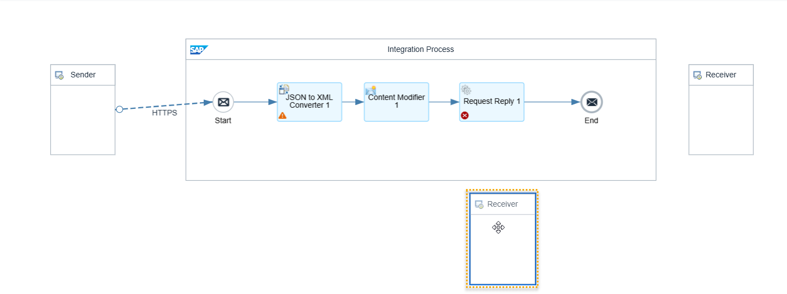

**화면 15 — Request Reply와 Receiver 연결**

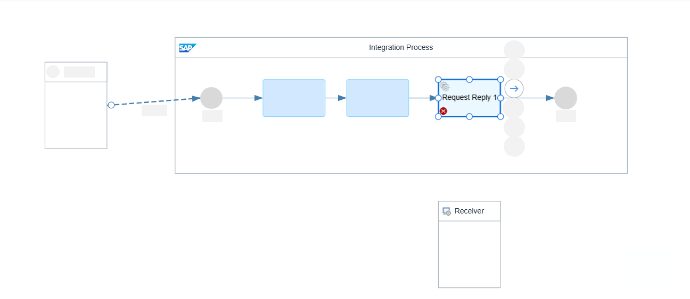

**화면 16 — OData adapter와 OData V2 protocol 선택**

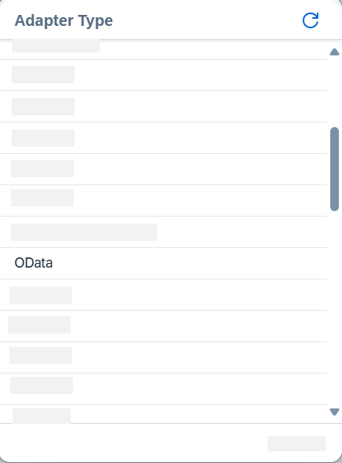

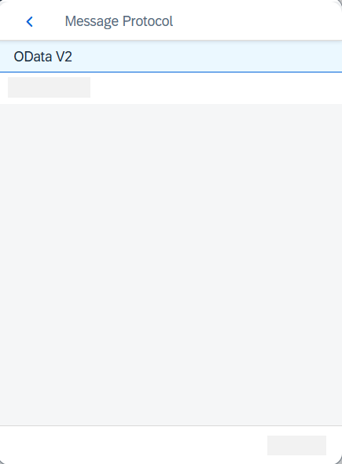

**화면 17 — OData Resource Path 설정 시작**

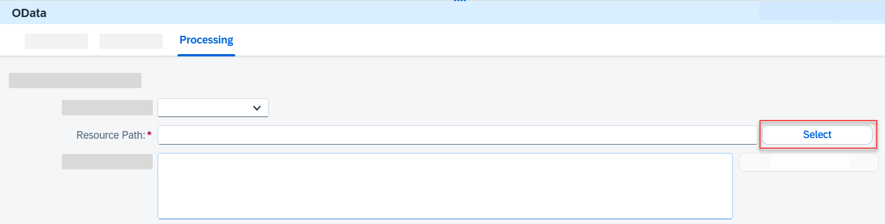

**화면 18 — `Products` 엔터티 선택과 필드 선택**

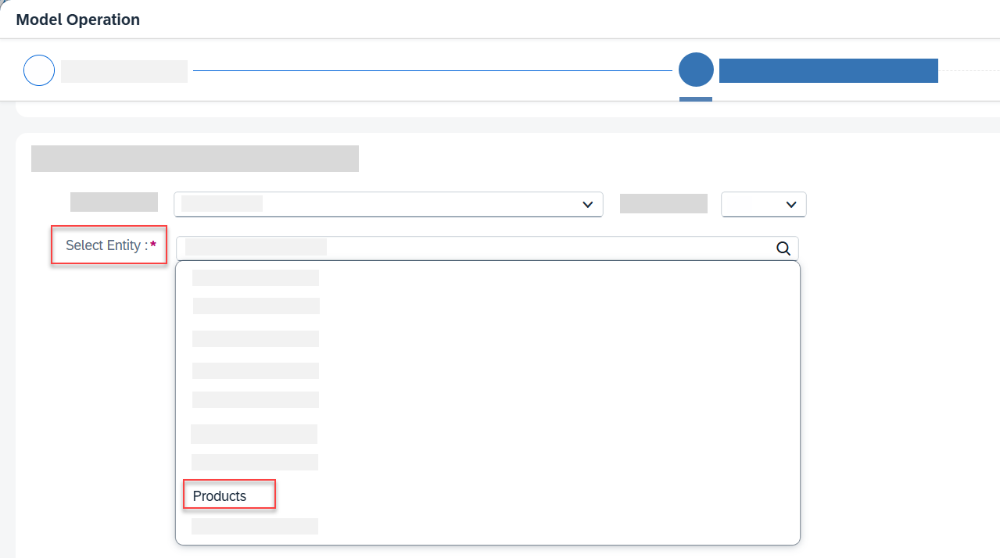

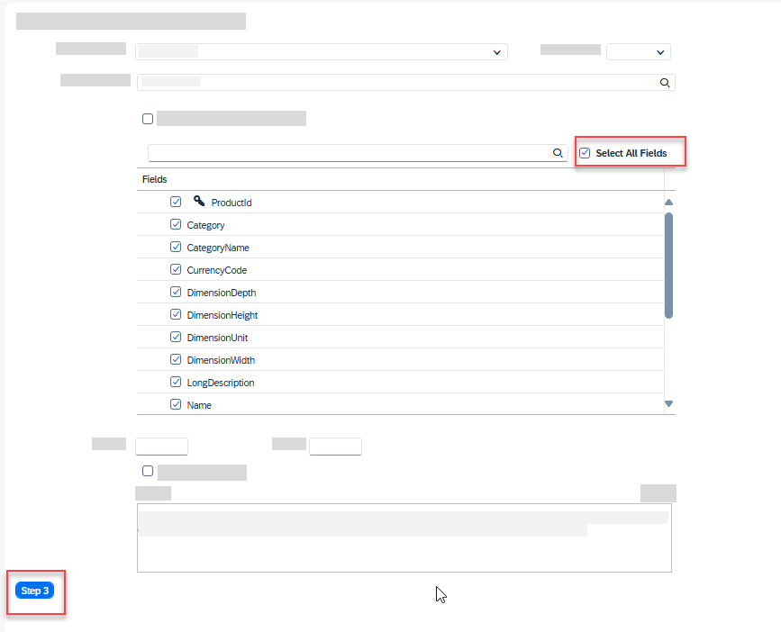

**화면 19 — Product ID 필터와 헤더 값 설정**

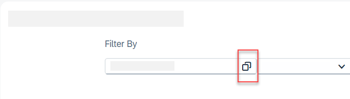

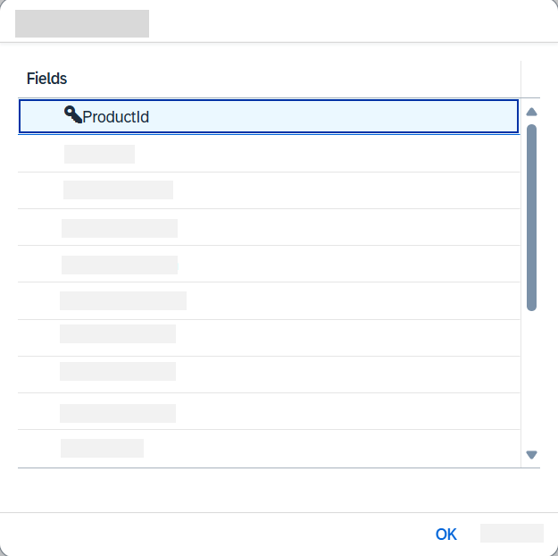

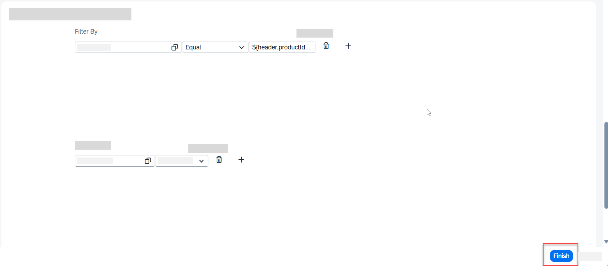

## 7. 배포 및 상태 확인

1. **Deploy**를 선택하고 확인 대화상자에서 **Yes**를 선택한다.
2. 배포가 끝난 뒤 Property Sheet의 **Deployment Status** 탭을 연다.
3. 아래 상태를 확인한다.

| 확인 항목 | 기대 값 |
|---|---|
| Deployment status | `Deployed` |
| Runtime status | `Started` |

다음 문서에서 API Management에 사용할 iFlow endpoint는 이 화면의 endpoint 정보에서 확인한다.

**화면 20 — iFlow 배포**

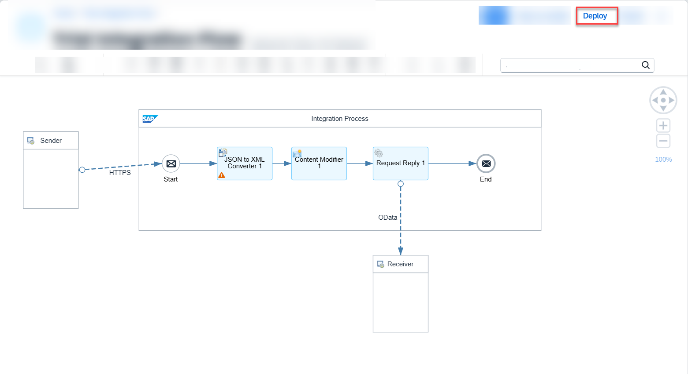

**화면 21 — Deployment Status 확인**

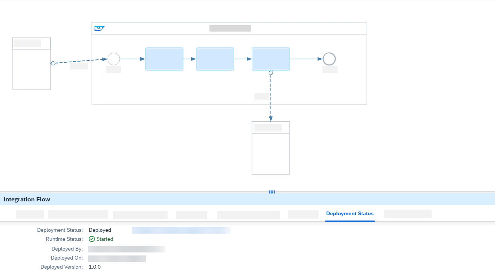

## 완료 점검

- Sender와 Receiver가 연결되고 adapter가 각각 HTTPS, OData V2로 설정되었는가?
- `productIdentifier` 헤더가 XPath `//productIdentifier`로 만들어졌는가?
- OData 필터가 `${header.productIdentifier}`를 사용하도록 설정되었는가?
- Deployment Status가 `Deployed`, Runtime Status가 `Started`인가?

## 공식 출처

- [Design and Deploy Your First Integration Flow](https://developers.sap.com/tutorials/cp-starter-integration-cpi-design-iflow.html)
- [SAP Help Portal — Elements of an Integration Flow](https://help.sap.com/docs/cloud-integration/sap-cloud-integration/elements-of-integration-flow?locale=en-US)
