# 8-2. API Management로 iFlow API 노출과 테스트

## 이 문서에서 하는 일

앞 문서에서 배포한 iFlow endpoint를 API Management의 **API Proxy**로 만들고, OpenAPI 정의와 OAuth 2.0 Client Credentials 정책을 적용한 뒤 호출을 테스트한다.

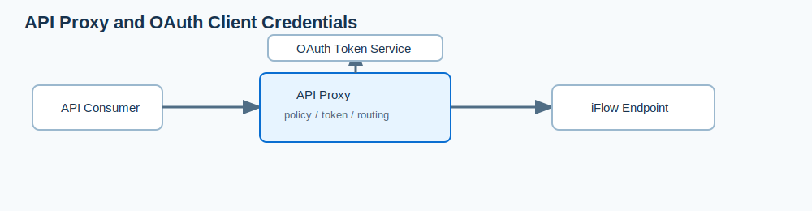

> 이 문서는 [8-1. iFlow 설계와 배포](8-1.%20iFlow%20설계와%20배포.md)에서 iFlow가 `Deployed` 및 `Started` 상태인 것을 전제로 한다.

## 시작 전 확인

- API Management Capability가 활성화되어 있어야 한다. 처음 활성화하는 경우 **Settings > Runtimes > Activate**를 선택하고 완료 후 페이지를 새로 고친다.
- iFlow의 **Deployment Status > Endpoints**에서 endpoint를 복사할 수 있어야 한다.
- service key의 `clientid`, `clientsecret`, `tokenurl`을 확인할 권한이 있어야 한다.
- `clientsecret`과 access token은 화면 캡처, Markdown, 소스 코드에 남기지 않는다.

## 전체 절차

| 단계 | 작업 | 결과 |
|---|---|---|
| 1 | iFlow endpoint 복사 | API Proxy의 backend 주소 준비 |
| 2 | API Proxy와 POST resource 생성 | 관리형 공개 API 경로 생성 |
| 3 | OpenAPI 정의 보완 | 요청 구조와 예시를 문서화 |
| 4 | service key 값 확인 | OAuth 설정값 준비 |
| 5 | OAuth 정책 적용 및 배포 | API Proxy가 안전하게 backend 호출 |
| 6 | Try Out 실행 | 상품 상세 응답 확인 |

---

## 1. 배포된 iFlow endpoint 복사

1. 배포된 iFlow를 연다.
2. Property Sheet의 **Deployment Status** 탭에서 navigation link를 선택한다.
3. **Endpoints** 탭에서 **Copy** 아이콘을 눌러 endpoint 주소를 복사한다.

**화면 1 — 배포된 iFlow artifact 열기**

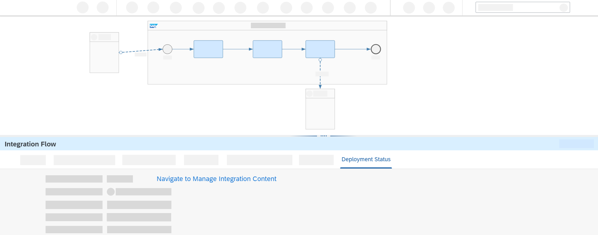

**화면 2 — Endpoints 탭에서 URL 복사**

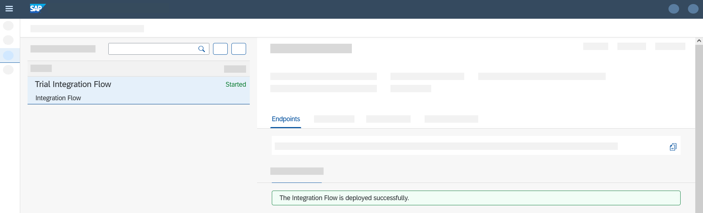

## 2. API Proxy와 POST resource 만들기

1. **Configure > APIs > Create**를 선택한다.
2. Source로 **URL**을 선택하고 아래 값을 지정한다.

| 항목            | 값                                                                               |
| ------------- | ------------------------------------------------------------------------------- |
| URL           | 복사한 iFlow endpoint. 단, 끝의 `/http/products/details` 중 **`/http/products`까지만** 사용 |
| Name          | `RequestProductDetails`                                                         |
| Title         | `Product Details API`                                                           |
| API Base Path | `/products`                                                                     |

3. **Create**를 선택한다.
4. 생성된 API의 **Resources** 탭에서 **Add**를 선택한다.
5. `Tag`에는 `Product Details`, `Path Prefix`에는 `/details`를 입력한다.
6. Operations에서는 **POST만 남기고** 나머지 operation을 삭제한 뒤 저장한다.
7. **Deploy**를 선택해 API Proxy를 활성화한다.

Backend iFlow URL과 외부에 제공할 API 경로는 다르다. 이 실습에서 backend는 `/http/products/details`이고, API Proxy는 Base Path `/products`와 Resource Path `/details`를 결합해 `/products/details`로 노출한다.

**화면 3 — Configure에서 새 API 만들기**

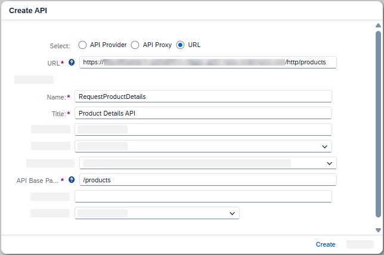

**화면 4 — iFlow URL과 API 기본 정보 입력**

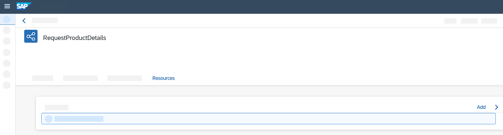

**화면 5 — Resource 추가**

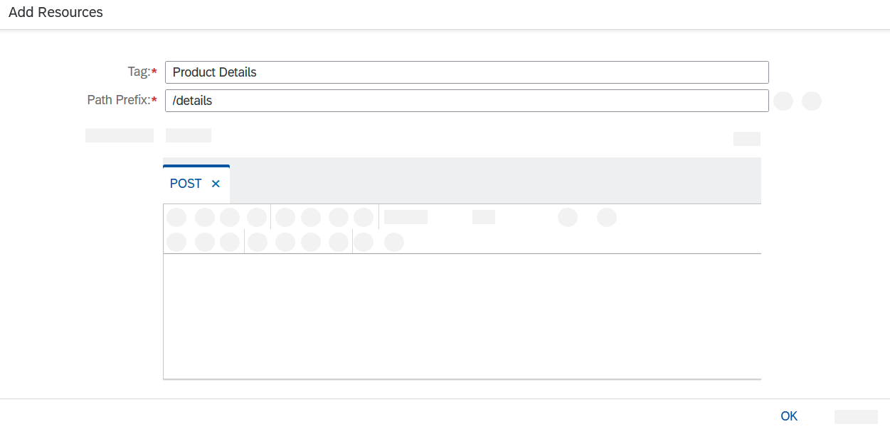

**화면 6 — `/details` resource와 POST operation 저장**

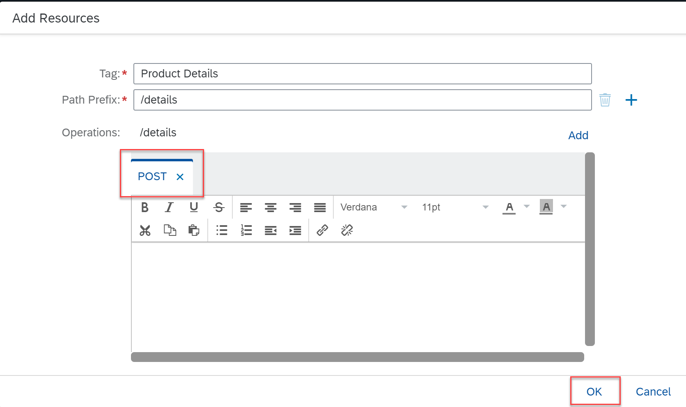

**화면 7 — 생성된 API Resource 확인 및 배포**

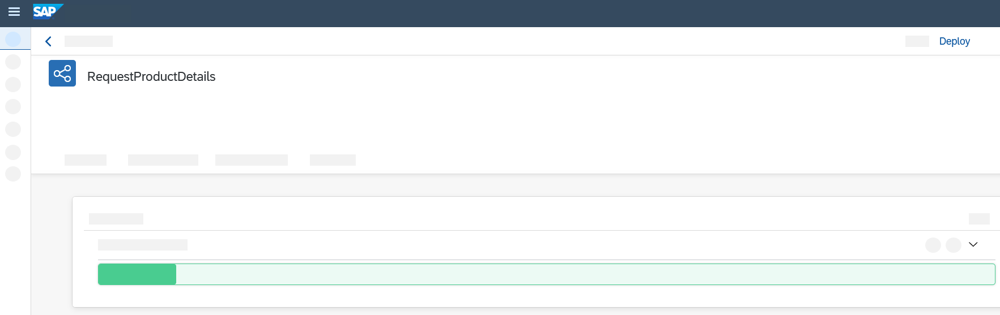

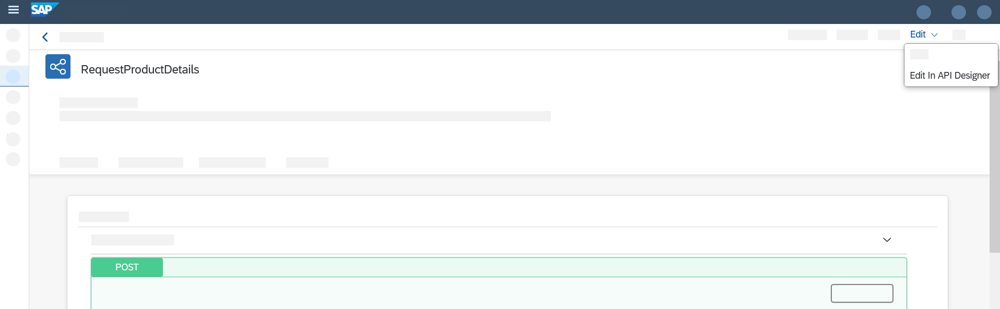

## 3. 생성된 OpenAPI 정의 보완

1. POST operation을 열고 **Edit > Edit in API Designer**를 선택한다.
2. request body의 키 `Payload`를 `productIdentifier`로 바꾼다.
3. `type` 다음 줄에 예시 값을 추가한다.

   ```yaml
   example: HT-2000
   ```

4. 저장한 뒤 API의 Resources 탭에서 API Designer를 다시 열어 POST request body가 바뀌었는지 확인한다.

아직 인증 정책을 설정하지 않았다면 **Try Out > Execute**는 `401 Not Authorized`를 반환하는 것이 정상이다.

**화면 8 — API Designer 수정 전 정의**

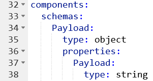

**화면 9 — `productIdentifier`와 example 추가 후 정의**

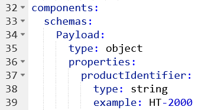

**화면 10 — 수정된 POST operation 확인**

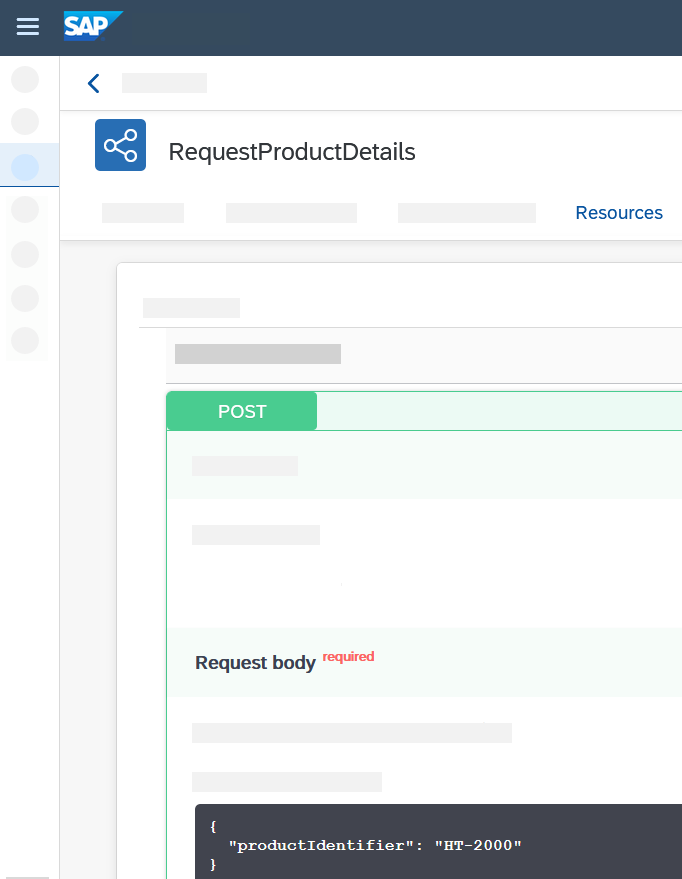

**화면 11 — 정책 적용 전 Try Out의 401 응답**

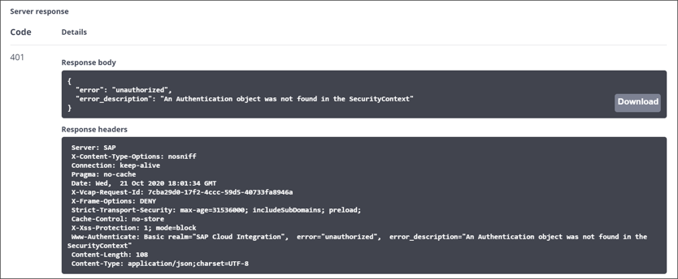

## 4. service key에서 OAuth 값 확인

1. SAP BTP 서브계정에서 **Services > Instances and Subscriptions**로 이동한다.
2. 생성된 서비스 인스턴스의 Credentials 열에서 key를 연다.
3. `clientid`, `clientsecret`, `tokenurl`을 확인한다.

| 값 | 쓰임 | 캡처 시 주의 |
|---|---|---|
| `clientid` | 토큰 요청의 클라이언트 식별 | 필요하면 일부만 보이게 처리 |
| `clientsecret` | 토큰 요청의 비밀 값 | 반드시 마스킹 |
| `tokenurl` | 액세스 토큰 발급 주소 | tenant 정보 노출 여부 검토 |

Trial에서 Booster가 만든 인스턴스 이름은 `default-it-rt-integration-flow`일 수 있으며, Free Tier의 인스턴스 이름은 사용자가 정한다.

**화면 12 — service instance의 key 열기**

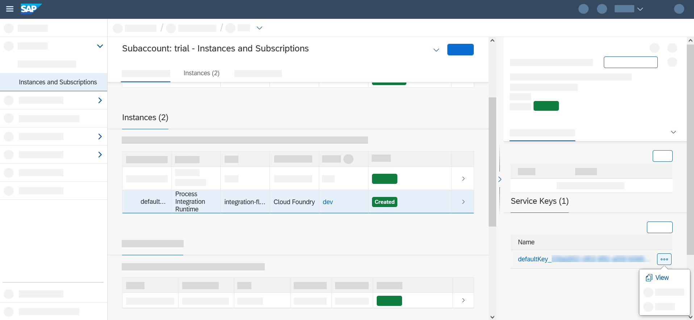

**화면 13 — `clientid`, `clientsecret`, `tokenurl` 확인**

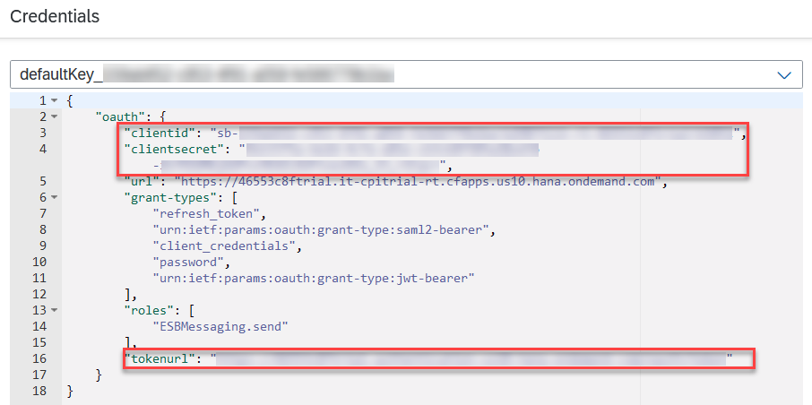

> 이 이미지를 공유할 때 `clientsecret`은 반드시 마스킹한다.

## 5. OAuth Client Credentials 정책 적용

1. **Discover > APIs**로 이동한다.
2. `Connect to SAP Business Technology Platform Services` 패키지를 검색해 연다.
3. **Artifacts** 탭에서 artifact를 **Copy**한다.
4. 복사가 끝나면 **Configure > APIs**에서 만든 API를 열고 **Edit > Policies**를 선택한다.
5. **Policy Template > Apply**에서 `Cloud_Platform_Connectivity` 템플릿을 적용한다.
6. **Target Endpoint > PreFlow**를 연다.
7. Policy Editor의 `getcredential` 도형에 `clientid`와 `clientsecret`을 설정한다.
8. `getoauthtoken` 도형에 `tokenurl`을 설정하고 URL 끝에 다음을 붙인다.

   ```text
   ?grant_type=client_credentials
   ```

9. **Update > Save**를 선택하고 화면 상단의 **Click to Deploy**로 변경 사항을 배포한다.

> **왜 artifact를 Copy하는가?**  
> 여기서의 **Actions > Copy**는 OpenAPI 코드를 클립보드에 복사하는 기능이 아니다. SAP 제공 정책 artifact를 현재 테넌트에서 사용할 수 있도록 복제하는 작업이다. 이 준비가 되어야 이후 **Policy Template > Apply** 목록에서 `Cloud_Platform_Connectivity` 템플릿을 선택해 적용할 수 있다. 이미 해당 템플릿이 목록에 있다면 이전에 복제되었을 수 있으므로 다시 복사할 필요는 없다.

이 정책의 흐름은 다음과 같다.

1. API Proxy가 service key의 `clientid`와 `clientsecret`으로 token service에 요청한다.
2. token service가 access token을 반환한다.
3. API Proxy가 token을 포함해 iFlow endpoint를 호출한다.

Client Credentials 인증에 필요한 값은 `clientid`, `clientsecret`, `tokenurl`이다. 실제 API 호출을 위해서는 대상 iFlow URL도 정확해야 한다.

### 정책 화면 순서

아래 화면은 위 1~9번 조작을 실제 UI 순서대로 보충한다. API Management 화면 구성은 릴리스에 따라 약간 달라질 수 있지만, 대상 위치와 값은 동일하다.

**화면 14 — Discover에서 API 패키지 찾기**

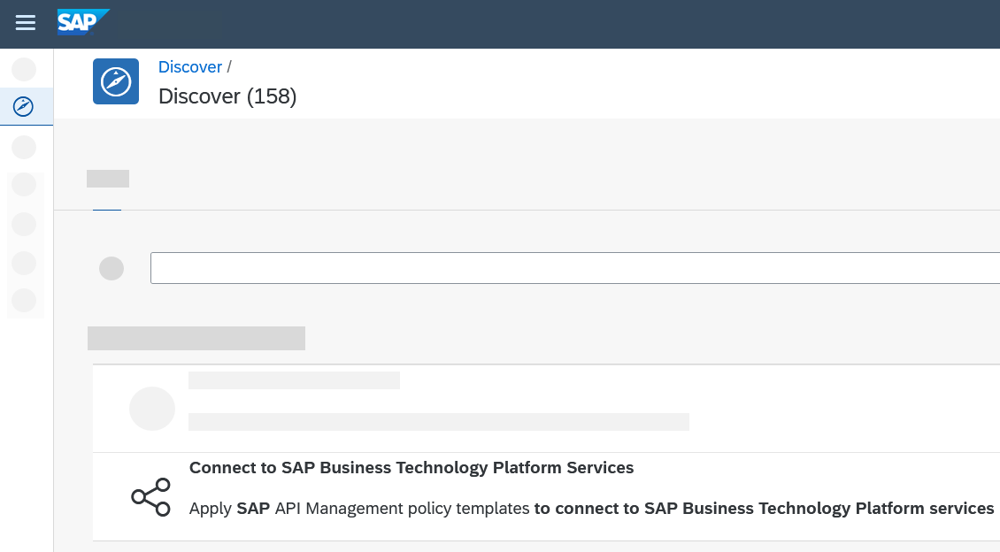

**화면 15 — `Connect to SAP Business Technology Platform Services` 패키지 열기**

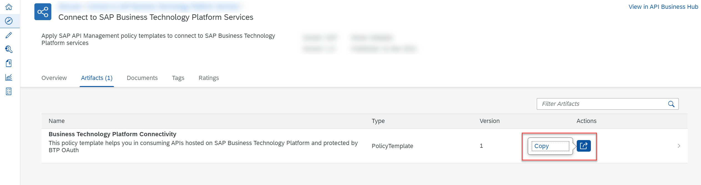

**화면 16 — Artifacts 탭에서 정책 artifact 확인**

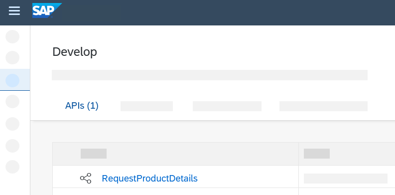

**화면 17 — artifact 복사**

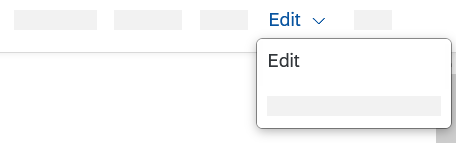

**화면 18 — Configure에서 생성한 API 선택**

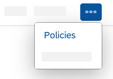

**화면 19 — API 편집 진입**

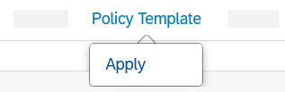

**화면 20 — Policies 탭 열기**

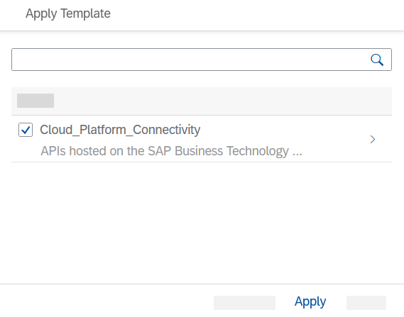

**화면 21 — Policy Template 적용 시작**

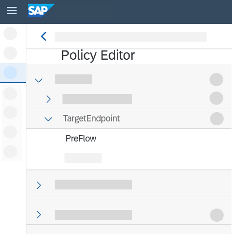

**화면 22 — `Cloud_Platform_Connectivity` 템플릿 선택**

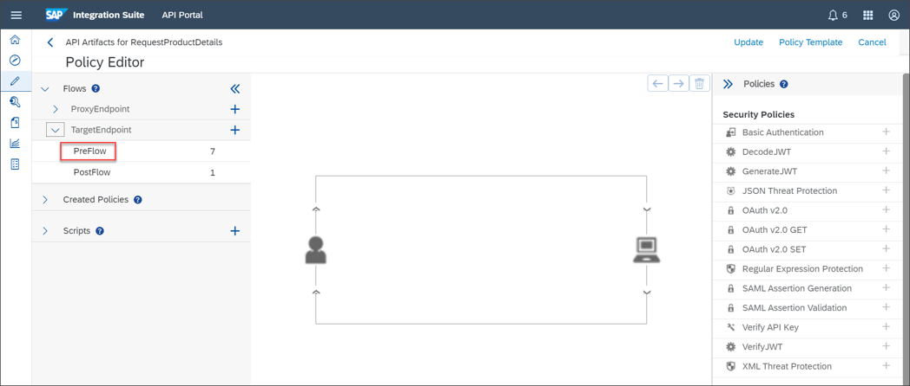

**화면 23 — Target Endpoint와 PreFlow 열기**

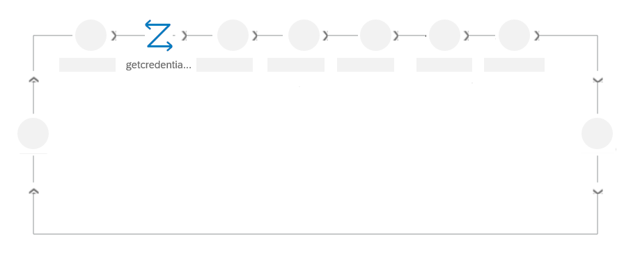

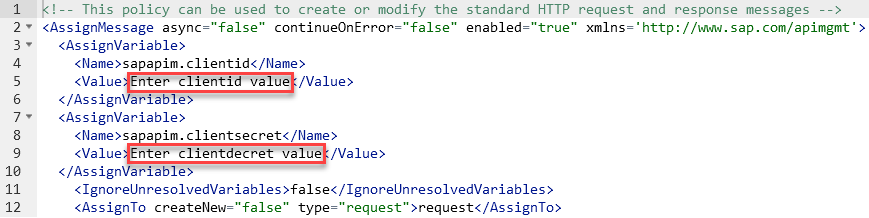

**화면 24 — Policy Editor의 OAuth 흐름과 `getcredential` 설정**

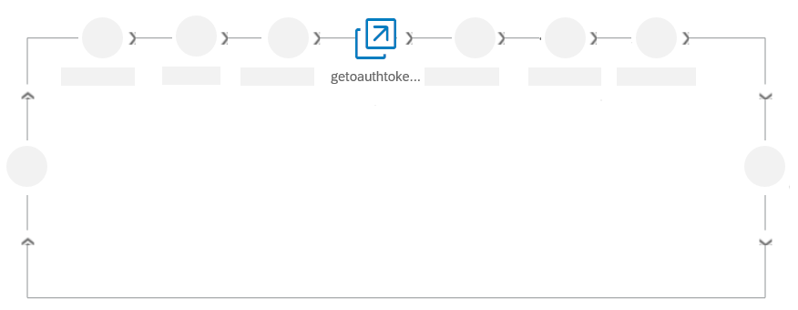

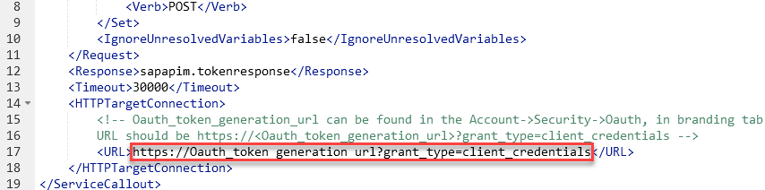

> `clientsecret`이 보이는 화면은 공유용 문서에서 반드시 마스킹한다.

**화면 25 — `getoauthtoken`의 token URL 설정**


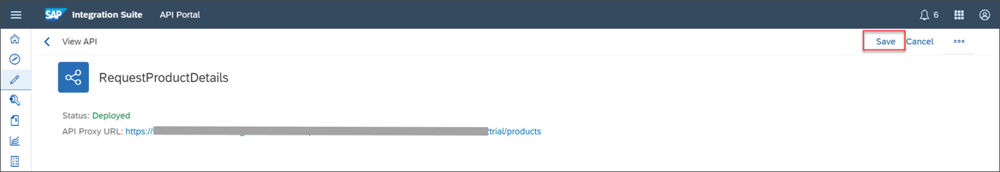

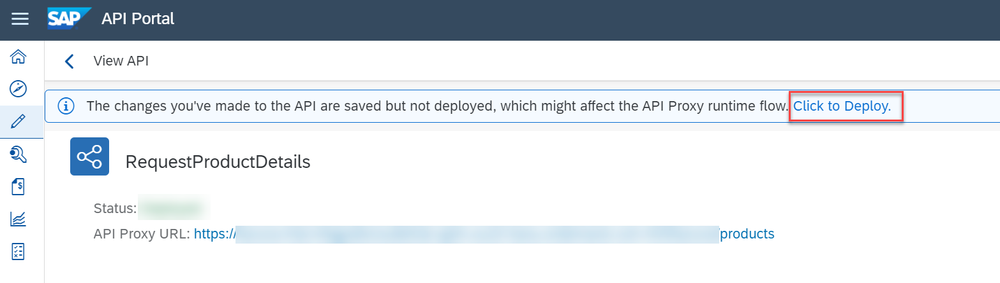

**화면 26 — 정책 Update, Save, Deploy**

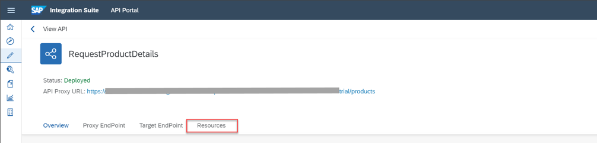

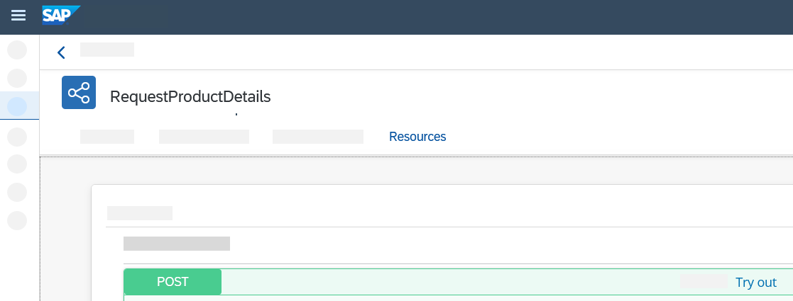

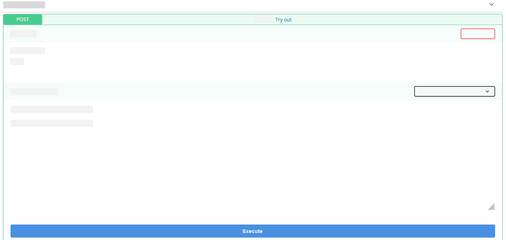

## 6. API 실행

1. API의 **Resources** 탭에서 POST resource를 연다.
2. **Try Out > Execute**를 선택한다.
3. 지정한 `productIdentifier`에 대한 웹숍 상품 상세 응답이 반환되는지 확인한다.

**화면 27 — Try Out 실행 및 상품 상세 응답**

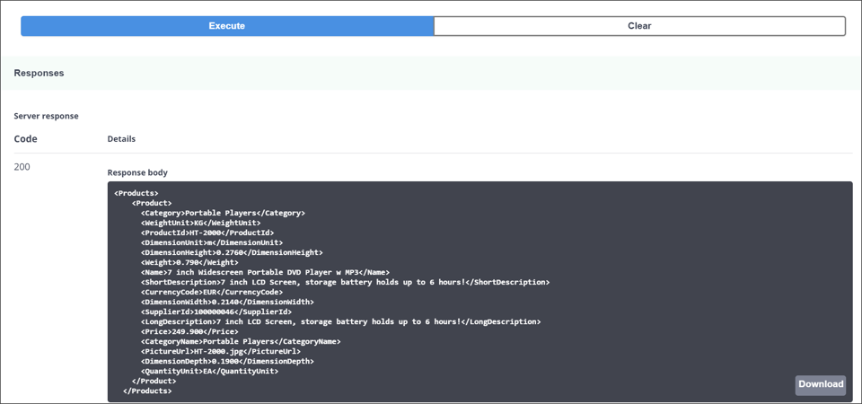

> tenant URL, 토큰, 민감 데이터가 보이면 공유 전에 마스킹한다.

## 완료 점검

- API Proxy의 경로가 `/products/details`로 구성되었는가?
- 인증 전에는 401이 발생하고, 정책 적용·배포 후에는 호출이 성공하는가?
- API 응답이 요청한 `productIdentifier`에 맞는 상품 정보를 반환하는가?
- Cloud Integration의 메시지 모니터링과 API Management의 API 분석/로그에서 호출을 추적할 수 있는가?

## 공식 출처

- [Expose Integration Flow Endpoint as API and Test the Flow](https://developers.sap.com/tutorials/cp-starter-isuite-api-management.html)
- [SAP Help Portal — Configuring User Access](https://help.sap.com/docs/integration-suite/sap-integration-suite/configuring-user-access?locale=en-US)
