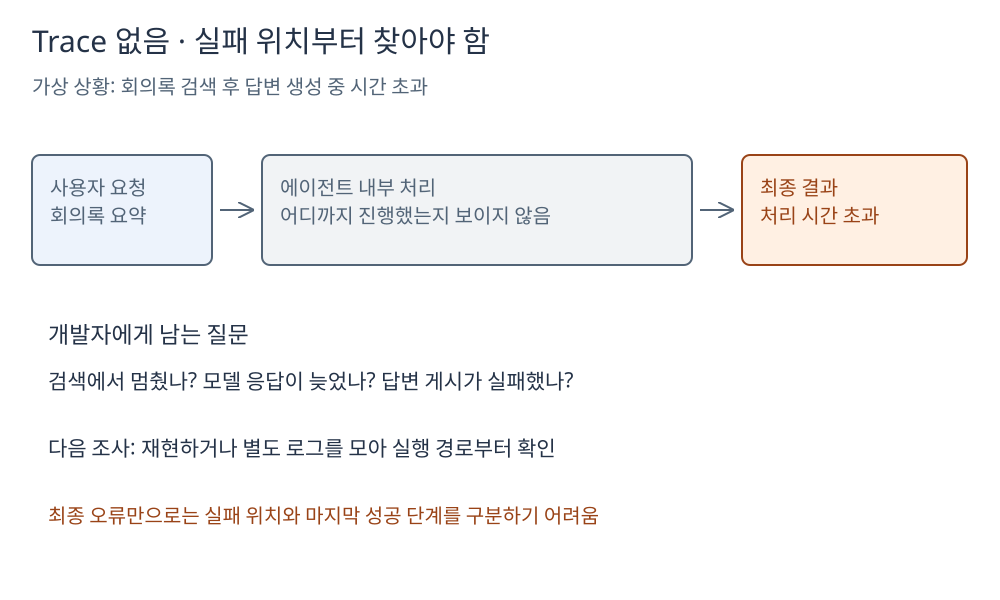
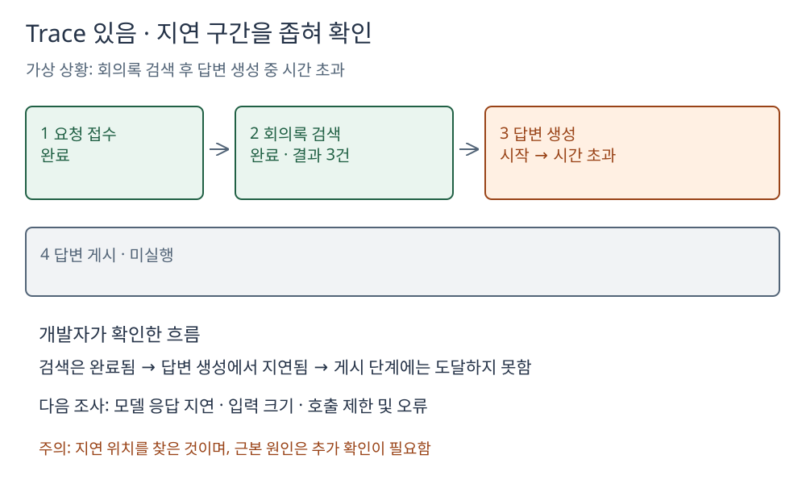

# 에이전트 Trace의 정의와 필요한 이유

에이전트를 처음 만드는 개발자를 위한 안내입니다. **Trace는 최종 답변뿐 아니라, 그 답변에 이르기까지 에이전트가 실제로 지나간 실행 경로를 추적하는 기록**입니다.

## Trace로 무엇을 확인하는가

개발자가 설계한 구조 안에서 에이전트가 **현재 어느 단계에 있고, 어떤 단계를 거쳤으며, 어디에서 대기하거나 실패했는지** 확인합니다. 예를 들어 요청 접수 → 판단 → 도구 선택·실행 → 사용자 선택 대기 → 답변 생성 → 답변 게시 순서입니다. 실제 실행에서는 일부 단계를 건너뛰거나 반복할 수도 있습니다.

- **동작 확인:** 의도한 도구와 순서로 처리하는지 모니터링합니다.
- **문제 위치 파악:** 마지막 성공 단계와 지연·실패 구간을 좁힙니다.
- **개선 검증:** 수정 후 불필요한 반복이나 지연이 줄었는지 비교합니다.

## 같은 장애를 Trace 없이 확인한다면

가상 상황으로, 회의록 검색은 성공했지만 모델의 답변 생성 중 시간 초과가 발생했다고 가정합니다. 사용자에게는 “처리 시간 제한을 초과했습니다”만 보입니다.

[Excalidraw 원본 열기](그림/01-Trace-없음.excalidraw)

개발자는 검색·모델 호출·답변 게시 중 어느 구간이 문제인지 먼저 찾아야 합니다. 재현하거나 별도 로그를 모으는 데 시간이 들 수 있습니다.

## 같은 장애를 Trace로 확인한다면

[Excalidraw 원본 열기](그림/02-Trace-있음.excalidraw)

검색 완료와 답변 생성 시작이 기록되어 있으므로 조사 범위를 답변 생성 구간으로 좁힐 수 있습니다. 다만 **시간 초과가 발생한 위치를 아는 것과 근본 원인을 확정하는 것은 다릅니다.** 모델 응답 지연, 입력 크기, 호출 제한 등은 추가로 확인해야 합니다.

## 구축할 때 기억할 최소 원칙

- 요청별 실행(run)을 구분하고 후속 요청도 추적합니다. 각 단계의 시작·완료·대기·실패와 소요 시간을 연결해 기록합니다.
- 도구 입출력은 필요한 범위만 남깁니다. 예를 들어 항목 이름·자료형·배열 개수이며, 인증키나 민감한 원문은 그대로 노출하지 않습니다.
- Trace는 모델 내부의 전체 사고 과정과 다릅니다. 모델이 제공하는 공개 추론 요약은 선택적인 추가 정보이며, 없어도 실행 단계 추적은 가능합니다.
- 저장 위치는 별도 설계입니다. 메모리만 사용하면 재시작·만료 시 기록이 사라질 수 있고, 나중에도 조사해야 한다면 영속 저장과 보관 정책이 필요합니다.

**핵심은 “실패했다”에서 끝내지 않고, “어디까지 성공했고 어디부터 확인해야 하는가”를 알 수 있게 만드는 것입니다.**
