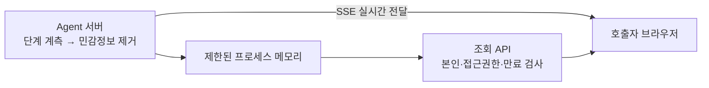
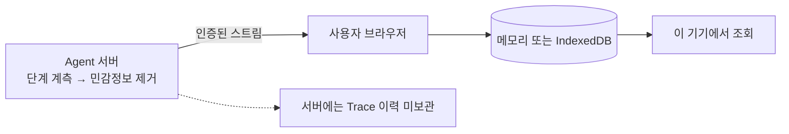
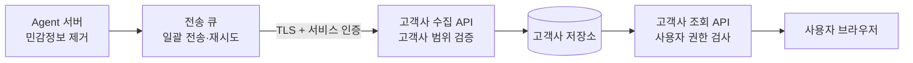
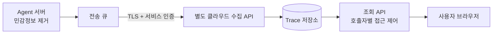

# Trace 보관 위치와 운영 방식 비교

조사 기준: 2026-09-22 · 기존 조사에 메모리 전환 결정을 반영. 로컬 구현이며 운영 적용 전.

## 1. 결론

- **현재 선택은 Agent 서버 수집 + 제한된 프로세스 메모리 보관 + 브라우저 조회다.** 사용자가 유실을 허용하여 영속 Trace 관리 복잡성을 줄인다.
- 브라우저는 **보는 곳**, 서버는 **실행을 관측하고 기록하는 곳**으로 역할을 나눈다.
- 부하가 커지면 먼저 **같은 관리 영역 안에서 Trace 저장·수집을 분리**한다. 외부 SaaS로 보낼 필요는 없다.
- 고객이 자기 인프라에만 보관하기를 요구하면 **고객사 서버 보관**을 검토한다.
- “Gemini도 클라이언트에서 한다”는 이유만으로 브라우저 보관으로 전환하지 않는다. **Gemini CLI와 Gemini 웹 서비스는 구분해야 한다.**

## 2. 먼저 구분할 말

| 구분 | 의미 |
| --- | --- |
| 생성·계측 | Agent가 실행되는 곳에서 단계 시작·종료·오류를 이벤트로 만든다. |
| 전달·수집 | 이벤트를 저장 담당자에게 전달한다. 같은 프로세스 함수 호출 또는 네트워크 전송이다. |
| 보관 | DB·파일 등에 남겨 나중에도 조회할 수 있게 한다. |
| 조회·화면 | 권한을 확인한 뒤 이벤트를 사용자에게 보여 준다. |

**보관 위치를 바꿔도 서버에서 실행되는 Agent의 계측까지 브라우저로 옮길 수 있는 것은 아니다.** 브라우저는 서버가 보내 주지 않은 내부 단계는 알 수 없다.

“클라이언트 서버”라는 말은 다음 중 어느 뜻인지 확인해야 한다.

- **사용자 브라우저/PC:** 고객 개인의 기기. 브라우저 메모리·IndexedDB 또는 로컬 프로그램의 파일.
- **고객사 서버:** 고객이 관리하는 공용 서버. 브라우저가 아니며, 서버 간 연동에 해당한다.
- **별도 클라우드:** 우리가 관리하는 전용 클라우드일 수도, 외부 업체의 SaaS일 수도 있다. **물리적 위치보다 운영 주체·계정·접근 권한·데이터 반출 경계가 중요하다.**

## 3. 구조 그림

Obsidian 읽기 화면에서 아래 Mermaid 블록이 도형으로 표시된다. 화살표는 Trace의 흐름이며, Agent의 업무 요청 흐름은 생략했다.

### A. 현재: Agent 서버 측 보관

- 기존 인증/업무 DB는 권한 확인에 사용한다. Trace 이벤트를 DB에 저장하지 않는다.
- 최대168시간/1000요청/요청당500이벤트/전체payload32MiB. 기존 두 Trace 테이블은0085로 제거한다.
- **서버 재시작이면 기록이 사라진다.** 새로고침은 같은 프로세스에 남은 기록만 재조회한다. 다중 replica 집계는 지원하지 않는다.

### B. 사용자 브라우저에만 보관하는 대안

- 서버 저장 부담은 줄지만, **서버 계측·전송 부담은 남는다.**
- 탭 종료·연결 단절 중 발생한 이벤트는 별도 서버 버퍼/보관 없이는 복구할 수 없다.
- IndexedDB는 새로고침 후 남을 수 있지만, 기기 교체·사이트 데이터 삭제·브라우저 저장소 정리에는 취약하다.
- 고객 PC에서의 복사·변조·오래된 사본을 중앙에서 확실히 회수하기 어렵다. **7일 만료와 권한 회수의 강제력이 약해진다.**

### C. 고객사 서버에 보관하는 대안

- 고객이 보관 위치와 운영 권한을 직접 통제한다. Agent 서버가 이미 고객사 내부에 있다면 A와 운영 경계가 같을 수도 있다.
- 별도 망이라면 방화벽·인증서/키 교체·연결 장애·재전송·중복 제거·조회 권한 연동이 필요하다.
- 이 그림은 **Agent 서버가 고객사로 보내는 방식**이다. 고객사에서 가져가는 방식은 Agent 측 임시 보관과 조회 API가 추가로 필요하다.

### D. 별도 클라우드에 보관하는 대안

- **자체 운영:** 우리/고객 전용 계정에 직접 구축. 외부 Trace SaaS 도입과는 다르지만 보안·삭제·장애 운영은 우리가 맡는다.
- **외부 SaaS:** 수집·검색·운영 기능을 제품에 맡긴다. 위탁 처리·보관 지역·접근 권한·계약 확인이 필요하다. 현재 도입 대상은 아니다.
- C와 D의 기술 흐름은 비슷하다. 차이는 **누가 관리하고 어느 신뢰 경계를 넘는지**다.

## 4. 장단점과 적합한 상황

| 방식 | 장점 | 단점 | 적합한 상황 |
| --- | --- | --- | --- |
| A. Agent 서버 메모리 | 구현·권한 관리 단순, 별도 저장 서비스 없음 | 재시작/한도 초과 시 유실, 단일 프로세스 | 현재처럼 유실을 허용하는 초기 운영 |
| B. 브라우저만 | 서버 저장 부담 감소, 개인 기기 중심 | 누락·변조·기기 종속, 중앙 만료·장애 분석 어려움 | 임시 시연, 개인 디버깅, 보조 캐시 |
| C. 고객사 서버 | 고객의 데이터 보관 통제 | 고객별 연결·자격증명·운영 지원 증가 | 고객사 내부 보관이 계약상 필수 |
| D. 별도 클라우드 | 업무와 관측 부하 분리, 여러 서버의 기록 통합 | 전송·권한·비용·장애 운영 추가, 반출 검토 | 실제 부하 증가, 독립 운영/확장 필요 |

**별도 서버를 둔다고 자동으로 무손실이 되는 것은 아니다.** 전송 큐의 내구성·재시도·저장 완료 확인까지 설계해야 한다. 반대로 소규모 서비스가 처음부터 이 복잡성을 떠안을 필요도 없다.

## 5. 매 Trace마다 인증이 엄청 복잡해지는가?

**“매 이벤트마다 다시 로그인한다”는 뜻이라면 아니다.** 인증(누구인가), 인가(이 기록을 보거나 쓸 수 있는가), 전송을 구분해야 한다.

| 연결 | 일반적인 구현 | 반드시 지킬 것 |
| --- | --- | --- |
| 같은 서버 내부 계측 → 메모리 | 함수 호출, 정제 후 제한된 버퍼 | 호출자·커뮤니티 범위를 서버가 결정 |
| 서버 → 로그인한 브라우저 | 연결 시 세션 인증, SSE 등으로 여러 이벤트 전달 | 수신자 격리, 권한 회수·만료·재연결 처리 |
| 브라우저 → 이력 조회 API | 기존 세션으로 요청마다 인증·인가 | 본인·커뮤니티·채널·만료 검사 |
| Agent 서버 → 별도 수집 서버 | mTLS 또는 제한된 서비스 토큰, 여러 이벤트 일괄 전송 | 고객사 범위 검증, 키 교체, 재시도·중복 처리 |
| 브라우저 → 별도 수집 서버 | 필요할 때만 짧은 수명의 제한 토큰 또는 자체 Backend 경유 | 장기 서비스 키 노출 금지, 위조·남용 방어 |

- HTTPS 연결과 자격증명을 재사용할 수 있고, 각 전송 요청에서 서버가 검증한다. **로그인 반복과 권한 검증 반복은 다르다.**
- 스트림도 처음 한 번 인증했다고 권한을 영구 신뢰해서는 안 된다.
- 브라우저의 자기 저장만으로는 새로운 원격 인증이 생기지 않는다. 복잡성은 **별도 도메인·다른 운영 주체·고객사별 권한 경계**에서 주로 발생한다.
- CORS는 브라우저 접근 규칙이지 인증 수단이 아니다. Trace ID도 접근 권한을 대신하지 않는다.
- 표의 일괄 전송·서비스 토큰 방식은 **분리 시의 설계 예시**다. 현재 zen-ai에 이미 구현됐다는 뜻은 아니다.

## 6. Gemini 사례에서 확인된 사실

- **Gemini CLI 공식 문서 [1]:** OpenTelemetry 지원. 로컬 파일(`outfile`) 또는 Google Cloud로 내보내는 설정이 있다. 클라우드 전송에는 ADC나 CLI OAuth 자격증명과 IAM 권한을 사용한다.
- 이는 **사용자 PC에서 실행되는 CLI의 관측** 사례다. 서버에서 실행되는 zen-ai Agent의 Trace를 브라우저에만 두는 것과는 조건이 다르다.
- **Google ADK 공식 문서 [2]:** Agent 실행의 로깅·메트릭·Trace 및 exporter 연결을 설명한다. 브라우저 단독 보관을 기본 정답으로 제시하는 자료가 아니다.
- **Gemini 웹 서비스의 내부 Trace 보관 구조:** 이번에 확인한 문서만으로는 판단할 수 없다. 들은 설명의 제품명·원문 링크가 필요하다.
- Gemini CLI에는 프롬프트 기록 옵션도 있다. **그 기본값을 zen-ai에 복제하면 안 된다.** 우리 목적은 내용 수집이 아니라 실행 단계·상태 확인이다.

## 7. zen-ai의 유지 계약과 전환 기준

### 위치와 관계없이 유지

- 출력/이벤트: 단계·시각·순번·소요시간·결과 상태·안전한 오류 코드·임의 실행 연결 표식만 허용.
- 제외: 사용자/스레드/회의록 실제 ID, 메시지·프롬프트·회의록 본문, Tool 입출력 원문·내부 상태, 키·토큰·원본 예외.
- 본인 확인용 ID는 **보호된 권한 메타데이터에만** 필요하다. 이벤트 payload에 공개하지 않는다. 임의 표식도 재식별 가능성이 있어 접근 제한한다.
- 조회는 현재 접근 권한이 있는 호출자 본인만. 개발자 진단 목적이라고 관리자 우회 조회를 자동 추가하지 않는다.
- 생성 후 최대7일. 메모리 방식은 재시작/상한으로 더 일찍 유실되며 Trace 백업은 없다.
- Tool은 API의 시작·결과 상태까지만 관측한다. 고객사 MCP 서버 내부를 추적하지 않는다.
- Trace 장애로 Agent 업무를 실패시키지 않는다. 다만 누락 가능성을 숨기지 않는다.

### 언제 바꿀 것인가

1. **지금:** A의 메모리 방식. 만료·용량·누락을 표시하고 업무 실행과 분리한다.
2. **부하 확인:** 사용자 수 대신 이벤트 수·평균 크기·동시 실행·heap·누락률을 측정한다.
   - 예: 일 1,000요청 × 요청당 100이벤트 × 1KB × 7일 ≈ **700MB payload**. 인덱스·행·WAL·백업은 별도다. 실측치나 용량 보증이 아닌 계산 예시다.
3. **무손실 보관/다중 서버가 필요할 때:** 동일 관리 영역 내 저장소/수집 서비스를 재검토한다. 브라우저로 옮기는 것으로 해결하지 않는다.
4. **고객사 보관 요구:** C 검토. 허용 데이터·보관 기한·서비스 인증·조회 권한을 먼저 합의한다.
5. **향후 템플릿:** 공통 이벤트/보호 계약과 저장 연결부를 분리한다. Builtin 테이블 구조를 그대로 고정하거나 지금부터 모든 exporter를 구현하지 않는다.

## 근거

외부 자료는 2026-09-22 열람. 아래 구현 비교·권고는 이 자료와 zen-ai 코드를 바탕으로 한 설계 판단이다.

1. [Gemini CLI — Observability with OpenTelemetry](https://github.com/google-gemini/gemini-cli/blob/main/docs/cli/telemetry.md): local/file·GCP 전송, 인증, 프롬프트 기록 옵션.
2. [Google ADK — Observability for agents](https://google.github.io/adk-docs/observability/): Agent 계측 및 exporter 예시.
3. [OpenTelemetry — Client-side Apps](https://opentelemetry.io/docs/platforms/client-apps/): 사용자 기기의 네트워크·자원·프라이버시 제약, Backend Trace 연결.
4. [OpenTelemetry — Collector hosting best practices](https://opentelemetry.io/docs/security/hosting-best-practices/): 수집 서버 인증·최소 권한·접근 및 자원 제한.
5. 현재 구현: `src/lib/agent-trace/memory.ts`, `memory-runtime.ts`, `runtime.ts`, `drizzle/0085_remove-private-agent-trace.sql`. 과거 DB 방식은0081에 남아 있다.

외부 제품 비교는 설계 조사이며 제품 실험 결과가 아니다. 현재 로컬 구현·검증 결과는 `1. Trace 구조와 테스트 결과.md`를 참고한다.
