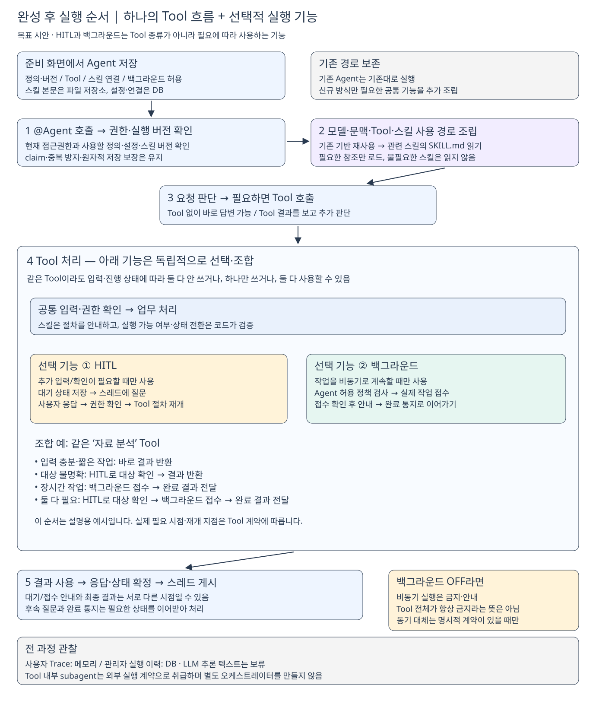
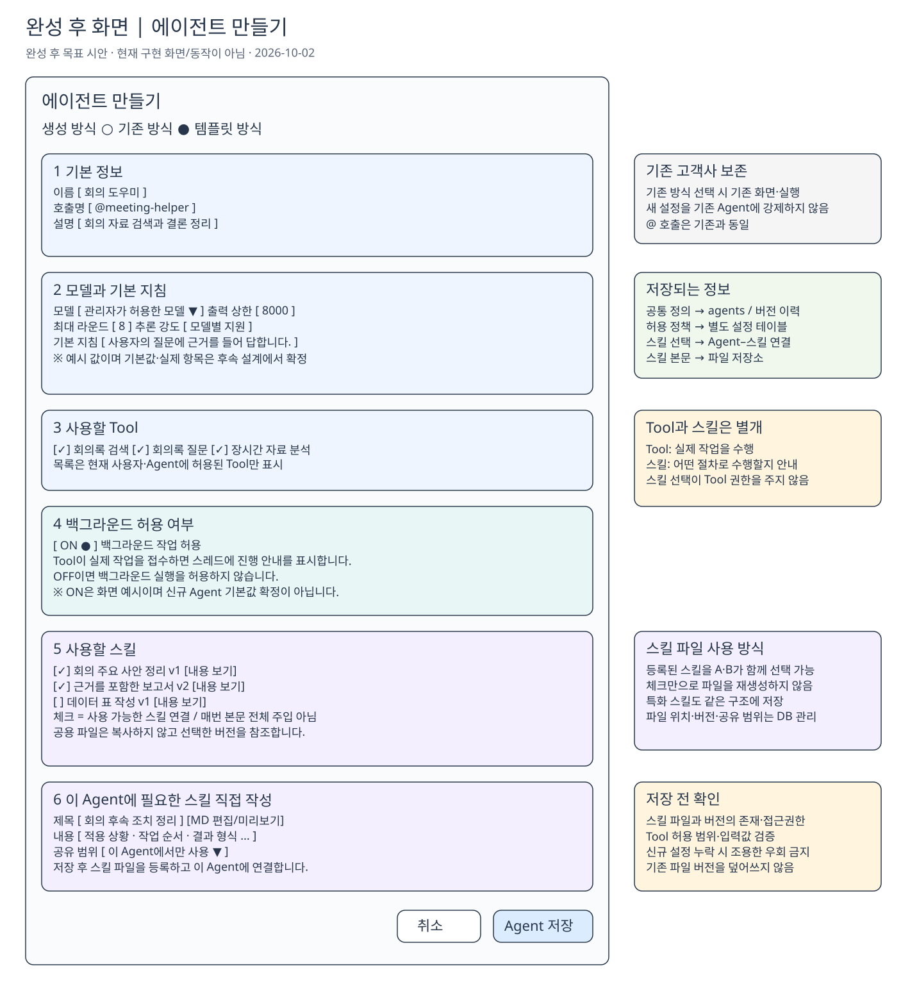

# 완성 후 모습 — 템플릿 실행 흐름과 생성 화면

> **목표 시안 · 2026-10-02**
> 스킬·백그라운드 연동과 템플릿 구현이 완료되었을 때의 모습을 설명한다. **현재 구현 완료나 확정된 DB 스키마를 뜻하지 않는다.**
> 기준: [[1. 목표·상태·상황 기반 행동 플랜]]

## 1. 전체 방향

**사용자는 Agent를 만들고 스킬과 Tool을 선택한 뒤, 채팅방에서 기존처럼 @로 호출한다.** 실행은 기존 일반 Agent 기반을 재사용하고 필요한 스킬 로딩·대기/재개·Trace 기능만 연결한다.

- **기존 Agent:** 현재의 생성·실행 경로 유지. 신규 설정 조회를 강제하지 않는다.
- **신규 템플릿 Agent:** 해당 정의 버전의 설정으로 실행 기능을 조립한다.
- **회의 Builtin:** 먼저 업무 로직을 코드로 옮기고 스킬을 적용해 검증한다. 그 경험과 재사용 가능한 기능을 템플릿에 연결한다.
- **범위 밖:** 다중 Agent 관계 편집기·별도 오케스트레이터. Subagent는 필요한 Tool이 외부에서 수행한다.

## 2. 실행은 어떤 순서로 진행되나?

[Excalidraw에서 편집할 원본](Excalidraw/template-runtime-target.excalidraw)

| 순서 | 실제로 하는 일 |
| --- | --- |
| **저장** | Agent 정의·버전, 스킬 연결, 백그라운드 허용 정책을 저장한다. 직접 작성한 스킬 본문은 별도 파일로 보관한다. |
| **호출** | 사용자가 @Agent로 요청한다. 현재 권한과 해당 실행에 사용할 정의·설정 버전을 확인한다. |
| **조립** | 기존 모델·MCP·문맥·실행 제한을 활용하고 신규 기능을 필요한 만큼 연결한다. |
| **스킬 사용** | 선택된 스킬의 이름·설명을 보고 필요한 본문과 참조만 읽는다. 항상 모든 스킬을 사용하지는 않는다. |
| **업무 수행** | Tool 없이 답하거나 Tool을 실행한다. 같은 Tool도 상황에 따라 HITL·백그라운드를 사용하지 않거나, 하나 또는 둘 다 사용할 수 있다. |
| **게시·재개** | 답변과 상태를 일관되게 확정한다. 사용자 응답과 후속 질문은 필요한 상태를 이어받아 처리한다. Background 결과는 별도 완료 연동으로 전달한다. |

**HITL과 백그라운드는 별도 Tool 종류가 아니라 Tool이 선택적으로 사용하는 기능이다.** 예를 들어 같은 자료 분석 Tool이 입력이 충분하면 바로 결과를 반환하고, 대상이 모호하면 HITL로 확인하며, 작업이 길면 허용 정책에 따라 백그라운드로 계속할 수 있다. **HITL로 대상 확인 → 백그라운드 처리**처럼 둘을 함께 사용할 수도 있다. 실제 순서와 재개 지점은 Tool 계약에 따른다.

사용자 대기 시에는 질문을 게시하고, 답변이 오면 현재 권한과 대기 상태를 확인해 이어간다. 외부 Tool 호출 동안 긴 DB transaction을 유지하는 구조는 아니다.

### 백그라운드는 현재 턴과 작업 완료 시점이 다르다

**허용 ON → Tool 요청 → 실제 접수 확인 → 진행 안내 → 외부 작업 → 완료 통지·후속 결과 전달** 순서다. 현재 Agent 턴은 외부 작업 완료 전에 끝날 수 있다.

- 설명에 background라고 쓰여 있다는 이유만으로 “실행 중”을 표시하지 않는다.
- 허용하지 않으면 **background 실행 기능**을 막는다. 해당 Tool의 모든 기능을 무조건 금지한다는 뜻은 아니다. 동기 실행을 지원하는지는 Tool 계약에 따르며 임의로 대체하지 않는다.
- 접수 실패·작업 실패·완료 통지 중복은 동료 구현의 계약과 맞춰 처리한다.
- 완료 결과 전달 시에도 현재 권한과 중복 게시 여부를 확인한다.

### 스킬은 실행 코드의 대체물이 아니다

**SKILL.md는 절차 지침이고 Tool은 실제 작업 수단이다.** 권한·입력 검증·중복 방지·저장 원자성은 코드와 DB가 강제한다. 스킬이 읽혔다는 이유로 스크립트나 Tool 실행 권한이 추가되지 않는다.

## 3. 템플릿 만들기 화면은 어떤 모습인가?

[Excalidraw에서 편집할 원본](Excalidraw/template-create-target.excalidraw)

**한 페이지로 펼쳐 본 화면 시안**이다. 실제 제품에서 섹션 접기·탭·스크롤을 어떻게 적용할지는 후속 UI 설계에서 정한다. 모델·수치·스킬 이름과 ON 상태는 예시이며 확정 기본값이 아니다.

| 설정 | 사용자가 하는 일 | 저장·실행 의미 |
| --- | --- | --- |
| **생성 방식** | 기존/템플릿 중 선택 | 기존 고객사 기능을 유지하며 조립 경로 구분 |
| **기본 정보·모델·지침** | 이름·호출명·모델·상한·기본 역할 설정 | 공통 Agent 정의와 버전 기반 활용 |
| **Tool** | 접근 가능한 Tool 선택 | 실행에 허용된 작업 수단 연결 |
| **백그라운드 허용** | 허용 여부 선택 | 별도 정책 테이블에 저장. 실제 작업 기록과는 별개 |
| **공용 스킬** | 미리 등록한 스킬 체크·내용 확인 | Agent와 스킬 버전 연결. 파일 복사/재생성 없음 |
| **특화 스킬** | 해당 Agent에 필요한 지침 직접 작성 | MD 파일 등록 후 같은 연결 구조 사용. 공유 범위 제한 |
| **저장** | 검증 후 Agent 생성/수정 | 잘못된 파일 참조·권한·설정을 확인한 뒤 일관된 버전으로 기록 |

**공용과 특화 스킬을 서로 다른 시스템으로 만들지 않는다.** 같은 스킬 관리 구조에서 공유 범위만 구분한다. 화면의 ‘이 Agent에서만 사용’은 목표 UX이며 상세 권한 모델은 후속 설계 대상이다.

## 4. DB와 파일은 무엇을 나누어 보관하나?

| 저장 영역 | 보관하는 내용 |
| --- | --- |
| **공통 Agent 정의·버전** | 이름·모델·기본 지침·실행 제한 등 |
| **별도 background 설정** | 허용 여부와 해당 Agent/정의 버전 연결 |
| **스킬 정보** | 이름·설명·파일 위치·버전·접근 범위 |
| **Agent–스킬 연결** | 어떤 Agent가 어떤 스킬 버전을 선택했는지 |
| **파일 저장소** | 실제 SKILL.md와 필요한 참조 자료 |
| **실행 상태·업무 기록** | 대기·재개·완료 등 기존 실행 및 동료 background 저장 계약 |
| **관측** | 사용자 Trace는 메모리, 관리자 실행 이력은 별도 DB |

**파일 저장소는 서버와 worker가 접근 가능한 공간**이어야 한다. 사용자 PC의 로컬 경로만 DB에 기록하는 의미가 아니다. 기존 버전 파일은 덮어쓰지 않으며, 파일 등록 실패나 연결 실패가 나면 불완전한 스킬로 실행하지 않도록 한다.

정확한 테이블명·키·저장소 제품은 미정이다. 일반 Agent와 Builtin 모두 스킬을 연결할 수 있어야 하지만 Builtin release 체계를 일반 Agent에 복제하지 않는다.

## 5. 확정 방향과 남은 결정

**확정 방향:** 개별 @ 호출 유지, 기존 실행 기반 재사용, 별도 background 정책 저장, 스킬 파일/메타데이터 분리, 공용 스킬 체크 및 특화 스킬 작성, Builtin 선행 검증.

**남은 결정:** 실행 방식 식별 컬럼 채택 여부, 신규 설정 기본값, 스킬 선택·로딩의 구체적 API, 설정 변경 중인 실행과 HITL 재개의 버전 계약, background 접수·완료 연동 세부 규격.

**일반 처리 Trace는 표시하되 LLM 추론 텍스트는 보류**한다. 이 문서의 그림은 완성 목표를 이해하기 위한 것이며 실제 구현·통합·E2E의 증거는 아니다.
