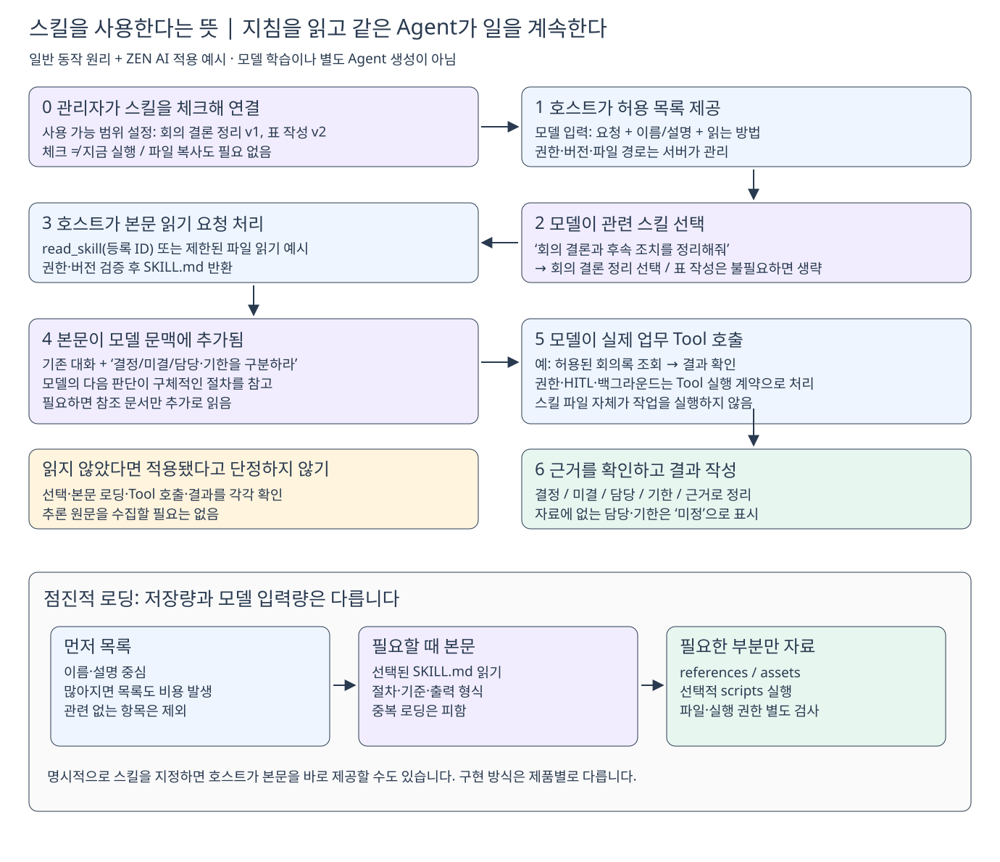
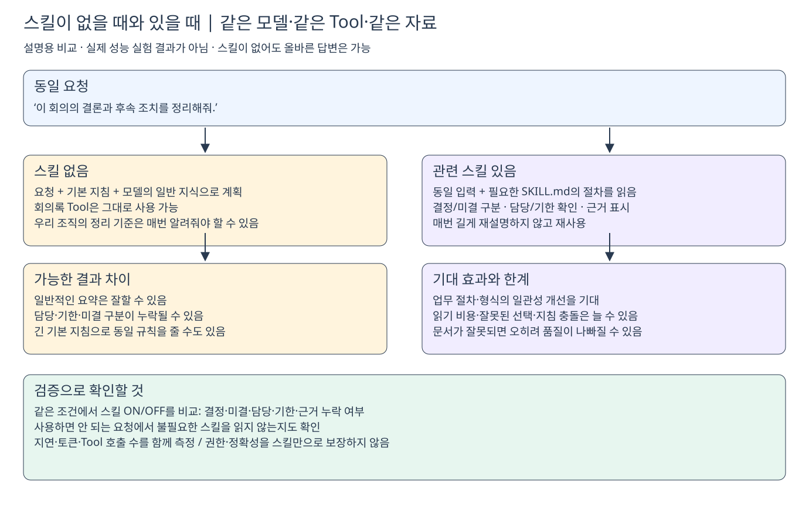

# 스킬 학습 — SKILL.md는 어떻게 Agent의 행동으로 이어지는가?

> **조사일: 2026-10-02** · OpenAI·Anthropic 공식 온라인 문서와 Agent Skills 규격을 직접 확인했다.
> **구분:** 공식 공통 개념 / 제품별 구현 / ZEN AI 적용 제안을 나누어 설명한다. 아래 예시와 그림은 성능 실험 결과가 아니다.
> 연결: [[1. 목표·상태·상황 기반 행동 플랜]] · [[2. 완성 후 템플릿 실행 흐름과 생성 화면]]

## 1. 먼저 세 문장으로 이해하기

**스킬은 ‘이 일을 할 때 따라야 할 절차’를 재사용 가능한 형태로 묶은 것이다.** 중심 파일은 `SKILL.md`이며 필요하면 참조 문서·템플릿·스크립트가 함께 들어간다.[1][2][4]

**스킬을 사용한다는 것은, 호스트가 지침을 모델의 현재 문맥에 제공하고 모델이 그 지침을 참고해 다음 행동을 선택한다는 뜻이다.** 모델을 새로 학습시키거나 별도 Agent를 자동 생성하는 것이 아니다.[2][5]

**파일을 저장하는 것만으로 작동하지 않는다.** Agent 서버가 발견·권한 확인·목록 제공·본문 읽기·Tool 실행을 연결해야 한다. 체크박스는 ‘사용할 수 있는 스킬’을 정하고, 실제 요청에서 무엇을 읽을지는 별도 단계다.

## 2. 비슷해 보이는 것과 구분하기

| 개념 | 하는 일 | 회의 Agent 예시 |
| --- | --- | --- |
| **기본 지침** | Agent의 지속적인 역할·공통 기준 | “근거를 들어 업무 질문에 답한다.” |
| **스킬** | 특정 업무의 절차·판단 기준·출력 형식 | “결정/미결을 나누고 담당·기한·근거를 확인한다.” |
| **Tool** | 실제 데이터를 읽거나 작업을 수행 | 회의록 검색·본문 조회·보고서 저장 |
| **커맨드** | 사용자가 기능을 요청하는 입력 방식 | `/meeting-start` |
| **하네스** | 모델·Tool·상태·중단/재개·권한을 연결하는 실행 코드 | Tool 결과 반영, claim 검사, 대기 상태 저장 |
| **참조 자료/RAG** | 작업에 필요한 사실·자료를 공급 | 회의록 원문, 사규 조항 |

**커맨드와 스킬은 서로 배타적이지 않다.** 최신 Claude Code는 커스텀 커맨드를 스킬과 통합하며 `/스킬명`으로 명시 호출도 지원한다.[3] 따라서 “/로 시작하면 절대로 스킬이 아니다”는 잘못된 일반화다. ZEN AI의 기존 커맨드가 실제 스킬을 로드하는지는 별도 구현 문제다.

**스킬은 프롬프트와 완전히 다른 마법이 아니다.** 본문은 결국 모델이 읽는 지침이다. 차이는 **발견할 수 있는 이름·설명, 재사용·파일 구성, 필요할 때 로딩하는 규칙**이다. 기존 기본 지침에 동일 내용을 모두 넣는 방식도 가능하지만 모든 요청에 같은 부담을 주기 쉽다.

## 3. 파일 안에는 무엇이 있나?

```text
meeting-summary/
├─ SKILL.md                  # 이름·적용 상황·핵심 절차
├─ references/output.md      # 필요할 때 읽을 상세 형식
├─ assets/report-template.md # 선택 사항: 결과 템플릿
└─ scripts/check_result.py   # 선택 사항: 명시적 실행·권한 필요
```

**최소 구성은 SKILL.md 하나**다. Open Agent Skills 규격에서는 YAML의 `name`·`description`과 Markdown 본문을 사용한다.[4] 폴더명은 스킬마다 달라도 중심 파일명은 SKILL.md다.

아래는 **학습용 예시**이며 실제 등록된 스킬이나 Tool 이름을 뜻하지 않는다.

```markdown
---
name: meeting-summary
description: 회의록의 결정 사항과 후속 조치를 근거와 함께 정리할 때 사용한다. 녹음 시작·종료 요청에는 사용하지 않는다.
---

# 회의 결론 정리

1. 대상 회의가 불명확하면 선택을 요청한다.
2. 허용된 조회 Tool로 회의록 본문을 확인한다.
3. 결정 사항과 미결 사항을 구분한다.
4. 담당자·기한은 원문에 있는 경우만 적고 없으면 ‘미정’으로 표시한다.
5. 주요 항목에 근거를 연결한다.
6. 상세 출력 형식이 필요하면 references/output.md를 읽는다.
```

- **description:** 모델이 ‘언제 읽을지’를 판단하는 단서. 무엇을 하는지뿐 아니라 언제 적용하지 않는지도 명확히 한다.
- **본문:** 읽은 뒤 따를 절차·실패 처리·결과 형식.
- **참조:** 상세 규칙을 필요한 경우에만 제공.
- **스크립트:** 없어도 된다. 실행할 경우 호스트의 실제 실행 도구와 권한이 필요하다.

MD에 “담당자를 추측하지 마라”라고 써도 완전한 준수가 보장되지는 않는다. 반드시 지켜야 하는 접근 제어·입력 검증·부작용 제한은 코드가 강제한다.

## 4. 실행할 때 실제로 무슨 일이 일어나나?



[편집 가능한 Excalidraw 원본](Excalidraw/skill-loading-flow.excalidraw)

**예시 요청:** “이 회의에서 결정된 일과 담당자를 정리해줘.”

| 단계 | 호스트/서버가 하는 일 | 모델이 받거나 하는 일 |
| --- | --- | --- |
| **① 사용 가능 목록 구성** | Agent에 연결된 스킬의 버전·권한을 확인 | 이름·설명·읽는 방법을 받음 |
| **② 관련 스킬 선택** | 선택/로딩 경로를 제공 | 요청과 description을 보고 관련 스킬을 선택 |
| **③ 본문 로딩** | 승인된 파일 또는 스킬 ID를 읽어 반환 | SKILL.md 내용이 문맥에 들어옴 |
| **④ 작업 계획·실행** | 실제 Tool 요청을 권한 검사 후 수행 | 지침에 따라 조회·확인·정리하고 결과를 읽음 |
| **⑤ 추가 자료 사용** | 필요한 참조만 반환 | 필요한 세부 형식 등을 읽음 |
| **⑥ 결과 검증·게시** | 실행 상태와 게시를 안전하게 처리 | 근거·누락 여부를 확인하고 답변 생성 |

**모델의 Tool 호출 요청과 호스트의 실행은 별개**다. 모델은 “파일을 읽어 달라”고 요청하고, 서버가 허용된 파일 내용을 반환한다. 다음 모델 호출에는 그 내용이 포함되므로 다음 행동이 더 구체적인 지침을 따르게 된다.

공식 통합 가이드는 두 구현을 소개한다.[5]

- **파일 읽기 방식:** 기존 파일 읽기 Tool로 SKILL.md 접근.
- **전용 로딩 Tool 방식:** `activate_skill` 같은 Tool이 등록된 스킬의 본문을 반환. 파일 접근을 직접 주지 않는 서버에도 적용할 수 있다.

**ZEN AI 제안:** 현재의 읽기 경로를 먼저 재사용 검토하되 등록 ID·고정 버전·접근권한을 서버에서 확인한다. 전용 로딩 API나 특정 함수명을 이미 채택한 것은 아니다. 임의 파일 경로를 모델 입력대로 읽게 해서는 안 된다.

**명시 선택도 가능하다.** 사용자가 특정 스킬을 지정하면 호스트가 바로 본문을 제공할 수 있다. 제품별 문법은 다르며 템플릿 화면의 체크와 매 요청의 명시 실행은 구분한다.[1][3][5]

## 5. 왜 처음부터 모든 스킬을 읽지 않나?

**점진적 로딩(progressive disclosure)**은 다음 세 층으로 필요한 내용만 제공하는 방식이다.[1][2][4]

| 층 | 모델에 들어가는 시점 | 목적 |
| --- | --- | --- |
| **이름·설명** | 사용 가능한 목록을 제공할 때 | 관련 스킬 찾기 |
| **SKILL.md 본문** | 그 스킬을 사용할 때 | 절차·기준 이해 |
| **참조·자료** | 해당 세부 내용이 필요할 때 | 상세 규칙 확인 |

**파일 저장량과 모델 입력량은 다르다.** 참조 자료가 많아도 읽지 않은 본문은 입력 토큰을 차지하지 않는다. 하지만 이름·설명 목록 자체도 비용이 있고, 읽은 본문은 대화·자료와 문맥 공간을 나누어 쓴다. “스킬이 많아도 무조건 비용 0”은 아니다.

Anthropic과 규격 문서는 핵심 본문을 짧게 유지하고 상세 내용은 참조로 분리하도록 권장한다.[4][6] 길이 권고는 품질 보증이나 반드시 채워야 할 목표가 아니다.

**한 번 읽었다고 영원히 유지되지도 않는다.** 새 run, 대화 압축, 문맥 정리 과정에서 지침이 빠질 수 있다. 호스트는 활성 스킬·버전과 재로딩 필요 여부를 관리해야 한다. 중복 주입을 줄이면서 필요한 지침을 보존하는 것이 과제다.[3][5]

## 6. 스킬이 없으면 못 하나? — 아니다



[편집 가능한 Excalidraw 원본](Excalidraw/skill-with-without.excalidraw)

| 비교 | 스킬 없음 | 관련 스킬 사용 |
| --- | --- | --- |
| **모델·Tool 능력** | 기본 능력과 Tool로 작업 가능 | 같은 능력·Tool에 절차 지침 추가 |
| **조직의 업무 기준** | 요청·기본 지침에 없으면 알기 어려움 | 정해 둔 기준을 재사용 가능 |
| **반복 설명** | 사용자나 기본 프롬프트에서 반복할 수 있음 | 필요한 스킬을 읽어 재사용 |
| **품질** | 충분히 좋은 결과도 가능 | 일관성 개선 기대, 잘못된 지침이면 악화 가능 |
| **비용·지연** | 스킬 로딩 비용 없음 | 목록·로딩 비용 추가, 시행착오 감소로 상쇄될 수도 있음 |
| **보안·정확성** | 코드·권한·검증 필요 | 동일하게 필요. 스킬만으로 해결되지 않음 |

**기대 효과는 ‘새 지능’보다 ‘업무 절차의 재사용과 일관성’**이다. 동일한 지침을 기본 프롬프트로 주었을 때보다 항상 더 잘하거나 더 저렴하다는 근거는 없다. 선택 정확도와 실제 결과를 비교해야 한다.

## 7. HITL·백그라운드·Subagent와는 어떤 관계인가?

**스킬과 Tool의 실행 기능은 서로 다른 축**이다.

예를 들어 같은 자료 분석 Tool이 입력 부족 시 HITL로 확인하고, 긴 작업이면 백그라운드를 사용하며, 둘 다 사용하거나 둘 다 사용하지 않을 수 있다. 스킬은 “분석 대상을 먼저 확인하라”는 절차를 안내할 수 있지만 **대기 상태 저장·재개·작업 접수·완료 전달은 코드와 Tool 계약이 구현**한다.

- **스킬 ≠ HITL:** 스킬 없이도 사용자 확인 기능을 구현할 수 있다.
- **스킬 ≠ 백그라운드:** 스킬 파일을 읽는다고 비동기 작업이 생기지 않는다.
- **스킬 ≠ Subagent:** 기본적으로 같은 Agent가 본문을 읽고 계속 작업한다.
- Claude Code의 `context: fork`·`background` 등은 **제품별 확장**이다.[3] ZEN AI가 이를 그대로 지원한다는 뜻이 아니다. 현재 합의대로 subagent 실행은 필요한 Tool 내부에서 처리한다.

## 8. OpenAI·Claude 문서를 읽을 때 주의할 차이

| 자료 | 확인한 내용 | ZEN AI에 그대로 적용하면 안 되는 것 |
| --- | --- | --- |
| **OpenAI Build skills** [1] | 명시/자동 호출, 이름·설명 우선 제공, 필요 시 본문 로딩 | Codex 설치 폴더·UI 호출 문법이 우리 서버에도 자동 적용된다는 가정 |
| **Claude Skills overview** [2] | 메타데이터→본문→자료, 파일/스크립트 기반 동작 | Claude API의 container·code execution 기능을 SAP/LiteLLM이 자동 제공한다는 가정 |
| **Claude Code Skills** [3] | 커맨드 통합, 호출 제어·제품별 확장 | Claude Code 전용 frontmatter를 모든 호스트가 이해한다는 가정 |
| **Agent Skills 규격·통합 가이드** [4][5] | 파일 형식과 호스트의 발견·로딩 책임 | 표준 파일만 저장하면 하네스 구현이 필요 없다는 가정 |

**OpenAI 또는 Claude 모델을 호출한다는 사실만으로 그 제품의 스킬 시스템을 사용하는 것은 아니다.** ZEN AI가 직접 스킬 로딩을 구현하면 모델에 지침을 전달할 수 있지만, 모델별 선택·지침 준수·Tool 호출 품질은 따로 검증해야 한다.

## 9. ZEN AI에는 이미 어떤 기반이 있나?

**확인한 코드에는 점진적 지침 로딩의 작은 기반이 이미 있다.**

- `src/lib/agent-workspace/skills.ts`: xlsx·docx·pdf·pptx 지침을 **모듈 문자열 상수**로 보관하고 `skillCatalog()`·`readSkill()`을 제공한다.
- `sandboxGuidance()`: 이름·요약 목록과 `/skills/<이름>/SKILL.md` 읽기 방법을 모델 지침에 넣는다.
- `src/lib/agent-workspace/tools.ts`: `read_file`의 위 가상 경로를 인식해 허용된 이름의 본문을 반환한다.
- `src/lib/agents/worker.ts`: 작업 공간과 sandbox 설정 조건 아래 이 안내를 조립한다.

**즉 “이름은 skills지만 지침만 전부 미리 넣는 코드”도 아니고, “실제 파일 기반 스킬 관리가 완성됐다”도 아니다.** 목록과 필요 시 본문 반환은 있으나 실제 MD 파일 저장·등록·Agent별 선택·공유 범위·버전 관리·Builtin 연결은 이번 목표와 대조해야 한다.

이 코드는 정적으로 읽었으며, 이번 문서 작성에서 로컬 실행·Provider 호출·E2E로 검증하지 않았다.

## 10. 우리 설계에서 기억할 것과 검증할 것

**저장:** MD 파일은 파일 저장소에, 이름·설명·위치·버전·접근 범위는 DB에, Agent별 선택은 연결 정보로 둔다. 공용 스킬 체크 때 파일을 복제하지 않고, 특화 스킬은 직접 작성해 같은 구조로 등록한다.

**보안:** 스킬 파일도 검토 대상이다. 악의적인 지침·외부 링크·스크립트가 데이터 유출을 유도할 수 있다.[2] 파일 경로 제한, 현재 권한, 버전 고정, 승인된 실행 수단은 코드에서 지킨다.

**검증:** Anthropic은 스킬 없이 기준 결과를 만들고, 실제 부족한 점을 다루는 최소 지침을 작성해 비교하도록 권장한다.[6]

| 테스트 | 확인할 증거 |
| --- | --- |
| **사용해야 하는 요청** | 관련 스킬 선택·본문 로딩·기준 충족 결과 |
| **사용하지 말아야 하는 요청** | 불필요한 스킬·참조를 읽지 않음 |
| **동일 조건 ON/OFF** | 결정/미결·담당/기한·근거 누락, 지연·토큰·Tool 횟수 비교 |
| **파일 없음·권한 회수** | 명시적 실패/안내, 다른 파일이나 다른 버전으로 임의 대체하지 않음 |
| **HITL·후속 run** | 필요한 스킬 버전과 현재 권한을 확인하고 절차를 재개 |
| **잘못된 지침** | Tool 권한·코드의 필수 안전장치를 우회하지 못함 |

**읽었다는 기록과 지침을 잘 적용했다는 결과는 별개**다. 스킬 ID·버전·로딩 성공을 관찰하되 원문 추론이나 민감한 본문 전체를 Trace에 남길 필요는 없다.

## 11. 공식 출처와 조사 범위

**2026-10-02에 실제 접근 가능한 온라인 문서를 확인**했다. 문서마다 갱신 시점·제품 범위가 달라 제품별 설명을 보편적 규칙으로 합치지 않았다. 이번 목적은 구현 원리 학습이므로 공식 문서·공개 규격을 우선했고, **논문 실험 수치나 ‘최신 논문까지 모두 조사했다’는 주장은 포함하지 않았다.**

1. [OpenAI — Build skills](https://developers.openai.com/codex/skills/) · 점진적 로딩, 명시/자동 호출, 파일 구성.
2. [Anthropic — Agent Skills overview](https://platform.claude.com/docs/en/agents-and-tools/agent-skills/overview) · 3단계 로딩, 실제 읽기/실행, API와 제품별 환경, 보안.
3. [Claude Code — Extend Claude with skills](https://code.claude.com/docs/en/skills) · 커맨드와의 통합, 호출 제어, 제품별 확장과 context 수명.
4. [Agent Skills — Specification](https://agentskills.io/specification) · SKILL.md 형식, 선택적 리소스, 점진적 로딩.
5. [Agent Skills — Integrate skills](https://agentskills.io/integrate-skills) · 카탈로그 구성, 파일 읽기/전용 Tool, 권한·문맥 관리.
6. [Anthropic — Skill authoring best practices](https://platform.claude.com/docs/en/agents-and-tools/agent-skills/best-practices) · 간결한 지침, 필요에 맞는 구체성, 기준 결과와 평가.

**한 줄 결론:** 스킬은 **필요할 때 읽는 재사용 업무 지침**이며, 이를 실제 행동으로 이어 주는 것은 **모델 + 호스트 하네스 + 허용된 Tool**이다.

