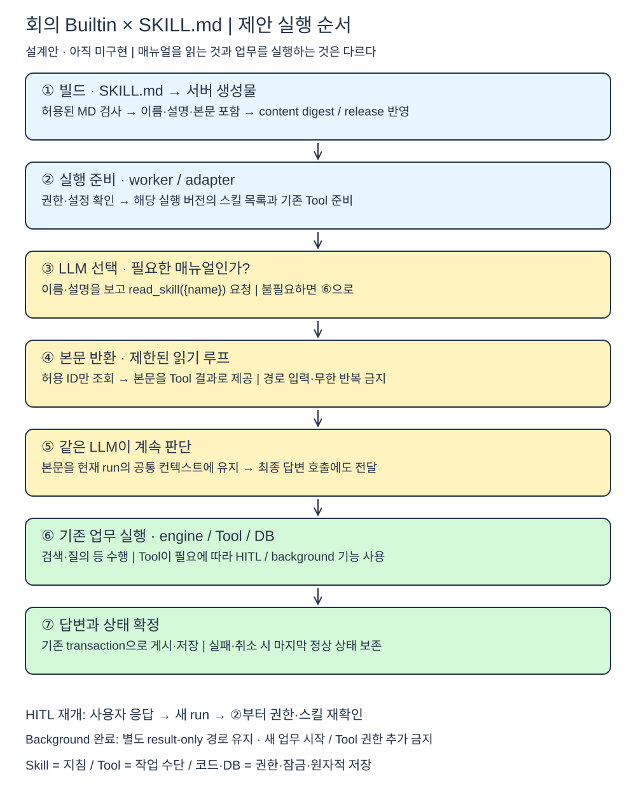

# 회의 Builtin 스킬 폴더 구조와 실행 순서

> **구현 후 안내(2026-10-02):** 단일 `skills/meeting-operations/SKILL.md`와 항목별 `read_skill`·Trace가 로컬에 구현되었다. 현재 사실과 검증 한계는 [구현 및 검증 문서](<../02. 에이전트 템플릿 작성/2. 회의 Builtin 스킬과 Trace 구현 및 검증.md>), 실제 파일·DB 구조는 [6번 조사](<6. 기존 스킬 구조와 에이전트 DB 조사.md>)를 따른다.

> **이하 본문은 구현 전 제안 이력이다.** `meeting-qa` 경로·선택적 읽기 예시는 현재 구현과 다르며, 현행 사양으로 사용하지 않는다.

## 1. 핵심은 “필요한 매뉴얼을 읽고, 같은 에이전트가 계속 실행”이다

**Skill은 절차 지침**, **Tool은 실제 작업 수단**, **하네스·DB는 강제 규칙**이다. 스킬을 읽었다고 별도 에이전트가 시작되거나 Tool 권한이 늘어나지 않는다.

현재 `src/lib/agent-workspace/skills.ts`에는 xlsx·docx·pdf·pptx 지침이 **코드 상수**로 있다. 일반 Agent가 샌드박스를 사용할 때 목록을 받고, 가상 경로 `/skills/<이름>/SKILL.md`를 `read_file`로 읽는 방식이다. **실제 MD 파일 기반의 회의 Builtin 스킬 연결은 아니다.**

## 2. 어떤 폴더에 작성할까?

**추천: 회의 Builtin 정의 옆에 실제 SKILL.md를 두고, 기존 컴파일러로 서버 산출물에 포함한다.** 처음에는 회의록 질의 스킬 하나로 검증한다.

```text
zen-ai/
├─ agents/meeting/assistant/
│  ├─ manifest.json                 기존 / 연결할 skill ID 목록 추가 제안
│  ├─ system-prompt.md              기존 / 역할·공통 원칙·스킬 사용 규칙
│  └─ skills/                       신규 제안
│     └─ meeting-qa/
│        └─ SKILL.md                검색·선택 자료 기반 질의/정리 절차
├─ src/lib/builtin-agents/
│  ├─ contracts/manifest.ts         기존 / skill 선언 계약 확장
│  ├─ contracts/compiled-registry.ts 기존 / 서버용 skill 데이터 계약 확장
│  └─ compile/                     기존 / MD 검증·포함·digest 반영
├─ src/lib/meeting-agent/
│  ├─ skills.ts                    신규 제안 / 허용 ID 조회·읽기 상태
│  ├─ provider.ts                  기존 / 목록 전달·읽기 루프·본문 유지
│  ├─ channel-adapter.ts            기존 / 실행 버전의 스킬 전달
│  ├─ engine.ts                    기존 / 업무 실행 흐름 유지
│  └─ tool-contracts.ts             기존 / 업무 Tool 계약 유지
└─ .generated/builtin-agents/       기존 / 서버용 빌드 산출물, 직접 편집 금지
```

**주의:** 현재 `agents/` 규칙은 manifest·system-prompt·선택적 evals를 대상으로 한다. 폴더만 추가해서 자동 적용되지 않는다. **컴파일러·strict schema·생성물 계약·문서 규칙을 함께 확장**해야 한다. 배포 때 원본 MD 경로를 직접 읽도록 의존하지 않고, 검증된 본문을 서버 산출물에 넣는다. 클라이언트 목록에는 본문이 유출되지 않게 한다.

| 대안 | 판단 |
| --- | --- |
| 시스템 프롬프트에 모든 매뉴얼 붙이기 | 빠르지만 선택적 읽기와 재사용을 검증하기 어려움 |
| **MD 원본 + 기존 Builtin 컴파일 경로** | **첫 적용에 추천.** Git 이력·배포 버전과 묶을 수 있음 |
| 처음부터 DB 스킬 카탈로그·업로드 저장소 구축 | 템플릿 UI 단계에서 필요. 이번 Builtin 실험에는 범위가 큼 |

**향후 공용/특화 스킬:** 템플릿에서는 앞서 정한 별도 스킬 메타데이터·Agent 연결 테이블과 MD 저장소를 사용한다. 이번에는 고정 Builtin 선언으로 먼저 검증한다. 일반 `agents` 테이블 변경이나 공용 스킬 파일 복제는 필요 없다.

## 3. SKILL.md에는 무엇을 넣을까?

```markdown
---
name: meeting-qa
description: 접근 가능한 회의록을 찾아 사용자가 선택한 자료의 주요 사안·결론·후속 조치를 정리할 때 사용한다.
---

# 회의록 기반 질의와 정리
1. 질문과 현재 선택 자료를 확인한다. 필요한 경우에만 검색한다.
2. 후보 선택·추가/대체 확인이 필요하면 기존 Tool의 HITL 결과를 따른다.
3. 권한이 확인된 선택 회의록을 질문 Tool로 조회한다.
4. 자료에 있는 사안·결론·미결 사항을 구분하고 근거를 표시한다.
5. 자료에 없는 내용은 추정으로 확정하지 않는다.
```

이는 **작성 예시**다. 세부 출력 양식은 실제 회의록 질문으로 비교·검증한다. `/meeting-start` 같은 것은 **명령어**이지 SKILL.md 자체가 아니다.

**넣지 않을 것:** DB 연결정보, 권한 우회, 잠금/CAS 규칙의 대체, 비밀값, 임의 스크립트 자동 실행. 첫 단계에는 `scripts/`나 `references/`를 만들지 않는다. 본문이 커져 분리가 실제로 필요할 때 추가한다.

## 4. 실행은 어떤 순서인가?



[Excalidraw 편집 원본](Excalidraw/builtin-meeting-skill-flow.excalidraw)

| 순서 | 주체 | 하는 일 |
| --- | --- | --- |
| **① 빌드** | 컴파일러 | manifest가 가리킨 MD만 검사. name·description·본문을 서버 산출물과 digest에 포함 |
| **② 실행 준비** | worker / adapter | 권한·현재 설정 확인. 실행에 고정된 정의 버전의 스킬 목록 준비 |
| **③ 스킬 선택** | LLM | 요청과 이름·설명을 보고 필요하면 `read_skill({name})` 호출 제안. 불필요하면 기존 판단으로 진행 |
| **④ 본문 읽기** | provider 내부 읽기 루프 | 허용 ID만 조회해 본문 반환. 임의 경로·URL·파일 접근 금지 |
| **⑤ 지침 반영** | 같은 LLM | Tool 결과로 받은 매뉴얼을 읽고 검색·질의 등 기존 업무 Tool을 선택 |
| **⑥ 실제 업무** | engine / Tool / DB | 입력·권한 검사 후 실행. Tool이 필요에 따라 HITL 또는 background 사용 |
| **⑦ 답변·저장** | provider / adapter / DB | 자료 기반 답변 생성. 상태·답변·종료를 기존 원자적 경로로 확정 |

**중요: 현재 회의 provider는 Tool 호출을 해석해 engine에 업무 결정을 넘긴다.** 새 `read_skill` 이름만 목록에 추가하면 끝나지 않는다. provider 안에서 **읽기 요청 → 본문 Tool 결과 → 재판단**을 처리한 뒤, 기존 업무 결정 형태를 engine에 넘기는 연결이 필요하다. 무제한 읽기 반복은 막고 기존 timeout을 유지한다.

읽은 본문은 **현재 실행의 공통 모델 컨텍스트**에 유지해 `decide`뿐 아니라 `answerQuestion`·`directResponse`에도 전달한다. 한 모델 호출에서 읽고 다음 답변 호출에서 사라지면 적용한 것이 아니다.

## 5. HITL 재개·실패·버전은 어떻게 다룰까?

- **현재 실행 안:** 스킬 본문은 중복 삽입하지 않는다. 허용된 스킬 수·본문 크기·읽기 횟수 상한을 둔다.
- **사용자 답변으로 새 run 시작:** 현재 권한·정의 버전을 다시 확인하고 스킬을 다시 조립한다. 실행 중 메모리가 다음 run에도 남아 있다고 가정하지 않는다.
- **읽기 실패:** 등록되지 않은 ID는 거절한다. 선택한 스킬을 읽지 못하면 “적용했다”고 진행하지 않고 안전하게 실패 처리한다. 단순히 필요 없는 요청은 읽기를 생략할 수 있다.
- **버전:** 스킬 본문 변경도 Builtin content digest와 release 변경에 포함한다. 같은 run 안에서는 중간 교체하지 않는다.
- **background 완료 전달:** 새 업무를 시작하는 입력이 아니다. 기존 result-only 경로·Tool 금지를 유지하고 스킬을 이유로 새 검색이나 작업을 재실행하지 않는다.

**매뉴얼은 확률적인 안내다. 반드시 지켜야 할 권한·검증·HITL 재개 규칙은 계속 코드/DB로 강제한다.**

## 6. 적용됐다는 것은 어떻게 확인할까?

1. **컴파일 검사:** 없는 파일·중복 이름·경로 이탈 거절, 본문 변경 시 digest 변경, 클라이언트 본문 미포함.
2. **로딩 검사:** 허용 목록만 읽기, 반복 상한, 읽은 본문이 다음 모델 호출과 최종 답변 생성까지 전달되는지 확인.
3. **실행 회귀:** 검색·선택·추가/대체·취소·후속 질문·timeout·background result-only 경로 보존.
4. **모델 비교:** 동일 질문의 스킬 OFF/ON 결과를 비교. 실제 provider 테스트와 모의 연결 테스트를 구분.

Trace에는 **코드가 확인한 “스킬 읽기 완료”와 이름·버전** 정도를 남기는 안을 권장한다. “모델이 완전히 이해했다/준수했다”거나 내부 추론을 관측했다는 의미는 아니다.

---
**정리:** 다음 구현은 **스킬 하나 + 기존 컴파일러 확장 + provider 읽기 루프**까지. DB 보호를 옮기거나 템플릿 UI·스킬 업로드 시스템을 한꺼번에 만들지 않는다.
