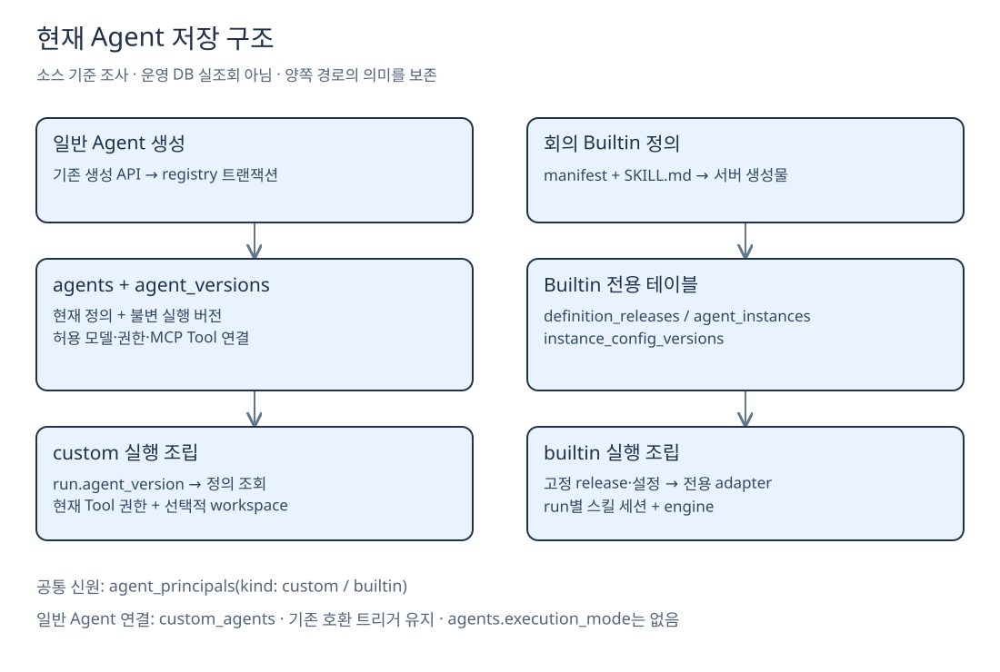

# 기존 스킬 구조와 에이전트 DB 조사

**2026-10-02 · 로컬 소스 기준 사실 조사.** 기준은 `agent/agent-template`, HEAD `07d9a3e`와 미커밋 스킬 구현이다. **운영 DB에 접속하거나 행·스키마·마이그레이션을 변경하지 않았다.** 아래 표는 저장소가 정의하는 구조이며, 운영의 적용 버전·실제 고객 행은 별도 확인 대상이다.

## 현재 스킬은 두 경로다

| 구분    | 기존 일반 에이전트                                        | 회의 Builtin                      |
| ----- | ------------------------------------------------- | ------------------------------- |
| 원본    | `src/lib/agent-workspace/skills.ts`의 문자열 상수       | 실제 `SKILL.md` 한 개               |
| 내용    | xlsx·docx·pdf·pptx 작성법                            | 회의 업무 15개 지침 항목                 |
| 조회    | `read_file("/skills/xlsx/SKILL.md")` 같은 **가상 경로** | `read_skill({name, sectionId})` |
| 조립    | workspace 활성화 + runner 설정 시 작성 지침 제공              | manifest → 컴파일 → run별 세션        |
| 반환 범위 | 해당 형식의 지침 문자열                                     | 컴파일된 매뉴얼의 지정 항목 본문              |
| 보존 원칙 | **기존 함수·가상 경로·조건 유지**                             | 검증된 읽기·trace 방식만 선택적으로 재사용      |

**기존 문서 작성용 스킬을 회의 스킬로 교체하면 안 된다.** 단일 SKILL.md 정책은 신규 업무 매뉴얼에 적용한다. 기존 문서 작성 기능과 함께 제공할지는 템플릿 설정 단계에서 명시적으로 결정한다.

## 회의 스킬의 실제 파일 책임

```text
agents/meeting/assistant/
├─ manifest.json
├─ system-prompt.md
└─ skills/meeting-operations/SKILL.md
src/lib/builtin-agents/
├─ contracts/{manifest,compiled-registry}.ts
└─ compile/{registry-source,skill,compile,client-bundle}.ts
src/lib/meeting-agent/
├─ tool-contracts.ts
├─ provider.ts
├─ tools/skill-tool.ts
├─ engine.ts
└─ channel-adapter.ts / background-adapter.ts
src/lib/agent-trace/     타입·안전한 필드·실행 기록
src/lib/ui/trace-labels.ts
.generated/builtin-agents/   자동 생성, 직접 편집 금지
```

| 책임 | 주요 파일 |
| --- | --- |
| 원본 위치·형식 검증 | `registry-source.ts`, `compile/skill.ts` |
| 조회 Tool 스키마 | `meeting-agent/tool-contracts.ts` |
| 모델 호출·본문 반환·후속 컨텍스트 | `meeting-agent/provider.ts` |
| run별 읽은 항목·ref·허용 동작 | `tools/skill-tool.ts`, `engine.ts` |
| 화면용 안전한 항목명·이벤트 | `agent-trace/`, `ui/trace-labels.ts` |

**아직 범용이 아니다.** 스킬 이름·경로가 `meeting-operations`로 고정되고, `SKILL_ACTIONS`와 화면 제목 사전도 회의 업무 전용이다. 템플릿은 **검증 계약을 새로 정한 뒤** 일반화해야 한다. 사용자 MD에 임의 action·파일 경로·URL을 적었다고 실행 권한이 생기면 안 된다.

## 일반 에이전트는 어느 DB에 저장되나

**하나의 애플리케이션 PostgreSQL 안의 여러 테이블**이다. 에이전트마다 별도 DB를 만드는 구조가 아니다.



[Excalidraw 편집 원본](Excalidraw/existing-agent-storage.excalidraw)

| 테이블 | 저장 역할 | 반드시 보존할 점 |
| --- | --- | --- |
| **agents** | 이름·slug·모델·system_prompt·workspace 설정·현재 version·활성 상태 | 기존 행을 재분류·일괄 수정하지 않음 |
| **agent_versions** | `(agent_id, version)`별 정의 스냅샷 | 실행이 참조한 과거 버전 보존 |
| agent_allowed_models | 현재 허용 모델·추론 강도 | 버전의 allowed_models 스냅샷과 구분 |
| agent_grants | 사용자/전체 사용 권한 | 현재 권한 회수 즉시 반영 |
| agent_user_preferences / agent_user_preference_versions | 사용자별 지침·모델 선택과 이력 | Agent 정의 버전과 별개 |
| **agent_mcp_tools / mcp_servers** | 허용 Tool 연결 / 서버 주소·인증 설정 | Tool 권한은 **버전 고정 대상이 아니라 현재 권한** |
| agent_principals / custom_agents | 공통 신원과 일반 Agent 연결 | 기존 호환 트리거·하위 유형 제약 유지 |
| agent_runs / agent_tasks | 실행 버전·상태 / workspace 이어달리기 | claim·lease·취소·재시도 경계 보존 |
| channel_members / agent_channel_notes / events | 채널 참여·채널 기억·대화/이벤트 | 테넌트·조회 권한 유지 |

아바타는 `agent_avatar_assets`, 사용량·실행 관측은 `usage_events`·`agent_run_spans` 등이 담당한다. 이들은 새 스킬 메타데이터 저장소가 아니다.

**저장:** API → `agents/runtime.ts`의 테넌트 스코프 → `registry.ts`의 트랜잭션에서 agents·허용 모델·정의 버전·이벤트를 저장한다. 수정은 version을 증가시키고 새 스냅샷을 만든다. `agents_principal_compatibility` 트리거가 principal/custom 연결을 동기화한다.

**실행:** run의 agent_id·agent_version → 해당 agent_versions → 현재 권한의 MCP Tool → 필요 시 workspace → 모델 스트림이다. 최신 agents 행만 읽어 과거 실행을 재구성하는 구조가 아니다.

## Builtin 저장은 별도다

`builtin_definition_releases`는 정의 digest·executor·release, `builtin_agent_instances`는 커뮤니티별 설치, `builtin_instance_config_versions`는 설정 버전, `builtin_agent_mcp_tools`는 Tool 허용 연결을 담당한다. **이번 SKILL.md 본문은 여기에 새 컬럼으로 저장하지 않고 서버 생성물에 포함**한다.

현재 **agents.execution_mode는 없다.** 구분은 `agent_principals.kind`·`agent_runs.run_kind`의 custom/builtin 등으로 이루어진다. 새 template 값을 임의 추가하면 SQL 제약과 worker 분기까지 영향을 받는다.

## 근거

[DB 스키마](<C:/Users/염정운/project/zen-ai/src/lib/db/schema.ts>) · [일반 저장 로직](<C:/Users/염정운/project/zen-ai/src/lib/agents/registry.ts>) · [일반 실행 조립](<C:/Users/염정운/project/zen-ai/src/lib/agents/worker.ts>) · [버전 조회와 Tool 연결](<C:/Users/염정운/project/zen-ai/src/lib/agents/worker-runtime.ts>) · [principal 호환 트리거](<C:/Users/염정운/project/zen-ai/drizzle/0045_builtin-agent-principals.sql>) · [기존 스킬](<C:/Users/염정운/project/zen-ai/src/lib/agent-workspace/skills.ts>)

**결론:** 기존 저장·실행 경로는 유지하고, 신규 템플릿만 별도 메타데이터와 업무 스킬 연결을 갖게 하는 안을 [7번 문서](<7. 기존 운영 에이전트를 보호하는 템플릿 추가 방안.md>)에서 제안한다.

