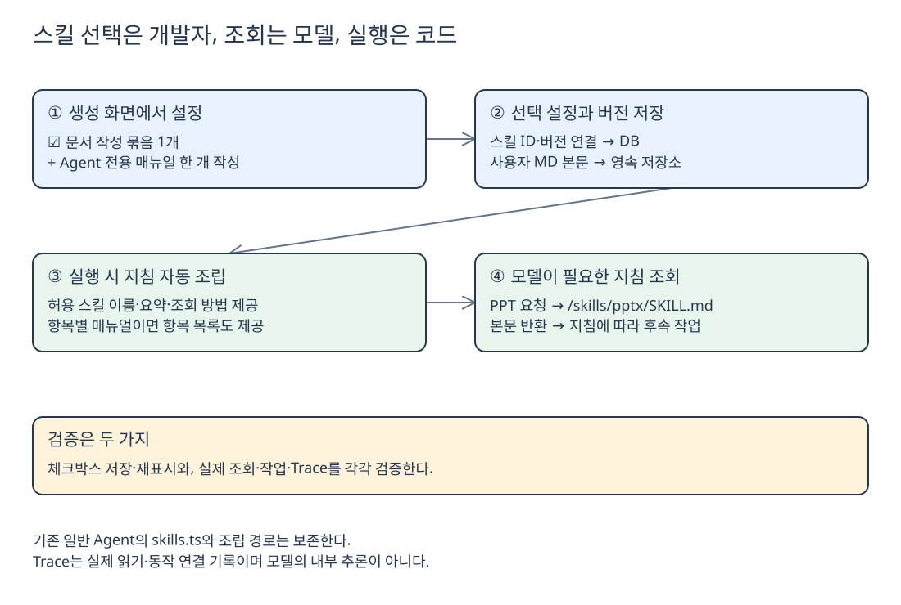

# 템플릿 스킬 구성과 조립 방식

**2026-10-02 · 합의한 설계 방향. 템플릿 연결은 아직 미구현이다.** 기존 일반 에이전트의 스킬·조립 로직은 보존하고, 템플릿에서만 선택한 스킬과 전용 매뉴얼을 연결한다.

## 스킬은 어떻게 구성하나

| 구분 | 구성과 선택 방식 |
| --- | --- |
| **재사용 스킬** | 미리 제공하는 기능 묶음. 카탈로그에서 체크박스 생성 |
| **문서 작성 묶음** | 체크박스 **1개**로 Excel·Word·PDF·PowerPoint 지침 사용 허용 |
| **Agent 전용 스킬** | 개발자가 작성하는 업무용 **SKILL.md 한 개**, 내부에 상황별 항목 |
| **기존 일반 Agent** | 기존 `src/lib/agent-workspace/skills.ts`와 제공 조건 그대로 유지 |

**파일 수와 체크박스 수는 다르다.** 문서 작성은 묶음 하나로 선택하지만, PPT 요청이면 모델이 `/skills/pptx/SKILL.md`를 조회하여 PPT 지침만 받는다.

초기 실험은 기존 `skills.ts`의 **복사본**으로 카탈로그 화면부터 검증한다. 기존 import는 바꾸지 않는다. 복사본은 장기 이중 관리하지 않도록 실제 연결 단계에서 공통화 여부를 결정한다.

```text
기존 agent-workspace/skills.ts          그대로 보존

템플릿 스킬 영역                         제안 구조
├─ reusable/skills.ts                   기존 구현 복사본으로 시작
└─ agent-specific/                     전용 스킬 조회·저장 연결 코드

비공개 영속 저장소
└─ agent-specific/<agent-id>/<version>/SKILL.md
```

사용자 MD를 운영 컨테이너의 **src 폴더에 직접 저장하지 않는다.** 전용 스킬 폴더라는 논리적 구분은 유지하되, 실제 본문은 재배포에도 남는 저장소에 두고 위치·버전은 DB로 연결한다.

## 실행할 때 누가 지침을 넣나



[Excalidraw 편집 원본](Excalidraw/template-skills-agreed.excalidraw)

**개발자가 시스템 프롬프트에 호출 안내를 직접 적지 않아도**, 조립 코드가 선택된 스킬의 **이름·요약·조회 방법**을 모델 입력에 자동으로 붙인다. 저장된 기본 프롬프트 원문은 덮어쓰지 않는다.

| 연결 단계 | 하는 일 |
| --- | --- |
| **목록 안내** | 어떤 스킬을 언제, 어떻게 읽는지 모델에게 알림 |
| **조회 연결** | 모델이 요청한 허용 스킬의 본문을 실제로 반환 |
| **항목별 조회** | 전용 매뉴얼은 항목 ID·제목·적용 상황을 알리고 지정 항목만 반환 |
| **실행 검증** | 선택 범위 밖의 스킬 조회·권한 없는 Tool 호출을 차단 |

기존 계약인 **목록 → 조회 → 본문 반환**을 재사용한다. 일반 문서 스킬은 현재 `read_file`로 조회한다. 회의 Builtin의 `read_skill`은 항목별 조회 실험이며, 템플릿의 최종 도구 계약은 기존 계약과 맞춰 정한다.

## 작성 규칙과 검증

**최소 작성 정보:** 고유 이름·요약/사용 상황·본문. 항목별 조회라면 항목 ID·제목·적용 상황도 필요하다. 화면 입력을 검증해 파일을 생성하며, 형식만 맞춘다고 자동 등록되는 것은 아니다. 카탈로그와 조회 대상 연결이 필요하다.

- **화면 검증:** 문서 작성 체크 1개와 저장·재표시 확인.
- **실행 검증:** 선택한 지침만 노출, PPT 지침 조회·본문 반환·후속 작업 확인.
- **Trace 검증:** 읽은 스킬/항목과 실제 동작 연결 확인. **LLM 내부 추론을 표시한다는 뜻은 아니다.**

“먼저 읽으라”는 지침만으로 강제되지는 않는다. 필수 읽기 여부와 권한은 코드로 검증한다. DB 연결은 [8번 문서](<8. 템플릿 DB 구조와 실행 구분.md>)를 따른다.

