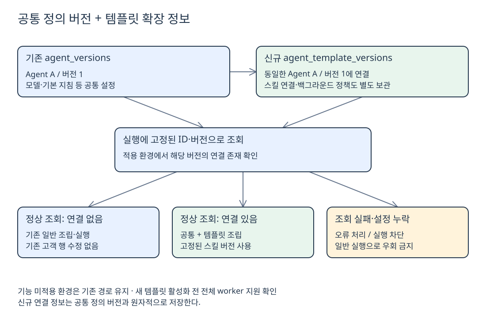

# 템플릿 DB 구조와 실행 구분

**2026-10-02 · 설계안, 신규 테이블명은 가칭이다.** 기존 PostgreSQL의 공통 테이블을 재사용하고, 템플릿 전용 정보만 별도 테이블에 저장한다. **기존 고객 Agent 행·스키마를 일괄 변경하거나 재분류하지 않는다.**

## 기존과 신규의 역할

| 구분 | 테이블 | 역할 |
| --- | --- | --- |
| **기존 공통** | `agents` | 이름·모델·기본 지침·현재 버전·활성 상태 |
| 기존 공통 | `agent_versions` | 공통 설정의 버전별 스냅샷 |
| 기존 공통 | `agent_allowed_models`, `agent_grants` | 허용 모델·사용 권한 |
| 기존 공통 | `agent_mcp_tools`, `mcp_servers` | Tool 허용 연결·서버 설정 |
| 기존 공통 | `agent_user_preferences` 계열 | 사용자 개인 설정 |
| 기존 공통 | `agent_principals`, `custom_agents`, `agent_runs` 등 | 신원·멘션 연결·실행 기록 |
| **신규 제안** | `agent_template_versions` | 템플릿 식별·전용 조립 설정 |
| 신규 제안 | `skill_artifact_versions` | 스킬 이름·요약·버전·위치·digest |
| 신규 제안 | `agent_version_skills` | 체크한 재사용 스킬과 전용 스킬 연결 |
| 신규 제안 | `agent_background_policy_versions` | 버전별 백그라운드 허용 여부 |

**agent_versions와 agent_template_versions는 대체 관계가 아니다.** 같은 `(agent_id, agent_version)`에 **공통 설정 + 템플릿 추가 설정**을 나눠 저장한다. 각각 독립적으로 버전을 증가시키지 않는다.

템플릿 생성 시에도 **agents에는 새 행을 생성**한다. 기존 고객 행은 수정하지 않는다. 사용자 작성 MD 본문은 **별도 영속 저장소**, 위치·버전·연결은 DB에 둔다. 코드로 제공하는 재사용 스킬도 선택된 정확한 버전이 식별되어야 한다.

## 일반인지 템플릿인지 구분

[Excalidraw 편집 원본](Excalidraw/template-db-agreed.excalidraw)

**현재 실행에 고정된 Agent ID·버전**으로 템플릿 연결을 확인한다. “그 Agent에 연결이 하나라도 있는가” 또는 “가장 최신 연결이 있는가”로 판단하지 않는다.

| 조회 결과 | 처리 |
| --- | --- |
| 정상 조회에서 해당 버전의 연결 **없음** | 기존 일반 조립·실행 |
| 해당 버전의 연결 **있음** | 공통 설정 + 템플릿 설정·스킬·정책 조립 |
| 조회 오류·권한 오류 | 없음으로 간주하지 않고 오류 처리 |
| 템플릿의 MD·정책 누락 / digest 불일치 | 실행 차단. 일반 경로로 우회하지 않음 |

현재 `agents.execution_mode` 컬럼은 없다. 이 안은 이를 추가하지 않고 **별도 연결 행의 존재**로 구분한다. 기존 custom/builtin 분류와 principal 트리거는 유지한다.

## 기존 운영을 보호하는 조건

1. **기능 OFF 또는 미적용 커뮤니티:** 신규 테이블을 조회하지 않고 기존 경로로 실행한다. 템플릿 생성·호출도 허용하지 않는다.
2. **저장은 원자적으로:** 공통 정의 버전·템플릿 연결·스킬 선택·정책을 함께 저장한다. 템플릿 정보만 빠진 버전이 공개되면 안 된다.
3. **기존 보호 유지:** 신규 테이블에도 테넌트 범위·복합 FK·RLS를 적용한다. Tool 권한 회수는 현재 권한으로 즉시 반영한다.
4. **전체 worker 지원 후 활성화:** 구버전 worker가 템플릿을 일반 Agent로 실행하지 않게 한다. 롤백 전 템플릿 접수 차단·기존 실행 정리가 필요하다.

**연결 분기는 작아도 운영 영향이 0이라고 보장할 수는 없다.** 먼저 격리 DB·테스트 커뮤니티에서 기존 생성/수정/실행·권한 회수와 신규 스킬·버전·조회 실패를 검증한 뒤 확대한다. 템플릿 적용 이력이 있는 환경에서 기능만 끄고 일반 실행으로 우회시키면 안 된다.

이번 문서는 저장소와 대화를 바탕으로 한 설계 정리다. **운영 DB 조회·DDL 적용·코드 변경은 수행하지 않았다.** 기존 구조의 근거는 [6번 조사](<6. 기존 스킬 구조와 에이전트 DB 조사.md>)를 참고한다.

