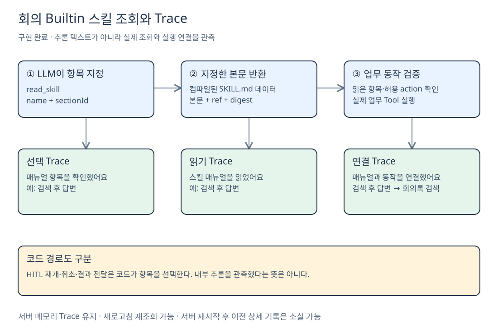

# 회의 Builtin 스킬과 Trace 구현 및 검증

**2026-10-02 · 로컬 구현 결과.** 소규모 에이전트 하나에 **SKILL.md 하나**를 두고, 필요한 지침 항목을 Tool로 읽는 방식을 구현했다. **운영 배포 완료를 의미하지 않는다.**

## 무엇을 구현했나

| 구성 | 구현 내용 |
| --- | --- |
| **단일 매뉴얼** | `agents/meeting/assistant/skills/meeting-operations/SKILL.md`에 15개 항목 |
| **항목별 조회** | `read_skill({name: "meeting-operations", sectionId})`가 지정 항목의 본문과 참조를 반환 |
| **버전 고정** | 컴파일 시 검증한 본문·digest를 서버 산출물에 포함. 실행마다 디스크 파일을 다시 열지 않음 |
| **실행 보호** | 업무 동작 직전에 읽은 항목·digest·허용 action 확인. 읽기 반복 4회, 누락 읽기 교정 1회 제한 |
| **Trace** | 항목 선택 → 읽기 완료 → 실제 동작 연결. 코드가 선택한 경로는 **코드 경로** 표시 |

15개 항목은 **검색·검색 후 답변·선택 자료 답변·후보 선택·추가/대체·취소·녹음 4종·백그라운드 4종·직접 안내**다. 스킬 DB나 신규 의존성은 추가하지 않았다.

## 지침을 읽고 판단하는 것을 어디까지 보여주나

[Excalidraw 편집 원본](Excalidraw/meeting-skill-trace-implemented.excalidraw)

**LLM의 내부 추론을 읽는 것이 아니다.** 모델이 실제로 보낸 `read_skill` 인자와 이후 업무 동작을 코드가 관측한다. 따라서 추론 텍스트를 반환하지 않는 모델에서도 아래 표시가 가능하다.

> 매뉴얼 항목을 확인했어요 · 검색 후 답변  
> 스킬 매뉴얼을 읽었어요 · 검색 후 답변  
> 매뉴얼 항목과 동작을 연결했어요 · 검색 후 답변 → 회의록 검색

이는 **어떤 항목을 선택·조회했고 어떤 동작에 연결했는지**에 대한 증거다. 선택 이유나 지침의 모든 문장을 준수했다는 증명은 아니다. HITL 재개·취소·백그라운드 결과 전달은 코드 선택으로 구분한다.

## 간략한 검증 결과

| 검사 | 결과와 범위 |
| --- | --- |
| **게이트 4종** | check·lint·knip·Vitest 통과. lint 기존 경고 26개, 오류 0개 |
| **전체 자동 검사** | Linux 4,698 통과 / 조건부 skip 27개. 별도 Windows bootstrap 19 통과 |
| **집중 검사** | 스킬 시나리오·background adapter 23 통과 |
| **브라우저 E2E** | 모의 모델 + 실제 UI·worker·격리 DB로 15개 항목 확인. 검색·선택·후속 질문·녹음 제어·백그라운드·취소 trace 확인 |
| **새로고침** | 후속 질문·녹음 일부·추가·취소 trace 재조회 확인. 15개 항목별 전수 재조회는 미실행 |
| **실제 Claude** | 호환 LiteLLM 4001 경로에서 검색 후 답변·선택 자료 질문·녹음 시작의 스킬/Tool 선택 3건 통과 |

**검증 한계:** 기본 4000 경로의 검색 스트림 500은 미해결이다. 실제 모델 전 시나리오 브라우저 E2E·실제 음성 녹음/전사·새 production build·harness 교차 모델 evaluator는 완료 항목이 아니다. Trace는 기존 **서버 메모리 보관**이므로 서버 재시작 후 상세 기록이 사라질 수 있다.

경미한 후속 사항은 **매뉴얼 제목과 화면 제목 사전의 동기화**, 일부 잘못된 조회/상한 실패의 **전용 rejection 이벤트 보완**이다. 실패 자체는 차단된다.

## 근거와 다음 단계

[상세 검증 기록](<C:/Users/염정운/project/zen-ai/docs/superpowers/plans/2026-10-02-meeting-builtin-skill-trace-results.md>) · [실제 스킬 원본](<C:/Users/염정운/project/zen-ai/agents/meeting/assistant/skills/meeting-operations/SKILL.md>) · [조회 구현](<C:/Users/염정운/project/zen-ai/src/lib/meeting-agent/tools/skill-tool.ts>)

다음은 **[기존 스킬 구조와 에이전트 DB 조사](<../01. 에이전트 템플릿 설계/6. 기존 스킬 구조와 에이전트 DB 조사.md>)**를 바탕으로 템플릿 연결 범위를 결정하는 단계다. 이번 구현을 범용 템플릿 완성으로 해석하지 않는다.

