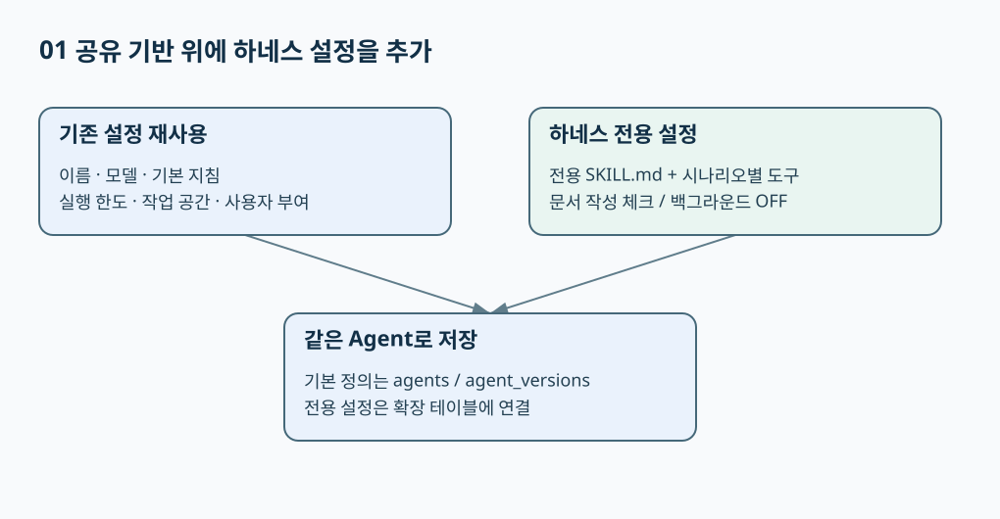
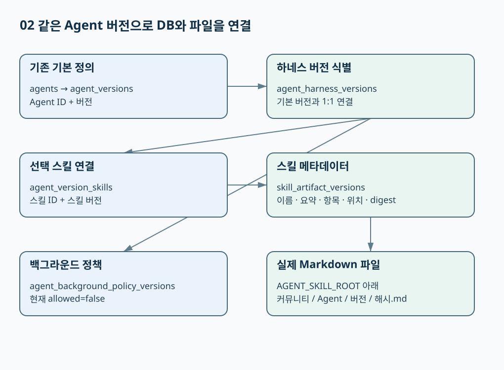
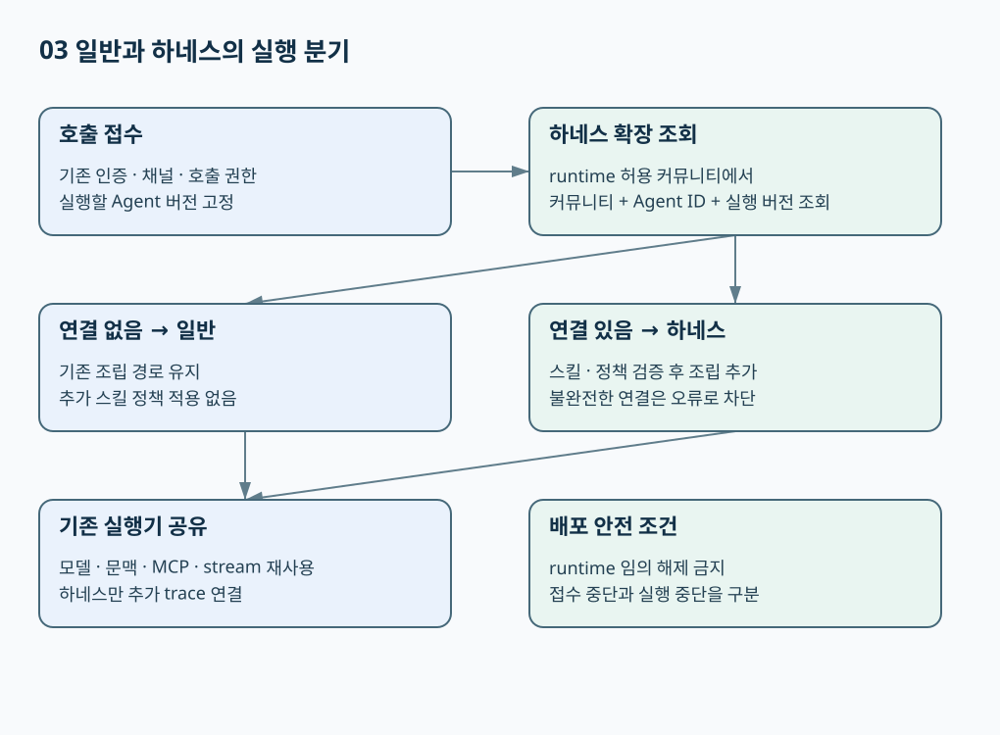
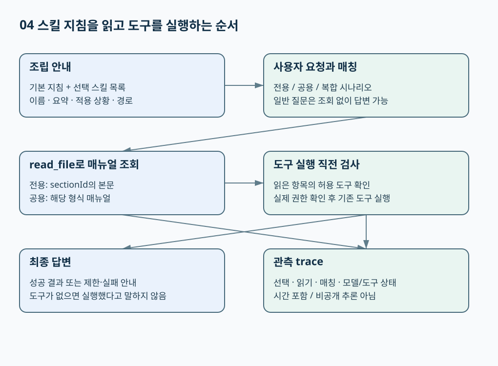

# 하네스 에이전트 설정·저장·실행 명세

**기준: 2026-10-08 로컬 구현 코드. 운영 배포 완료를 뜻하지 않는다.** 여기서 ‘일반’은 기존 **에이전트 만들기**, ‘하네스’는 **하네스 기반 에이전트 만들기**를 의미한다. Builtin 회의 에이전트와 하네스 에이전트는 별개다.

> **기존 에이전트를 새 테이블로 옮기는 방식이 아니다.** 기본 정의·버전·권한·실행 기반은 공유하고, 하네스 버전에만 스킬 및 정책을 추가 연결한다.

## 1. 무엇을 설정할 수 있나

| 설정 | 일반과의 관계 | 현재 하네스 화면·동작 |
| --- | --- | --- |
| 이름·호출 이름·설명·기본 지침 | **기존 정의 재사용** | 호출 이름은 생성 후 편집 불가 |
| 기본·허용 모델 | 기존 정책 재사용 | 기본 모델 및 사용자가 선택 가능한 모델 지정 |
| 기본·최대 추론 강도 | 기존 정책 재사용 | 모델 지원 여부에 따라 선택 제한. **추론 텍스트 출력 보장은 아님** |
| 최대 출력 토큰·컨텍스트·라운드 | 기존 정책 재사용 | 최대 라운드 0은 라운드 수 제한 없음; 다른 실행 제한까지 해제하지 않음 |
| 작업 공간·파일·되묻기 | 기존 도구 기반 재사용 | OFF여도 **선택된 스킬 조회**는 가능 |
| 사용자/전체 부여 | 기존 권한 재사용 | 기존 `agent_grants` 사용. 스킬 선택이 호출 권한을 대신하지 않음 |
| MCP 도구 | 기존 서버·도구 선택 기능 재사용 | **전용 지침 항목별** 허용 도구를 체크. 실패 서버는 안내하고 정상 서버 도구를 제공 |
| **재사용 스킬** | 하네스 전용 설정 | ‘문서 작성’ 체크 **1개** → PPTX·XLSX·DOCX·PDF **4종** 조회 가능 |
| **에이전트 전용 SKILL.md** | 하네스 전용 설정 | 이름·요약 + 지침 1~20개. 각 지침에 ID·제목·적용 상황·본문·허용 도구 |
| **백그라운드 허용** | 하네스 전용 정책 자리 | 현재 비활성. 저장값 false; true 요청은 서버에서도 거부 |

**일반 에이전트에도 기존 workspace 스킬 로직이 있다.** 하네스가 새로 제공하는 것은 개발자가 체크·작성한 스킬을 **특정 에이전트 버전에 고정하고, 상황별 조회와 도구 연결을 설정하는 기능**이다.


[Excalidraw 원본](Excalidraw/harness-spec-settings.excalidraw)

## 2. 어떤 DB에 저장하나

**새 DB 서버가 아니라 기존 PostgreSQL 안의 추가 테이블 4개**다. `agents`에 일반/하네스를 구분하는 `execution_mode` 컬럼을 추가한 방식이 아니다.

| 기존 테이블                           | 공유 역할                              |
| -------------------------------- | ---------------------------------- |
| `agents`                         | 에이전트 식별자·현재 정의·현재 버전               |
| `agent_versions`                 | 기본 지침·모델 등 버전별 정의. **하네스도 반드시 사용** |
| `agent_allowed_models`           | 허용 모델                              |
| `agent_grants`                   | 사용자·전체 호출 권한                       |
| `mcp_servers`, `agent_mcp_tools` | 기존 MCP 연결·선택 도구 권한                 |
| `agent_runs`, 채널·이벤트 등           | 기존 실행·대화 기반 재사용                    |

| 추가 테이블 | 저장 내용 | 연결 기준 |
| --- | --- | --- |
| **`agent_harness_versions`** | 하네스 버전 존재, 계약 버전, 생성 트랜잭션 ID | `community_id + agent_id + agent_version` |
| **`skill_artifact_versions`** | 이름·요약·종류·파일 위치·SHA-256·항목 메타데이터 | 스킬 ID/버전 + 소유 Agent/커뮤니티 |
| **`agent_version_skills`** | 해당 Agent 버전이 사용할 스킬 버전 | Agent 버전 ↔ 스킬 버전 |
| **`agent_background_policy_versions`** | 해당 버전의 백그라운드 허용 여부 | 하네스 버전과 연결; 현재 false |

`skill_artifact_versions.sections`에는 **ID·제목·적용 상황·허용 도구 참조**를 저장한다. **매뉴얼 본문은 DB가 아니라 서버의 Markdown 파일**에 저장한다.


[Excalidraw 원본](Excalidraw/harness-spec-storage.excalidraw)

### 파일 위치와 버전 고정

```text
src/lib/agent-workspace/skills.ts          # 기존 일반 경로 유지
src/lib/agent-harness/skills/
  catalog.ts                             # 화면의 공용 묶음 목록
  reusable/skills.ts                     # 현재 공용 4종 원본
  agent-specific/manual.ts               # 입력 검증·SKILL.md 조립
  agent-specific/storage.ts              # 파일 저장·무결성 확인

AGENT_SKILL_ROOT/
  <communityId>/<agentId>/<agentVersion>/<sha256>.md
```

**공용 원본은 현재 TypeScript 카탈로그**에 있다. 임의 폴더의 SKILL.md를 자동 탐색하는 구조는 아니다. 체크한 공용 4종도 저장 시 해당 Agent 버전의 Markdown 산출물로 고정한다. 따라서 원본 변경이 이미 저장된 버전의 내용을 자동 변경하지 않는다.

LLM에 안내하는 `/skills/<name>/SKILL.md`는 **가상 조회 경로**다. 물리 파일 경로를 그대로 노출하지 않는다.

## 3. 저장은 어떤 순서인가

1. 인증·커뮤니티 범위·관리 권한·하네스 접수 허용·입력 형식을 검증한다.
2. 기존 `createAgent`/`updateAgent`로 기본 정의와 버전을 저장한다.
3. 지침별 MCP 참조를 기존 도구 권한 저장 로직에 전달한다.
4. 전용 매뉴얼 및 체크한 공용 매뉴얼 파일을 생성하고, **같은 Agent 버전**에 추가 테이블을 연결한다.
5. 기존 부여 권한을 반영하고 DB 트랜잭션을 커밋한다. 편집은 `expectedVersion`으로 오래된 화면의 덮어쓰기를 막는다.

**DB 저장은 한 트랜잭션이지만 파일 시스템까지 함께 롤백되지는 않는다.** 파일 생성 후 DB가 실패하면 미연결 파일이 남을 수 있다. DB 연결이 없는 파일을 실행 대상으로 삼지는 않는다.

추가 테이블에는 **커뮤니티 RLS·복합 FK·버전 완결성·연결 봉인**이 적용된다. 기존 `agent_versions`에도 하네스 버전 완결성 검사 트리거가 연결되므로 ‘기존 테이블을 전혀 건드리지 않았다’는 표현은 부정확하다. **하네스 이력이 없는 일반 Agent는 해당 검사의 추가 조건에서 제외**된다.

마이그레이션: `0094` 확장 생성 → `0095` 연결 불변성 → `0096` 명칭 변경. 과거 `agent_template_versions`는 현재 `agent_harness_versions`로 **rename**됐으며 별도 병행 저장 테이블이 아니다.

## 4. 호출 시 일반/하네스는 어떻게 구분하나

**Agent 이름이나 최신 버전만으로 판단하지 않는다.** 실행에 고정된 `(communityId, agentId, agentVersion)`에 하네스 연결이 있는지를 확인한다.


[Excalidraw 원본](Excalidraw/harness-spec-routing.excalidraw)

- 진입 시 기존 인증·채널·Agent 호출 권한을 확인하며, 하네스 접수 중단이면 신규 요청을 거부한다.
- worker는 기존 Agent 버전과 하네스 확장을 조회한다. **연결 없음 → 기존 일반 경로**, **연결 있음 → 스킬·정책 조립을 추가**한다.
- 하네스 연결이 있는데 스킬·정책이 불완전하면 오류로 차단한다. 정상 일반 Agent인 것처럼 처리하지 않는다.
- 하네스도 기존 모델·문맥·MCP·`startAgentStream` 실행기를 재사용한다. 별도 LLM 서비스나 Builtin 회의 엔진으로 일괄 우회하지 않는다.

### 운영 전환 조건 — 반드시 함께 봐야 하는 부분

`AGENT_HARNESS_RUNTIME_COMMUNITIES`는 실행/조회 대상, `AGENT_HARNESS_ACCEPTING_COMMUNITIES`는 생성·수정·신규 요청 접수 대상이다. **접수 대상은 실행 대상의 부분집합**이어야 한다.

실행 설정이 꺼진 커뮤니티는 하네스 조회 자체를 건너뛴다. 따라서 이미 하네스를 사용하는 곳의 runtime 설정을 임의 제거하면 안 된다. `checkHarnessRollout`은 활성/진행 중 하네스를 놓치는 설정 변경을 차단하기 위한 **배포 사전 검사 함수**다. 실제 배포 경로에서 이 검사를 수행하는지 별도 확인이 필요하다. **기존 일반 Agent 무영향을 운영에서 절대 보장했다는 뜻은 아니다.**

## 5. 스킬과 도구는 어떻게 실행되나


[Excalidraw 원본](Excalidraw/harness-spec-execution.excalidraw)

조립 시 **기본 지침 + 선택된 스킬 이름·요약·가상 경로 + 항목별 적용 상황**을 LLM에 안내한다. 전체 매뉴얼을 시스템 지침에 무조건 붙이지 않는다.

- **전용 시나리오:** `read_file({path: '/skills/manual/SKILL.md', sectionId: '...'})` → 해당 지침 본문 반환.
- **문서 요청:** 선택된 공용 스킬 전체 본문 조회. 문서 도구가 없어도 매뉴얼을 읽을 수 있으며, 실제 생성은 도구·권한이 있어야 한다.
- **복합 요청:** 관련 지침 여러 개를 읽고 처리. **무관한 단순 질문:** 스킬 조회 없이 답변 가능.
- **도구 실행:** 현재 실행에서 읽은 지침의 허용 도구와 실제 권한을 확인한다. 매뉴얼에 도구 이름을 적는 것만으로 권한이 생기지 않는다.
- **Trace:** 항목 선택 → 읽기 → 도구 매칭 + 모델/도구 시작·완료·실패·시간. 이는 **실제 호출 관측값이지 LLM의 비공개 추론이 아니다.**

공용 문서 스킬은 제한된 플랫폼 도구와 연결된다. **Builtin의 `read_skill`과 하네스의 `read_file`은 서로 다른 구현**이다. 회의 검색·녹음 기능은 해당 도구와 지침을 구성해야 하며, 하네스를 만들었다고 자동으로 모두 탑재되는 것은 아니다.

## 6. 검증과 범위

하네스 범위 **21개 파일·256개 자동 테스트**, check·lint·knip 통과. 로컬 브라우저에서 편집 저장·재열기, 전용/공용 스킬, MCP 실행, 단순/후속/복합 질문, 실패 표시, 정수 시간, 새로고침 후 trace를 확인했다. **전체 저장소·모든 실제 모델·운영 배포 검증을 의미하지 않는다.**

백그라운드 연동·실제 문서 생성 도구·음성 전사 환경은 별도 작업이다. Trace 상세는 서버 메모리 보관 범위이며 **서버 재시작 후 영구 보존 대상이 아니다**.

## 코드 근거

- [저장 서비스](C:/Users/염정운/project/zen-ai/src/lib/agent-harness/service.ts) · [추가 테이블](C:/Users/염정운/project/zen-ai/src/lib/db/schema.ts) · [버전 조회](C:/Users/염정운/project/zen-ai/src/lib/agent-harness/repository.ts)
- [호출 분기](C:/Users/염정운/project/zen-ai/src/lib/agent-harness/routing.ts) · [조립/조회/도구 검사](C:/Users/염정운/project/zen-ai/src/lib/agent-harness/assembly.ts) · [운영 전환 조건](C:/Users/염정운/project/zen-ai/src/lib/agent-harness/rollout.ts)
- [상세 검증 결과](C:/Users/염정운/project/zen-ai/docs/superpowers/plans/2026-10-08-harness-live-execution-trace-results.md)
