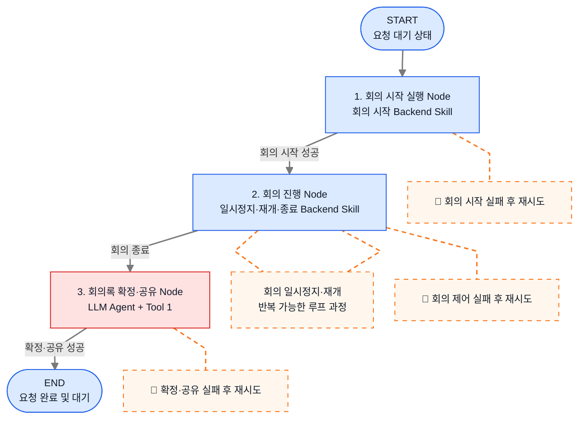
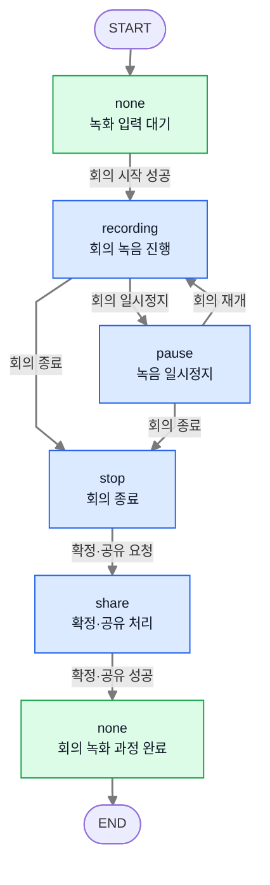
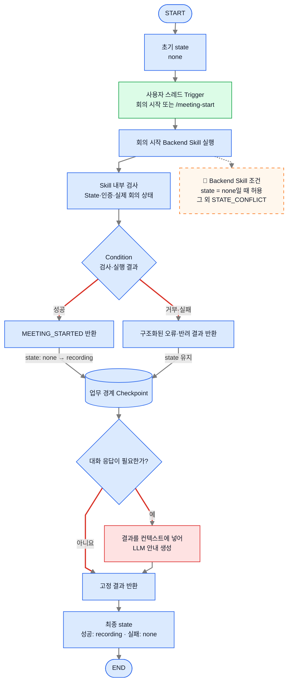
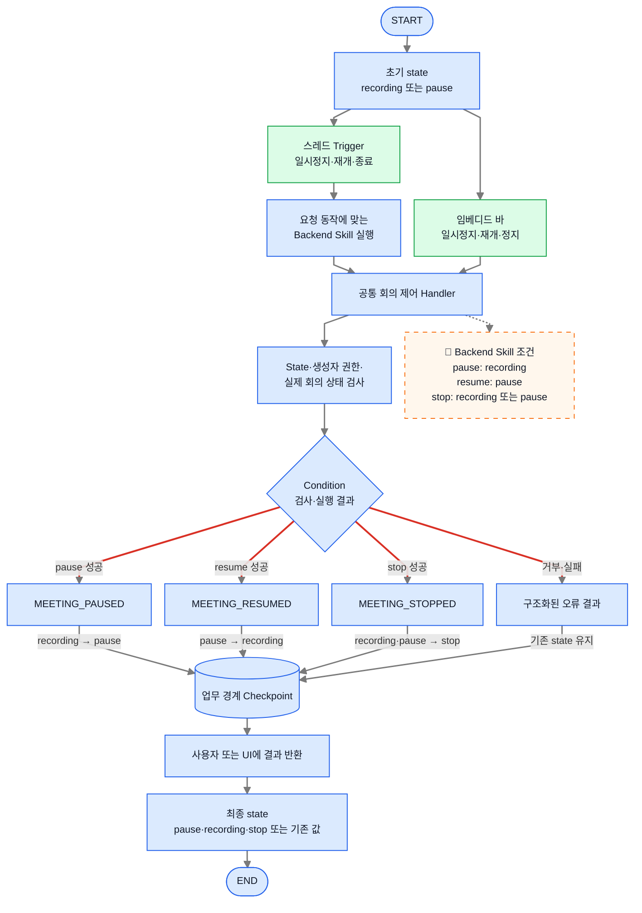
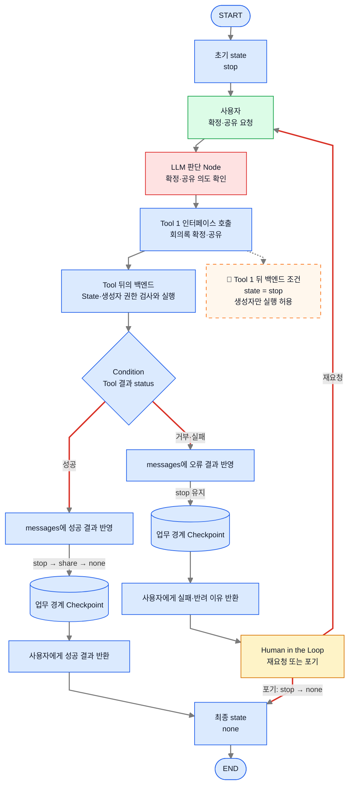
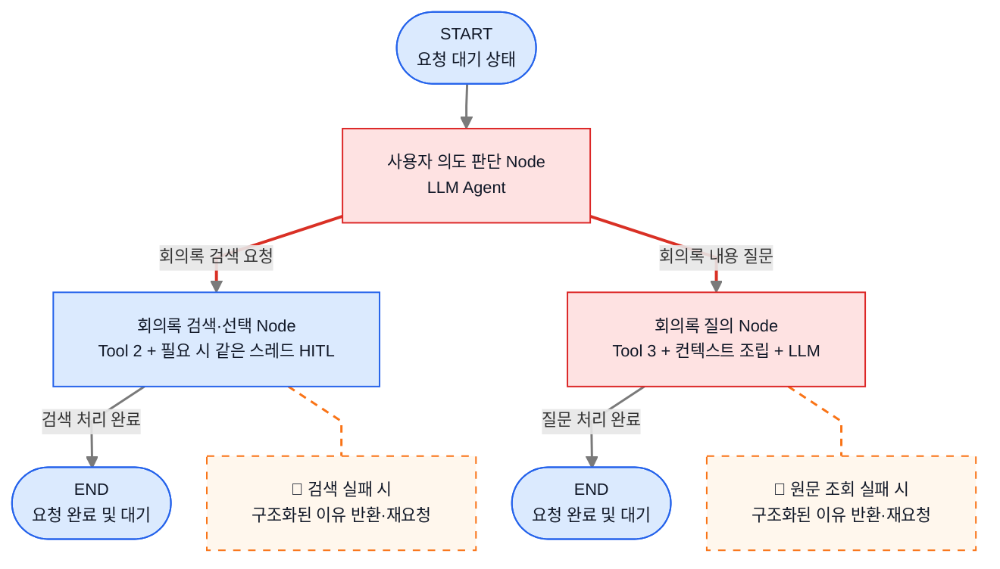
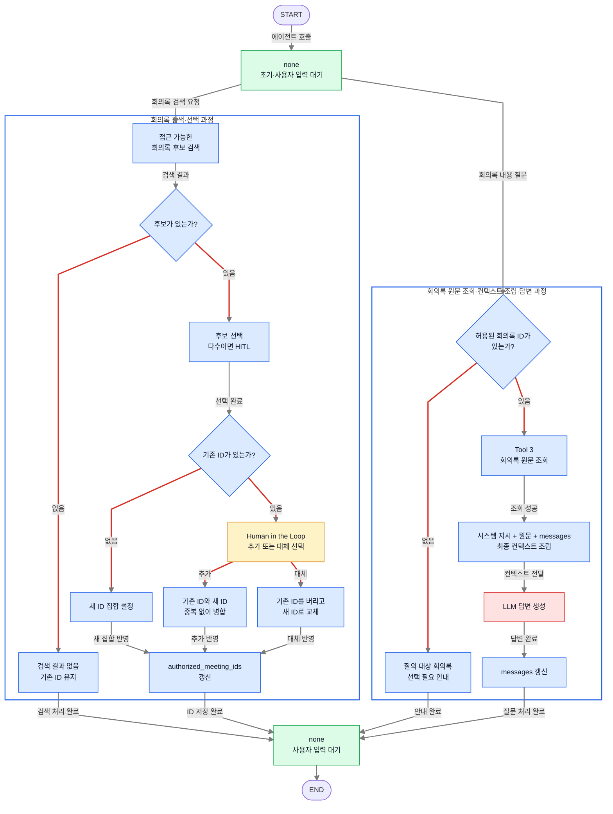
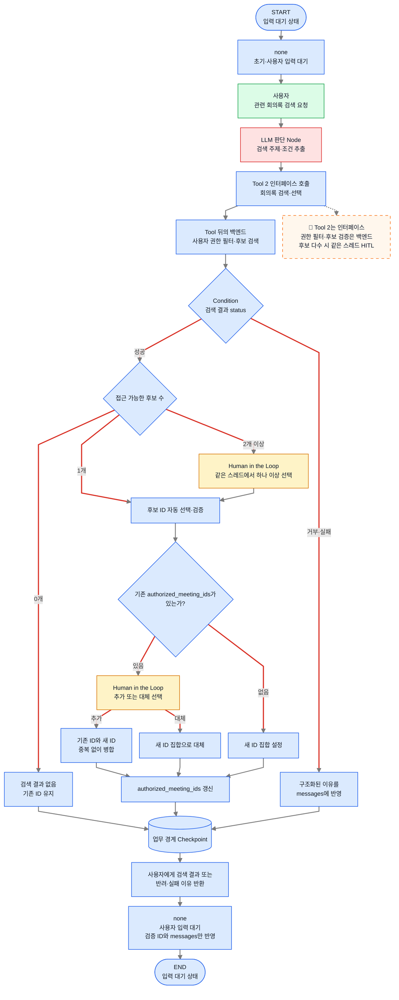
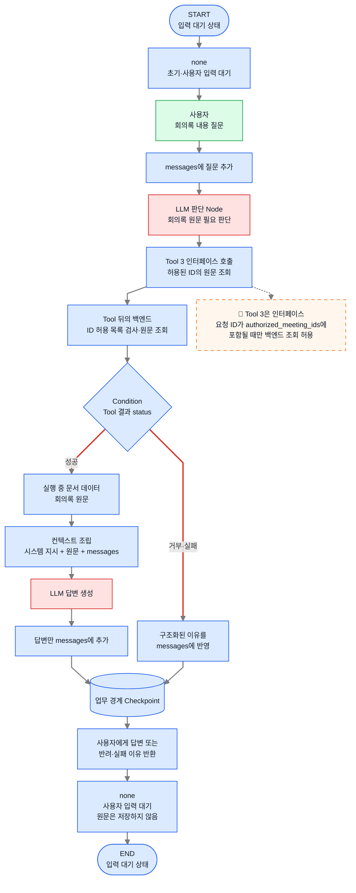

# 회의록 에이전트 워크플로우 Graph 상세

이 문서는 회의록 에이전트의 **State, Checkpoint, Backend Skill, Tool과 세부 실행 Graph**를 정의하는 개발 상세 문서다.

서비스의 목적, 사용자와 전체 업무 흐름을 먼저 확인하려면 [[1-1. 회의록 에이전트 업무 개요]]를 참고한다.

> [!info] 권장 읽기 순서
> 처음 읽는 사람은 **용어 사전 → 그림의 차이 → State·Checkpoint 원칙**을 먼저 확인한 뒤, 필요한 업무의 Agent Graph·State 전이도·순서도를 읽는다.

## 1. 기술 그림과 전체 구조

이 절은 문서의 중심이 되는 다이어그램을 읽기 전에, **세 가지 기술 그림이 각각 무엇을 보여주는지**와 회의록 에이전트의 **전체 기술 실행 구조**를 설명한다.

### 1-1. 세 가지 기술 그림의 차이

동일한 업무를 서로 다른 관점으로 설명하기 위해 세 종류의 그림을 사용한다.

| 그림 | 답하려는 질문 | 주요 내용 |
|---|---|---|
| **Agent Graph** | 어떤 실행 단위가 어떤 순서로 동작하는가? | Node의 책임과 Edge |
| **State 전이도** | 현재 상태가 어떤 사건으로 바뀌는가? | `none`, `recording`, `pause`, `stop`, `share` |
| **순서도** | 기능 내부에서 무엇을 검사하고 실행하는가? | 요청, 권한 검사, 실행, 결과 반환 |

업무 개요의 워크플로우는 사용자 관점의 업무 순서를 보여주며, 이 문서의 Agent Graph는 실제 기술 실행 단위를 보여준다.

### 1-2. 전체 기술 구조

```text
사용자 요청
→ LLM이 의도와 Tool 호출 여부 판단
→ Backend Skill 또는 Tool 뒤의 백엔드 실행
→ State·권한·실제 리소스 상태 검사
→ 구조화된 실행 결과 반환
→ State와 Checkpoint 반영
→ 사용자에게 결과 안내
```

권한과 실제 업무 상태를 LLM이 확정하지 않는다. Backend Skill과 Tool 뒤의 신뢰 가능한 백엔드가 검사하고, LLM은 필요한 기능을 선택하거나 결과를 설명한다.

## 2. State·Checkpoint 적용 원칙


### 2-1. State 적용 기준

State에는 **다음 사용자 요청에서도 기억해야 하고 이후 실행 가능 여부를 바꾸는 값**을 둔다.

- **회의 녹화**는 녹화 상태 에 따라 허용되는 다음 동작이 달라지므로 **`state`를 둔다**.
- **회의록 검색 및 질문**은 일직선의 워크 플로우이라서 사용자의 선택에 따라 다음 동작이 달리지지 않기 때문에 **`state`를 두지 않는다**. 
- 다음 질문에 필요한 결과는 State의 `authorized_meeting_ids`에 저장한다.

```python
AgentState = {
    "messages": [...],
    "authorized_meeting_ids": ["meeting-123"],
    "state": "recording",
}
```

검색·질문 과정이 state가 없기 때문에 **양쪽 과정을 동시에 처리**할 수 있다.

```text
state = recording
사용자 요청 = "지난 회의록을 검색해 줘"

→ state를 search로 변경하지 않음
→ 회의록 검색 Tool 실행
→ 검증된 ID만 authorized_meeting_ids에 반영
→ state는 recording 유지
```

### 2-2. Checkpoint 적용 기준

Checkpoint는 **각 업무가 끝난 시점의 State와 실행 결과를 저장**한다.

- 녹화 제어는 시작·일시정지·재개·종료·확정 및 공유 요청이 정상적으로 끝난 지점에 저장한다.
- 검색은 검증된 ID가 `authorized_meeting_ids`에 반영된 지점에 저장한다.
- 질문은 사용자 질문과 생성된 답변이 `messages`에 반영된 지점에 저장한다.
- 검색 후보가 여러 개여서 HITL로 기다릴 때는 같은 스레드의 런타임 내부 스냅샷으로 중단·재개하는 식으로 구현하여 Checkpoint가 사용되지 않는다.

Checkpoint는 **저장된 세이브 포인트**이며 자동 복구 기능 자체는 아니다. 오류가 발생하면 복구 로직이 마지막 정상 Checkpoint를 선택하고 해당 업무를 다시 실행해야 한다.

State와 Checkpoint의 구체적인 저장 구조는 [[2-1. 회의록 에이전트 현재 구현 상세 설계]]에서 다룬다.

## 3. 다이어그램을 읽기 위한 용어·표기 부록

> [!info] 이 절의 역할
> 이 절은 회의 녹화와 회의록 검색·질문의 본 흐름을 설명하는 부분이 아니라, 이후 다이어그램에 등장하는 **용어, 도형과 색상**을 해석하기 위한 부록이다. 익숙한 독자는 필요한 항목만 확인해도 된다.

| 용어                           | 이 문서에서의 의미                                             |
| ---------------------------- | ------------------------------------------------------ |
| **Agent**                    | 사용자의 요청을 이해하고 필요한 Tool 호출이나 답변을 판단하는 AI                |
| **LLM**                      | 요청 해석, Tool 호출 여부와 답변을 생성하는 AI 모델                      |
| **현재 상태(State)**             | 다음 요청의 실행 가능 여부에 영향을 주는 현재 업무 정보                       |
| **저장 지점(Checkpoint)**        | 정상적으로 완료된 업무 결과와 State를 저장한 지점                         |
| **실행 관리자(오케스트레이터)**          | Graph 이동, 실행 결과 반영과 Checkpoint 저장을 담당하는 구성요소           |
| **녹화 백엔드 기능(Backend Skill)** | 회의 시작·일시정지·재개·종료를 수행하는 백엔드 로직                          |
| **에이전트 호출 기능(Tool)**         | LLM이 백엔드 기능을 호출할 때 사용하는 이름·Description·Schema 기반 인터페이스 |
| **사용자 선택 대기(HITL)**          | AI가 임의로 결정하지 않고 사용자의 선택을 기다리는 구간                       |
| **Node**                     | Graph에서 하나의 실행 책임을 담당하는 단계                             |
| **Edge**                     | 다음 실행 단계로 이어지는 경로                                      |
| **분기 조건(Condition)**         | 실행 결과에 따라 이동할 Edge를 선택하는 규칙                            |

### 3-1. Skill·Tool·백엔드 구분

- **Backend Skill**: 회의 시작·일시정지·재개·종료 Trigger 또는 UI가 호출하는 백엔드 로직이다. 전달받은 `state`, 인증·권한과 실제 회의 상태를 검사하고 결과를 반환한다.
- **Tool**: LLM이 이름·Description·Schema를 보고 호출하는 Agent의 실행 인터페이스다. 실제 권한·검사·업무 로직은 Tool 뒤의 백엔드가 실행한다.
- **오케스트레이터**: Skill·Tool 결과를 받아 State를 갱신하고 Graph 이동과 Checkpoint 저장을 담당한다.
- **LLM**: 사용자 의도와 Tool 호출 여부를 판단하고, 실행 결과를 바탕으로 답변을 생성한다.

녹화 Skill은 Agent에 Tool로 연결되지 않는다. Agent에 연결되는 Tool은 회의록 확정·공유, 검색·선택, 원문 조회다.

### 3-2. 다이어그램 표기

| 요소               | 의미                                        | 표현                |
| ---------------- | ----------------------------------------- | ----------------- |
| Node             | LLM 판단, Backend Skill 실행, Tool 호출, 백엔드 처리 | 사각형               |
| Edge             | 다음 단계로 이동하는 경로                            | 화살표               |
| Condition        | 실행 결과에 따라 다음 경로를 선택                       | 마름모               |
| State            | 다음 요청에도 유지되는 `state`·대화·검증 ID   | 평행사변형 또는 State 박스 |
| 업무 경계 Checkpoint | 업무 완료 결과를 저장하는 지점                         | 원통형               |
| 내부 조건 주석         | Backend Skill·Tool 뒤의 확정적 검사 규칙           | 점선 말풍선            |
| 루프 과정            | 같은 Node를 반복하거나 실패 후 해당 Node를 다시 실행하는 과정   | 주황색 점선 박스         |

- **초록색**: 사용자의 호출·요청
- **노란색**: Human in the Loop
- **빨간색 네모**: LLM 판단·생성
- **파란색 네모**: Backend Skill, Tool 호출, 백엔드 검사, Condition, 컨텍스트 조립과 Checkpoint
- **회색 화살표**: 정해진 단방향 진행
- **빨간색 화살표**: Condition 분기·재시도·복구

Graph Engineering 관점의 Agent Graph에서 **주황색 점선 박스**는 그 자체로 일시정지·재개 반복이나 실패 후 재시도 같은 **루프 과정**을 뜻한다. Mermaid에서 복귀 화살표를 모두 직접 연결하면 선이 겹쳐 가독성이 떨어지는 한계가 있어, 반복되는 과정을 별도의 점선 박스로 단순화해 표현한다.

> 권한과 실제 업무 상태는 LLM이나 Condition이 결정하지 않는다. Backend Skill과 Tool 뒤의 백엔드가 검사하고, Condition은 구조화된 실행 결과에 따라 응답 경로만 선택한다.

## 4. 회의 녹화 과정

> [!summary] 회의 녹화 과정 한눈에 보기
> - **사용자:** 회의 생성자
> - **시작 State:** `none`
> - **주요 행동:** 시작, 일시정지, 재개, 종료, 확정·공유
> - **종료 State:** 확정·공유 성공 후 `none`
> - **특징:** 여러 사용자 요청에 걸쳐 녹화 상태가 유지됨

회의 녹화는 여러 요청에 걸쳐 지속되므로 별도의 `state`를 사용한다.

이 과정은 세 가지 관점으로 표현한다. **Graph Engineering 관점의 Agent Graph**는 업무 Node와 책임의 경계를, **State 전이도**는 녹화 상태의 변화와 허용 경로를, 각 **순서도**는 요청별 실제 실행·검사·응답 절차를 보여준다.

### 4-0. Graph Engineering 관점의 Agent Graph



**Node를 이렇게 나눈 이유**

- **회의 시작 실행 Node**: State·권한 검사부터 실제 녹화 시작 결과까지가 하나의 백엔드 실행 단위다.
- **회의 진행 Node**: 일시정지·재개·종료는 같은 회의와 공통 Handler를 사용하고 종료 전까지 반복될 수 있다.
- **회의록 확정·공유 Node**: 녹화 종료 이후 LLM이 Tool 1을 선택하고 외부 공유라는 쓰기 작업을 수행하므로 분리한다.

### 4-0-1. 회의 녹화 State 전이도



사용자 명령이나 버튼 클릭만으로 State를 먼저 바꾸지 않는다. Backend Skill 또는 Tool 뒤의 실제 동작이 성공한 뒤 오케스트레이터가 `state`를 변경한다.

### 4-1. 회의 시작 순서도



1. Trigger가 회의 시작 Backend Skill을 호출하면서 신뢰된 현재 `state`를 전달한다.
2. Skill 내부에서 State, 인증 사용자와 실제 회의 상태를 검사한다.
3. 조건을 통과하면 기존 회의 시작 로직을 실행한다.
4. 성공 결과를 받은 오케스트레이터가 `state`를 `recording`으로 변경한다.
5. Skill은 State를 직접 수정하지 않으며, 자연어 안내가 필요할 때만 LLM을 호출한다.

### 4-2. 회의 일시정지·재개·종료 순서도



각 요청은 Backend Skill과 공통 Handler에서 독립적으로 처리된다. 일시정지 후 재개는 같은 Graph가 계속 도는 것이 아니라, 다음 Trigger가 들어오면 기존 `pause`를 읽어 새 실행에서 재개 Skill을 처리한다.

### 4-3. 회의록 확정·공유 순서도



Tool 1은 Agent가 보는 인터페이스다. Tool 뒤의 백엔드가 `state`, 실제 회의 상태와 생성자 권한을 검사하고, 성공 결과가 반환된 뒤 오케스트레이터가 State를 변경한다.

## 5. 회의록 검색·질문 과정

> [!summary] 회의록 활용 과정 한눈에 보기
> - **사용자:** 회의록을 공유받은 사용자
> - **시작 State:** `none`
> - **주요 행동:** 회의록 검색·선택 또는 원문 기반 질문
> - **종료 State:** 요청 처리 후 `none`
> - **남는 결과:** `authorized_meeting_ids` 또는 생성된 답변
> - **특징:** 검색과 질문은 별도의 지속 업무 State를 만들지 않음

검색과 질문에는 별도의 지속 업무 State를 두지 않는다. 각 사용자 요청에서 필요한 Tool과 LLM을 실행하고, 다음 질문에도 필요한 결과만 `messages`와 `authorized_meeting_ids`에 남긴다.

### 5-0. Graph Engineering 관점의 Agent Graph



**Node를 이렇게 나눈 이유**

- **사용자 의도 판단 Node**: 현재 요청이 새 회의록 검색인지, 선택된 회의록을 이용한 질문인지 LLM이 판단한다.
- **회의록 검색·선택 Node**: 검색 조건 추출부터 권한 필터, 후보 선택과 검증된 ID 반영까지가 한 번의 검색 요청이다.
- **회의록 질의 Node**: 검증된 ID로 원문을 조회하고 컨텍스트를 조립해 질문 한 번에 답변하는 단위다.

`END`는 에이전트 세션 종료가 아니라 이번 요청 처리가 끝나 다시 입력을 기다린다는 뜻이다.

### 5-0-1. 회의록 검색·질문 State 전이도

아래 그림은 입력 대기 상태에서 **회의록 검색·선택** 또는 **회의록 원문 조회·컨텍스트 조립·답변**으로 진입한 뒤, 필요한 State 값만 갱신하고 다시 입력 대기 상태로 돌아오는 전체 흐름을 보여준다. 검색과 질문의 내부 단계는 한 요청 안에서만 실행되며 별도의 지속 업무 State로 저장하지 않는다.



위쪽과 아래쪽의 `none`은 서로 다른 State가 아니다. 검색이나 질문 처리가 끝난 뒤 동일한 사용자 입력 대기 State인 `none`으로 돌아왔음을 위에서 아래로 읽을 수 있도록 반복해서 표시한 것이다.

### 5-1. 관련 회의록 검색·선택 순서도



1. LLM이 검색 주제와 조건을 추출해 Tool 2 인터페이스를 호출한다.
2. Tool 뒤의 백엔드가 현재 사용자의 생성자·참여자·공유 채널 권한을 기준으로 후보를 필터링한다.
3. 후보가 여러 개이면 같은 스레드의 HITL에서 사용자가 하나 이상 선택한다. 별도의 `run_id`는 두지 않는다.
4. 선택 ID를 서버에서 검증하고, 기존 ID가 있으면 추가·대체를 사용자가 선택한다.
5. 최종 ID만 `authorized_meeting_ids`에 반영하고 `none`인 사용자 입력 대기 상태로 돌아간다.
6. 검색 동안 `state`는 읽거나 변경하지 않으므로 녹화 중에도 검색할 수 있다.

### 5-2. 회의록 원문 조회·컨텍스트 조립·답변 순서도



1. 질문이 들어오면 Agent는 `authorized_meeting_ids`를 기준으로 Tool 3을 호출한다.
2. Tool 뒤의 백엔드가 요청 ID의 허용 목록 포함 여부를 검사하고 원문을 가져온다.
3. 원문은 실행 중 문서 데이터로만 사용하며 State나 Checkpoint에 저장하지 않는다.
4. 시스템 지시, 원문과 `messages`를 조립해 LLM이 답변한다.
5. 답변만 `messages`에 추가하고 `none`인 사용자 입력 대기 상태로 돌아간다.

## 6. Backend Skill과 Agent Tool 조건 요약

| 실행 기능               | 위치와 역할                  | 실행 조건                    | 성공 후 처리                     |
| ------------------- | ----------------------- | ------------------------ | --------------------------- |
| 회의 시작 Backend Skill | Trigger·UI가 호출하는 백엔드 로직 | `state=none`·권한·실제 회의 상태 | 오케스트레이터가 `recording` 반영     |
| 일시정지 Backend Skill  | Trigger·UI가 호출하는 백엔드 로직 | `state=recording`        | `pause` 반영                  |
| 재개 Backend Skill    | Trigger·UI가 호출하는 백엔드 로직 | `state=pause`            | `recording` 반영              |
| 종료 Backend Skill    | Trigger·UI가 호출하는 백엔드 로직 | `state=recording·pause`  | `stop` 반영                   |
| Tool 1. 확정·공유       | Agent가 호출하는 인터페이스       | 백엔드가 `state=stop`·생성자 확인 | `share → none` 반영           |
| Tool 2. 검색·선택       | Agent가 호출하는 인터페이스       | 백엔드 권한 필터·선택 ID 검증       | `authorized_meeting_ids` 반영 |
| Tool 3. 원문 조회       | Agent가 호출하는 인터페이스       | 요청 ID가 허용 목록에 포함         | 원문을 호출 시점 컨텍스트에만 전달         |

Backend Skill과 Tool의 입력에서 `state`와 인증 사용자는 LLM이 생성하는 인자가 아니다. 오케스트레이터와 서버 Runtime이 신뢰된 값으로 전달한다.

## 핵심 정리

- 회의 녹화에만 지속 `state`를 둔다.
- 검색·질문은 요청이 들어올 때 Agent가 Tool과 LLM을 실행하고 끝내며 `search`, `question`, `run_id`를 두지 않는다.
- 검색 후보가 여러 개이면 같은 스레드의 HITL에서 선택한다.
- Backend Skill은 Agent Tool이 아니라 Trigger·UI가 호출하는 백엔드 로직이며, State·권한·실제 회의 상태를 검사해 결과를 반환한다.
- 성공 결과를 받은 오케스트레이터가 State를 갱신한다.
- Tool은 LLM과 실제 백엔드 로직 사이의 인터페이스다.
- 검색 중에도 `state`를 유지하므로 회의 녹화와 과거 회의록 검색·질문을 함께 처리할 수 있다.
- 회의록 원문은 State·Checkpoint·임시 Storage에 저장하지 않고 LLM 호출 시점에만 조립한다.
