## 1. 회의록 업무 워크플로우

회의록의 **개념적인 업무 흐름 단계**를 기준으로 하여 워크플로우로 나누었다.

크게 보면
 - 회의를 **생성·진행·공유**하는 흐름
 - 공유된 회의록을 **검색·질문**하는 흐름
의 두 줄기로 나뉜다.

**회의 생성·진행·공유 흐름**

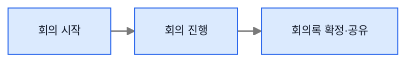

**공유 회의록 검색·질의 흐름**

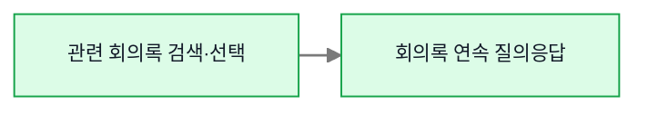

두 흐름은 같은 사용자의 같은 Agent 실행으로 직접 이어지지 않는다. 공유받은 사용자는 자신의 전용 스레드에서 별도의 회의록 활용 과정을 시작한다.

## 2. Agent Graph와 순서도 표기 규칙

위의 전체 워크플로우를 두 개의 Agent Graph로 나눈 뒤, 각 Graph 바로 아래에서 세부 실행 과정을 순서도로 전개한다.

 - **State**: 워크플로우에서 구분해야 하는 **세부 업무 상태를 기준**으로 나눈다.
 
**설계 의도**
 - 회의 진행 과정에서는 **회의록 녹음의 상태가 주된 기준**이라고 판단하여, 녹음 중·일시정지·종료·공유의 4가지 상태로 분류한다.
 - 회의록 활용 과정에서는 **사용자가 질문 하려고 하는 회의록 정보(ID)의 상태**가 주된 기준이라고 판단하여, 후보 회의록 검색·최종 회의록 ID 결정 및 가져오기·사용자 질문의 3가지 상태로 분류한다.
 - `none`은 현재 진행 중인 업무 과정이 없는 초기·대기 상태로, 양쪽 과정의 초기 상태는 `none`이며, 하나의 과정이 정상적으로 마무리되면 다시 `none`으로 돌아간다.
 - 두 과정은 각각 **회의 녹화 과정**과 **회의록 기반 검색 과정**으로 분리되어 있다고 가정하여, 둘 중 하나로 들어가는 순간 다른 과정으로는 **들어갈 수 없도록 강제 고정**된다.
 - 회의 녹화 과정은 회의 진행 도중 새로운 회의를 시작할 수 없는 **일방향 과정**으로 본다. 반면 회의록 기반 검색 과정에서는 사용자가 질의 대상을 추가하거나 교체할 수 있도록 중간에 검색 단계로 **돌아가는 것을 허용**한다.

**State 간단 예시**

```text
현재 workflow_state = recording
사용자 요청 = "지난 회의 내용을 검색해 줘"
→ 검색 Tool의 백엔드 내부 State 조건에서 실행 거부
→ "현재 회의 녹화 과정이 끝나지 않았습니다"라는 이유를 LLM에 반환

회의 종료·회의록 확정 및 공유 완료
→ workflow_state = none
→ 이후 새로운 회의록 검색 과정 시작 가능
```

 - **Checkpoint**: 각 **워크플로우를 하나의 업무 단위**로 보고, **해당 업무가 끝나는 지점**에 둔다.
 
**설계 의도**
  - 각 워크플로우가 끝나는 지점에 Checkpoint를 두어, 해당 업무에서 **마지막으로 확정된 State와 Skill·Tool 등의 실행 결과를 기록**한다.
  - 이를 통해 다음 단계에서 오류가 났을 때 **정상적으로 진행되었던 마지막 지점 부터** 다시 시작 할 수 있도록 한다.
 
**Checkpoint 간단 예시**

```text
`/meeting-pause` Skill이 호출한 백엔드 실행 성공
→ workflow_state = pause
→ 일시정지 실행 결과와 State를 Checkpoint에 저장

이후 `/meeting-resume` 실행 중 오류 발생
→ 재개 워크플로우의 Checkpoint는 아직 생성되지 않음
→ 오류 복구 로직이 마지막으로 정상 완료된 pause Checkpoint를 선택
→ workflow_state = pause와 일시정지 실행 결과를 기준으로 재개 워크플로우를 다시 시작
→ 재개 성공 시 workflow_state = recording으로 갱신하고 새로운 Checkpoint 저장
```

State 값의 구체적인 정의와 변경 시점, Checkpoint 저장 기준은 [[2. 회의록 에이전트 설계]]에서 자세히 다루며, 이 문서에서는 Graph 흐름을 이해하는 데 필요한 값과 변경 지점만 표시한다.

| 요소               | 의미                                                                   | 그림 속 표현                      |
| ---------------- | -------------------------------------------------------------------- | ---------------------------- |
| Node             | Agent 판단, Skill 실행, Tool 호출, 백엔드 처리처럼 실제로 실행되는 한 단계                  | 사각형                          |
| Edge             | 한 단계에서 다음 단계로 이동하는 경로                                                | 화살표                          |
| Condition        | State 또는 Skill·Tool 결과를 읽고 다음 Edge를 결정하는 단계                          | 마름모                          |
| State            | 현재 실행에서 다음 Node로 전달되는 대화, Skill·Tool 결과 등의 "상태" (예:`workflow_state`) | 평행사변형                        |
| 업무 경계 Checkpoint | 하나의 업무 워크플로우가 끝날 때 결과 State를 영속적으로 확정하는 지점                           | 원통형                          |
| 실행 기능 내부 조건 주석   | Skill·Tool 백엔드가 허용하는 `workflow_state`와 반려 시 반환할 이유                   | 점선으로 해당 실행 기능 옆에 연결된 말풍선형 메모 |

- **초록색**: 사용자의 호출·요청
- **노란색**: Human in the Loop 입력·선택 구간
- **빨간색 네모**: 의도·조건 해석, Tool 사용 판단, 답변 생성처럼 LLM이 판단하거나 생성하는 영역
- **파란색 네모**: Skill 실행, Tool 호출, 백엔드 검사, State 갱신, Condition 분기, 컨텍스트 조립, Checkpoint처럼 정해진 규칙에 따라 처리되는 영역
- **회색 화살표**: 정해진 단방향 진행 또는 상위 Agent Graph의 정상 완료 Outcome
- **빨간색 화살표**: Condition의 대안 분기, 실패 후 재시도, 이전 작업으로 돌아가는 복구 Edge

> 권한은 LLM이나 Condition이 결정하지 않는다. Skill·Tool이 호출하는 백엔드가 권한을 검사하고, Condition은 백엔드가 반환한 성공·거부 결과에 따라 다음 응답 경로만 선택한다.

**설계 의도**
State 값 읽기나, 컨텍스트 조립과 같은 **오케스트레이터의 영역**과 조립된 컨텍스트를 통해 판단을 하는 **LLM의 영역**을 따로 나눴다.
-> LLM과 오케스트레이터의 담당 영역을 명확히
해서 **어느 부분까지를 LLM에게 판단을 맡길지**를 확실하게 해야하기 때문.

## 3. 회의 녹화 과정 Graph

회의 녹화 과정에서 실제로 실행되는 Skill·Tool, 백엔드 처리, Condition과 State 갱신을 Graph Engineering 관점으로 표현하면 다음과 같다.

**Graph Engineering 관점의 Agent Graph**

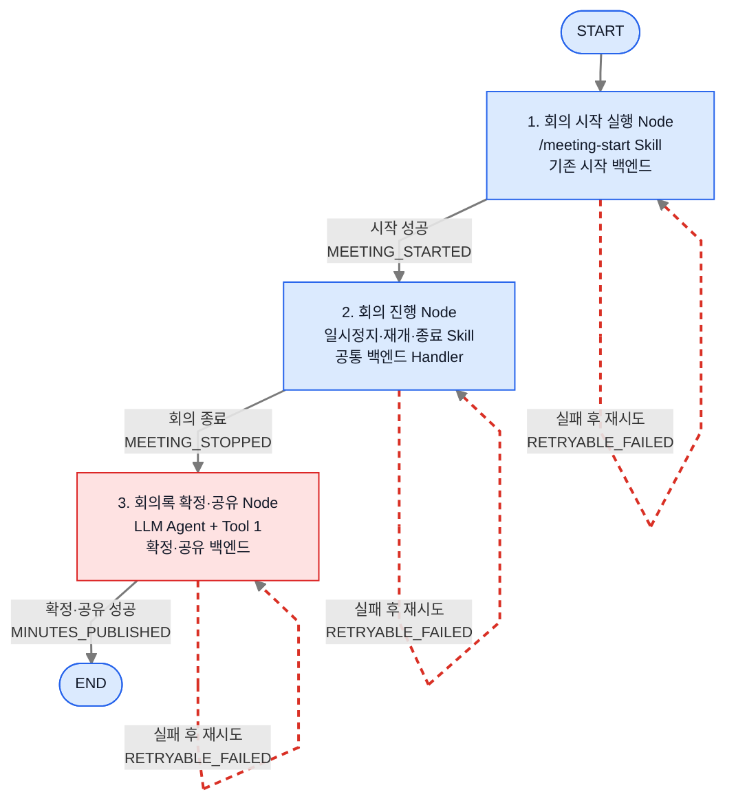

이 Agent Graph의 Node는 독립적으로 실행·검증할 수 있는 회의 시작, 회의 진행, 확정·공유 작업 단위다. Edge는 다음 Node로 이동할 수 있게 하는 구조화된 실행 결과를 나타낸다. 각 Node가 반환한 State 업데이트는 오케스트레이터와 reducer가 반영하고, Checkpoint는 런타임이 저장하므로 상위 실행 Graph의 별도 Node로 그리지 않는다. 구체적인 내부 흐름은 아래 3-1부터 3-3까지의 순서도에서 나누어 설명한다.

**Node를 이렇게 나눈 이유**

- **회의 시작 실행 Node**: 시작 조건 검사부터 실제 녹화 시작까지가 하나의 목표이며, `MEETING_STARTED`가 반환되어야 다음 단계로 이동할 수 있으므로 하나의 실행 단위로 묶었다.
- **회의 진행 Node**: 일시정지·재개·종료는 같은 회의의 녹화 상태와 권한을 공유하고, 종료 전까지 반복될 수 있는 하나의 제어 구간이므로 함께 묶었다.
- **회의록 확정·공유 Node**: 녹화가 종료된 뒤에만 실행되며 회의록 확정과 채널 공유라는 외부 상태 변경을 수행하므로, 녹화 제어와 분리된 작업 단위로 두었다.
- **START·END**: 업무를 수행하는 Node가 아니라 Graph의 진입점과 종료점을 나타내는 제어용 Terminal이다.

**회의 녹화 과정 State 전이도**

아래 그림은 같은 실행 과정에서 `workflow_state`가 어떻게 바뀌는지만 따로 보여준다.

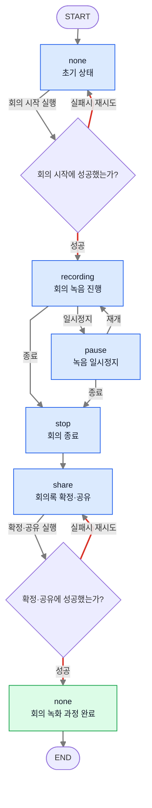

**설계 의도 — Skill·Tool 백엔드 내부 State 조건**

 - State에 따른 모든 Skill·Tool 허용·금지 조합을 시스템 프롬프트, 사전 지식 또는 Description에 자연어로 나열하지 않는다. 조건이 많아질수록 LLM이 매번 읽어야 할 컨텍스트와 토큰 사용량이 증가하고, 에이전트 종류와 기능이 늘어날 때 조건 로직의 유지보수도 어려워지기 때문이다.

 - 대신 각 Skill과 Tool이 호출하는 확정적인 **백엔드 로직이 현재 `workflow_state`를 읽고 `if`등의 조건을 걸어서 실행 가능 여부를 검사**한다. 허용된 상태이면 기존 백엔드 기능을 실행하고, 허용되지 않은 상태이면 실행하지 않은 채 구조화된 반려 이유를 반환한다. LLM은 복잡한 상태 규칙을 모두 기억하거나 판단하지 않고, 반환된 이유를 읽어 사용자에게 현재 실행할 수 없는 이유를 설명한다.

```text
if current_state in allowed_states:
    기존 백엔드 기능 실행
else:
    실행하지 않음
    STATE_CONFLICT와 사용자에게 설명할 반려 이유 반환
```

이는 State 전체의 소유권을 Skill이나 Tool에 넘긴다는 뜻이 아니다. Graph 이동과 State 전달·갱신은 계속 오케스트레이터가 담당하고, 각 실행 기능은 자신이 실행되기 위한 State 조건 검사만 tool 내부 로직으로 이관할 뿐이다.

### 3-1. 회의 시작 순서도

이 순서도는 회의 시작 요청을 받은 에이전트가 `/meeting-start` Skill로 기존 회의 시작 백엔드를 실행하고, 그 결과를 LLM 컨텍스트와 State에 반영하는 구조를 나타낸다.

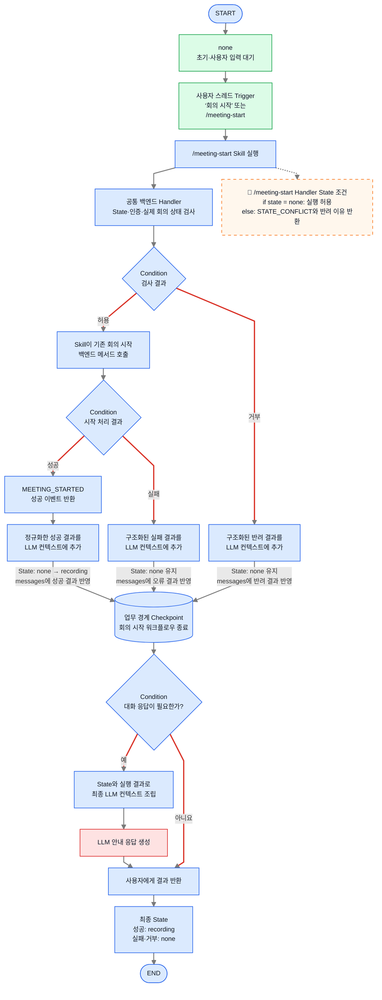

1. 사용자가 전용 스레드에 `회의 시작` 또는 `/meeting-start`를 입력하면 Trigger가 `/meeting-start` Skill을 실행한다.
2. 전용 스레드가 생성될 때 `workflow_state="none"`으로 초기화되어 있으므로, 회의 시작 순서도에서는 별도의 초기화 단계를 거치지 않는다.
3. 공통 백엔드 Handler는 현재 State, 인증 사용자와 실제 회의 상태를 검사한다. `none`일 때만 실행을 허용하며, 거부되면 기존 State를 유지하고 구조화된 반려 결과를 반환한다.
4. 조건을 통과하면 Skill이 기존 회의 시작 백엔드 메서드를 호출한다. 호출 중에는 `workflow_state="none"`을 유지한다.
5. Skill이 반환한 성공·실패 결과를 정규화해 LLM 컨텍스트에 추가한다. 성공하면 오케스트레이터가 `none`에서 `recording`으로 바로 변경하고, 실패하면 `none`을 유지한다.
6. 실행 결과와 State를 Checkpoint에 반영한다. 자연어 안내가 필요하면 정규화한 결과를 바탕으로 LLM이 응답하고, 고정 안내만 필요하면 LLM 호출을 생략한다.

### 3-2. 회의 재생·일시정지·종료 순서도

이 순서도는 스레드 Trigger와 임베디드 바가 각 녹화 Skill과 동일한 공통 백엔드 Handler를 통해 일시정지·재개·종료를 실행하고, 성공 이벤트가 반환된 뒤 State를 갱신하는 구조를 나타낸다.

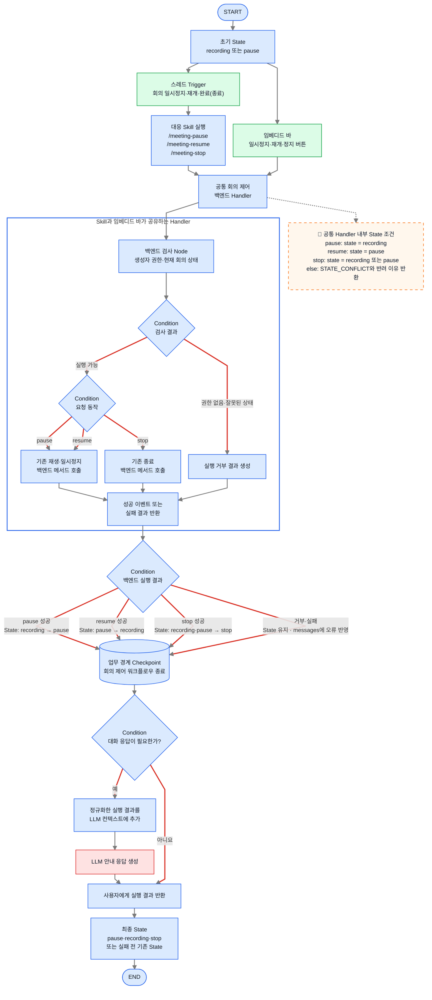

1. 스레드의 `회의 일시정지`·`회의 재개`·`회의 완료` 또는 `회의 종료` Trigger는 각각 `/meeting-pause`, `/meeting-resume`, `/meeting-stop` Skill을 실행한다. 임베디드 바 버튼은 각 Skill과 동일한 공통 Handler로 직접 들어간다.
2. 공통 Handler가 현재 State, 생성자 권한과 백엔드의 실제 회의 상태를 검사한다.
3. `pause`와 `resume`은 기존 재생·일시정지 메서드를, `stop`은 기존 종료 메서드를 호출한다.
4. 버튼 클릭이나 Skill 호출 시점에는 State를 바꾸지 않는다. 일시정지 성공 이벤트 후 `pause`, 재개 성공 이벤트 후 `recording`, 종료 성공 이벤트 후 `stop`으로 변경한다.
5. 거부나 실패 시 기존 `workflow_state`를 유지하고 오류 결과만 기록한다.
6. 요청 1회의 결과와 State를 반영한 뒤 Checkpoint를 남긴다. 대화 응답이 필요할 때만 실행 결과를 컨텍스트에 넣어 LLM을 호출한다.

일시정지 이후의 재개는 같은 Graph가 계속 실행되는 방식이 아니다. 일시정지 워크플로우가 끝난 뒤 재개 Trigger 또는 버튼 이벤트가 들어오면 이 Graph가 새로 실행되고 기존 `pause` 상태에서 `/meeting-resume`과 같은 공통 Handler 경로를 처리한다.

### 3-3. 회의록 확정·공유 순서도

이 순서도는 회의록 확정·공유 요청에 대해 백엔드가 생성자 권한을 검사하고, 성공 여부에 따라 State를 갱신하는 구조를 나타낸다.

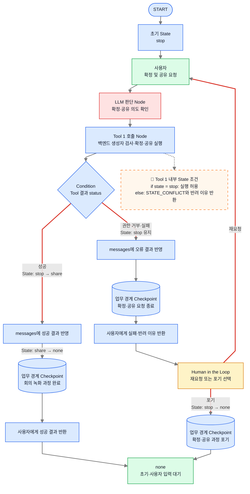

1. 사용자가 확정·공유를 요청하면 Agent가 Tool 1을 호출한다.
2. 백엔드가 생성자 권한을 검사하고, 권한이 있으면 회의록을 확정해 지정된 채널에 공유한다.
3. 성공하면 `workflow_state`를 `share`로 변경한 뒤, 회의 녹화 과정 전체를 마치고 대기 상태인 `none`으로 돌아간다.
4. 권한 거부나 실패 시 `stop`을 유지하고 오류 결과를 기록한 뒤, 사용자가 재요청하거나 포기할 수 있도록 기다린다.
5. 재요청하면 확정·공유 요청 단계로 돌아가 다시 시도한다. 포기하면 `workflow_state`를 `none`으로 변경하고 마지막 Checkpoint를 남긴다.
6. 성공하거나 실패 후 포기한 경우 모두 하나의 `none` 초기·사용자 입력 대기 상태로 합류한다.

## 4. 회의록 기반 검색 과정 Graph

회의록 기반 검색 과정에서 실제로 실행되는 LLM 판단, Tool 호출, Human in the Loop, 컨텍스트 조립과 State 갱신을 Graph Engineering 관점으로 표현하면 다음과 같다.

**Graph Engineering 관점의 Agent Graph**

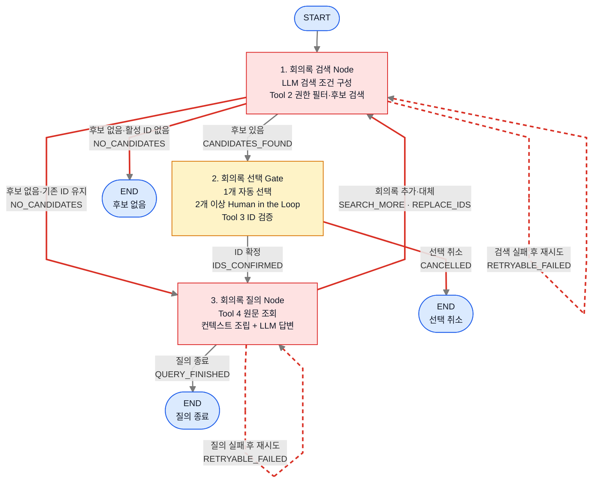

이 Agent Graph의 Node는 검색, 선택, 질의처럼 독립적으로 실행·검증할 수 있는 작업 단위다. Edge는 후보 존재 여부, ID 확정, 후속 질문처럼 다음 작업을 허용하는 구조화된 Outcome을 나타낸다. 각 Node는 Outcome과 함께 필요한 State 업데이트를 반환하지만, State 갱신과 Checkpoint 저장 자체를 상위 Graph의 별도 작업 Node로 만들지는 않는다. 검색과 질문의 구체적인 내부 흐름은 아래 4-1과 4-2 순서도에서 나누어 설명한다.

그림의 세 `END`는 서로 다른 Agent나 State가 아니라, 후보 없음·선택 취소·질의 종료라는 서로 다른 사유로 동일한 Graph 실행이 끝나는 출구를 각각 가까운 위치에 표시한 것이다.

**Node를 이렇게 나눈 이유**

- **회의록 검색 Node**: 사용자의 검색 의도를 조건으로 만들고 권한이 적용된 후보를 반환하는 데까지가 하나의 목표이므로, LLM 판단과 Tool 2 실행을 하나의 검색 단위로 묶었다.
- **회의록 선택 Gate**: 후보 수에 따라 자동 선택 또는 Human in the Loop가 필요하고, 선택된 ID의 검증이 끝나야 질의를 시작할 수 있으므로 별도의 중단·재개 경계로 분리했다.
- **회의록 질의 Node**: 확정된 ID로 원문을 조회하고 컨텍스트를 조립해 답변하는 과정이 질문마다 반복되므로 하나의 반복 가능한 질의 단위로 묶었다. 회의록을 추가하거나 대체해야 할 때만 검색 Node로 돌아간다.
- **START·END**: 업무를 수행하는 Node가 아니라 Graph의 진입점과 종료점을 나타내는 제어용 Terminal이다.

**회의록 기반 검색 과정 State 전이도**

아래 그림은 검색 요청이 들어오면 `search` 안에서 후보 검색, 기존 ID 확인, 추가·대체 선택과 최종 ID 저장까지 처리한 뒤 다시 사용자 입력 대기 상태인 `none`으로 돌아가는 흐름을 보여준다.

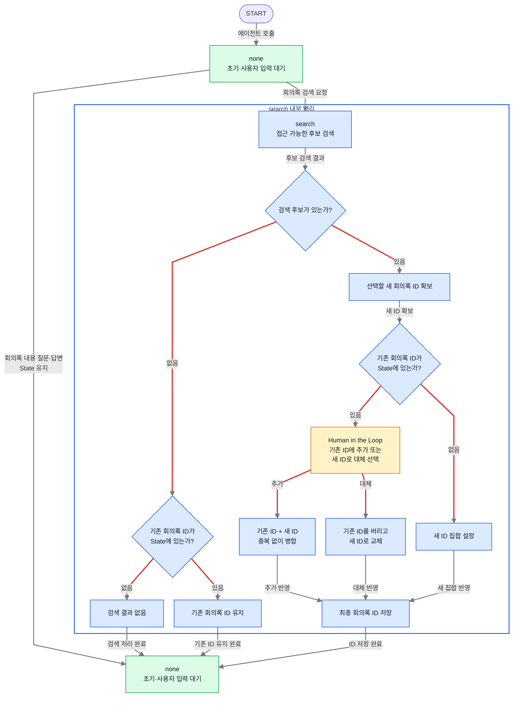

위쪽과 아래쪽의 `none`은 서로 다른 State가 아니다. 검색이나 질문 처리가 끝난 뒤 동일한 초기·사용자 입력 대기 상태로 돌아왔음을 위에서 아래로 읽을 수 있도록 반복해서 표시한 것이다.
### 4-1. 관련 회의록 검색·선택 순서도

이 순서도는 `none`에서 검색 요청을 받아 `search` 안에서 접근 가능한 회의록 후보를 검색하고, 기존 ID가 있으면 Human in the Loop로 추가·대체를 선택한 뒤 최종 ID 집합을 저장하고 다시 `none`으로 돌아가는 구조를 나타낸다.

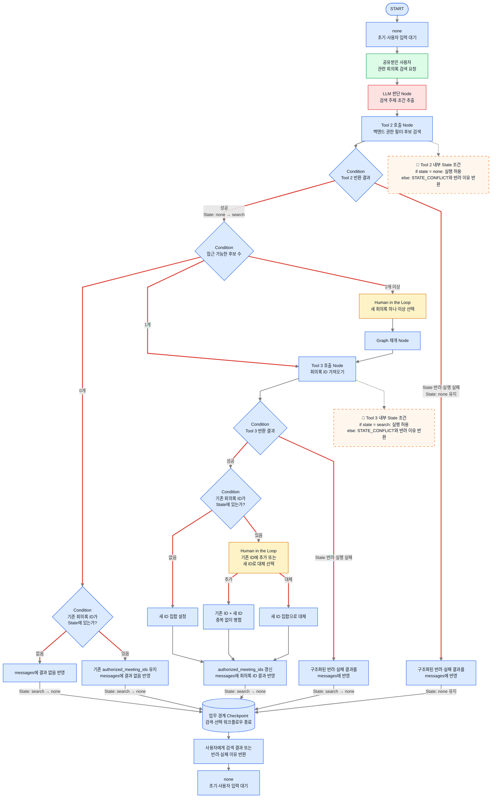

위쪽과 아래쪽의 `none`은 같은 State이며, 검색·선택 처리가 끝난 뒤 에이전트가 다시 사용자 입력을 기다린다는 의미로 아래쪽에 한 번 더 표시한다.

1. 에이전트는 `workflow_state="none"`인 상태에서 사용자의 입력을 기다린다.
2. 사용자가 관련 회의록을 요청하면 LLM이 검색 주제와 조건을 추출하고 Tool 2를 호출한다. Tool 2는 현재 State가 `none`일 때만 검색을 허용한다.
3. Tool 2가 성공하면 `workflow_state`를 `search`로 변경하고 후보 수를 판별한다. State 조건에 의해 반려되거나 실행에 실패하면 기존 `none`을 유지하고 구조화된 이유를 기록한 뒤 정상 후보 흐름으로 넘기지 않는다.
4. Tool 2는 사용자가 생성자·참여자·공유 대상자인 회의록만 반환한다. 접근 가능한 후보가 없는 것은 권한 오류가 아니라 정상적인 `후보 0개` 결과로 처리한다.
5. 후보가 0개이면 기존 `authorized_meeting_ids`가 있는지 확인한다. 기존 ID가 없으면 결과 없음 메시지를 기록하고, 기존 ID가 있으면 해당 목록을 유지한 채 결과 없음 메시지를 기록한다. 두 경우 모두 `none`으로 돌아간다.
6. 후보가 1개이면 Tool 3이 새 ID를 바로 가져오고, 2개 이상이면 Human in the Loop로 새 회의록을 하나 이상 선택한 뒤 가져온다.
7. Tool 3이 성공하면 선택된 ID를 검증한다. State 조건에 의해 반려되거나 실행에 실패하면 ID를 저장하지 않고 구조화된 이유를 기록한 뒤 `search`를 종료하고 `none`으로 돌아간다.
8. Tool 3의 검증을 통과한 뒤 기존 ID가 없으면 새 ID 집합을 바로 설정하고, 기존 ID가 있으면 Human in the Loop로 **기존 ID에 추가** 또는 **새 ID로 대체**를 선택한다.
9. 추가 시에는 기존 ID와 새 ID를 중복 없이 병합하고, 대체 시에는 기존 목록을 새 ID 집합으로 교체한다. 최종 결과를 `authorized_meeting_ids`와 `messages`에 반영한다.
10. 기존 ID 유지, 최종 ID 저장 또는 반려·실패 처리가 끝나면 Checkpoint를 남긴다. 사용자에게 검색 결과나 처리되지 않은 이유를 반환한 뒤 다시 `none`에서 입력을 기다린다.

후보 회의록 선택과 기존 ID의 추가·대체 선택에 사용되는 Human in the Loop의 중단·재개 저장은 런타임 내부 스냅샷으로 처리하고, 선택 대기 지점에는 별도의 업무 경계 Checkpoint를 표시하지 않는다.

### 4-2. 회의록 원문 조회·컨텍스트 조립·답변 순서도

이 순서도는 `none`에서 사용자의 질문을 기다리다가, `search`에서 저장한 회의록 ID로 원문을 조회하고 답변한 뒤 State를 바꾸지 않고 다시 `none`에서 다음 입력을 기다리는 구조를 나타낸다.

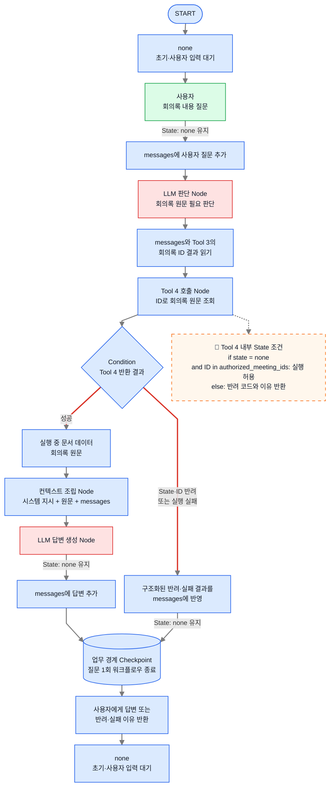

위쪽과 아래쪽의 `none`은 같은 State이며, 답변을 반환한 뒤 에이전트가 종료되지 않고 다시 사용자 입력을 기다린다는 의미로 아래쪽에 반복해서 표시한다.

1. 에이전트는 `workflow_state="none"`인 상태에서 사용자의 입력을 기다린다. 사용자가 회의록 내용에 대해 질문하면 State를 바꾸지 않고 질문만 `messages`에 추가한다.
2. Agent는 Tool 3이 반환한 회의록 ID를 읽고 Tool 4를 호출한다.
3. Tool 4가 성공하면 ID에 해당하는 회의록 원문을 가져온다. State 조건이나 `authorized_meeting_ids` 검사에 의해 반려되거나 실행에 실패하면 원문 조회와 컨텍스트 조립으로 넘기지 않고 구조화된 이유를 `messages`에 기록한다.
4. 성공한 원문은 실행 중 문서 데이터로만 사용하며 State나 Checkpoint에 누적하지 않는다.
5. 컨텍스트 조립 Node가 시스템 지시, 원문, `messages`를 최종 Model Context로 합친다.
6. 생성된 답변만 `messages`에 추가하고 `workflow_state="none"`을 유지한다.
7. 성공한 답변 또는 반려·실패 결과를 반영한 뒤 질문 1회의 Checkpoint를 남긴다. 사용자에게 답변이나 처리되지 않은 이유를 반환하고 다시 `none`에서 다음 입력을 기다린다.

하나의 Main Agent가 사용자 의도와 Tool 호출 여부를 판단하고, 오케스트레이터가 Graph 이동, State 전달, Tool 실행, 컨텍스트 조립을 제어한다. 녹화 Skill은 명시된 Trigger로 실행되며, 권한과 실제 상태·데이터 접근은 Skill·Tool이 호출하는 백엔드가 강제한다.

## Skill·Tool State 조건 핵심 설명

순서도의 점선 말풍선은 LLM이 기억해야 할 프롬프트 규칙이 아니라, 각 Skill과 Tool이 호출하는 신뢰된 백엔드가 코드로 강제하는 실행 조건이다.

| 실행 기능 | Trigger 또는 역할 | 허용 `workflow_state` | 성공 후 State |
|---|---|---|---|
| `/meeting-start` Skill | 스레드의 `회의 시작` 또는 `/meeting-start` | `none` | 실제 시작 성공 후 `recording` |
| `/meeting-pause` Skill·일시정지 버튼 | 녹화 일시정지 | `recording` | 실제 일시정지 성공 후 `pause` |
| `/meeting-resume` Skill·재개 버튼 | 녹화 재개 | `pause` | 실제 재개 성공 후 `recording` |
| `/meeting-stop` Skill·정지 버튼 | 녹화 종료 | `recording`, `pause` | 실제 종료 성공 후 `stop` |
| Tool 1 | 회의록 확정·공유 | `stop` | 성공 시 `share → none` |
| Tool 2 | 관련 회의록 후보 검색 | `none`, `get_ID`, `question` | 검색 진입 시 `search`; 기존 ID 없는 결과 없음은 `none` |
| Tool 3 | 선택한 회의록 ID 검증·반영 | `search` | 추가·대체 반영 후 `get_ID` |
| Tool 4 | 허용된 회의록 원문 조회 | `get_ID`, `question` 및 ID 허용 목록 포함 | 질문 중 `question` 유지 |

공통 처리 원칙은 다음과 같다.

```text
Trigger·버튼·Tool 호출
→ 백엔드가 State·권한·실제 리소스 상태 검사
→ 성공한 실제 동작 수행
→ 성공 이벤트 반환
→ 오케스트레이터가 State 갱신과 Checkpoint 저장
→ 대화 안내가 필요할 때만 결과를 컨텍스트에 넣어 LLM 호출
```

호출이나 버튼 클릭만으로 성공 State를 미리 기록하지 않는다. 조건 거부나 실행 실패 시에는 기존 State를 유지하고 `STATE_CONFLICT` 등의 코드와 사용자가 이해할 수 있는 반려 이유를 반환한다. 임베디드 바와 녹화 Skill은 동일한 공통 백엔드 Handler를 사용하므로 어느 진입점에서 실행해도 같은 State 조건과 성공 이벤트 규칙이 적용된다.

## 핵심 정리

- 문서 첫 부분에서는 회의 시작부터 연속 질의응답까지를 하나의 간단한 전체 워크플로우로 보여준다.
- 전체 흐름은 회의 시작·진행·확정 및 공유를 묶은 **회의 녹화 과정 Graph**와 검색·선택·질의응답을 묶은 **회의록 기반 검색 과정 Graph**로 나눈다.
- 각 상위 Graph 바로 아래에서 기존의 다섯 개 세부 다이어그램을 순서도로 끝까지 설명한 뒤 다음 Graph로 이동한다.
- 회의 녹화 과정은 완료되어 `none`으로 돌아가기 전에는 새 회의나 회의록 기반 검색 과정으로 이동할 수 없는 일방향 업무 흐름이다.
- 회의록 기반 검색 과정은 `get_ID` 또는 `question`에서 `search`로 돌아갈 수 있다. 기존 회의록 ID가 있으면 Human in the Loop로 새 ID의 추가·대체를 선택한 뒤 질의응답을 계속한다.
- 각 Skill과 Tool의 백엔드는 허용된 State를 `if` 조건으로 검사하고, 조건이 맞지 않으면 실행하지 않은 채 LLM이 사용자에게 설명할 수 있는 반려 이유를 반환한다.
- State와 Checkpoint의 상세 정의는 [[2. 회의록 에이전트 설계]]에서 다룬다.
- 권한과 실제 녹화 상태는 Skill·Tool이 호출하는 백엔드에서 강제하고, 회의록 원문은 State나 Checkpoint에 저장하지 않는다.
