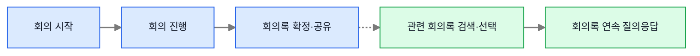
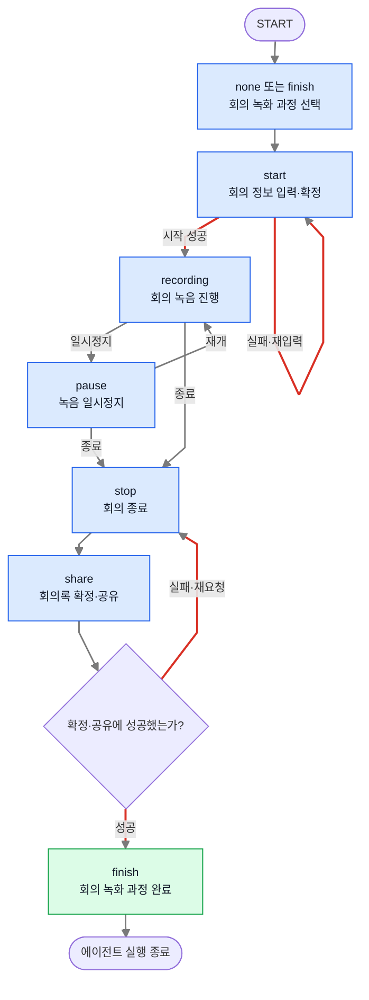
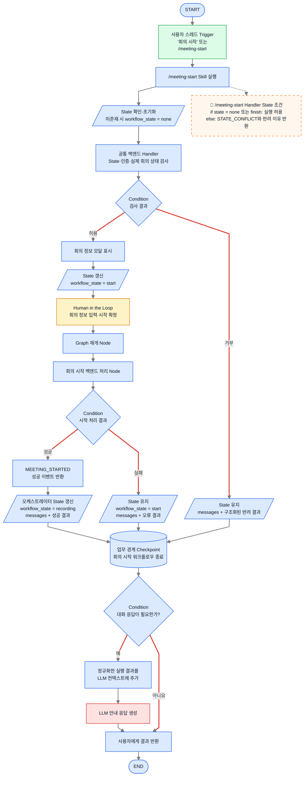
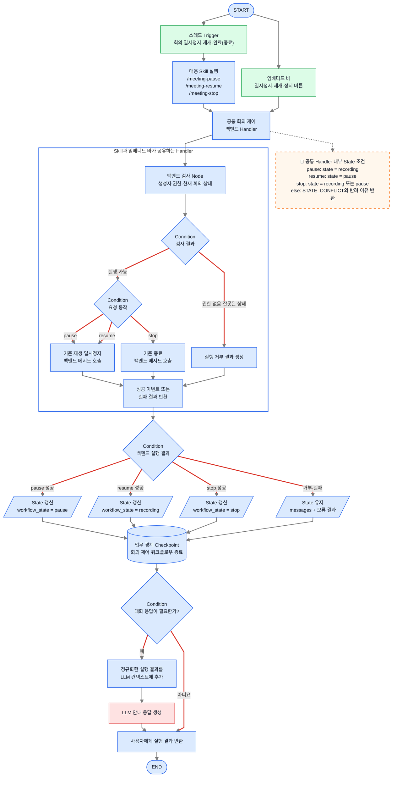
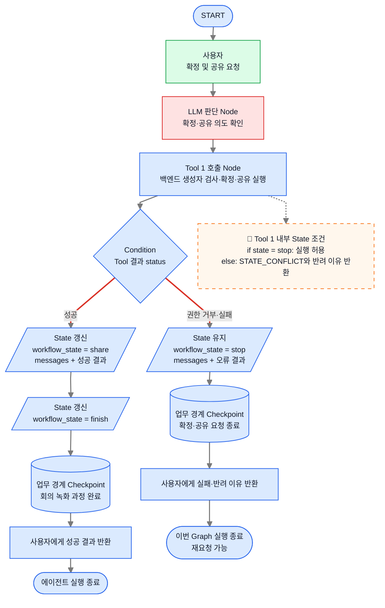
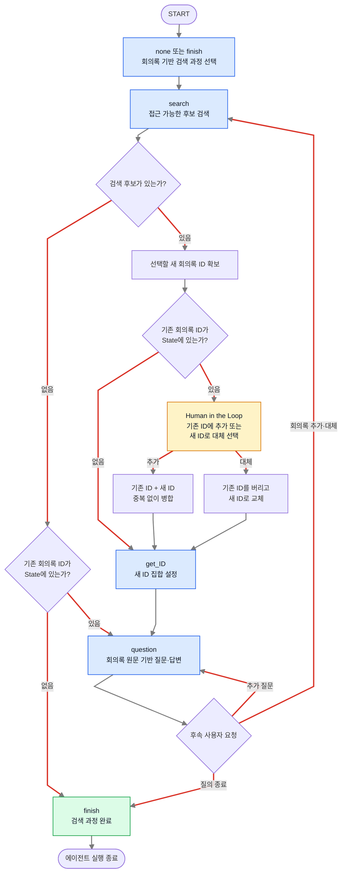
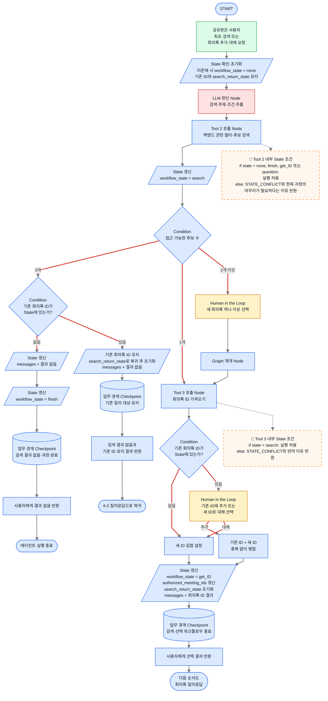
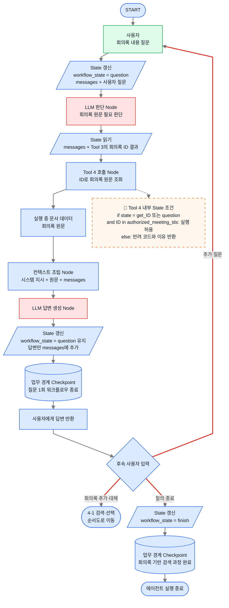

## 1. 회의록 업무 워크플로우

회의록의 **개념적인 업무 흐름 단계**를 기준으로 하여 워크플로우로 나누었다.

크게 보면
 - 회의를 **생성·진행·공유**하는 흐름
 - 공유된 회의록을 **검색·질문**하는 흐름
의 두 줄기로 나뉜다.



점선은 회의 생성·진행·공유와 회의록 검색·질의가 같은 사용자의 같은 Agent 실행으로 직접 이어지지 않음을 뜻한다. 공유받은 사용자는 자신의 전용 스레드에서 별도의 회의록 활용 과정을 시작한다.

## 2. Agent Graph와 순서도 표기 규칙

위의 전체 워크플로우를 두 개의 Agent Graph로 나눈 뒤, 각 Graph 바로 아래에서 세부 실행 과정을 순서도로 전개한다.

 - **State**: 워크플로우에서 구분해야 하는 **세부 업무 상태를 기준**으로 나눈다.
 
**설계 의도**
 - 회의 진행 과정에서는 **회의록 녹음의 상태가 주된 기준**이라고 판단하여, 시작·진행·일시정지·종료·공유의 5가지 상태로 분류한다.
 - 회의록 활용 과정에서는 **사용자가 질문 하려고 하는 회의록 정보(ID)의 상태**가 주된 기준이라고 판단하여, 후보 회의록 검색·최종 회의록 ID 결정 및 가져오기·사용자 질문의 3가지 상태로 분류한다.
 - 두 과정은 각각 **회의 녹화 과정**과 **회의록 기반 검색 과정**으로 분리되어 있다고 가정한다.
 - 두 과정의 최초 시작 시점은 `none`이며, 하나의 과정이 정상적으로 마무리되면 `finish`로 전환한다.
 - 두 과정 중 하나로 들어가는 순간 다른 과정으로는 **들어갈 수 없도록 강제 고정**한다. 예를 들어 `recording` 또는 `pause` 상태에서는 관련 회의록 검색 Tool을 실행할 수 없으며, 회의 녹화 과정이 `finish`가 된 뒤에만 새로운 회의록 기반 검색 과정을 시작할 수 있다.
 - 회의 녹화 과정은 `start → recording ↔ pause → stop → share → finish` 순서를 벗어나 새로운 회의를 시작할 수 없는 일방향 과정으로 본다. 반면 회의록 기반 검색 과정 안에서는 사용자가 질의 대상을 추가하거나 교체할 수 있도록 `get_ID` 또는 `question`에서 `search`로 다시 돌아가는 것을 허용한다.
 - `finish`는 현재 선택한 과정이 마무리되어 에이전트가 해당 실행을 끝낼 수 있는 상태다. 이후 새로운 요청이 들어오면 `finish` 상태를 확인한 뒤 새로운 과정을 시작할 수 있다.

**State 간단 예시**

```text
현재 workflow_state = recording
사용자 요청 = "지난 회의 내용을 검색해 줘"
→ 검색 Tool의 백엔드 내부 State 조건에서 실행 거부
→ "현재 회의 녹화 과정이 끝나지 않았습니다"라는 이유를 LLM에 반환

회의 종료·회의록 확정 및 공유 완료
→ workflow_state = finish
→ 이후 새로운 회의록 검색 과정 시작 가능
```

 - **Checkpoint**: 각 **워크플로우를 하나의 업무 단위**로 보고, **해당 업무가 끝나는 지점**에 둔다.
 
**설계 의도**
 각 워크플로우가 끝나는 지점에 Checkpoint를 두어, 해당 업무에서 마지막으로 확정된 State와 Skill·Tool 결과를 다음 요청이 이어받을 수 있도록 한다. Human in the Loop 중단·재개를 위한 런타임 내부 스냅샷과 업무 경계 Checkpoint는 구분한다.

**Checkpoint 간단 예시**

```text
`/meeting-pause` Skill이 호출한 백엔드 실행 성공
→ workflow_state = pause
→ 사용자에게 일시정지 결과 반환 직전에 Checkpoint 저장

이후 사용자가 재개 요청
→ 마지막 Checkpoint의 pause 상태에서 시작
→ 재개 성공 시 workflow_state = recording으로 갱신
```

State 값의 구체적인 정의와 변경 시점, Checkpoint 저장 기준은 [[2. 회의록 에이전트 설계]]에서 자세히 다루며, 이 문서에서는 Graph 흐름을 이해하는 데 필요한 값과 변경 지점만 표시한다.

| 요소 | 의미 | 그림 속 표현 |
|---|---|---|
| Node | Agent 판단, Skill 실행, Tool 호출, 백엔드 처리처럼 실제로 실행되는 한 단계 | 사각형 |
| Edge | 한 단계에서 다음 단계로 이동하는 경로 | 화살표 |
| Condition | State 또는 Skill·Tool 결과를 읽고 다음 Edge를 결정하는 단계 | 마름모 |
| State | 현재 실행에서 다음 Node로 전달되는 대화, Skill·Tool 결과, `workflow_state` | 평행사변형 |
| 업무 경계 Checkpoint | 하나의 업무 워크플로우가 끝날 때 결과 State를 영속적으로 확정하는 지점 | 원통형 |
| 실행 기능 내부 조건 주석 | Skill·Tool 백엔드가 허용하는 `workflow_state`와 반려 시 반환할 이유 | 점선으로 해당 실행 기능 옆에 연결된 말풍선형 메모 |

- **초록색**: 사용자의 호출·요청
- **노란색**: Human in the Loop 입력·선택 구간
- **빨간색 네모**: 의도·조건 해석, Tool 사용 판단, 답변 생성처럼 LLM이 판단하거나 생성하는 영역
- **파란색 네모**: Skill 실행, Tool 호출, 백엔드 검사, State 갱신, Condition 분기, 컨텍스트 조립, Checkpoint처럼 정해진 규칙에 따라 처리되는 영역
- **회색 화살표**: 정해진 다음 단계로 이동하는 단방향 Edge
- **빨간색 화살표**: Condition의 결과에 따라 갈라지는 Edge

> 권한은 LLM이나 Condition이 결정하지 않는다. Skill·Tool이 호출하는 백엔드가 권한을 검사하고, Condition은 백엔드가 반환한 성공·거부 결과에 따라 다음 응답 경로만 선택한다.

**설계 의도**
State 값 읽기나, 컨텍스트 조립과 같은 **오케스트레이터의 영역**과 조립된 컨텍스트를 통해 판단을 하는 **LLM의 영역**을 따로 나눴다.
-> LLM과 오케스트레이터의 담당 영역을 명확히 해서 **어느 부분까지를 LLM에게 판단을 맡길지**를 확실하게 해야하기 때문.

## 3. 회의 녹화 과정 Graph

회의 시작, 회의 진행, 회의록 확정·공유를 하나의 상위 Graph로 연결하면 다음과 같다. 일시정지와 재개는 `recording ↔ pause`로 반복할 수 있고, 회의록 확정·공유까지 성공하면 `finish`로 전환하여 회의 녹화 과정을 마친다.



이 상위 Graph의 각 단계를 실제로 처리하는 순서도는 아래에서 회의 시작, 회의 제어, 회의록 확정·공유 순으로 끝까지 설명한다.

### 3-1. 회의 시작 순서도

이 순서도는 회의 시작 요청을 받은 에이전트가 모달과 Human in the Loop를 거쳐 녹음을 시작하고, 그 결과를 State와 업무 경계 Checkpoint에 반영하는 구조를 나타낸다.

**설계 의도 — Skill·Tool 백엔드 내부 State 조건**

State에 따른 모든 Skill·Tool 허용·금지 조합을 시스템 프롬프트, 사전 지식 또는 Description에 자연어로 나열하지 않는다. 조건이 많아질수록 LLM이 매번 읽어야 할 컨텍스트와 토큰 사용량이 증가하고, 에이전트 종류와 기능이 늘어날 때 조건 로직의 유지보수도 어려워지기 때문이다.

대신 각 Skill과 Tool이 호출하는 확정적인 백엔드 로직이 현재 `workflow_state`를 읽고 `if` 조건으로 실행 가능 여부를 검사한다. 허용된 상태이면 기존 백엔드 기능을 실행하고, 허용되지 않은 상태이면 실행하지 않은 채 구조화된 반려 이유를 반환한다. LLM은 복잡한 상태 규칙을 모두 기억하거나 판단하지 않고, 반환된 이유를 읽어 사용자에게 현재 실행할 수 없는 이유를 설명한다.

```text
if current_state in allowed_states:
    기존 백엔드 기능 실행
else:
    실행하지 않음
    STATE_CONFLICT와 사용자에게 설명할 반려 이유 반환
```

이는 State 전체의 소유권을 Skill이나 Tool에 넘긴다는 뜻이 아니다. Graph 이동과 State 전달·갱신은 계속 오케스트레이터가 담당하고, 각 실행 기능은 자신이 실행되기 위한 State 조건 검사만 결정적으로 강제한다. 권한과 실제 리소스 상태 검사도 기존 원칙대로 공통 백엔드에서 함께 수행한다.



1. 사용자가 전용 스레드에 `회의 시작` 또는 `/meeting-start`를 입력하면 Trigger가 `/meeting-start` Skill을 실행한다.
2. 공통 백엔드 Handler는 현재 State, 인증 사용자와 실제 회의 상태를 검사한다. `none` 또는 `finish`일 때만 허용하며, 거부되면 모달을 표시하지 않고 기존 State를 유지한다.
3. 조건을 통과해 모달 표시가 성공하면 `workflow_state="start"`로 변경한다.
4. 사용자가 회의 정보를 입력하고 시작을 확정할 때까지 Human in the Loop로 중단한다.
5. Graph가 재개되어 실제 녹화 시작 백엔드가 성공 이벤트를 반환한 직후에만 오케스트레이터가 `recording`으로 변경한다. 실패하면 `start`를 유지한다.
6. 실행 결과와 State를 반영한 뒤 Checkpoint를 남긴다. 스레드에 자연어 안내가 필요하면 정규화한 결과를 컨텍스트에 넣어 LLM을 호출하고, 고정 안내만 필요하면 LLM 호출을 생략한다.

모달 대기 중 재개를 위해 필요한 State 저장은 LangGraph 런타임의 내부 스냅샷으로 처리하며, 별도의 업무 경계 Checkpoint로 표시하지 않는다.

### 3-2. 회의 재생·일시정지·종료 순서도

이 순서도는 스레드 Trigger와 임베디드 바가 각 녹화 Skill과 동일한 공통 백엔드 Handler를 통해 일시정지·재개·종료를 실행하고, 성공 이벤트가 반환된 뒤 State를 갱신하는 구조를 나타낸다.



1. 스레드의 `회의 일시정지`·`회의 재개`·`회의 완료` 또는 `회의 종료` Trigger는 각각 `/meeting-pause`, `/meeting-resume`, `/meeting-stop` Skill을 실행한다. 임베디드 바 버튼은 각 Skill과 동일한 공통 Handler로 직접 들어간다.
2. 공통 Handler가 현재 State, 생성자 권한과 백엔드의 실제 회의 상태를 검사한다.
3. `pause`와 `resume`은 기존 재생·일시정지 메서드를, `stop`은 기존 종료 메서드를 호출한다.
4. 버튼 클릭이나 Skill 호출 시점에는 State를 바꾸지 않는다. 일시정지 성공 이벤트 후 `pause`, 재개 성공 이벤트 후 `recording`, 종료 성공 이벤트 후 `stop`으로 변경한다.
5. 거부나 실패 시 기존 `workflow_state`를 유지하고 오류 결과만 기록한다.
6. 요청 1회의 결과와 State를 반영한 뒤 Checkpoint를 남긴다. 대화 응답이 필요할 때만 실행 결과를 컨텍스트에 넣어 LLM을 호출한다.

일시정지 이후의 재개는 같은 Graph가 계속 실행되는 방식이 아니다. 일시정지 워크플로우가 끝난 뒤 재개 Trigger 또는 버튼 이벤트가 들어오면 이 Graph가 새로 실행되고 기존 `pause` 상태에서 `/meeting-resume`과 같은 공통 Handler 경로를 처리한다.

### 3-3. 회의록 확정·공유 순서도

이 순서도는 회의록 확정·공유 요청에 대해 백엔드가 생성자 권한을 검사하고, 성공 여부에 따라 State를 갱신하는 구조를 나타낸다.



1. 사용자가 확정·공유를 요청하면 Agent가 Tool 1을 호출한다.
2. 백엔드가 생성자 권한을 검사하고, 권한이 있으면 회의록을 확정해 지정된 채널에 공유한다.
3. 성공하면 `workflow_state`를 `share`로 변경한 뒤, 회의 녹화 과정 전체가 끝났음을 나타내는 `finish`로 전환한다.
4. 권한 거부나 실패 시 이전 상태를 유지하고 오류 결과를 기록한다.
5. 성공한 `finish` State를 업무 경계 Checkpoint에 남기고 사용자에게 결과를 반환한 뒤 에이전트 실행을 종료한다. 실패 시에는 `stop`을 유지한 Checkpoint를 남기므로 사용자가 다시 확정·공유를 요청할 수 있다.

## 4. 회의록 기반 검색 과정 Graph

관련 회의록 검색·선택과 연속 질의응답을 하나의 상위 Graph로 연결하면 다음과 같다. 검색 결과가 없거나 사용자가 질의를 마치면 `finish`로 전환하고, 회의록 ID가 확정되면 같은 회의록 집합을 대상으로 `question` 상태를 반복한다. 질의 도중 회의록을 더 추가하거나 완전히 다른 회의록 집합으로 교체하려는 요청이 들어오면 `search`로 돌아간다.



이 상위 Graph의 각 단계를 실제로 처리하는 순서도는 아래에서 관련 회의록 검색·선택, 회의록 원문 조회·컨텍스트 조립·답변 순으로 끝까지 설명한다.

### 4-1. 관련 회의록 검색·선택 순서도

이 순서도는 접근 가능한 회의록 후보를 검색하고, 후보 수에 따라 자동 선택 또는 Human in the Loop를 거쳐 질의 대상 회의록 ID를 확정하는 구조를 나타낸다. 이미 질의 중인 회의록 ID가 있다면 새 ID를 기존 집합에 추가할지, 새 집합으로 대체할지를 다시 Human in the Loop로 선택한다.



1. 공유받은 사용자가 최초로 관련 회의록을 요청하거나, 질의 도중 회의록을 추가·대체해 달라고 요청하면 검색·선택 Graph 실행이 시작된다.
2. 요청 직후 State를 확인하고, State가 없으면 `workflow_state="none"`으로 초기화한다. 기존 `authorized_meeting_ids`가 있다면 추가·대체가 확정될 때까지 지우지 않고, 재검색 직전의 `get_ID` 또는 `question`을 `search_return_state`에 보존한다. Tool 2는 현재 상태가 `none`, `finish`, `get_ID`, `question` 중 하나일 때 검색을 허용하며, 조건을 통과하면 `search`로 변경한다.
3. Tool 2는 사용자가 생성자·참여자·공유 대상자인 회의록만 반환한다.
4. 후보가 0개이고 기존 ID도 없다면 결과 없음 메시지를 만든 뒤 `finish`로 변경하여 이번 회의록 기반 검색 과정을 마친다. 기존 ID가 있다면 이를 지우지 않고 `search_return_state`의 `get_ID` 또는 `question`으로 복귀하여 기존 회의록에 대한 질의를 계속할 수 있게 한다. 복귀 후 `search_return_state`는 비운다.
5. 후보가 1개이면 Tool 3이 새 ID를 바로 가져오고, 2개 이상이면 Human in the Loop로 새 회의록을 하나 이상 선택한 뒤 가져온다.
6. 기존 ID가 없다면 새 ID 집합을 그대로 설정한다. 기존 ID가 있다면 Human in the Loop로 **기존 ID에 추가** 또는 **새 ID로 대체**를 선택한다. 추가 시에는 중복을 제거해 병합하고, 대체 시에는 기존 ID를 새 ID 집합으로 교체한다.
7. 최종 ID 집합이 확정되면 `authorized_meeting_ids`를 갱신하고 `workflow_state="get_ID"`로 변경한 뒤 ID 결과를 `messages`에 추가하고 `search_return_state`를 비운다.
8. 후보가 없고 기존 ID도 없으면 `finish` State를 Checkpoint에 남기고 에이전트 실행을 종료한다. 기존 ID를 유지하거나 새 ID 집합이 확정되면 해당 State를 Checkpoint에 남긴 뒤 회의록 질의응답 순서도로 이어진다.

후보 회의록 선택과 기존 ID의 추가·대체 선택에 사용되는 Human in the Loop의 중단·재개 저장은 런타임 내부 스냅샷으로 처리하고, 선택 대기 지점에는 별도의 업무 경계 Checkpoint를 표시하지 않는다.

### 4-2. 회의록 원문 조회·컨텍스트 조립·답변 순서도

이 순서도는 확정된 회의록 ID로 원문을 조회하고, 원문과 대화 이력을 Model Context로 조립하여 사용자의 질문에 답하는 구조를 나타낸다.



1. 사용자가 회의록 내용에 대해 질문하면 `workflow_state`를 `question`으로 변경하고 질문을 `messages`에 추가한다.
2. Agent는 Tool 3이 반환한 회의록 ID를 읽고 Tool 4를 호출한다.
3. Tool 4는 ID에 해당하는 회의록 원문을 필요한 시점에 가져온다.
4. 원문은 실행 중 문서 데이터로만 사용하며 State나 Checkpoint에 누적하지 않는다.
5. 컨텍스트 조립 Node가 시스템 지시, 원문, `messages`를 최종 Model Context로 합친다.
6. 답변만 `messages`에 추가하고 `question` 상태를 유지한다.
7. 질문 1회가 끝나는 지점에서 Checkpoint를 남긴 뒤 답변을 반환한다.
8. 추가 질문에서는 같은 ID로 원문을 다시 가져오며 `question → question` 흐름을 반복한다.
9. 사용자가 회의록을 더 추가하거나 기존 회의록 집합을 새 회의록으로 대체해 달라고 요청하면 `finish`로 종료하지 않고 4-1 검색·선택 순서도로 돌아간다. 새 ID 집합을 확정한 뒤 다시 이 순서도로 복귀하여 연속 질의응답을 이어간다.
10. 사용자가 질의를 마치면 `workflow_state`를 `finish`로 변경하고 마지막 업무 경계 Checkpoint를 남긴 뒤 에이전트 실행을 종료한다.

하나의 Main Agent가 사용자 의도와 Tool 호출 여부를 판단하고, 오케스트레이터가 Graph 이동, State 전달, Tool 실행, 컨텍스트 조립을 제어한다. 녹화 Skill은 명시된 Trigger로 실행되며, 권한과 실제 상태·데이터 접근은 Skill·Tool이 호출하는 백엔드가 강제한다.

## Skill·Tool State 조건 핵심 설명

순서도의 점선 말풍선은 LLM이 기억해야 할 프롬프트 규칙이 아니라, 각 Skill과 Tool이 호출하는 신뢰된 백엔드가 코드로 강제하는 실행 조건이다.

| 실행 기능 | Trigger 또는 역할 | 허용 `workflow_state` | 성공 후 State |
|---|---|---|---|
| `/meeting-start` Skill | 스레드의 `회의 시작` 또는 `/meeting-start` | `none`, `finish` | 모달 표시 후 `start`, 실제 시작 성공 후 `recording` |
| `/meeting-pause` Skill·일시정지 버튼 | 녹화 일시정지 | `recording` | 실제 일시정지 성공 후 `pause` |
| `/meeting-resume` Skill·재개 버튼 | 녹화 재개 | `pause` | 실제 재개 성공 후 `recording` |
| `/meeting-stop` Skill·정지 버튼 | 녹화 종료 | `recording`, `pause` | 실제 종료 성공 후 `stop` |
| Tool 1 | 회의록 확정·공유 | `stop` | 성공 시 `share → finish` |
| Tool 2 | 관련 회의록 후보 검색 | `none`, `finish`, `get_ID`, `question` | 검색 진입 시 `search`; 기존 ID 없는 결과 없음은 `finish` |
| Tool 3 | 선택한 회의록 ID 검증·반영 | `search` | 추가·대체 반영 후 `get_ID` |
| Tool 4 | 허용된 회의록 원문 조회 | `get_ID`, `question` 및 ID 허용 목록 포함 | 질문 중 `question` 유지 |

공통 처리 원칙은 다음과 같다.

```text
Trigger·버튼·Tool 호출
→ 백엔드가 State·권한·실제 리소스 상태 검사
→ 성공한 실제 동작 수행
→ 성공 이벤트 반환
→ 오케스트레이터가 State 갱신과 Checkpoint 저장
→ 대화 안내가 필요할 때만 결과를 컨텍스트에 넣어 LLM 호출
```

호출이나 버튼 클릭만으로 성공 State를 미리 기록하지 않는다. 조건 거부나 실행 실패 시에는 기존 State를 유지하고 `STATE_CONFLICT` 등의 코드와 사용자가 이해할 수 있는 반려 이유를 반환한다. 임베디드 바와 녹화 Skill은 동일한 공통 백엔드 Handler를 사용하므로 어느 진입점에서 실행해도 같은 State 조건과 성공 이벤트 규칙이 적용된다.

## 핵심 정리

- 문서 첫 부분에서는 회의 시작부터 연속 질의응답까지를 하나의 간단한 전체 워크플로우로 보여준다.
- 전체 흐름은 회의 시작·진행·확정 및 공유를 묶은 **회의 녹화 과정 Graph**와 검색·선택·질의응답을 묶은 **회의록 기반 검색 과정 Graph**로 나눈다.
- 각 상위 Graph 바로 아래에서 기존의 다섯 개 세부 다이어그램을 순서도로 끝까지 설명한 뒤 다음 Graph로 이동한다.
- 회의 녹화 과정은 `finish`가 되기 전에는 새 회의나 회의록 기반 검색 과정으로 이동할 수 없는 일방향 업무 흐름이다.
- 회의록 기반 검색 과정은 `get_ID` 또는 `question`에서 `search`로 돌아갈 수 있다. 기존 회의록 ID가 있으면 Human in the Loop로 새 ID의 추가·대체를 선택한 뒤 질의응답을 계속한다.
- 각 Skill과 Tool의 백엔드는 허용된 State를 `if` 조건으로 검사하고, 조건이 맞지 않으면 실행하지 않은 채 LLM이 사용자에게 설명할 수 있는 반려 이유를 반환한다.
- State와 Checkpoint의 상세 정의는 [[2. 회의록 에이전트 설계]]에서 다룬다.
- 권한과 실제 녹화 상태는 Skill·Tool이 호출하는 백엔드에서 강제하고, 회의록 원문은 State나 Checkpoint에 저장하지 않는다.
