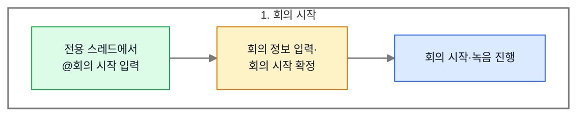
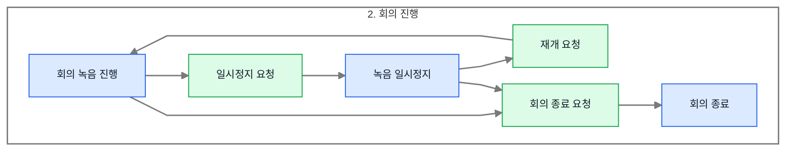
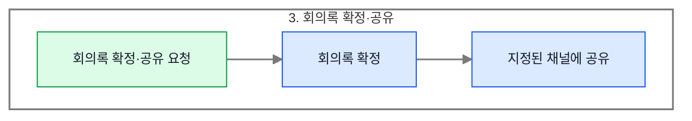
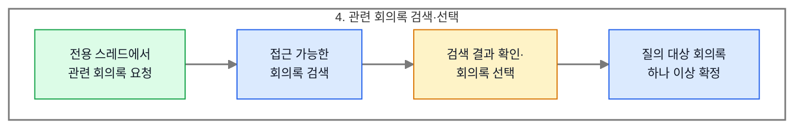
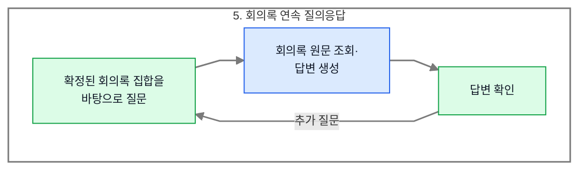
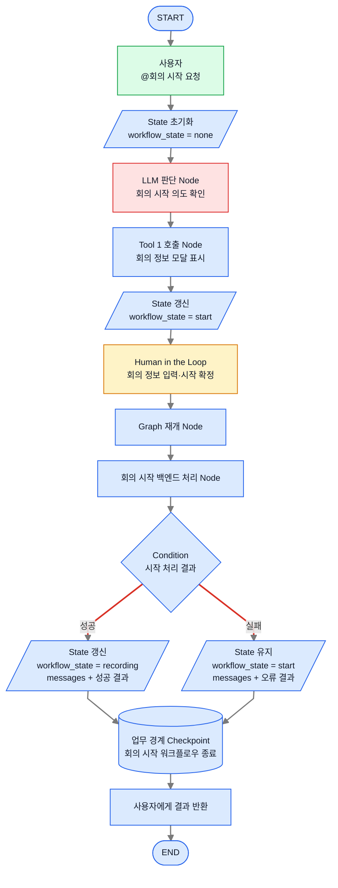
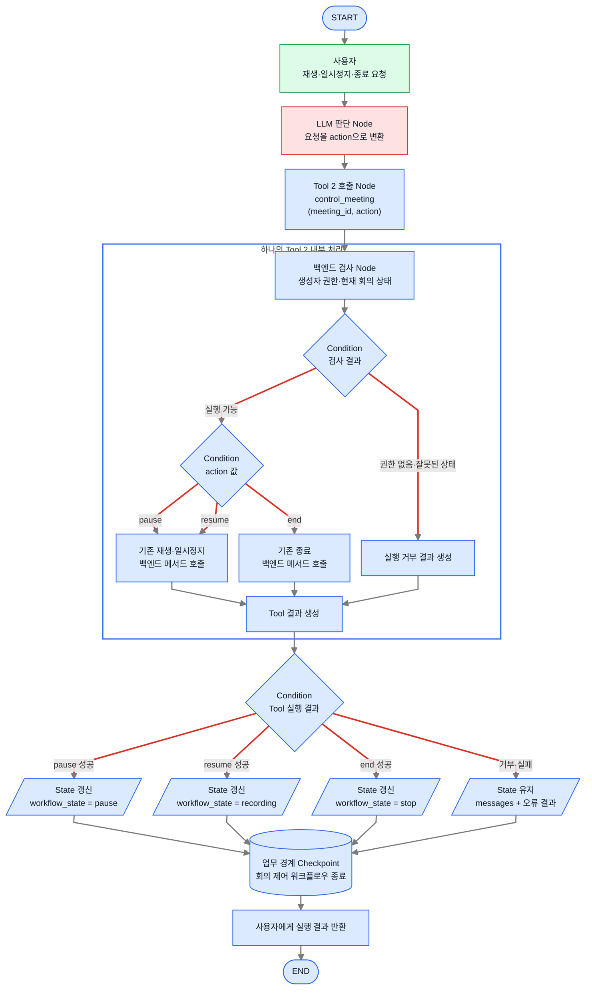
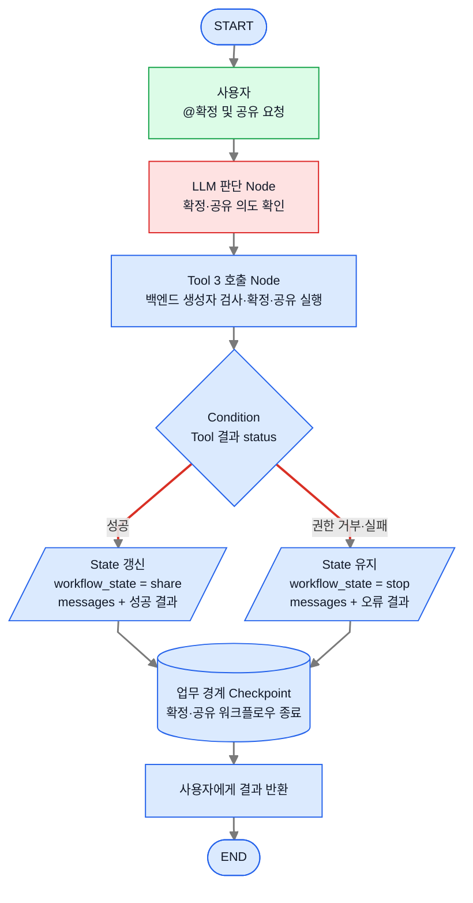
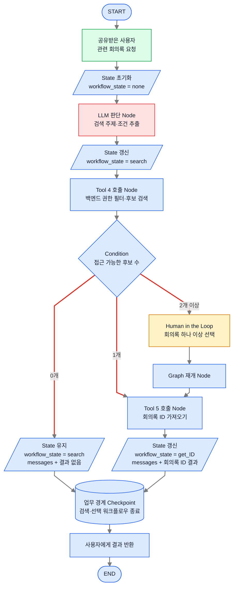
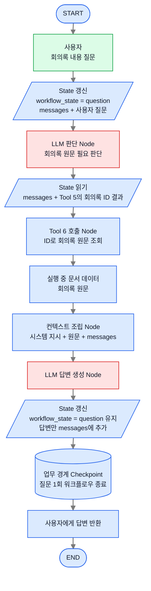

## 1. 회의록 업무 워크플로우

회의록의 **개념적인 업무 흐름 단계**를 기준으로 하여 워크플로우로 나누었다.

크게 보면
 - 회의를 **생성·진행·공유**하는 흐름
 - 공유된 회의록을 **검색·질문**하는 흐름
의 두 줄기로 나뉜다.

### 1-1. 회의 시작 워크플로우

이 워크플로우는 사용자가 회의 시작을 요청한 뒤 회의 정보를 확정하고 실제 녹음을 시작하기까지의 업무를 나타낸다.

1. 사용자가 회의 에이전트 전용 스레드에서 `@회의 시작`을 입력한다.
2. 모달에 회의 정보를 입력하고 회의 시작을 확정한다.
3. 회의가 시작되고 녹음이 진행된다.

### 1-2. 회의 진행 워크플로우

이 워크플로우는 녹음 중인 회의를 필요에 따라 일시정지·재개하고 최종적으로 종료하기까지의 업무를 나타낸다.

1. 회의 중 사용자는 필요할 때 녹음을 일시정지한다.
2. 재개를 요청하면 녹음 상태로 돌아간다.
3. 녹음 중이거나 일시정지 상태에서 종료를 요청하면 회의가 종료된다.

### 1-3. 회의록 확정·공유 워크플로우

이 워크플로우는 종료된 회의에서 생성된 회의록을 사람이 확정하고 지정된 채널에 공유하는 업무를 나타낸다.

1. 회의 생성자가 만들어진 회의록의 확정·공유를 요청한다.
2. 회의록이 확정된 뒤 지정된 채널에 공유된다.

### 1-4. 관련 회의록 검색·선택 워크플로우

이 워크플로우는 사용자의 조건에 맞고 접근 권한이 있는 회의록을 검색한 뒤, 질의에 사용할 회의록을 선택·확정하는 업무를 나타낸다.

1. 공유받은 사용자가 자신의 회의 에이전트 전용 스레드에서 주제나 날짜 등의 조건으로 관련 회의록을 요청한다.
2. 권한이 있는 회의록만 검색 결과로 제공된다.
3. 사용자가 필요한 회의록을 하나 이상 선택하면 이후 질의에 사용할 회의록 ID가 확정된다.

### 1-5. 회의록 연속 질의응답 워크플로우

이 워크플로우는 확정된 회의록 집합을 유지하면서 그 내용을 질문하고 후속 질문을 연속해서 이어가는 업무를 나타낸다.

1. 사용자는 앞에서 확정한 회의록 집합을 바탕으로 질문한다.
2. 에이전트는 필요한 회의록 원문을 조회해 답변한다.
3. 이후에는 회의록을 다시 선택하지 않고 같은 회의록 집합을 바탕으로 추가 질문을 이어간다.

## 2. Agent Graph 표기 규칙

위 워크플로우들에 대해서 에이전트가 실행하는 Graph로 나타낸다.

 - **State**: 워크플로우에서 구분해야 하는 **세부 업무 상태를 기준**으로 나눈다.
 
**설계 의도**
 - 회의 진행 과정에서는 **회의록 녹음의 상태가 주된 기준**이라고 판단하여, 시작·진행·일시정지·종료·공유의 5가지의 상태로 분류한다.
 - 회의록 활용 과정에서는 **사용자가 질문 하려고 하는 회의록 정보(ID)의 상태**가 주된 기준이라고 판단하여, 후보 회의록 검색·최종 회의록 ID 결정 및 가져오기·사용자 질문의 3가지 상태로 분류한다.
 - 그리고 두 과정의 최초 시작 시점에서는 아직 none으로 시작한다.
 - 두 과정 중 하나로 들어가는 순간 다른 과정으로는 **들어갈 수 없도록 강제 고정** 된다.

 - **Checkpoint**: 각 **워크플로우를 하나의 업무 단위**로 보고, **해당 업무가 끝나는 지점**에 둔다.
 
**설계 의도**
 각 워크 플로우가 끝나는 지점에 Checkpoint를 둬서 

State 값의 구체적인 정의와 변경 시점, Checkpoint 저장 기준은 [[2. 회의록 에이전트 설계]]에서 자세히 다루며, 이 문서에서는 Graph 흐름을 이해하는 데 필요한 값과 변경 지점만 표시한다.

| 요소 | 의미 | 그림 속 표현 |
|---|---|---|
| Node | Agent 판단, Tool 호출, 백엔드 처리처럼 실제로 실행되는 한 단계 | 사각형 |
| Edge | 한 단계에서 다음 단계로 이동하는 경로 | 화살표 |
| Condition | State 또는 Tool 결과를 읽고 다음 Edge를 결정하는 단계 | 마름모 |
| State | 현재 실행에서 다음 Node로 전달되는 대화, Tool 결과, `workflow_state` | 평행사변형 |
| 업무 경계 Checkpoint | 하나의 업무 워크플로우가 끝날 때 결과 State를 영속적으로 확정하는 지점 | 원통형 |

- **초록색**: 사용자의 호출·요청
- **노란색**: Human in the Loop 입력·선택 구간
- **빨간색 네모**: 의도·조건 해석, Tool 사용 판단, 답변 생성처럼 LLM이 판단하거나 생성하는 영역
- **파란색 네모**: Tool 호출, 백엔드 검사, State 갱신, Condition 분기, 컨텍스트 조립, Checkpoint처럼 정해진 규칙에 따라 오케스트레이터가 처리하는 영역
- **회색 화살표**: 정해진 다음 단계로 이동하는 단방향 Edge
- **빨간색 화살표**: Condition의 결과에 따라 갈라지는 Edge

> 권한은 LLM이나 Condition이 결정하지 않는다. Tool의 백엔드가 권한을 검사하고, Condition은 백엔드가 반환한 성공·거부 결과에 따라 다음 응답 경로만 선택한다.

**설계 의도**
State 값 읽기나, 컨텍스트 조립과 같은 **오케스트레이터의 영역**과 조립된 컨텍스트를 통해 판단을 하는 **LLM의 영역**을 따로 나눴다.
-> LLM과 오케스트레이터의 담당 영역을 명확히 해서 **어느 부분까지를 LLM에게 판단을 맡길지**를 확실하게 해야하기 때문.
## 3. 회의 시작 Graph

이 Graph는 회의 시작 요청을 받은 에이전트가 모달과 Human in the Loop를 거쳐 녹음을 시작하고, 그 결과를 State와 업무 경계 Checkpoint에 반영하는 구조를 나타낸다.

1. 사용자가 `@회의 시작`을 입력하면 회의 에이전트의 Graph 실행이 시작된다.
2. 요청 직후 State를 생성하고 `workflow_state="none"`으로 초기화한 뒤, Agent가 회의 시작 의도를 확인하고 Tool 1로 모달을 표시한다.
3. 모달이 표시된 시점에 `workflow_state`를 `start`로 변경한다.
4. 사용자가 회의 정보를 입력하고 시작을 확정할 때까지 Human in the Loop로 중단한다.
5. Graph가 재개되어 백엔드 처리가 성공하면 `recording`으로 변경하고, 실패하면 `start`를 유지한다.
6. 성공 또는 실패 결과를 `messages`에 추가하고 워크플로우 끝에서 한 번 Checkpoint를 남긴다.

모달 대기 중 재개를 위해 필요한 State 저장은 LangGraph 런타임의 내부 스냅샷으로 처리하며, 별도의 업무 경계 Checkpoint로 표시하지 않는다.

## 4. 회의 재생·일시정지·종료 Graph

이 Graph는 에이전트가 사용자의 회의 제어 요청을 구분하고, 하나의 Tool 안에서 권한·현재 상태를 검사한 뒤 일시정지·재개·종료를 실행하는 구조를 나타낸다.

1. Agent가 요청을 `pause`, `resume`, `end` 중 하나의 `action`으로 변환한다.
2. 하나의 `control_meeting` Tool 내부 백엔드가 생성자 권한과 현재 회의 상태를 검사한다.
3. `pause`와 `resume`은 기존 재생·일시정지 메서드를, `end`는 기존 종료 메서드를 호출한다.
4. 일시정지 성공 시 `pause`, 재개 성공 시 `recording`, 종료 성공 시 `stop`으로 변경한다.
5. 거부나 실패 시 기존 `workflow_state`를 유지하고 오류 결과만 기록한다.
6. 요청 1회의 처리가 끝나는 지점에서 Checkpoint를 한 번 남긴다.

일시정지 이후의 재개는 같은 Graph가 계속 실행되는 방식이 아니다. 일시정지 워크플로우가 끝난 뒤 재개 요청이 들어오면 이 Graph가 새로 실행되고 기존 `pause` 상태에서 `action="resume"`을 처리한다.

## 5. 회의록 확정·공유 Graph

이 Graph는 회의록 확정·공유 요청에 대해 백엔드가 생성자 권한을 검사하고, 성공 여부에 따라 State를 갱신하는 구조를 나타낸다.

1. 사용자가 확정·공유를 요청하면 Agent가 Tool 3을 호출한다.
2. 백엔드가 생성자 권한을 검사하고, 권한이 있으면 회의록을 확정해 지정된 채널에 공유한다.
3. 성공하면 `workflow_state`를 `share`로 변경한다.
4. 권한 거부나 실패 시 이전 상태를 유지하고 오류 결과를 기록한다.
5. 결과를 업무 경계 Checkpoint에 남긴 뒤 반환한다.

## 6. 관련 회의록 검색·선택 Graph

이 Graph는 접근 가능한 회의록 후보를 검색하고, 후보 수에 따라 자동 선택 또는 Human in the Loop를 거쳐 질의 대상 회의록 ID를 확정하는 구조를 나타낸다.

1. 공유받은 사용자가 관련 회의록을 요청하면 회의 에이전트의 Graph 실행이 시작된다.
2. 요청 직후 State를 생성하고 `workflow_state="none"`으로 초기화한 뒤, 검색 조건을 추출하고 `search`로 변경한다.
3. Tool 4는 사용자가 생성자·참여자·공유 대상자인 회의록만 반환한다.
4. 후보가 0개이면 `search`를 유지하고 결과 없음 메시지를 만든다.
5. 후보가 1개이면 Tool 5가 ID를 바로 가져오고, 2개 이상이면 Human in the Loop로 하나 이상 선택한 뒤 가져온다.
6. ID가 확정되면 `get_ID`로 변경하고 ID 결과를 `messages`에 추가한다.
7. 결과를 워크플로우 끝의 Checkpoint에 남긴 뒤 반환한다.

Human in the Loop의 중단·재개를 위한 저장은 런타임 내부 스냅샷으로 처리하고, 선택 대기 지점에는 별도의 업무 경계 Checkpoint를 표시하지 않는다.

## 7. 회의록 원문 조회·컨텍스트 조립·답변 Graph

이 Graph는 확정된 회의록 ID로 원문을 조회하고, 원문과 대화 이력을 Model Context로 조립하여 사용자의 질문에 답하는 구조를 나타낸다.

1. 사용자가 회의록 내용에 대해 질문하면 `workflow_state`를 `question`으로 변경하고 질문을 `messages`에 추가한다.
2. Agent는 Tool 5가 반환한 회의록 ID를 읽고 Tool 6을 호출한다.
3. Tool 6은 ID에 해당하는 회의록 원문을 필요한 시점에 가져온다.
4. 원문은 실행 중 문서 데이터로만 사용하며 State나 Checkpoint에 누적하지 않는다.
5. 컨텍스트 조립 Node가 시스템 지시, 원문, `messages`를 최종 Model Context로 합친다.
6. 답변만 `messages`에 추가하고 `question` 상태를 유지한다.
7. 질문 1회가 끝나는 지점에서 Checkpoint를 남긴 뒤 답변을 반환한다.
8. 추가 질문에서는 같은 ID로 원문을 다시 가져오며 `question → question` 흐름을 반복한다.

하나의 Main Agent가 사용자 의도와 Tool 호출 여부를 판단하고, 오케스트레이터가 Graph 이동, State 전달, Tool 실행, 컨텍스트 조립을 제어한다. 권한과 실제 데이터 접근은 각 Tool의 백엔드가 강제한다.

## 핵심 정리

- 업무 흐름은 회의 시작, 회의 진행, 확정·공유, 검색·선택, 연속 질의응답의 다섯 개 다이어그램으로 분리한다.
- 각 Graph 앞에는 해당 Graph가 어떤 업무를 구현하는지 한두 문장으로 먼저 설명한다.
- State와 Checkpoint의 상세 정의는 [[2. 회의록 에이전트 설계]]에서 다룬다.
- 권한은 Tool의 백엔드에서 강제하고, 회의록 원문은 State나 Checkpoint에 저장하지 않는다.
