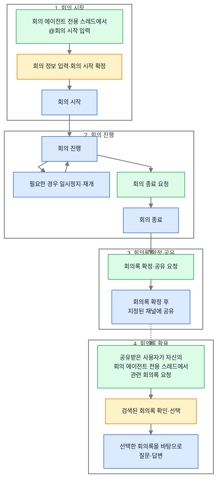
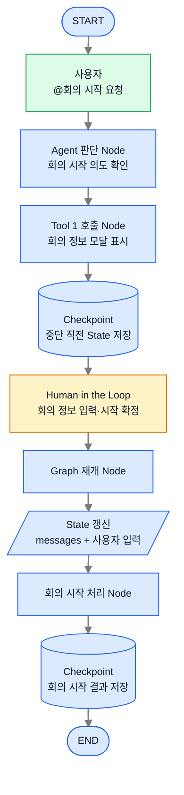
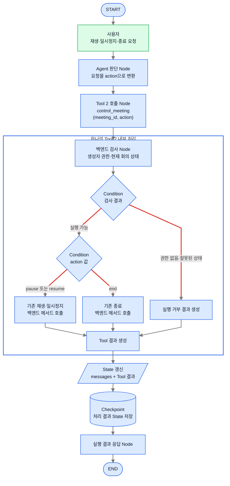
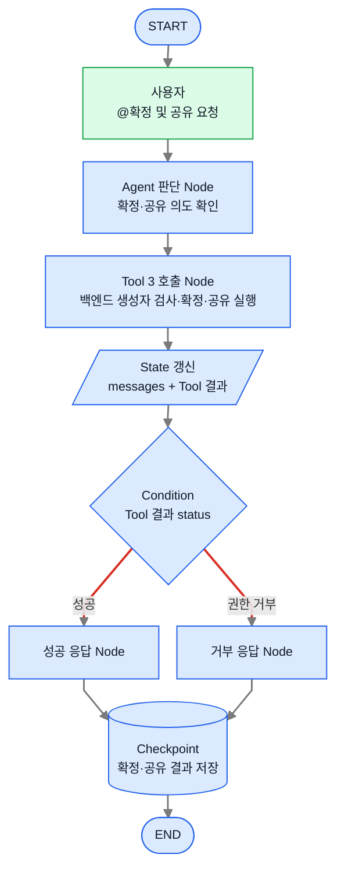
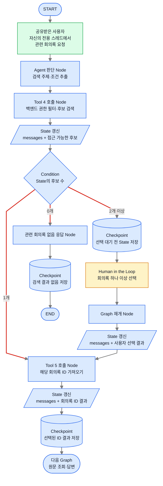
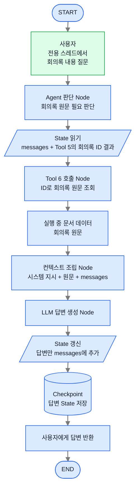
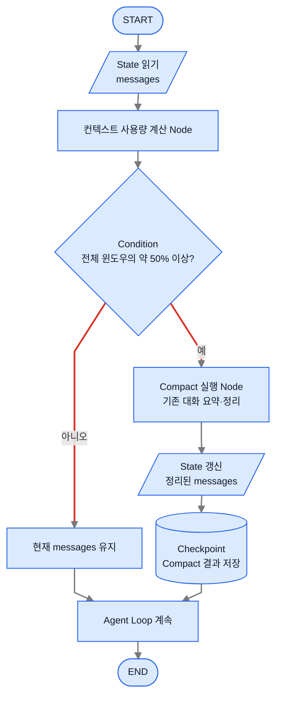

# 회의록 에이전트 워크플로우와 Graph

이 문서는 먼저 회의록 업무 자체의 흐름을 보여준다. 그다음 각 업무를 에이전트가 실행할 때의 구조를 Node, Edge, Condition, State, Checkpoint 단위로 나누어 표현한다.

## 1. 회의록 업무 워크플로우

다음 그림은 Agent Graph의 구현 구조가 아니다. 사용자가 회의를 시작하고, 회의록을 확정·공유하고, 공유된 회의록을 다시 활용하기까지의 **업무 흐름 자체**를 나타낸다.

### 업무 흐름 설명

1. 사용자는 이미 생성된 회의 에이전트 전용 스레드에서 `@회의 시작`을 입력하고, 회의 정보를 입력한 뒤 회의 시작을 확정한다.
2. 회의가 시작되며, 필요한 경우 일시정지와 재개를 거쳐 회의를 진행한다.
3. 사용자가 종료를 요청하면 회의가 종료된다.
4. 사용자가 만들어진 회의록을 확정·공유하면 지정된 채널에 회의록이 공유된다.
5. 공유받은 사용자는 회의 에이전트를 호출해 생성된 자신의 전용 스레드에서 주제나 날짜 등의 조건으로 관련 회의록을 요청한다.
6. 검색 결과를 확인하고 필요한 회의록을 선택한다.
7. 선택한 회의록을 바탕으로 질문하고 답변을 받는다.

1~4단계의 회의 생성·진행·공유와 5~7단계의 공유 회의록 활용은 같은 사용자의 같은 스레드에서 이어지는 하나의 Agent 실행을 뜻하지 않는다. 공유받은 사용자는 기존 상위 시스템을 통해 회의 에이전트를 별도로 호출하고, 그 호출 채팅을 루트로 생성된 자신의 전용 스레드에서 회의록 검색과 질의를 시작한다.

## 2. Agent Graph 표기 규칙

이하의 그림부터는 위 업무들을 에이전트가 실행하는 내부 Graph를 나타낸다.

### 구성 요소

| 요소 | 의미 | 그림 속 표현 |
|---|---|---|
| Node | Agent 판단, Tool 호출, 백엔드 처리처럼 실제로 실행되는 한 단계 | 사각형 |
| Edge | 한 단계에서 다음 단계로 이동하는 경로 | 화살표 |
| Condition | State 또는 Tool 결과를 읽고 다음 Edge를 결정하는 단계 | 마름모 |
| State | 현재 실행에서 다음 Node로 전달되는 대화와 Tool 결과 | 평행사변형 |
| Checkpoint | 중단·재개 또는 장애 복구를 위해 현재 State를 영속적으로 저장한 시점 | 원통형 |

### 색상과 Edge

- **초록색**: 사용자의 호출·요청
- **노란색**: Human in the Loop 입력·선택 구간
- **파란색**: Agent 판단, Tool 호출, 백엔드 검사, State 처리, Checkpoint 등 내부 처리
- **회색 화살표**: 정해진 다음 단계로 이동하는 단방향 Edge
- **빨간색 화살표**: Condition의 결과에 따라 갈라지는 Edge

> 권한은 LLM이나 Condition이 결정하지 않는다. Tool의 백엔드가 권한을 검사하고, Condition은 백엔드가 반환한 성공·거부 결과에 따라 다음 화면이나 응답 경로만 선택한다.

회의 에이전트를 에이전트 탭에서 생성·등록하고 채널에 공유하여, 호출 채팅을 루트로 한 전용 스레드 세션을 만드는 과정은 이미 구축된 상위 시스템의 동작이다. 이 과정은 회의를 시작하는 사용자와 공유된 회의록을 활용하는 사용자에게 동일하게 적용된다. 따라서 이 문서의 Agent Graph에는 에이전트 호출과 스레드 생성 과정을 포함하지 않으며, 준비된 각 사용자의 전용 스레드에서 `@회의 시작` 또는 회의록 검색·질의 요청이 입력되는 시점부터 다룬다.

## 3. 회의 시작 Graph

### Graph 흐름 설명

1. 사용자가 회의 에이전트 전용 스레드에서 `@회의 시작`을 입력하면 Agent 판단 Node가 의도를 확인한다.
2. Tool 1 호출 Node가 현재 채널 정보를 기본값으로 포함한 모달을 표시한다.
3. Human in the Loop로 중단하기 직전의 State를 Checkpoint에 저장한다.
4. 사용자가 회의 정보를 입력하고 회의 시작을 확정할 때까지 Graph가 멈춘다.
5. 사용자 입력과 함께 Graph를 재개하고 State의 `messages`에 입력 결과를 반영한다.
6. 회의 시작 처리를 실행하고 그 결과가 반영된 State를 다시 Checkpoint에 저장한다.

이 Graph에는 경로를 나누는 Condition이 없으므로 모든 Edge가 회색이다. 회의 시작의 사용자 진입점은 전용 스레드의 `@회의 시작`으로 확정하며, 모달 표시 단계를 Tool과 결정적 Node 중 어느 형태로 구현할지는 구현 단계에서 결정한다.

## 4. 회의 재생·일시정지·종료 Graph

### Graph 흐름 설명

1. 사용자가 회의 재생, 일시정지 또는 종료를 요청한다.
2. Agent 판단 Node가 요청을 `pause`, `resume`, `end` 중 하나의 `action` 값으로 변환한다.
3. Agent는 `meeting_id`와 `action`을 입력값으로 하나의 `control_meeting` Tool을 호출한다.
4. Tool 내부 백엔드는 현재 사용자의 생성자 권한과 현재 회의 상태를 검사한다.
5. 권한이 없거나 현재 상태에서 실행할 수 없는 요청이면 메서드를 호출하지 않고 거부 결과를 만든다.
6. 실행할 수 있으면 `action` 값을 확인한다.
7. `pause` 또는 `resume`이면 기존 재생·일시정지 백엔드 메서드를 호출한다.
8. `end`이면 기존 종료 백엔드 메서드를 호출한다.
9. 실행 또는 거부 결과를 하나의 Tool 결과로 만들고 State의 `messages`에 추가한다.
10. 처리 결과가 포함된 State를 Checkpoint에 저장하고 사용자에게 결과를 반환한다.

검사 결과와 `action` 값에 따라 나뉘는 Edge만 빨간색이다. 권한과 현재 상태 검사는 LLM이 아니라 하나의 Tool 내부 백엔드가 강제한다.

일시정지 이후의 재개는 같은 Graph 실행이 계속 도는 방식이 아니다. 일시정지 요청의 Graph가 끝난 뒤, 사용자가 나중에 재생을 요청하면 이 Graph가 새로 실행되고 `action="resume"`으로 같은 Tool을 호출한다. 업무 워크플로우에서 보이는 일시정지·재개 Loop는 이 두 번의 Graph 실행을 업무 관점에서 이어서 표현한 것이다.

## 5. 회의록 확정·공유 Graph

### Graph 흐름 설명

1. 사용자가 회의록 확정 및 공유를 요청한다.
2. Agent 판단 Node가 요청 의도를 확인하고 Tool 3을 호출한다.
3. Tool 3의 백엔드는 사용자의 생성자 권한을 검사한다. 권한이 있으면 Tool 내부에서 회의록을 확정하고 지정된 채널에 공유하며, 권한이 없으면 실행하지 않는다.
4. Tool의 성공 또는 권한 거부 결과가 State의 `messages`에 추가된다.
5. Condition은 State의 Tool 결과를 읽어 성공 응답과 거부 응답 경로로 분기한다.
6. 최종 결과가 포함된 State를 Checkpoint에 저장한다.

Condition에서 나가는 두 Edge만 빨간색이며, 실제 권한은 Tool의 백엔드가 강제한다.

## 6. 관련 회의록 검색·선택 Graph

### Graph 흐름 설명

1. 공유받은 사용자가 회의 에이전트를 호출해 생성된 자신의 전용 스레드에서 주제나 날짜 등의 조건으로 관련 회의록을 요청한다.
2. Agent 판단 Node가 요청에서 검색 조건을 추출하고 Tool 4를 호출한다.
3. Tool 4의 백엔드는 사용자가 생성자·참여자·공유 대상자인 회의록만 후보로 반환한다.
4. 접근 가능한 후보 목록이 State의 `messages`에 Tool 결과로 추가된다.
5. Condition이 State에 들어온 후보 수를 확인한다.
6. 후보가 0개이면 관련 회의록이 없다고 응답하고 그 State를 Checkpoint에 저장한 뒤 종료한다.
7. 후보가 1개이면 Human in the Loop 없이 Tool 5가 해당 회의록 ID를 바로 가져온다.
8. 후보가 2개 이상이면 현재 State를 Checkpoint에 저장하고 Graph를 일시정지한다.
9. 사용자가 회의록을 하나 이상 선택하면 선택 결과와 함께 Graph를 재개한다.
10. Tool 5가 최종 선택된 회의록 ID 하나 또는 여러 개를 가져온다.
11. ID 결과가 포함된 State를 Checkpoint에 저장한 뒤 원문 조회·답변 Graph로 이동한다.

후보 수에 따라 나뉘는 세 Edge만 빨간색이다. 벡터 유사도를 이용해 관련 회의록 일부를 자동 선별하는 방법은 아직 검토 단계이므로 확정 Graph에는 포함하지 않았다.

## 7. 회의록 원문 조회·컨텍스트 조립·답변 Graph

### Graph 흐름 설명

1. 사용자가 선택된 회의록의 내용에 대해 질문한다.
2. Agent 판단 Node가 답변에 회의록 원문이 필요하다고 판단한다.
3. State에서 현재 `messages`와 Tool 5가 반환한 회의록 ID 결과를 읽는다.
4. Tool 6이 ID에 해당하는 회의록 원문 하나 또는 여러 개를 필요한 시점에 가져온다.
5. 회의록 원문은 실행 중 문서 데이터로만 사용하며 State의 `messages`에 누적하지 않는다.
6. 컨텍스트 조립 Node가 시스템 지시, 회의록 원문, 현재 `messages`를 LLM에 전달할 최종 컨텍스트로 합친다.
7. LLM이 답변을 생성하면 답변만 State의 `messages`에 추가한다.
8. 답변이 반영된 State를 Checkpoint에 저장하고 사용자에게 반환한다.
9. 후속 질문이 들어오면 새로운 실행에서 같은 ID로 원문을 다시 가져와 이 Graph를 반복한다.

이 Graph에는 경로를 나누는 Condition이 없으므로 모든 Edge가 회색이다. 회의록 원문은 State나 Checkpoint에 복제하지 않는다.

---
## 8. Compact Graph

Compact는 특정 업무 단계가 아니라 모든 대화형 Graph에 공통으로 적용되는 컨텍스트 관리 흐름이다.

### Graph 흐름 설명

1. 현재 State의 `messages`와 컨텍스트 사용량을 확인한다.
2. Condition이 전체 컨텍스트 윈도우의 약 50% 이상을 사용했는지 판단한다.
3. 50% 미만이면 현재 `messages`를 유지하고 Agent Loop를 계속한다.
4. 50% 이상이면 기존 대화를 요약·정리하는 Compact Node를 실행한다.
5. 정리된 `messages`로 State를 갱신하고 그 결과를 Checkpoint에 저장한다.
6. 갱신된 State로 Agent Loop를 계속한다.

Condition에서 나가는 두 Edge만 빨간색이다. 50% 기준은 사용하는 모델과 실제 토큰 사용량에 따라 조정할 수 있다. 회의록 원문은 `messages`에 저장되지 않으므로 Compact 대상에도 포함되지 않는다.

## 핵심 정리

첫 번째 다이어그램은 회의 생성부터 회의록 활용까지의 실제 업무 워크플로우다. 그 아래 Graph들은 각 업무를 에이전트가 실행하는 내부 구조이며, Node와 State 사이의 이동을 Edge로 나타낸다. Condition은 State 또는 Tool 결과를 읽어 다음 Edge를 선택하고, Checkpoint는 중단·재개와 실행 복구를 위해 State를 저장한다. 권한은 Tool의 백엔드에서 강제하며, 선택된 회의록 원문은 State나 `messages`에 복제하지 않고 ID로 필요한 시점에 조회한다.
