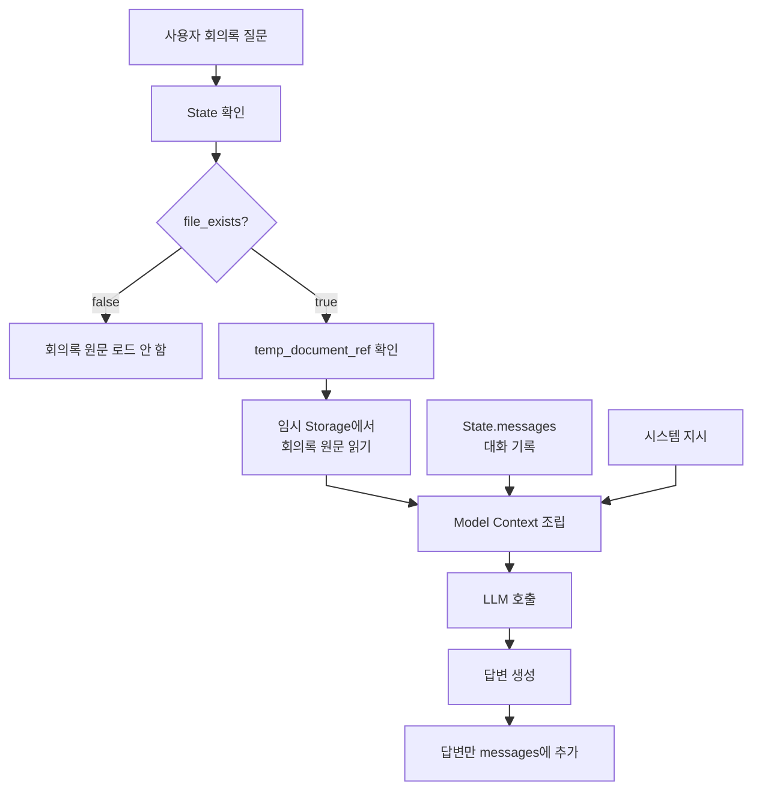

# 회의록 에이전트의 컨텍스트 엔지니어링 구조

## 1. 이 구조가 필요한 이유

회의록에 대한 질문이 들어올 때마다 전체 회의록 텍스트를 State의 `messages`에 추가하면 같은 문서가 계속 중복된다.

```text
첫 번째 질문
→ 회의록 전체를 messages에 추가

두 번째 질문
→ 같은 회의록 전체를 messages에 다시 추가

세 번째 질문
→ 같은 회의록 전체를 messages에 또 추가

결과
→ messages 길이 증가
→ 같은 문서에 대한 토큰 반복 사용
→ Compact 대상에 회의록 원문까지 포함
```

따라서 다음 세 데이터를 분리해야 한다.

```text
대화 기록
≠ 회의록 원문
≠ 한 번의 LLM 호출에 전달되는 최종 컨텍스트
```

LangChain 공식 문서도 지속적으로 저장되는 State와 한 번의 모델 호출에만 사용되는 Model Context를 구분한다. Model Context는 State를 변경하지 않고 호출마다 다르게 조립할 수 있는 일시적인 입력이다.

- [LangChain Context Engineering](https://docs.langchain.com/oss/python/langchain/context-engineering)
- [LangChain Context 개요](https://docs.langchain.com/oss/python/concepts/context)

## 2. 컨텍스트를 구성하는 네 영역

회의록 에이전트에서는 정보를 다음 네 영역으로 나누어 관리한다.

| 영역 | 저장하는 내용 | 유지 범위 | LLM이 직접 보는가? |
|---|---|---|---|
| State의 `messages` | 사용자 질문, LLM 답변과 필요한 Agent 실행 기록 | 현재 세션·대화 | 모델 호출 시 전달한 부분만 봄 |
| 서버 임시 Storage | 사용자가 선택한 회의록 원문 | 임시 문서 보관 기간 | 자동으로 보지 못함 |
| Runtime Context | 인증된 사용자, 세션 정보와 Storage 접근 수단 | 현재 실행 | 자동으로 보지 못함 |
| Model Context | 시스템 지시, 회의록 원문과 대화 기록을 조립한 최종 입력 | LLM 호출 1회 | 실제로 보는 입력 |

핵심은 서버 임시 Storage의 회의록 원문을 `messages`에 영구적으로 복사하지 않는 것이다.

## 3. State의 역할

State는 Graph가 현재 대화에서 사용해야 하는 동적인 작업 상태다.

현재 설계를 기준으로 하면 State는 다음 정보를 가진다.

```python
State = {
    "messages": [...],
    "file_exists": False,
    "temp_document_ref": None,
}
```

### `messages`

다음과 같은 대화 기록을 관리한다.

- 사용자의 질문
- LLM의 답변
- Agent Loop에 필요한 메시지

회의록 원문 전체는 `messages`에 반복해서 추가하지 않는다.

### `file_exists`

선택된 회의록이 임시 Storage에 저장되었는지를 나타낸다.

```text
false
→ 임시 회의록이 없음
→ 원문 로드 단계 실행하지 않음

true
→ 임시 회의록이 있음
→ 원문 로드 단계 실행 가능
```

기본값은 `false`이고, 5번 Tool이 임시 회의록 저장을 완료한 직후 `true`로 변경한다.

### `temp_document_ref`

`file_exists`는 파일이 있다는 사실만 나타낸다. 실제로 어느 임시 문서를 읽어야 하는지를 알기 위해서는 문서 참조값이 추가로 필요하다.

```text
file_exists
→ 임시 문서의 존재 여부

temp_document_ref
→ 실제로 읽어야 할 임시 문서의 식별자
```

`temp_document_ref`는 설명을 위한 임시 필드명이다. 실제 값이 파일 경로, Storage Key 또는 DB ID 중 무엇인지는 임시 Storage 방식을 정할 때 확정한다.

LangGraph State의 각 필드는 독립적인 갱신 규칙을 가질 수 있다. `messages`는 Reducer를 통해 추가하고, `file_exists`와 `temp_document_ref`는 새로운 값으로 덮어쓰는 방식으로 관리할 수 있다.

- [LangGraph Graph API의 State와 Reducer](https://docs.langchain.com/oss/python/langgraph/graph-api)

## 4. 서버 임시 Storage의 역할

서버 임시 Storage에는 사용자가 선택한 회의록의 전체 텍스트를 저장한다.

```text
4번 Tool
→ 접근 가능한 회의록 후보 조회
→ 사용자가 Human in the Loop에서 회의록 선택
→ 선택된 회의록 텍스트 반환

5번 Tool
→ 선택된 회의록 텍스트를 임시 Storage에 저장
→ file_exists=true
→ temp_document_ref 설정
```

회의록 원문은 대화 기록과 분리되어 있으므로 `messages`가 Compact되어도 그대로 유지된다.

```text
State.messages
→ Compact 대상

임시 Storage의 회의록 원문
→ messages Compact와 분리
```

임시 Storage를 파일, 객체 Storage 또는 DB 중 어디에 둘지는 이 문서에서 확정하지 않는다.

## 5. Runtime Context의 역할

Runtime Context는 LLM이 생성하는 값이 아니라 서버가 Graph 실행 시 제공하는 정보다.

예를 들면 다음 정보가 들어갈 수 있다.

- 인증된 사용자 ID
- 현재 세션 ID
- Storage 접근 수단
- DB 연결
- 서버에서 확인한 권한 정보

이 정보는 Tool Schema에 노출하지 않아도 Node와 Tool이 사용할 수 있다.

```text
LLM이 생성하는 Tool 인자
→ 검색 주제, 사용자가 선택한 회의록 ID 등

서버가 Runtime Context로 제공하는 값
→ 인증된 사용자, 세션과 Storage 접근 수단
```

Runtime Context는 자동으로 LLM 프롬프트에 들어가지 않는다. Node나 Tool이 읽어 권한 검사 또는 데이터 조회에 사용하고, 모델 답변에 필요한 정보만 Model Context에 포함한다.

- [LangChain Runtime](https://docs.langchain.com/oss/python/langchain/runtime)
- [LangChain Tools와 ToolRuntime](https://docs.langchain.com/oss/python/langchain/tools)

## 6. Model Context의 역할

Model Context는 LLM을 한 번 호출할 때 실제로 전달하는 최종 입력이다. 별도의 영구 저장 공간이 아니라 호출 시점에 조립되는 일시적인 값이다.

회의록 질문에서는 다음 정보를 조립한다.

```text
시스템 지시
+ 선택된 회의록 원문
+ 현재 messages
→ 한 번의 Model Context
```

중요한 점은 조립된 Model Context 전체를 다시 State에 저장하지 않는 것이다.

```text
LLM 호출 전
→ 임시 Storage에서 원문 읽기
→ 원문과 messages 조립

LLM 호출
→ 조립된 컨텍스트로 답변 생성

LLM 호출 후
→ LLM 답변만 messages에 추가
→ 조립 과정에서 사용한 회의록 원문은 messages에 추가하지 않음
```

## 7. 전체 컨텍스트 조립 흐름



## 8. 질문 한 번이 처리되는 순서

1. 사용자가 선택된 회의록의 내용에 대해 질문한다.
2. Condition이 State의 `file_exists`를 확인한다.
3. `false`이면 임시 회의록 원문을 로드하지 않는다.
4. `true`이면 임시 문서 참조값을 확인한다.
5. 임시 Storage에서 회의록 원문을 읽는다.
6. 현재 `messages`와 회의록 원문을 분리된 상태로 가져온다.
7. LLM 호출 직전에 시스템 지시, 회의록 원문과 `messages`를 조립한다.
8. 조립된 Model Context로 LLM을 호출한다.
9. LLM 답변만 `messages`에 추가한다.
10. 다음 질문에서도 임시 Storage의 원문을 다시 읽어 새로운 Model Context를 조립한다.

## 9. 6번 Tool의 정확한 의미

현재 설계의 6번 Tool은 다음 역할을 한다.

```text
임시 Storage에서 회의록 원문을 읽음
→ 이번 LLM 호출의 Model Context 조립에 제공
```

6번 Tool의 결과인 회의록 전체를 일반 Tool 결과처럼 `messages`에 계속 추가하면 처음의 중복 문제가 다시 발생한다.

```text
피해야 하는 구조
→ 6번 Tool이 전체 회의록을 ToolMessage로 messages에 누적

필요한 구조
→ 6번 단계가 원문을 일시적으로 제공
→ Model Context 조립에만 사용
→ 답변만 messages에 저장
```

따라서 구현 단계에서는 다음 두 방식 중 하나를 비교해야 한다.

| 방식 | 구조 |
|---|---|
| 6번을 Tool로 유지 | Tool은 원문을 별도 State 필드에 제공하고, Model 호출 단계가 이를 조립한다. 전체 원문은 `messages`에 누적하지 않는다. |
| 6번을 로드 Node로 구현 | Condition 이후 결정적인 Node가 원문을 읽고 Model 호출 단계에 제공한다. |

어느 방식을 사용할지는 아직 확정하지 않는다. 다만 어떤 방식을 사용하더라도 **회의록 전체를 `messages`에 계속 추가하지 않는다**는 원칙은 동일하다.

## 10. Compact와의 관계

Compact의 대상은 대화 기록인 `messages`다. 임시 Storage의 회의록 원문은 Compact 대상과 분리한다.

```text
messages가 기준 길이 이하
→ 현재 대화 기록 사용

messages가 기준 길이 초과
→ messages Compact
→ 임시 Storage 원문은 그대로 유지
→ Compact된 messages와 원문을 다시 조립
```

공식 LangChain의 Summarization Middleware는 오래된 메시지를 요약으로 바꾸고 최근 메시지를 유지하는 방식으로 State의 메시지 기록을 갱신한다. 실제 Compact 방법은 모델과 토큰 기준을 정할 때 별도로 확정한다.

- [LangChain Short-term Memory와 Summarization](https://docs.langchain.com/oss/python/langchain/short-term-memory)

## 11. 토큰 예산

회의록 원문을 `messages`와 분리해도 LLM 호출 시 전체 원문을 넣는다면 모델 컨텍스트 토큰은 사용된다.

```text
최종 입력 토큰
= 시스템 지시
+ 회의록 원문
+ Compact된 messages
+ 답변 생성을 위한 여유 공간
```

따라서 분리 저장은 **중복 누적 문제**를 해결하지만, 긴 회의록 한 건 자체가 모델 컨텍스트를 초과하는 문제까지 해결하지는 않는다.

긴 회의록에 대해서는 이후 다음 방식을 비교해야 한다.

- 전체 원문 사용
- 질문과 관련된 구간만 검색
- 청크 단위 조회
- 부분 요약과 원문 구간 병행

어떤 방식을 사용할지는 회의록 최대 길이와 모델 컨텍스트 한도를 확인한 뒤 결정한다.

## 12. 세션이 종료되는 경우

State가 현재 세션에만 존재하고 세션 종료와 함께 사라진다면 `file_exists`와 임시 문서 참조값도 사라질 수 있다.

이 문제는 `file_exists`를 LLM 프롬프트 안에 적는 방식으로 해결할 수 없다.

```text
LLM Model Context
→ 한 번의 모델 호출을 위한 일시적 입력
→ 서버 상태의 영구 저장소가 아님

State 또는 서버 저장소
→ 파일 존재 여부와 참조값을 복구할 수 있는 위치
```

세션 재개가 필요하다면 다음 중 하나가 필요하다.

- Checkpointer로 해당 Thread의 State 복구
- 서버 Storage 또는 DB에서 선택된 임시 문서 정보를 다시 조회
- 세션 재개 시 임시 파일 존재 여부를 서버에서 다시 계산

어느 방식을 사용할지는 세션과 임시 파일의 유지 범위를 정한 후 확정한다.

## 13. 권한 정보와 Model Context의 분리

현재 설계에서는 4번 Tool이 회의록 후보를 조회할 때 생성자, 참여자 또는 공유 대상자인지를 백엔드에서 검사한다.

이 권한 정보 자체를 LLM의 Model Context에 적어 두고 LLM이 판단하게 하지는 않는다.

```text
권한 판단
→ Tool의 백엔드 로직

회의록 내용
→ 권한 검사를 통과해 선택된 원문만 Model Context에 포함
```

6번 단계에서 원문을 다시 읽을 때 권한을 매번 재검사할지는 아직 결정하지 않는다. 다만 사용자 신원과 권한 판단을 LLM에 맡기지 않는 기존 원칙은 그대로 유지한다.

## 14. 현재 확정된 것과 미정인 것

### 확정된 원칙

- `messages`와 회의록 원문을 분리한다.
- 회의록 원문은 서버 임시 Storage에 저장한다.
- `file_exists` 기본값은 `false`다.
- 임시 저장 직후 `file_exists=true`로 변경한다.
- `file_exists=true`일 때만 회의록 원문을 로드한다.
- LLM 호출 시 원문과 `messages`를 조립한다.
- 회의록 원문 전체를 `messages`에 반복 누적하지 않는다.
- LLM 답변은 `messages`에 추가한다.

### 아직 결정하지 않은 항목

- `temp_document_ref`의 실제 필드명
- 임시 Storage의 종류
- 6번 기능을 Tool과 Node 중 어느 방식으로 구현할지
- 세션 종료 후 State와 임시 파일 유지 범위
- Compact의 토큰 기준과 구체적인 방법
- 긴 회의록을 전체로 넣을지 관련 구간만 넣을지
- 조립된 회의록 원문을 어떤 Message 역할과 형식으로 모델에 전달할지
- 6번 단계에서 임시 회의록을 읽을 때 권한을 다시 검사할지

## 핵심 정리

> `messages`는 대화 기록을 관리하고, 회의록 원문은 서버 임시 Storage에서 별도로 관리한다. State에는 임시 문서의 존재 여부와 참조값만 두고, 질문이 들어오면 서버에서 권한을 확인한 뒤 원문을 읽는다. LLM 호출 시점에만 `시스템 지시 + 회의록 원문 + messages`를 조립하며, 호출 후에는 답변만 `messages`에 추가한다. 이것이 회의록 원문을 보존하면서도 같은 문서가 대화 기록에 반복 누적되는 것을 막는 컨텍스트 엔지니어링 구조다.


추가 사항
1. 컨텍스트 윈도우가 50% 수준에 도달하면 컴팩트 요약을 실행하는 것이 범용적으로 권장되며, 초과 시 LLM 성능이 저하되고 토큰 비용도 증가한다.
2. 컨텍스트 윈도우가 50% 수준에 도달하면 컴팩트 요약을 실행하는 것이 범용적으로 권장되며, 초과 시 LLM 성능이 저하되고 토큰 비용도 증가한다. 따라서 압축(compact)를 해야한다.
