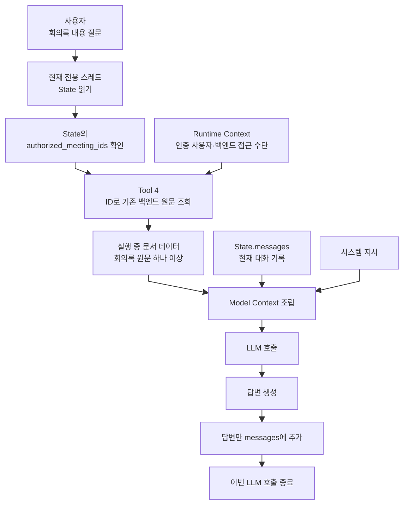

# 회의록 에이전트의 컨텍스트 구조

이 문서는 [[1. 회의록 에이전트 워크플로우 graph 정의]]와 [[2. 회의록 에이전트 상세 설계]]를 기준으로, 대화 기록과 선택된 회의록 원문을 LLM에 어떤 방식으로 전달할지를 정의한다.

대화 기록을 Compact하는 세부 방법론은 [[1. 대화 컨텍스트 Compact 방법론 조사]]에서, Tool 결과의 반환 형식과 Model Context 주입 방법론은 [[2. Tool 결과와 Model Context 조립 방법론 조사]]에서 다룬다.

## 1. 이 구조가 필요한 이유

회의록에 대한 질문이 들어올 때마다 전체 회의록 텍스트를 State의 `messages`에 추가하면 같은 문서가 계속 중복된다.

```text
첫 번째 질문
→ 회의록 전체를 messages에 추가

두 번째 질문
→ 같은 회의록 전체를 messages에 다시 추가

세 번째 질문
→ 같은 회의록 전체를 messages에 또 추가

결과
→ messages 길이 증가
→ 같은 문서에 대한 토큰 반복 사용
→ Compact 대상에 회의록 원문까지 포함
```

따라서 다음 세 데이터를 분리해야 한다.

```text
전용 스레드의 대화 기록
≠ 기존 백엔드에서 조회한 회의록 원문
≠ 한 번의 LLM 호출에 전달되는 최종 Model Context
```

LangChain은 지속적으로 관리되는 State와 한 번의 모델 호출에만 사용되는 Model Context를 구분한다. Model Context는 State를 변경하지 않고 호출마다 다르게 조립할 수 있는 일시적인 입력이다.

- [LangChain Context Engineering](https://docs.langchain.com/oss/python/langchain/context-engineering)
- [LangChain Context 개요](https://docs.langchain.com/oss/python/concepts/context)

## 2. 컨텍스트를 구성하는 네 영역

회의록 에이전트에서는 컨텍스트 조립에 사용하는 정보를 다음 네 영역으로 나누어 관리한다. State와 Checkpoint의 전체 구조와 저장 기준은 [[2. 회의록 에이전트 상세 설계]]에서 다룬다.

| 영역 | 관리하는 내용 | 유지 범위 | LLM이 직접 보는가? |
|---|---|---|---|
| State | `messages`의 대화·실행 기록과 서버가 관리하는 `authorized_meeting_ids` | 사용자별 전용 스레드 | Model Context에 포함한 `messages`만 보며, ID 허용 목록은 자동으로 보지 못함 |
| Runtime Context | 인증된 사용자, 현재 전용 스레드, 기존 백엔드·DB 접근 수단 | 현재 실행 | 자동으로 보지 못함 |
| 실행 중 문서 데이터 | Tool 4가 회의록 ID로 가져온 원문 하나 이상 | 현재 LLM 호출 준비 과정 | Model Context에 넣을 때만 봄 |
| Model Context | 시스템 지시, 원문, 현재 대화 기록을 조립한 최종 입력 | LLM 호출 1회 | 실제로 보는 입력 |

핵심은 기존 백엔드에 저장된 회의록을 별도의 임시 Storage에 복사하지 않는 것이다. 선택된 회의록 ID만 State에 남기고, 원문은 질문할 때마다 기존 백엔드에서 가져온다.

## 3. Model Context에 사용하는 `messages`

State와 `workflow_state`의 정의, 사용자별 전용 스레드 분리 기준은 [[2. 회의록 에이전트 상세 설계]]에서 다룬다. 이 문서에서는 State 전체가 아니라 Model Context의 대화 입력으로 사용하는 `messages`만 다룬다.

`messages`에는 다음 정보가 들어간다.

- 사용자의 요청과 질문
- LLM의 답변
- LLM이 생성한 Tool 호출
- Tool 실행 결과
- Human in the Loop 이후 전달된 사용자 입력·선택 결과
- Tool 3이 반환한 선택 결과와 메타데이터

회의록 원문 전체는 `messages`에 저장하지 않는다. Tool 3이 검증한 ID는 State의 별도 필드인 `authorized_meeting_ids`에 저장하고, 이후 질문에서 같은 회의록 집합을 다시 조회하기 위한 기준값으로 사용한다. `messages`에는 사용자에게 보여줄 선택 결과와 필요한 메타데이터만 남긴다.

LangGraph State의 각 필드는 별도의 갱신 규칙을 가질 수 있다. 현재 설계에서는 `messages`를 Reducer로 누적하는 구조를 전제로 한다.

- [LangGraph Graph API의 State와 Reducer](https://docs.langchain.com/oss/python/langgraph/graph-api)

## 4. Runtime Context의 역할

Runtime Context는 LLM이 생성하는 값이 아니라 서버가 Graph 실행 시 제공하는 정보다.

예를 들면 다음 정보가 들어갈 수 있다.

- 인증된 사용자 ID
- 현재 전용 스레드 ID
- 기존 ZEN AI 백엔드 호출 수단
- DB 연결
- 서버에서 확인한 요청 범위

이 정보는 Tool Schema에 LLM이 생성해야 하는 인자로 노출하지 않아도 Node와 Tool이 사용할 수 있다.

```text
LLM이 생성하는 Tool 인자
→ 검색 주제, meeting_id, action 등

서버가 Runtime Context로 제공하는 값
→ 인증된 사용자, 현재 전용 스레드, 백엔드·DB 접근 수단
```

Runtime Context는 자동으로 LLM 프롬프트에 들어가지 않는다. Node와 Tool은 이를 이용해 백엔드 메서드를 호출하고, 모델 답변에 필요한 데이터만 Model Context에 포함한다.

- [LangChain Runtime](https://docs.langchain.com/oss/python/langchain/runtime)
- [LangChain Tools와 ToolRuntime](https://docs.langchain.com/oss/python/langchain/tools)

## 5. 선택된 회의록 ID의 역할

Tool 2와 Tool 3의 검색·선택 방식은 [[2. 회의록 에이전트 상세 설계]]에서 다룬다. 컨텍스트 구조에서 Tool 3이 검증한 회의록 ID는 원문을 직접 저장하지 않고 필요할 때 다시 조회하기 위한 문서 참조값이다.

검증된 ID는 해당 전용 스레드 State의 `authorized_meeting_ids`에 저장된다. 이 필드는 LLM이 직접 수정하지 않으며 Tool 3의 검증된 서버 코드만 갱신한다. Tool 3의 선택 결과는 `messages`에도 메타데이터로 남길 수 있지만, Tool 4가 조회를 허용하는 기준은 `messages`가 아니라 `authorized_meeting_ids`다. 사용자가 질의 대상을 확정한 이후에는 같은 회의록 집합을 바탕으로 연속 질문할 수 있다.

## 6. Tool 4와 실행 중 문서 데이터

Tool 4는 Tool 3이 검증하여 `authorized_meeting_ids`에 저장한 ID를 이용해 기존 ZEN AI 백엔드에서 회의록 원문 하나 이상을 가져온다.

```text
State의 authorized_meeting_ids
→ Tool 4가 기존 백엔드에서 원문 조회
→ 원문을 실행 중 문서 데이터로 전달
→ Model Context 조립에 사용
```

회의록 원문은 다음 위치에 저장하지 않는다.

- State의 `messages`
- 별도의 임시 Storage

일반적인 Tool 결과처럼 회의록 원문 전체를 ToolMessage로 `messages`에 넣으면 같은 문서가 다시 누적된다. 따라서 Tool 4의 영속적인 Tool 결과에는 조회 성공 여부, 사용한 회의록 ID, 문서 수와 같은 메타데이터만 남길 수 있고, 원문 본문은 오케스트레이터 또는 컨텍스트 조립 단계에 일시적으로 전달해야 한다.

## 7. Model Context의 역할

Model Context는 LLM을 한 번 호출할 때 실제로 전달하는 최종 입력이다. 별도의 영구 저장 공간이 아니라 호출 시점에 조립되는 일시적인 값이다.

회의록 질문에서는 다음 정보를 조립한다.

```text
시스템 지시
+ Tool 4가 가져온 회의록 원문 하나 이상
+ 현재 전용 스레드의 messages
= 한 번의 Model Context
```

조립된 Model Context 전체를 다시 State에 저장하지 않는다.

```text
LLM 호출 전
→ Tool 4가 authorized_meeting_ids의 ID로 회의록 원문 조회
→ 원문과 messages 조립

LLM 호출
→ 조립된 컨텍스트로 답변 생성

LLM 호출 후
→ LLM 답변만 messages에 추가
→ 회의록 원문은 State에 추가하지 않음
```

## 8. 전체 컨텍스트 조립 흐름



## 9. 질문 한 번이 처리되는 순서

1. 사용자가 자신의 전용 스레드에서 확정된 회의록 집합의 내용에 대해 질문한다.
2. Agent가 State의 `authorized_meeting_ids`에서 Tool 3이 검증한 회의록 ID를 확인한다.
3. Tool 4가 해당 ID를 이용해 기존 백엔드에서 회의록 원문 하나 이상을 가져온다.
4. 회의록 원문은 실행 중 문서 데이터로 유지한다.
5. LLM 호출 직전에 시스템 지시, 회의록 원문, 현재 `messages`를 조립한다.
6. 조립된 Model Context로 LLM을 호출한다.
7. LLM 답변만 `messages`에 추가한다.
8. 추가 질문이 들어오면 같은 회의록 ID 집합으로 원문을 다시 조회하고 새로운 Model Context를 조립한다.

## 10. Compact와의 관계

Compact의 대상은 대화 기록인 `messages`다. 회의록 원문은 State에 저장하지 않으므로 Compact 대상에 포함되지 않는다.

```text
컨텍스트 사용량이 전체 윈도우의 약 50% 미만
→ 현재 messages 유지

컨텍스트 사용량이 전체 윈도우의 약 50% 이상
→ messages Compact
→ 정리된 messages를 State에 반영
→ 다음 질문에서 ID로 원문을 다시 조회
```

현재 질의 대상 회의록 ID는 `messages`가 아니라 별도의 `authorized_meeting_ids` 필드에 저장되므로 `messages` Compact의 영향을 받지 않는다. Compact 이후에도 이 구조화된 ID 목록은 그대로 유지하며, Tool 3의 선택 결과를 설명하는 메시지만 요약 대상이 될 수 있다.

공식 LangChain의 Summarization Middleware는 오래된 메시지를 요약으로 바꾸고 최근 메시지를 유지하는 방식으로 State의 메시지 기록을 갱신한다. 구체적인 Compact 방법과 토큰 기준은 사용하는 모델을 정한 뒤 확정한다.

- [LangChain Short-term Memory와 Summarization](https://docs.langchain.com/oss/python/langchain/short-term-memory)

## 11. 토큰 예산

회의록 원문을 `messages`와 분리하더라도 LLM 호출 시 전체 원문을 넣으면 해당 원문의 토큰은 사용된다.

```text
최종 입력 토큰
= 시스템 지시
+ Tool 4가 조회한 회의록 원문
+ Compact된 messages
+ 답변 생성을 위한 여유 공간
```

따라서 이 구조는 같은 문서가 `messages`에 반복해서 누적되는 문제를 해결하지만, 긴 회의록 자체가 모델의 컨텍스트 한도를 초과하는 문제까지 해결하지는 않는다.

긴 회의록 또는 여러 회의록에 대해서는 이후 다음 방식을 비교해야 한다.

- 전체 원문 사용
- 질문과 관련된 구간만 검색
- 청크 단위 조회
- 부분 요약과 원문 구간 병행

어떤 방식을 사용할지는 회의록 최대 길이와 모델 컨텍스트 한도를 확인한 뒤 결정한다.

## 12. 권한 정보와 Model Context의 분리

권한 검사 방식은 [[2. 회의록 에이전트 상세 설계]]에서 다룬다. 컨텍스트 조립 단계에서는 권한 정보 자체를 Model Context에 넣어 LLM이 접근 가능 여부를 판단하게 하지 않고, 백엔드 권한 필터를 통과한 회의록만 입력으로 사용한다.

```text
후보 접근 권한 필터
→ Tool 2의 백엔드 로직

선택 ID 검증과 원문 조회 허용
→ Tool 3이 authorized_meeting_ids 갱신
→ Tool 4가 요청 ID의 허용 목록 포함 여부 검사

Model Context에 포함하는 회의록
→ 백엔드 권한 필터를 통과하고 사용자가 확정한 회의록만 포함
```

## 13. 컨텍스트 구조에서 결정할 항목

- Tool 4가 원문을 컨텍스트 조립 단계에 전달하는 구체적인 구현 방식
- Tool 4의 영속적인 Tool 결과에 남길 메타데이터 Schema
- 긴 회의록을 전체로 넣을지 관련 구간만 넣을지
- 조립된 회의록 원문을 어떤 Message 역할과 형식으로 모델에 전달할지

## 핵심 정리

> `messages`는 LLM 호출에 사용할 대화와 Tool 결과를 제공하고, Tool 3이 검증한 회의록 ID는 별도의 `authorized_meeting_ids`에 원문 재조회를 위한 참조값으로 저장한다. 질문이 들어오면 Tool 4가 허용 목록의 ID에 해당하는 원문을 가져오고, LLM 호출 시점에만 `시스템 지시 + 회의록 원문 + messages`를 조립한다. 호출 후에는 답변만 `messages`에 추가한다.
