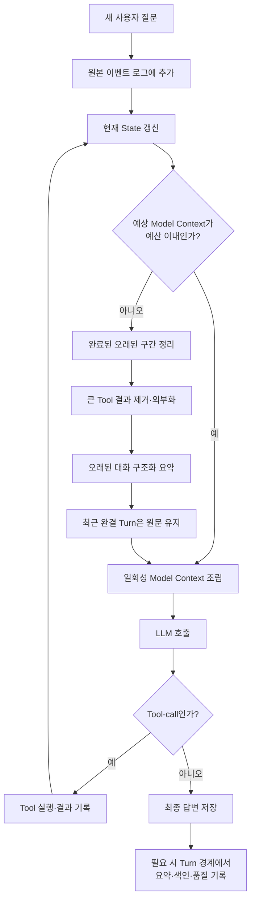

# 에이전트 Loop에서 증가하는 대화 컨텍스트 정리 방법론 조사

> 조사일: 2026-08-18  
> 조사 목적: 회의록 Agent가 Loop를 돌면서 대화와 Tool 실행 기록이 계속 늘어날 때, 기존 컨텍스트를 어떤 원칙과 방법론으로 정리해야 효율성과 답변 품질을 함께 유지할 수 있는지 조사한다.  
> 문서 성격: 구현안 확정 문서가 아니라, 이후 State Schema와 컨텍스트 조립 구조를 결정하기 위한 조사·설계 방향 문서다.

---

## 1. 조사 질문

현재 고려 중인 모델 입력은 개념적으로 다음과 같다.

```text
시스템 프롬프트
+ 선택된 회의록 원문
+ 업데이트된 이전 대화 messages
+ 최신 사용자 질문
= 이번 LLM 호출의 컨텍스트
```

문제는 Agent가 Loop를 돌수록 `messages`에 다음 정보가 계속 쌓인다는 점이다.

- 사용자의 과거 질문
- LLM의 과거 답변
- LLM이 생성한 Tool-call
- Tool 실행 결과
- 오류와 재시도 기록
- 이미 해결되어 더 이상 필요하지 않은 중간 과정
- 이후 발언으로 정정되거나 폐기된 정보

이 조사에서 다루는 질문은 단순히 “몇 개의 메시지를 남길 것인가?”가 아니다.

> 모델의 제한된 주의력과 토큰 예산 안에서, 어떤 정보는 원문으로 유지하고 어떤 정보는 압축하며 어떤 정보는 외부에 보관한 뒤 필요할 때만 다시 가져와야 하는가?

---

## 2. 조사 결과의 핵심 결론

현재의 공식 프레임워크 문서와 장기 대화 메모리 연구를 종합하면, 모든 상황에 통하는 하나의 압축 알고리즘은 없다. 가장 일관되게 나타나는 방향은 다음과 같은 **계층형·혼합형 컨텍스트 관리**다.

```text
전체 원본 기록
→ 감사·복구·재요약을 위해 모델 컨텍스트 밖에 보존

최근 대화 구간
→ 지시 대상, 대명사, 말투와 직전 흐름을 위해 원문 유지

오래된 대화의 구조화된 요약
→ 목표·결정·정정·미해결 사항을 압축해 유지

오래됐지만 다시 필요할 수 있는 정보
→ 외부 저장소에 두고 최신 질문과 관련된 항목만 검색

오래된 Tool 결과와 중간 추론 흔적
→ 결과의 결론·참조값만 남기고 원문은 제거 또는 외부화
```

따라서 방향성은 `messages 전체를 계속 전달`하거나 `오래된 내용을 하나의 산문 요약으로 모두 대체`하는 두 극단 중 하나를 선택하는 것이 아니다.

**원본 보존, 최근 원문, 구조화된 압축 기억, 필요시 검색을 서로 다른 계층으로 나누는 것**이 핵심이다.

---

## 3. 먼저 구분해야 하는 세 가지

### 3-1. 원본 대화 기록과 State와 모델 입력은 같은 것이 아니다

LangChain의 공식 Context Engineering 문서는 컨텍스트를 다음과 같이 구분한다.

- **Model Context**: 한 번의 LLM 호출에 실제로 들어가는 일회성 정보
- **State**: 대화 또는 Thread 안에서 지속되는 동적 상태
- **Store·Runtime Context**: 장기 데이터 또는 서버 실행에 필요한 정보

Model Context를 호출 직전에 바꾸는 작업은 일회성일 수 있지만, State의 메시지를 요약으로 교체하면 이후 호출에도 영향을 주는 영구 변경이다. 이 차이는 매우 중요하다.  
출처: [LangChain — Context engineering in agents](https://docs.langchain.com/oss/python/langchain/context-engineering)

회의록 Agent에서는 세 계층을 다음처럼 바라볼 수 있다.

| 계층 | 목적 | 모델이 매번 보는가? |
|---|---|---:|
| 원본 이벤트 로그 | 감사, 장애 복구, 요약 재생성, 품질 분석 | 아니오 |
| 현재 Agent State | 현재 회의록 선택, 최근 대화, 압축 기억 등 실행 상태 | 일부만 |
| 조립된 Model Context | 이번 판단과 답변에 필요한 정보 | 예 |

즉, 기록을 잃지 않기 위해 모든 것을 LLM에 계속 보여줄 필요는 없다. 반대로 LLM 입력에서 제거한다고 해서 원본 데이터까지 삭제해야 하는 것도 아니다.

### 3-2. 컨텍스트 윈도는 저장 공간이 아니라 제한된 주의력 예산이다

긴 컨텍스트를 지원하는 모델이라도 더 많은 정보를 넣는 것이 항상 더 좋은 것은 아니다. `Lost in the Middle` 연구에서는 관련 정보의 위치만 바꿔도 성능이 달라졌으며, 긴 입력의 가운데에 있는 정보를 사용할 때 성능이 크게 저하되는 현상을 관찰했다. 또한 더 많은 검색 문서를 넣어도 검색 Recall이 늘어나는 만큼 최종 QA 성능이 계속 상승하지 않았다.  
출처: [Liu et al. — Lost in the Middle: How Language Models Use Long Contexts](https://arxiv.org/abs/2307.03172)

LangChain 공식 메모리 문서도 전체 기록이 컨텍스트에 들어가더라도 오래되거나 관련 없는 내용이 모델을 산만하게 하고, 지연시간과 비용을 증가시킬 수 있다고 설명한다.  
출처: [LangChain — Memory overview](https://docs.langchain.com/oss/python/concepts/memory)

따라서 기준은 다음과 같아야 한다.

```text
얼마나 많이 넣을 수 있는가?  X
이번 판단에 필요한 고신호 정보가 무엇인가?  O
```

### 3-3. 하나의 사용자 Turn과 Agent 내부 Loop를 구분해야 한다

회의록 Agent의 한 사용자 질문 안에서도 다음 Loop가 여러 번 발생할 수 있다.

```text
사용자 질문
→ LLM Tool-call
→ Tool 결과
→ LLM 재판단
→ 추가 Tool-call
→ Tool 결과
→ 최종 답변
```

이 활성 Loop 안의 Tool-call과 Tool 결과는 아직 처리 중인 하나의 논리적 작업 단위다. 이 중간에서 임의로 메시지를 잘라내면 호출과 결과의 연결이 깨지거나, 모델이 방금 수행한 일을 잊을 수 있다.

그러므로 컨텍스트 정리의 최소 단위는 개별 메시지 한 개가 아니라 다음과 같은 **완결된 상호작용 단위**여야 한다.

```text
HumanMessage
+ 관련 AIMessage의 Tool-call
+ 대응하는 ToolMessage
+ 그 결과를 반영한 AIMessage
```

활성 처리 구간은 원문을 유지하고, 이미 종료된 과거 구간부터 정리 대상으로 보는 것이 안전하다.

---

## 4. 인터넷 조사에서 확인한 주요 방법론

### 4-1. 최근 메시지 Window 유지

가장 단순한 방법은 최근 N개 메시지 또는 최근 일정 토큰만 남기는 것이다. LangGraph 공식 문서는 토큰 수를 계산한 뒤 `trim_messages`로 최근 메시지를 남기는 방식을 기본 선택지로 제시한다.  
출처: [LangGraph — Add and manage memory](https://docs.langchain.com/oss/python/langgraph/add-memory)

장점:

- 구현이 단순하다.
- 별도 요약 LLM 호출이 없어 빠르고 저렴하다.
- 최신 질문의 대명사, 지시 대상과 직전 대화 흐름이 그대로 유지된다.
- 요약 모델이 새로운 사실을 만들어내는 위험이 없다.

한계:

- Window 밖으로 밀린 중요한 결정과 정정 내용은 사라진다.
- “처음에 내가 정한 조건이 뭐였지?” 같은 장거리 질문에 약하다.
- 메시지 개수 기준만 사용하면 짧은 메시지 10개와 거대한 Tool 결과 10개를 같게 취급한다.

따라서 최근 Window는 단독 해법이라기보다 다른 기억 방식과 함께 사용하는 **단기 작업 기억**에 가깝다.

### 4-2. 오래된 메시지의 재귀적·점진적 요약

이전 요약과 새 대화 구간을 합쳐 갱신된 요약을 만드는 방식이다.

```text
이전 요약 + 새로 오래된 대화 묶음
→ 새로운 누적 요약
```

LangGraph는 State에 `summary` 또는 `RunningSummary`를 별도로 두고, 일정 토큰을 넘으면 오래된 메시지를 요약하면서 최근 메시지는 원문으로 보존하는 예제를 제공한다. 최신 LangChain Agent에서는 `SummarizationMiddleware`가 토큰 기준 Trigger와 최근 메시지 보존량을 받을 수 있다.  
출처: [LangGraph — Summarize messages](https://docs.langchain.com/oss/python/langgraph/add-memory), [LangChain — Short-term memory](https://docs.langchain.com/oss/python/langchain/short-term-memory)

장기 대화 연구에서도 이전 기억과 새로운 구간을 반복적으로 요약하는 방식이 대화 일관성을 개선할 수 있음을 보고했다. 그러나 같은 논문은 요약 과정에서 잘못된 인과관계가 생기고 그 오류가 누적될 수 있다는 한계도 명시했다.  
출처: [Wang et al. — Recursively Summarizing Enables Long-Term Dialogue Memory](https://arxiv.org/abs/2308.15022)

장점:

- 단순 삭제보다 오래된 정보의 Recall을 높일 수 있다.
- 매우 긴 대화를 고정 크기에 가깝게 유지할 수 있다.
- 최근 원문과 병행하면 대화 흐름도 어느 정도 보존된다.

한계:

- 요약은 손실 압축이며 미래 질문에 무엇이 중요할지 완벽히 알 수 없다.
- 요약을 다시 요약할수록 미세한 조건과 예외가 약해질 수 있다.
- 한 번 생긴 오해나 환각이 이후 누적 요약의 입력이 되어 증폭될 수 있다.
- 자연어 산문 하나에 목표, 결정, 사용자 정정과 미해결 사항을 모두 섞으면 갱신이 어렵다.

따라서 “오래된 대화를 짧게 써줘”라는 일반 요약보다 **업무 목적에 맞춘 구조화된 압축**이 필요하다.

### 4-3. 구조화된 기억

대화를 하나의 산문으로만 요약하지 않고, 나중에 다시 필요할 정보의 종류를 나눠 저장하는 방식이다.

예를 들어 회의록 질의 대화에서는 다음과 같은 정보 유형을 구분할 수 있다.

```text
현재 사용자의 목적
현재 선택된 회의록과 범위
사용자가 지정한 조건·표현 방식
이미 확인한 사실과 그 근거 구간
대화 중 합의하거나 확정한 해석
사용자가 정정한 내용
아직 답하지 못한 질문
실패한 Tool과 재시도 필요 여부
```

LangChain의 메모리 개념 문서는 기억을 사실에 해당하는 Semantic Memory, 경험에 해당하는 Episodic Memory, 행동 규칙에 해당하는 Procedural Memory 등으로 구분한다. 또한 한 개의 통합 Profile은 전체 맥락을 보기 쉽지만 업데이트가 어려울 수 있고, 여러 개의 작은 기억 Collection은 Recall에 유리한 대신 검색과 중복 관리가 복잡해지는 Trade-off가 있다고 설명한다.  
출처: [LangChain — Memory overview](https://docs.langchain.com/oss/python/concepts/memory)

회의록 Agent에서 이 분류를 그대로 구현해야 한다는 뜻은 아니다. 중요한 시사점은 **성격과 수명이 다른 정보를 같은 요약 문자열에 섞지 않는 것**이다.

### 4-4. 과거 대화 Retrieval

오래된 대화를 전부 요약에 넣지 않고 원본 또는 추출된 기억을 외부 저장소에 보관한 뒤, 최신 질문과 관련된 항목만 검색해 모델 입력에 추가하는 방식이다.

장기 대화 메모리 평가인 LongMemEval은 단순한 긴 컨텍스트 외에 다음 능력을 별도로 평가한다.

- 특정 정보 추출
- 여러 세션을 합친 추론
- 시간 순서와 시점 추론
- 이전 정보의 갱신
- 근거가 없을 때 답하지 않는 능력

이 연구는 세션 분해, 사실을 이용한 검색 Key 확장, 시간 정보를 고려한 Query 확장 등이 기억 Recall과 최종 답변 성능에 도움을 줄 수 있다고 보고한다.  
출처: [Wu et al. — LongMemEval](https://arxiv.org/abs/2410.10813)

장점:

- 현재 질문과 관련 없는 과거 대화를 모델에 넣지 않아도 된다.
- 원문 근거를 다시 가져올 수 있어 요약 손실을 보완한다.
- 대화가 매우 길어져도 모델 입력 크기를 제한할 수 있다.

한계:

- 검색되지 않은 정보는 존재하지 않는 것처럼 취급될 수 있다.
- 의미 유사도만으로는 정정, 시간 순서와 여러 Turn을 합쳐야 하는 정보를 놓칠 수 있다.
- Retrieval 결과가 너무 많으면 다시 컨텍스트 오염이 발생한다.
- 짧은 대화부터 Retrieval 시스템을 넣으면 복잡도에 비해 이득이 작을 수 있다.

따라서 Retrieval은 요약의 완전한 대체제가 아니라, **요약으로 보존하지 못한 오래된 세부 정보를 복구하는 계층**으로 보는 편이 적절하다.

### 4-5. 오래된 Tool 결과의 선택적 제거

Agent Loop에서는 사용자 대화보다 Tool 결과가 더 빠르게 컨텍스트를 키울 수 있다. 검색 결과, 파일 전체, API 응답과 오류 Stack을 그대로 `ToolMessage`에 쌓으면 이미 LLM이 처리한 데이터가 이후 모든 호출에 반복된다.

Anthropic의 공식 Context Engineering 문서는 오래된 Tool-call과 Tool 결과를 제거하는 것을 가장 안전하고 가벼운 Compaction 중 하나로 제시한다. 공식 Context Editing 문서도 최근 Tool 사용은 보존하면서 오래된 결과부터 제거하고, 필요하면 특정 Tool은 제거 대상에서 제외하는 방식을 제공한다.  
출처: [Anthropic — Effective context engineering for AI agents](https://www.anthropic.com/engineering/effective-context-engineering-for-ai-agents), [Claude Platform — Context editing](https://platform.claude.com/docs/en/build-with-claude/context-editing)

일반화하면 Tool 결과는 처음부터 다음과 같이 다루는 편이 좋다.

```text
큰 Tool 원본 결과
→ 외부 Storage 또는 원본 시스템에 보관

messages에 남기는 내용
→ 실행 성공·실패
→ 핵심 결론
→ 이후 다시 읽을 수 있는 신뢰된 참조값
→ 다음 판단에 필요한 최소 메타데이터
```

단, 방금 호출한 Tool 결과와 이에 대응하는 Tool-call은 활성 Loop가 끝날 때까지 함께 유지해야 한다.

### 4-6. 계층형 메모리

MemGPT 연구는 운영체제의 메모리 계층처럼 제한된 모델 컨텍스트와 외부 저장소 사이에서 정보를 이동하는 Virtual Context Management를 제안했다. 핵심은 무한히 큰 하나의 프롬프트가 아니라, 빠른 작업 기억과 더 큰 외부 기억을 구분하는 것이다.  
출처: [Packer et al. — MemGPT: Towards LLMs as Operating Systems](https://arxiv.org/abs/2310.08560)

회의록 Agent에 적용해 해석하면 다음과 같다.

| 계층 | 성격 | 예시 |
|---|---|---|
| 고정 정책 | 항상 필요한 규칙 | 권한 정책, 회의록은 데이터라는 지시 |
| 현재 작업 기억 | 최근 원문 | 최근 질문·답변, 활성 Tool Loop |
| 압축 기억 | 오래된 대화의 핵심 상태 | 사용자 목적, 결정, 정정, 미해결 질문 |
| 선택적 회수 기억 | 필요할 때만 검색 | 오래된 질문·답변 원문과 근거 |
| 외부 원본 | 모델이 직접 기억하지 않음 | 회의록 원문, 전체 대화 이벤트 로그 |

이 계층은 특정 제품을 그대로 도입하자는 결론이 아니라, 컨텍스트 관리 문제를 바라보는 유용한 설계 모델이다.

---

## 5. 방법별 비교

| 방법 | 토큰 절감 | 오래된 정보 보존 | 오류 위험 | 적합한 역할 |
|---|---:|---:|---:|---|
| 최근 Window | 높음 | 낮음 | 낮음 | 직전 흐름과 지시 대상 유지 |
| 단순 삭제 | 높음 | 매우 낮음 | 낮음 | 명백히 불필요한 기록 제거 |
| 누적 요약 | 높음 | 중간 | 요약 왜곡·누적 오류 | 오래된 대화의 전체 흐름 압축 |
| 구조화된 기억 | 중간~높음 | 높음 | Schema 누락·잘못된 갱신 | 목표·결정·정정·미해결 사항 유지 |
| 과거 대화 Retrieval | 가변적 | 검색 성공 시 높음 | 검색 누락 | 오래된 세부 정보 복구 |
| Tool 결과 외부화 | 매우 높음 | 참조로 복구 가능 | 참조 만료·권한 문제 | 큰 중간 결과 관리 |
| 전체 기록 매번 전달 | 낮음 | 겉보기에는 높음 | 주의력 분산·비용 증가 | 짧은 대화의 초기 Baseline만 |

조사 결과상 가장 타당한 방향은 다음 조합이다.

```text
최근 Window
+ 구조화된 누적 기억
+ 오래된 Tool 결과 제거
+ 필요해졌을 때만 과거 대화 Retrieval
+ 외부에 보존된 전체 원본 기록
```

---

## 6. 회의록 Agent의 컨텍스트를 정리할 때 가져야 할 방향성

이 절은 특정 필드명이나 구현 코드를 확정하는 것이 아니라, 이후 설계가 따라야 할 원칙을 정리한다.

### 방향 1. 보존 정책을 정보의 중요도와 기능으로 나눈다

컨텍스트를 단순히 오래된 순서로 삭제하지 않는다. 먼저 각 정보가 무엇을 위해 필요한지 구분한다.

#### 항상 원문 또는 신뢰된 상태로 유지할 후보

- 시스템 정책과 보안 규칙
- 최신 사용자 질문
- 활성화된 Tool-call과 아직 처리 중인 Tool 결과
- 사용자가 명시적으로 정정한 내용
- 현재 작업 목표와 아직 해결되지 않은 사항
- 현재 선택된 회의록을 식별하는 신뢰된 서버 정보

#### 요약해도 되는 후보

- 이미 완료된 과거 질문과 답변
- 반복된 설명
- 최종 결론이 나온 탐색 과정
- 이후 답변에서 다시 원문 표현까지 필요하지 않은 대화

#### 제거하거나 외부화할 후보

- 이미 반영된 대형 Tool 결과
- 중복 검색 결과
- 성공 후 의미가 사라진 재시도 오류
- 모델의 장황한 중간 설명
- 같은 회의록 원문의 반복 사본

### 방향 2. 요약은 자유 산문보다 업무 지향적인 구조를 갖는다

요약 Prompt의 목표는 “대화를 짧게 쓰기”가 아니라 “다음 Loop가 잘못 판단하지 않도록 작업 상태를 보존하기”여야 한다.

구조화 방향의 예시는 다음과 같다. 이는 필드 확정안이 아니다.

```text
현재 사용자 목표:
사용자가 정한 조건:
현재까지 확인된 내용:
확정된 결정·해석:
사용자 정정·최신값:
아직 해결하지 못한 질문:
필요한 후속 행동:
관련 원본 Turn 또는 근거 참조:
```

특히 다음 규칙이 중요하다.

- 사실이 없는 내용을 추론해서 추가하지 않는다.
- 사용자가 과거 내용을 정정하면 이전값과 최신값을 구분하고 최신값을 우선한다.
- 완료된 사항과 미완료 사항을 구분한다.
- 회의록 본문의 사실과 사용자 대화에서 나온 가정을 섞지 않는다.
- 중요한 항목에는 가능하면 원본 Turn ID나 근거 참조를 남긴다.

Anthropic은 Compaction Prompt를 조정할 때 먼저 중요한 내용을 빠뜨리지 않는 Recall을 높인 뒤, 불필요한 내용을 줄여 Precision을 높이는 순서를 권장한다.  
출처: [Anthropic — Effective context engineering for AI agents](https://www.anthropic.com/engineering/effective-context-engineering-for-ai-agents)

### 방향 3. 최근 대화는 요약하지 않고 일정 구간 원문으로 남긴다

요약만 있으면 다음과 같은 표현을 해석하기 어렵다.

```text
“그 결정은 누가 말했어?”
“아까 두 번째 항목만 다시 설명해줘.”
“아니, 내가 말한 건 그 회의가 아니라 지난주 회의야.”
```

따라서 오래된 구간은 압축하더라도 최근 몇 개의 **완결된 Turn 묶음**은 원문으로 유지하는 것이 필요하다. 최근 보존량은 메시지 개수만이 아니라 실제 토큰과 업무 특성을 기준으로 평가해야 한다.

### 방향 4. Trigger는 Turn 수보다 토큰 예산을 중심으로 잡는다

메시지 20개라도 모두 짧을 수 있고, Tool 결과 한 개가 수만 토큰일 수도 있다. 따라서 “N번 대화하면 요약”만으로는 안정적인 예산 관리가 어렵다.

호출 전에 다음 항목의 예산을 따로 계산하는 방향이 적절하다.

```text
모델 전체 Context 한도
- 시스템 정책
- 회의록 원문 또는 검색된 회의록 구간
- 최신 질문
- 응답 생성용 예약 공간
- Tool Schema와 예상 Tool 결과 여유
= 대화 기억에 사용할 수 있는 예산
```

그 예산을 넘기기 전에 오래된 구간을 묶어서 압축해야 한다. 매 Loop마다 요약하면 지연시간과 비용이 늘고 요약 오류 기회도 많아지므로, Threshold를 넘을 때 또는 사용자 Turn 사이의 안전한 지점에서 수행하는 것이 합리적이다.

OpenAI Agents SDK의 현재 Compaction 기능도 매번 무조건 압축하지 않고 후보가 Threshold를 넘었는지를 확인하며, 낮은 지연시간이 필요하면 자동 압축 대신 Turn 사이 또는 Idle 시점에 수동 압축할 수 있도록 한다. 이는 특정 SDK를 사용하자는 의미가 아니라 Trigger 설계의 참고 사례다.  
출처: [OpenAI Agents SDK — Sessions and compaction](https://openai.github.io/openai-agents-python/sessions/)

### 방향 5. Compaction은 가능한 한 안전한 경계에서 실행한다

권장되는 안전 경계는 다음과 같다.

- 하나의 사용자 질문에 대한 최종 답변이 끝난 직후
- Tool-call과 대응 Tool 결과가 모두 처리된 뒤
- Human in the Loop 중단 상태를 저장하고 필요한 재개 정보가 구조화된 뒤
- 새 회의록으로 전환하기 직전 또는 직후

피해야 할 경계는 다음과 같다.

- Tool-call은 있지만 결과가 아직 없는 상태
- Tool 결과를 받았지만 LLM이 아직 해석하지 않은 상태
- 사용자가 정정하는 발언의 앞뒤가 분리되는 지점
- HITL 승인에 필요한 원본 선택 정보가 요약으로만 남는 상태

### 방향 6. 요약을 유일한 진실의 원천으로 만들지 않는다

재귀적 요약은 효율적이지만 손실과 오류 누적 가능성이 있다. 따라서 다음 복구 경로가 필요하다.

```text
전체 원본 대화 이벤트 로그
→ 현재 요약이 의심되거나 품질이 떨어지면 재생성
→ 특정 질문이 오래된 세부 정보를 요구하면 원문 검색
```

장기간 누적된 요약은 이전 요약만 계속 확장하지 말고, 일정 시점에 원본 기록의 관련 구간에서 다시 만드는 **Rebase**를 평가할 필요가 있다. 이 방식은 비용이 더 들지만 요약 오류가 영구히 굳어지는 것을 줄일 수 있다.

### 방향 7. 회의록 원문과 대화 기억을 서로 요약하지 않는다

회의록 원문은 답변의 근거 데이터이고, `messages`는 사용자가 그 데이터에 대해 무엇을 물었고 Agent가 어떻게 응답했는지를 나타낸다. 두 데이터를 한꺼번에 Compact하면 다음 문제가 발생한다.

- 회의록의 원문 사실이 대화 요약 속 2차 표현으로 바뀐다.
- 사용자의 해석과 회의록의 원래 발언이 섞인다.
- 이후 질문에서 원문 근거와 이전 답변을 구분하기 어렵다.
- 같은 회의록 내용이 임시 Storage와 요약에 중복된다.

따라서 대화 요약에는 회의록 본문을 다시 복사하기보다 다음 정도만 남기는 방향이 적절하다.

```text
어떤 질문을 했는가
어떤 결론을 답했는가
어떤 회의록 구간을 근거로 사용했는가
사용자가 그 답변을 정정하거나 추가 조건을 주었는가
```

회의록의 사실 자체는 원문 또는 검색된 근거 구간에서 다시 읽는다.

### 방향 8. 최신 질문의 중복 삽입을 방지한다

LangGraph의 `messages` Reducer에 최신 `HumanMessage`를 먼저 추가한 뒤 Model Node를 실행한다면, 최신 질문은 이미 `state.messages`의 마지막 원소다. 이 상태에서 다음처럼 다시 최신 질문을 붙이면 같은 질문이 두 번 들어간다.

```text
state.messages 전체 + latest_question  # 중복 가능
```

따라서 실제 조립 단계에서는 둘 중 하나를 명확히 선택해야 한다.

```text
과거 messages만 분리 + 최신 질문 별도 추가
또는
최신 질문까지 포함된 messages를 그대로 사용
```

문서에서 사용하는 `업데이트된 messages + 최신 질문`은 논리적 구성 요소를 설명하는 표현이며, 실제 구현에서는 메시지가 한 번만 들어가도록 해야 한다.

### 방향 9. 현재 회의록이 바뀌면 대화 기억의 Scope도 함께 바꾼다

새 회의록을 선택했는데 이전 회의록에 대한 요약과 최근 대화를 그대로 넣으면, 과거의 사람·날짜·결정이 새 회의록 답변에 섞일 수 있다.

따라서 압축 기억과 Retrieval 기록에는 적어도 다음 Scope가 필요하다.

- 사용자 또는 권한 주체
- 대화 Thread·Session
- 선택된 회의록 식별자와 버전
- 필요할 경우 질문 시점

회의록이 변경되었을 때 기존 기억을 제거할지, 별도 Scope로 보관할지, 일부 사용자 선호만 계승할지는 이후 설계에서 명시적으로 결정해야 한다.

### 방향 10. 컨텍스트 정리를 권한 경계와 분리하지 않는다

외부 Storage에 저장한 Tool 결과와 과거 대화를 Retrieval한다고 해서 기존 권한 검사가 생략되어서는 안 된다.

- 회의록 참조값은 LLM이 자유 텍스트로 만들어 권한을 우회할 수 없어야 한다.
- 원문과 과거 대화를 다시 읽을 때도 인증된 사용자와 현재 Scope를 서버가 검사해야 한다.
- 요약에 남아 있는 과거 회의록 정보도 회의록 접근 권한이 사라졌다면 다시 모델에 주입하지 않아야 한다.
- 회의록 원문은 외부에서 온 데이터이므로 시스템 지시와 분리하고, 원문 안의 명령문을 Agent 지시로 따르지 않게 해야 한다.

### 방향 11. 매 Loop의 State 갱신과 LLM 입력 조립을 분리한다

`messages를 갱신한다`는 말에는 서로 다른 두 작업이 섞일 수 있다.

1. 실행 기록을 다음 Step에서도 사용할 수 있도록 State에 저장하는 작업
2. 그중 이번 LLM 호출에 보여줄 내용만 골라 Model Context를 만드는 작업

이 둘을 하나의 배열 복사 작업으로 취급하지 않는 것이 중요하다. 개념적인 갱신 원칙은 다음과 같다.

```text
새 사용자 입력
→ 원본 로그와 State에 한 번 추가

LLM이 Tool-call 생성
→ 해당 AIMessage를 State에 추가

Tool 실행 완료
→ 대응하는 ToolMessage를 State에 추가

다음 LLM 호출 직전
→ State를 그대로 전부 전달하지 않음
→ 압축 기억 + 최근 완결 Turn + 현재 활성 Loop를 읽어 일회성 입력 조립

최종 답변 생성
→ 답변을 State와 원본 로그에 추가

안전한 Turn 경계에서 Threshold 초과
→ 압축 기억을 갱신하고, 그 기억이 덮는 완료 구간만 작업용 messages에서 정리
```

LangGraph의 Checkpointer는 Thread의 Graph State를 Step 단위로 지속하는 기반이 될 수 있다. 다만 작업용 `messages`를 요약으로 교체하는 경우에도 감사와 재요약에 필요한 전체 원본 로그를 별도로 보존할지는 애플리케이션이 결정해야 한다.  
출처: [LangGraph — Persistence](https://docs.langchain.com/oss/python/langgraph/persistence)

회의록 원문이나 Context Builder가 만든 최종 Prompt 사본은 `messages`에 다시 추가하지 않는다. 그렇지 않으면 다음 Loop에서 같은 회의록과 압축 기억이 대화 기록으로 다시 유입되어 중복된다. State에는 LLM의 실제 대화·Tool 상호작용과 필요한 참조만 남기고, 회의록 원문은 호출 직전에 일회성으로 조립하는 방향을 유지해야 한다.

---

## 7. 조사 결과에서 도출되는 개념적 처리 흐름

다음은 코드나 Graph Node를 확정한 것이 아니라, 각 Loop에서 수행되어야 할 논리적 단계를 나타낸다.



호출 시점의 Model Context는 개념적으로 다음처럼 구성할 수 있다.

```text
1. 신뢰된 시스템 정책
2. 현재 작업의 구조화된 압축 기억
3. 선택된 회의록 원문 또는 질문 관련 근거 구간
4. 질문과 관련해 검색한 오래된 대화 기억(필요할 때만)
5. 최근 완결 대화 Turn 원문
6. 최신 사용자 질문
```

정확한 순서는 실제 사용하는 모델을 대상으로 평가해야 한다. `Lost in the Middle` 연구가 보여주듯 정보의 위치도 성능에 영향을 줄 수 있으므로, 중요 정보를 단순히 가운데에 묻어 두어서는 안 된다.

---

## 8. 단순 Rolling Summary만 사용할 때의 위험과 보완책

| 위험 | 발생 예 | 보완 방향 |
|---|---|---|
| 세부 조건 소실 | “재무팀 승인 후”가 “승인 후”로 축약 | 조건·예외 전용 항목과 원본 참조 유지 |
| 정정 내용 충돌 | 과거 담당자 A가 남고 최신 담당자 B가 누락 | 최신값·폐기값·변경 시점을 구분 |
| 요약 환각 누적 | 존재하지 않은 인과관계를 생성 | 원본 근거 ID, 재검증, 주기적 Rebase |
| 미해결 작업 삭제 | 아직 답하지 않은 질문이 완료로 요약 | 완료·진행·대기 상태를 구조화 |
| 회의록과 대화 혼합 | Agent의 해석이 회의록 발언처럼 보임 | Source 유형과 근거를 분리 |
| 여러 회의록 혼선 | 이전 회의의 담당자가 새 회의에 등장 | 회의록 ID·버전별 Scope 격리 |
| 중간 Tool 상태 손상 | Tool-call만 남고 결과가 제거 | 완결된 호출·결과 묶음 단위로 정리 |

---

## 9. 설계를 결정하기 위한 평가 방법

어떤 방법론이 실제 회의록 Agent에 효과적인지는 토큰 절감률만으로 결정할 수 없다. 최소한 다음 네 영역을 함께 측정해야 한다.

### 9-1. 기억 정확성

- 오래된 사용자 조건을 정확히 기억하는가?
- 사용자가 정정한 최신 정보가 이전 정보보다 우선하는가?
- 여러 Turn에 흩어진 내용을 합쳐 답할 수 있는가?
- 시점과 순서를 정확히 구분하는가?
- 근거가 없을 때 모른다고 답하는가?

LongMemEval의 정보 추출, 다중 세션 추론, 시간 추론, 지식 갱신, Abstention 항목을 회의록 도메인에 맞게 변형할 수 있다.  
출처: [Wu et al. — LongMemEval](https://arxiv.org/abs/2410.10813)

### 9-2. 회의록 근거 충실성

- 답변의 사실이 회의록 원문과 일치하는가?
- 이전 Agent 답변의 오류를 회의록 사실로 재사용하지 않는가?
- 회의록의 서로 다른 위치에 있는 근거도 놓치지 않는가?
- 회의록이 바뀌면 이전 회의록 정보가 섞이지 않는가?

### 9-3. Agent 실행 안정성

- Compaction 전후에 Tool 선택이 달라지지 않는가?
- 활성 Tool-call과 Tool 결과 연결이 보존되는가?
- HITL 중단 후 재개에 필요한 상태가 남는가?
- 요약 시점에 동시 State 업데이트가 덮어써지지 않는가?
- 오류와 재시도가 무한히 누적되지 않는가?

### 9-4. 효율성

- LLM 호출별 입력 토큰 수
- 대화 길이에 따른 토큰 증가 기울기
- 요약과 Retrieval을 포함한 전체 비용
- P50·P95 응답 지연시간
- Compaction 호출 빈도와 소요 시간
- 원본 전체를 전달한 Baseline 대비 답변 품질 변화

### 9-5. 필요한 회귀 테스트 예시

1. 첫 Turn의 중요한 제약을 여러 Turn 뒤에 질문한다.
2. 담당자 또는 날짜를 중간에 정정한 뒤 최신값을 질문한다.
3. 같은 표현을 가진 두 회의록을 순서대로 선택하고 정보가 섞이는지 확인한다.
4. 매우 큰 Tool 결과를 만든 뒤 몇 Turn 후 Context에서 제거됐는지 확인한다.
5. 과거 세부사항이 요약에는 없지만 Retrieval로 복구되는지 확인한다.
6. 답이 없는 질문에서 과거 요약을 억지로 조합해 답하지 않는지 확인한다.
7. Compaction 직전과 직후 동일한 질문을 하여 답변 일관성을 비교한다.
8. 동일한 중요 사실을 입력의 앞·가운데·뒤에 배치해 위치 민감도를 확인한다.
9. 요약을 여러 번 갱신한 뒤 원본에서 다시 만든 요약과 사실 정확도를 비교한다.
10. Tool-call 도중 Context 정리가 발생해도 호출·결과 Pair가 깨지지 않는지 확인한다.

---

## 10. 단계적으로 검증할 수 있는 설계 실험 방향

처음부터 모든 기억 계층을 구현하면 어떤 기능이 품질을 높였는지 알기 어렵다. 다음과 같이 한 단계씩 추가해 비교하는 방향이 좋다.

### 실험 A. Baseline

```text
회의록 원문 + 전체 messages + 최신 질문
```

목적:

- 현재 모델의 기본 장기 대화 성능과 비용 측정
- 이후 방법의 비교 기준 확보

### 실험 B. 최근 Window와 Tool 결과 정리

```text
회의록 원문
+ 최근 완결 Turn 원문
+ 오래된 Tool 결과의 결론·참조값
+ 최신 질문
```

목적:

- 가장 손실 위험이 낮은 경량 정리의 효과 확인
- Tool 결과가 전체 Context에서 차지하는 비중 확인

### 실험 C. 구조화된 누적 요약 추가

```text
회의록 원문
+ 오래된 대화의 구조화된 기억
+ 최근 완결 Turn 원문
+ 최신 질문
```

목적:

- 오래된 조건·정정·미해결 사항의 보존 여부 확인
- 일반 산문 요약과 구조화 요약 비교

### 실험 D. 오래된 대화 Retrieval 추가

```text
회의록 원문 또는 관련 구간
+ 구조화된 기억
+ 최신 질문과 관련된 과거 대화 검색 결과
+ 최근 완결 Turn 원문
+ 최신 질문
```

목적:

- 요약에서 빠진 세부 정보 복구
- 검색 누락과 과도한 검색 결과의 Trade-off 측정

이 순서로 실험하면 단순한 방식으로 목표 품질을 달성할 수 있는지 먼저 확인하고, 실제 필요가 관찰될 때 복잡한 Retrieval 계층을 추가할 수 있다.

---

## 11. 현재 회의록 Agent에 대한 잠정적 방향

이 조사의 결론은 특정 구현을 확정하는 것이 아니라 다음 원칙을 우선 설계 기준으로 삼자는 것이다.

1. `messages`를 무제한 원본 저장소와 동일시하지 않는다.
2. 전체 원본 대화는 모델 입력 밖의 신뢰된 로그에 보존한다.
3. 최근 완결 Turn은 원문으로 유지한다.
4. 오래된 대화는 업무 목적에 맞는 구조로 압축한다.
5. 회의록 원문은 대화 요약에 다시 복사하지 않는다.
6. 큰 Tool 결과는 처리 후 결론과 참조만 남긴다.
7. 오래된 세부 정보는 필요할 때 원본에서 검색할 수 있게 한다.
8. 정리는 메시지 개수보다 토큰 예산과 정보 성격을 기준으로 Trigger한다.
9. 요약은 활성 Tool Loop가 아닌 안전한 작업 경계에서 수행한다.
10. Compaction 전후의 기억 정확도와 Agent 실행을 회귀 테스트한다.

한 문장으로 정리하면 다음과 같다.

> Agent의 컨텍스트 정리는 과거를 단순히 짧게 만드는 작업이 아니라, 원본 기록은 밖에 보존하면서 이번 Loop에 필요한 최근 원문·구조화된 작업 상태·질문 관련 과거 기억만 제한된 주의력 예산 안에 다시 조립하는 작업이어야 한다.

---

## 12. 다음 설계 단계에서 결정해야 할 항목

이 조사를 바탕으로 다음 단계에서는 아래 내용을 하나씩 선택해야 한다.

- 전체 원본 대화 로그와 LangGraph `messages` State의 관계
- 최근 원문을 유지할 단위를 Turn, 메시지 또는 토큰 중 무엇으로 볼지
- 구조화된 압축 기억에 반드시 포함할 업무 항목
- Compaction Trigger와 응답용 예약 토큰 계산 방식
- 요약을 별도 Node, Middleware 또는 백그라운드 작업 중 어디에서 수행할지
- 원본 대화 Retrieval이 초기 버전부터 필요한지
- Tool 결과를 외부화할 때 남길 요약과 참조 형식
- 회의록 변경 시 대화 기억의 초기화·분리·계승 정책
- 요약 오류를 발견했을 때 원본에서 Rebase하는 절차
- 권한 철회 또는 임시 Storage 만료 시 파생 기억을 제거하는 정책

이 항목이 결정된 뒤에야 현재 `회의록 에이전트 설계.md`의 State Schema와 6번 Tool 또는 Context Builder의 역할을 구체적으로 수정하는 것이 적절하다.

---

## 13. 주요 참고 자료

### 공식 문서·기술 자료

- [LangChain — Context engineering in agents](https://docs.langchain.com/oss/python/langchain/context-engineering)
- [LangChain — Short-term memory](https://docs.langchain.com/oss/python/langchain/short-term-memory)
- [LangGraph — Add and manage memory](https://docs.langchain.com/oss/python/langgraph/add-memory)
- [LangChain — Memory overview](https://docs.langchain.com/oss/python/concepts/memory)
- [LangGraph — Persistence](https://docs.langchain.com/oss/python/langgraph/persistence)
- [Anthropic — Effective context engineering for AI agents](https://www.anthropic.com/engineering/effective-context-engineering-for-ai-agents)
- [Claude Platform — Manage tool context](https://platform.claude.com/docs/en/agents-and-tools/tool-use/manage-tool-context)
- [Claude Platform — Context editing](https://platform.claude.com/docs/en/build-with-claude/context-editing)
- [OpenAI Agents SDK — Sessions and compaction](https://openai.github.io/openai-agents-python/sessions/)

### 연구 자료

- [Liu et al. — Lost in the Middle: How Language Models Use Long Contexts](https://arxiv.org/abs/2307.03172)
- [Wang et al. — Recursively Summarizing Enables Long-Term Dialogue Memory](https://arxiv.org/abs/2308.15022)
- [Packer et al. — MemGPT: Towards LLMs as Operating Systems](https://arxiv.org/abs/2310.08560)
- [Wu et al. — LongMemEval: Benchmarking Chat Assistants on Long-Term Interactive Memory](https://arxiv.org/abs/2410.10813)
- [Maharana et al. — Evaluating Very Long-Term Conversational Memory of LLM Agents](https://arxiv.org/abs/2402.17753)
