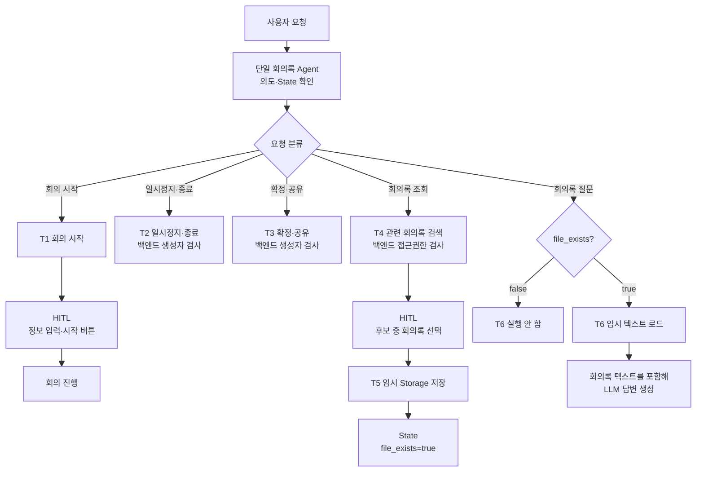

# 회의록 에이전트 설계

## 1. 설계 시 가정 사항

### 1-1. 단일 에이전트로 구성

회의록 에이전트가 수행하는 작업과 Tool 흐름이 비교적 단순할 것으로 예상하므로 하나의 LLM이 여러 Tool을 선택하는 **단일 에이전트**로 구성한다.

여러 에이전트를 분리하지 않고 하나의 에이전트가 사용자의 요청, 현재 State와 Tool 결과를 보고 다음 행동을 결정한다.

### 1-2. State와 Compact

대화 컨텍스트는 State의 `messages`에 저장한다고 가정한다.

```python
State = {
    "messages": [...],
    "file_exists": False,
}
```

회의록에 대한 질문이 반복되어 `messages`가 일정 길이 이상으로 커지는 경우에 대비해 Compact를 설정한다.

```text
messages 길이 확인
→ 기준 이하: 그대로 진행
→ 기준 초과: Compact 실행
```

### 1-3. 회의록 원문 보존

회의록 텍스트를 `messages`에만 넣으면 Compact 과정에서 회의록 내용 일부가 소실될 수 있다.

이를 방지하기 위해 사용자가 특정 회의록을 선택하여 가져오는 순간 전체 회의록 텍스트를 서버의 임시 Storage에 저장한다. 이후 회의록에 대한 질문이 들어올 때마다 임시 Storage에 있는 텍스트를 다시 읽어 LLM 컨텍스트에 추가한다.

```text
선택된 회의록 원문
→ 서버 임시 Storage에 저장
→ messages가 Compact되어도 원문은 유지
→ 질문할 때마다 임시 Storage에서 다시 로드
```

임시 Storage의 회의록 텍스트를 원문 보존용 데이터로 사용하고, `messages`는 현재 대화와 Agent Loop를 위한 상태로 사용한다.

### 1-4. `file_exists` 상태(State)

선택된 회의록이 임시 Storage에 저장되어 있는지는 State의 `file_exists`로 구분한다.

| 값 | 의미 | 회의록 컨텍스트 로드 Tool 실행 |
|---|---|---|
| `false` | 임시 회의록 파일이 없음 | 실행하지 않음 |
| `true` | 임시 회의록 파일이 있음 | 실행 가능 |

전체 흐름이 `저장 전 false → 저장 후 true`이므로 `file_exists`의 기본값은 `false`로 정의한다.

```python
file_exists: bool = False
```

5번 Tool로 임시 파일을 저장한 직후 `file_exists`를 `true`로 변경한다.

## 2. Tool 목록

### Tool 1. 회의 시작

회의 정보 입력 모달을 화면에 표시하고 Graph 실행을 일시정지한다.

```text
1번 Tool 호출
→ 회의 정보 입력 모달 표시(기본적으로 해당 채널에 대한 내용 추가되어있음)
→ Human in the Loop로 Graph 일시정지
→ 사용자가 "회의 시작" 버튼 선택
→ 입력한 회의 정보와 함께 Graph 재개
→ 회의 시작 처리
```

사용자가 버튼을 누르기 전에는 실제 회의를 시작하지 않는다.
**필요 없을 수 있음**
### Tool 2. 회의 일시정지·종료

현재 회의를 일시정지하거나 종료한다.

일시정지와 종료의 백엔드 로직이 완전히 분리되어 있다면 다음과 같이 Tool도 나누는 것을 고려한다.

- 회의를 일시정지하는 Tool
- 회의를 종료하는 Tool

실행 전에 백엔드에서 현재 사용자가 회의 생성자인지 검사한다.
**없어도 될 수 있음**

### Tool 3. 회의록 확정 및 공유

작성된 회의록을 확정하고 지정된 채널에 공유한다.

실행 전에 백엔드에서 현재 사용자가 회의 생성자인지 검사한다. 권한이 없으면 확정과 공유를 모두 수행하지 않는다.

### Tool 4. 특정 주제와 연관된 회의록 가져오기

사용자의 질문에서 주제와 조건을 받아 관련 회의록 후보 목록을 조회한다.

```text
검색 조건 입력(에)
→ 백엔드 권한 검사(툴)
→ 접근 가능한 회의록 후보만 반환(툴)
→ 후보 목록 화면 표시(에)
→ Human in the Loop로 Graph 일시정지
→ 사용자가 회의록 하나를 선택
→ 선택한 회의록과 함께 Graph 재개(에)
→ 해당 회의록 텍스트 반환(에)
```

조회 결과에는 사용자가 생성자, 참여자 또는 공유 대상자인 회의록만 포함한다.

### Tool 5. 회의록 텍스트를 임시 Storage에 저장

4번 Tool을 통해 사용자가 확정한 회의록의 전체 텍스트를 서버 임시 Storage에 저장한다.

저장 직후 State의 `file_exists`를 `false`에서 `true`로 변경한다.
회의록 로컬 다운로드(저장) 백업용???에 대한 내용도 고려

### Tool 6. 임시 회의록 텍스트를 컨텍스트에 추가

사용자가 선택한 회의록의 내용에 대해 질문할 때 서버 임시 Storage에 있는 회의록 텍스트를 읽어 LLM 컨텍스트에 추가한다. (Messages 내부에 넣는 구조인데 따로 저장을 한다. 컨텍스트 부분과 회의록 텍스트 부분으로 구분이 되어있으며 LLM으로 전달 될 때 합쳐지는 구조(Context engineering))

실행 전 Condition이 State의 `file_exists`를 확인한다.

```python
if state["file_exists"] is True:
    6번_Tool을_실행한다()
else:
    6번_Tool을_실행하지_않는다()
```

`file_exists=false`이면 6번 Tool을 실행하지 않는다.

## 3. 전체 구조

다음 다이어그램은 단일 에이전트 안에서 여섯 Tool과 두 Human in the Loop 지점, 권한 검사와 `file_exists` Condition이 연결되는 구조를 한 화면에 요약한 것이다.



## 4. 권한 및 실행 제약

### 4-1. 회의 일시정지·종료

2번 Tool은 백엔드에서 현재 사용자가 해당 회의의 생성자인지 검사한다.

```text
Tool 호출
→ 백엔드가 인증된 사용자 확인
→ 해당 회의의 생성자와 비교
→ 일치: 일시정지 또는 종료
→ 불일치: 실행하지 않음
```

State에 `authorized=true/false`를 저장하고 Condition에서 분기하는 방안도 고려할 수 있다. 그러나 이 방식은 사용자의 신원과 권한 정보를 State에 별도로 저장하고 최신 상태로 유지하는 과정이 추가되므로 현재 설계에서는 보류한다.
**인풋과 컨텍스트의 형태 정의하기**
불일치에 대한 경우에 대해서도 대응할 수 있도록 해야함. 에이전트가 계속해서 대응하도록.
-> 오류 메세지가 돌아온면 그대로 LLM에게 던져야하나?
### 4-2. 회의록 확정 및 공유

3번 Tool도 2번 Tool과 동일하게 백엔드에서 현재 사용자가 회의 생성자인지 검사한다.

- 생성자이면 확정 및 공유 실행
- 생성자가 아니면 실행하지 않음

### 4-3. 관련 회의록 조회

4번 Tool은 현재 사용자가 다음 중 하나에 해당하는 회의록만 반환한다.

- 회의 생성자
- 회의 참여자
- 회의록 공유 대상자

권한 필터는 LLM이 아니라 백엔드 조회 로직에서 강제한다.

### 4-4. 임시 파일 저장 후 State 갱신

5번 Tool의 저장이 성공한 직후 `file_exists`를 `false`에서 `true`로 변경한다.

```text
저장 전: file_exists=false
→ 임시 Storage 저장 성공
→ 저장 후: file_exists=true
```

### 4-5. 임시 회의록 로드 조건

6번 Tool 실행 전 Condition이 `file_exists`를 확인한다.

```text
file_exists=true
→ 6번 Tool 실행
→ 임시 회의록 텍스트를 컨텍스트에 추가

file_exists=false
→ 6번 Tool 실행하지 않음
```
State 자체가 날아가는 경우를 고려?
## 5. Human in the Loop 적용 Tool

| Tool         | 일시정지 시점           | 사용자 행동                | 재개 후 동작        |
| ------------ | ----------------- | --------------------- | -------------- |
| 1번 회의 시작     | 회의 정보 입력 모달 표시 후  | 정보 입력 후 `회의 시작` 버튼 선택 | 입력값으로 회의 시작    |
| 4번 관련 회의록 조회 | 접근 가능한 후보 목록 표시 후 | 회의록 하나 선택             | 선택된 회의록 텍스트 조회 |

Human in the Loop가 적용된 Tool은 사용자의 선택이 들어올 때까지 Graph 실행을 중단한다. 사용자가 확정한 입력을 받은 뒤 중단 지점부터 실행을 재개한다.

## 6. 내부 Tool 실행 순서 예시

### 6-1. 회의 시작

1. 사용자가 채팅창에 `@회의 시작`을 입력한다.
2. 회의록 Agent가 1번 Tool을 호출한다.
3. 화면에 회의 정보 입력 모달을 표시한다.
4. Human in the Loop로 Graph 실행을 일시정지한다.
5. 사용자가 회의 정보를 입력하고 `회의 시작` 버튼을 선택한다.
6. 중단 지점부터 Graph를 재개하고 회의를 시작한다.

### 6-2. 회의 종료

7. 사용자가 채팅창에 `@회의 종료`를 입력한다.
8. Agent가 2번 Tool을 호출한다.
9. Tool 내부 백엔드 로직에서 사용자가 회의 생성자인지 검사한다.
10. 생성자이면 회의를 종료하고, 생성자가 아니면 실행을 거부한다.

### 6-3. 회의록 확정 및 공유

11. 사용자가 `@확정 및 공유`를 입력한다.
12. Agent가 3번 Tool을 호출한다.
13. Tool 내부 백엔드 로직에서 사용자가 회의 생성자인지 검사한다.
14. 생성자이면 회의록을 확정하고 지정된 채널에 공유한다.

### 6-4. 특정 회의록 조회 및 임시 저장

15. 회의록을 공유받은 채널 사용자가 `@회의록 오늘 회의록 불러줘`와 같이 요청한다.
16. Agent가 4번 Tool을 호출한다.
17. Tool 내부 백엔드 로직에서 사용자가 생성자, 참여자 또는 공유 대상자인 회의록만 조회한다.
18. 조건에 맞는 회의록 후보 목록을 화면에 표시한다.
19. Human in the Loop로 Graph 실행을 일시정지한다.
20. 사용자가 회의록 하나를 선택한다.
21. 중단 지점부터 Graph를 재개하고 선택된 회의록 텍스트를 가져온다.
22. Agent가 즉시 5번 Tool을 호출하여 전체 회의록 텍스트를 서버 임시 Storage에 저장한다.
23. 저장에 성공하면 State의 `file_exists`를 `false`에서 `true`로 변경한다.

### 6-5. 회의록 내용 질문

24. 사용자가 선택한 회의록의 내용에 대해 질문한다.
25. Condition이 State의 `file_exists`를 확인한다.
26. `true`이면 Agent가 6번 Tool을 호출한다.
27. 6번 Tool이 임시 Storage의 회의록 텍스트를 읽어 현재 컨텍스트에 추가한다.
28. LLM이 회의록 텍스트와 사용자 질문을 바탕으로 답변한다.
29. 이후 질문에서도 같은 과정을 반복하여 Compact 이후에도 회의록 원문을 다시 컨텍스트에 넣는다.

## 핵심 정리

> 회의록 에이전트는 하나의 LLM이 여섯 Tool을 선택하는 단일 에이전트로 구성한다. 대화 State의 `messages`는 길이에 따라 Compact하되, 선택한 회의록 원문은 서버 임시 Storage에 별도로 보존한다. `file_exists=true`일 때만 원문 로드 Tool을 실행하며, 회의 제어·확정·조회 권한은 LLM이 아니라 각 Tool의 백엔드 로직에서 검사한다.
