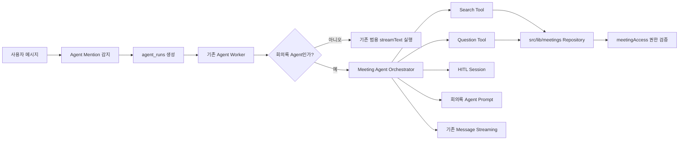

# zen-ai 기존 Agent Framework 기반 회의록 Agent 구현 계획서

## 1. 작성 목적

회의록 Agent POC의 목적은 Python과 LangGraph 자체를 제품에 옮기는 것이 아니라, **설계한 회의록 Agent의 로직과 보안 경계가 기술적으로 성립하는지 검증하는 것**이었다.

POC를 통해 다음 항목이 실제로 동작함을 확인했다.

- Search와 Question 업무의 분리 및 연속 실행
- 회의록 후보 선택과 허용 ID 추가·대체를 위한 HITL
- 사용자·Thread별 `authorized_meeting_ids` 관리
- Tool 실행 전후의 권한 재검증
- 회의록 원문을 영속 State와 Trace에 남기지 않고 일시적인 LLM Context로만 사용하는 방식
- 녹화 명령을 LLM의 자유 판단이 아닌 결정적 Workflow로 처리하는 방식

그러나 실제 `zen-ai`에는 Agent 등록, 실행 Queue, Worker, Streaming, Tool 연결, Message 영속화가 이미 구현되어 있다. 따라서 POC의 LangGraph 실행 껍데기를 그대로 이식하면 제품 안에 두 번째 Agent Framework를 만드는 결과가 된다.

> **이식의 핵심은 POC의 Python 코드가 아니라 로직, Tool 계약, Prompt, 상태 전이, HITL 및 보안 불변 조건이다.**  
> 이 문서는 그 설계 핵심을 현재 `zen-ai` 구조에 어떤 형식으로 구현할지를 정리한다.

---

## 2. 이식 대상과 범위

회의록 Agent는 다음 방식으로 구현하는 것이 적절하다.

1. 기존 `agents` Registry와 DB에 회의록 Agent를 등록한다.
2. 기존 `agent_runs` Queue와 Worker 실행·Streaming 구조를 그대로 사용한다.
3. `src/lib/agents` 아래에 회의록 전용 Orchestrator와 상태 저장 경계를 추가한다.
4. 회의 검색과 원문 조회는 기존 `src/lib/meetings`의 Repository 및 `meetingAccess` 권한 정보를 사용하는 **서버 내부 Tool**로 구현한다.
5. LangGraph `Checkpoint`와 `interrupt()`를 그대로 도입하지 않고, 제품 DB의 회의록 Agent Session과 Pending HITL 상태로 번역한다.
6. 녹화 기능은 기존 `MeetingRecordingProvider`가 계속 소유하며, Agent는 기존 녹화 명령 또는 UI Intent를 발생시키는 역할만 담당한다.



---

## 3. 구현해야 할 회의록 Agent 기능

이식 계획은 POC의 폴더나 파일을 어디로 옮길지보다, 제품에서 사용자에게 어떤 기능을 제공해야 하는지부터 시작한다.

### 3-1. 회의록 검색·선택

- 사용자의 주제·기간·참여자 조건에 맞는 회의록을 검색한다.
- 현재 사용자가 접근할 수 있는 회의록만 후보로 만든다.
- 후보가 없으면 안내하고, 하나면 재검증 후 선택하며, 여러 개면 사용자가 선택하게 한다.
- 이미 허용된 ID와 새 선택이 다를 때만 추가·대체 여부를 묻는다.

### 3-2. 선택한 회의록에 대한 질문

- 사용자·Thread별로 선택된 `authorized_meeting_ids` 범위만 사용한다.
- 원문 조회 직전에 실제 권한을 다시 검증한다.
- 회의록 원문은 답변 생성 중 일시적인 Context로만 사용하고 DB의 Agent State, Message, Event, Audit, Trace에는 저장하지 않는다.
- 질문이 끝나면 업무 상태는 설계 용어인 `none`으로 돌아간다.

### 3-3. 사용자 선택이 필요한 HITL

- 복수 회의록 후보 선택과 허용 ID 추가·대체를 사용자에게 묻는다.
- 대기 상태는 사용자·Channel·Thread·Agent별로 분리한다.
- 형식에 맞지 않는 입력은 기존 대기 Context를 버리지 않고 다시 질문한다.
- Worker가 재시작되더라도 DB에 저장된 Pending Action으로 재개할 수 있어야 한다.

### 3-4. 녹화 명령

- 녹화 시작·일시정지·재개·종료는 LLM이 임의로 판단하는 Tool Loop가 아니라 결정적 명령으로 처리한다.
- 실제 녹화 State와 성공 여부는 기존 녹화 UI와 Backend가 관리한다.
- Agent는 제품의 기존 녹화 진입점 또는 구조화된 UI Command만 호출한다.

---

## 4. POC에서 검증된 설계 계약

POC는 위 기능을 어떤 제품 Framework로 제공할지를 결정한 것이 아니라, 다음 설계 계약이 기술적으로 성립하는지를 검증했다.

| 검증 항목 | POC에서 확인한 의미 | 제품 이식 시 유지할 계약 |
|---|---|---|
| 목표 판단 | Search, Question, Search 후 Question의 분기와 반복이 가능함 | 동일한 업무 분기와 최종 `none` 복귀 |
| Tool 1 | 권한 범위 안에서 후보 검색과 0·1·복수 분기가 가능함 | 검색과 후보 선택 책임 유지 |
| Tool 2 | 서버가 허용한 회의록 원문만 일시적으로 조회할 수 있음 | ID 비노출, 권한 재검증, 원문 비영속 |
| `authorized_meeting_ids` | 사용자별 질문 범위를 서버 State로 제한할 수 있음 | LLM 권한 판단 자료가 아닌 서버 관리 State |
| HITL | 복수 후보 및 추가·대체 선택에서 중단·재개가 가능함 | 영속 대기 상태와 잘못된 입력 재질문 |
| Checkpoint | 업무 경계에서 상태를 보존하고 재개할 수 있음 | 제품 DB Transaction과 Revision으로 번역 |
| 녹화 Workflow | Trigger에 따른 결정적 상태 갱신을 검증함 | 실제 UI Provider와 Backend 상태를 원본으로 사용 |

Python, LangGraph, `SqliteSaver`, CLI, 로컬 Trace 화면은 이 계약을 검증하기 위한 수단이다. 이들은 제품 이식 대상 그 자체가 아니다.

---

## 5. 현재 zen-ai Agent Framework

### 5-1. Agent 정의와 등록

`src/lib/agents/registry.ts`의 `AgentDefinitionInput`에는 다음 정보가 들어간다.

- `slug`, `name`, `description`
- 기본 모델과 허용 모델
- Reasoning 설정
- 출력 및 Context 제한
- 최대 Tool 실행 Round
- `systemPrompt`

Agent 정의는 `agents`와 `agent_versions`에 저장된다. 해당 채팅 채널에 Agent가 부여되어 있고 메시지에서 사용자가 해당 Agent를 호출하면, 새롭게 생성된 스레드 내부에서, 현재 버전과 사용자별 유효 설정을 바탕으로 실행된다.

회의록 Agent 역시 완전히 독립된 코드로 작성하는 것이 아닌 **제품 Agent 정의를 통해 등록**한다.

```ts
const meetingAgentDefinition: AgentDefinitionInput = {
  slug: "meeting",
  name: "회의록 Agent",
  description: "접근 가능한 회의록을 검색하고 질문에 답합니다.",
  model: configuredMeetingModel,
  maxRounds: 6,
  systemPrompt: MEETING_AGENT_SYSTEM_PROMPT,
};
```

위 코드는 구조를 설명하기 위한 예시다. 실제 모델 ID와 배포 설정은 `zen-ai`의 Provider 및 Agent 관리 정책을 따른다. POC의 외부 DeepSeek 키 파일 읽기 방식은 제품으로 이식하지 않는다.

### 5-2. Run 생성과 실행

현재 실행 흐름은 다음과 같다.

```text
Agent Mention 감지
→ enqueueRunsInTransaction()
→ agent_runs.status = pending
→ claimNextRun()
→ agent_runs.status = running
→ runAgentTurn()
→ Agent Version·사용자 설정·Thread Context·Tool 로드
→ streamText()
→ Delta Streaming 및 Tool Audit
→ 최종 Message와 Run 결과 저장
```

`agent_runs`에는 Trigger 사용자, Channel, Agent 버전과 실행 당시의 모델·정책 Snapshot이 저장된다. 또한 `claimNextRun()`은 같은 Channel에서 복수 Run이 동시에 실행되지 않도록 제한한다.

이 실행 골격은 회의록 Agent에서도 그대로 재사용한다.

### 5-3. Prompt와 Tool

`runAgentTurn()`은 Agent Version의 `systemPrompt`와 Thread Message Context를 읽고, 허용된 Tool을 구성해 `streamText()`에 전달한다.

그러나 회의록 데이터는 같은 서비스 내부의 DB와 권한 모듈에 존재하므로, 회의록 Tool은 MCP를 이용하지 않은 **서버 내부로만 기동하는 Tool**으로 구현하는 것이 적절하다.

- 회의록을 위해 별도 MCP 서버를 만들 필요가 없다.
- 실제 권한 검증 함수를 직접 재사용할 수 있다.
- 원문이 불필요한 네트워크 경계를 추가로 통과하지 않는다.
- MCP는 향후 회의록 기능이 별도 서비스로 분리될 때 다시 검토한다.

---

## 6. POC 설계와 zen-ai 구현의 대응

| POC 설계 요소                | zen-ai에서의 구현 방향                                                 |
| ------------------------ | --------------------------------------------------------------- |
| 최상위 Agent Graph          | 기존 Worker가 호출하는 회의록 전용 Orchestrator                             |
| `llm_goal_condition`     | 구조화된 목표 판별 결과 또는 회의록 전용 Routing 함수                              |
| Search Subgraph          | 회의 검색 Service·Tool과 후보 선택 HITL                                  |
| Question Subgraph        | 서버 Session의 허용 ID를 사용하는 원문 조회·답변 로직                             |
| `ScratchPad`             | 필요한 최소 중간값만 회의록 Agent Session에 저장; 일반 대화는 기존 Message Context 사용 |
| `authorized_meeting_ids` | 사용자·Thread·Agent별 서버 관리 Session State                           |
| LangGraph Checkpoint     | DB Transaction으로 저장한 업무 단계와 Session Revision                    |
| `interrupt()`            | 영속 Pending HITL과 구조화된 UI 선택 요청                                  |
| Graph 재개                 | HITL 응답 검증 후 새 `agent_run` 또는 전용 Continuation 실행                |
| SQLite Repository        | `src/lib/meetings/store.ts`와 실제 Postgres DB                     |
| POC 권한 검사                | `meetingAccess`와 인증 사용자 ID를 이용한 조회 전 재검증                        |
| 녹화 Graph                 | 기존 Composer와 `MeetingRecordingProvider`의 결정적 명령 흐름              |
| `recording_modal_status` | Agent 영속 State로 복제하지 않고 UI Provider의 실제 상태를 사용                  |

---

## 7. 권장 코드 배치

기존 Framework를 유지하면서 다음 정도의 회의록 전용 모듈을 추가한다.

```text
src/lib/agents/
├─ registry.ts                         # 기존 Agent 정의·버전 관리
├─ runs.ts                             # 기존 Run Queue
├─ worker.ts                           # 기존 공통 실행기
├─ worker-runtime.ts                   # 기존 AI SDK Streaming
└─ meeting/
   ├─ runtime.ts                       # Search·Question 업무 Orchestrator
   ├─ state.ts                         # 업무 상태와 HITL 타입
   ├─ sessions.ts                      # 사용자·Thread별 상태 DB 접근
   ├─ tools.ts                         # 회의 검색·원문 조회 ToolSet
   ├─ prompts.ts                       # 회의록 Agent Prompt
   └─ runtime.test.ts                  # 상태 전이 및 보안 계약 테스트

src/lib/meetings/
├─ store.ts                            # 기존 회의·권한 Repository
└─ agent-query.ts                      # Agent용 검색 조건 및 원문 조립
```

`src/lib/meetings`는 회의 데이터와 권한을 다루고, `src/lib/agents/meeting`은 Agent의 업무 순서와 HITL을 다룬다. 이 경계를 지키면 Agent 로직이 DB 상세 구현을 중복하지 않는다.

`worker.ts` 전체를 회의록 전용으로 복사하지 않는다. 대신 Agent `slug`나 명시적인 Runtime 종류를 기준으로 전용 Orchestrator를 선택할 수 있는 작은 확장 지점을 둔다. (**이 부분 이해 못함**)
(세부 설정을 할 수 있다.)
```ts
const runtime = runtimeForAgent(version.slug);

if (runtime) {
  await runtime.run({ run, version, context, stream, tools });
  return;
}

await runGenericAgentTurn(/* 기존 실행 */);
```

실제 구현에서는 `slug` 문자열 분기를 여러 곳에 흩뿌리지 말고 Runtime Registry 한 곳에서만 매핑한다.

---

## 8. 제품용 회의록 Agent State

### 8-1. 영속 상태

POC의 모든 LangGraph State를 그대로 저장하지 않는다. 제품에서 재개와 보안에 필요한 최소 상태만 별도 테이블에 저장한다.

```ts
type MeetingAgentSession = {
  userId: string;
  channelId: string;
  threadRootId: string;
  agentId: string;
  workflowState:
    | "none"
    | "search"
    | "question"
    | "search_and_question"
    | "waiting_for_candidate"
    | "waiting_for_id_merge";
  authorizedMeetingIds: string[];
  pendingAction: PendingMeetingAction | null;
  revision: number;
};
```

Session 식별자는 최소한 다음 조합을 포함해야 한다.

```text
userId + channelId + threadRootId + agentId
```

이 조합은 같은 Channel에서도 사용자 또는 Thread가 다른 HITL Context를 잘못 재개하지 않도록 한다.

### 8-2. 저장하지 않을 값

다음 값은 Session, Checkpoint, Event payload, Trace에 저장하지 않는다.

- 회의록 원문
- LLM에 전달하기 위해 조립한 전체 Context
- API Key
- 권한 검증 전의 임의 회의록 ID

회의록 원문은 Question 실행 순간에만 Repository에서 읽고 LLM 호출 인자로 전달한 뒤 폐기한다.

### 8-3. `none`의 의미

POC 설계와 동일하게 업무를 수행하지 않는 초기·종료 상태는 `none`으로 표현한다. 별도의 `done` 업무 상태를 추가하지 않는다.

`agent_runs.status = done`은 제품 실행 Queue의 기술적 완료 상태이며, 회의록 Agent 업무 상태인 `none`과 의미가 다르다.

---

## 9. Search 로직과 Tool 1
**(tool 전체적인 역할을 하고, 세부 역할로 들어가야 한다.)**

### 9-1. 역할

Search Tool은 **인증 사용자가 접근할 수 있는 회의록만 검색**해 안전한 **후보 메타데이터**를 반환한다.

```ts
type SearchMeetingsInput = {
  query: string;
  from?: string;
  to?: string;
};

type MeetingCandidate = {
  id: string;
  title: string;
  createdAt: string;
  summaryPreview?: string;
};
```

검색 구현은 `listMeetingsForUser(db, userId)`와 동일하게 `meetingAccess`를 기준으로 접근 가능한 회의만 대상으로 한다. 사용자 메시지에 포함된 ID를 신뢰해서는 안 된다.
**(사이트로tool을 넣는다, 실제로 이렇게 넣는지를 확인)**
### 9-2. 후보 수 판별

POC 설계상 LLM이 회의록 ID를 받는 유일한 지점은 **Search 결과가 0개, 1개, 복수인지 판별하는 단계**다. 이때에도 원문은 전달하지 않는다.
**(tool1에서 이루어진다는 것을 강조)**

가능하면 구조화된 출력으로 제한한다.

```ts
type CandidateCardinality =
  | { kind: "none" }
  | { kind: "one"; meetingId: string }
  | { kind: "many" };
```

- `none`: 안내 응답 후 업무 상태를 `none`으로 갱신한다.
- `one`: 해당 ID를 서버에서 다시 검증한 후 허용 ID 반영 절차로 진행한다.
- `many`: 후보 목록을 사용자에게 보여 주고 HITL로 중단한다.

LLM이 반환한 `meetingId`는 신뢰하지 않고 검색 후보 집합에 포함되는지 반드시 서버 코드에서 검증한다.

### 9-3. 허용 ID 반영

기존 허용 ID가 없으면 선택한 ID를 바로 저장한다. 기존 목록과 완전히 같은 선택이면 불필요한 추가·대체 HITL을 만들지 않는다.

그 외에는 사용자가 다음 중 하나를 선택한다.

- `add`: 기존 ID와 새 ID의 합집합
- `replace`: 새 ID 목록으로 교체

저장 직전에도 모든 ID에 대한 현재 권한을 다시 확인하고, 권한을 잃은 ID는 허용 목록에 넣지 않는다.

---

## 10. Question 로직과 Tool 2

### 10-1. 중요한 호출 원칙

Question 단계에서는 `authorized_meeting_ids`를 LLM Prompt나 Tool 인자로 전달하지 않는다.

Tool 2는 모델이 ID를 선택하는 형태가 아니라, 서버가 현재 Session의 허용 ID를 Closure에 결합하는 형태로 구성한다. (**이 부분 이해 못함**)

```ts
function buildMeetingQuestionTool(context: {
  db: Database;
  userId: string;
  authorizedMeetingIds: readonly string[];
}) {
  return tool({
    description: "현재 허용된 회의록 근거로 질문에 답할 자료를 조회합니다.",
    inputSchema: z.object({
      question: z.string().min(1),
    }),
    execute: async ({ question }) => {
      const sources = await readAuthorizedMeetingSources({
        db: context.db,
        userId: context.userId,
        meetingIds: context.authorizedMeetingIds,
      });

      return buildEphemeralQuestionContext(question, sources);
    },
  });
}
```

이 구조에서는 LLM이 다른 회의록 ID를 임의로 요청할 수 없다.

### 10-2. 권한 재검증

Tool 2는 각 ID에 대해 `readMeetingForUser(db, meetingId, userId)` 또는 동일한 `meetingAccess` Join을 다시 수행한다.

```text
Session의 authorized_meeting_ids 읽기
→ 현재 사용자 권한 재검증
→ 권한이 남은 회의록만 원문 조회
→ 일시적 LLM Context 조립
→ 답변 생성
→ 원문 Context 폐기
```

`authorized_meeting_ids`는 조회 범위를 제한하는 서버 State이지, 권한 자체를 증명하는 자료가 아니다.

### 10-3. 원문 보존 금지

Tool 결과 전체를 현재 Agent Tool Audit나 Message Event에 그대로 기록하면 원문이 남을 수 있다. 따라서 Audit에는 다음과 같은 메타데이터만 기록한다.

```ts
{
  tool: "meeting_question",
  meetingCount: 2,
  authorization: "revalidated",
  result: "success"
}
```

원문, 전체 Transcript, LLM 입력 Context는 기록하지 않는다.

---

## 11. Prompt 구현 원칙

Prompt에는 LLM이 판단할 대화 규칙을 넣고, 보안과 상태 전이는 코드로 강제한다.

### Prompt에 둘 내용

- 사용자의 목표를 Search, Question, Search 후 Question, 녹화 명령으로 해석하는 기준
- Tool 결과를 근거로 답하는 규칙
- 근거가 없거나 권한 있는 회의록을 찾지 못했을 때의 안내 방식
- 후보 목록을 사용자가 이해하기 쉽게 설명하는 형식
- Question 답변에 회의록 근거를 명시하는 형식
(**근거가 없거나 권한 있는 회의록을 찾지 못했을 때의 안내 방식** 같은 것을 tool action(tool의 리턴값)으로 안내)
(역할 워크플로우 상태 정도만 정의)
### 코드에 둘 내용

- 회의록 권한 확인
- `authorized_meeting_ids` 읽기·변경
- 후보 ID 재검증
- HITL 입력 형식 검증과 재질문
- 원문 저장 금지
- 상태 전이 및 업무 Checkpoint
- 사용자·Thread 격리

```ts
export const MEETING_AGENT_SYSTEM_PROMPT = `
당신은 회의록 검색 및 질의 Agent다.

- 필요한 회의록이 정해지지 않았다면 검색 절차를 요청한다.
- 서버가 제공한 Tool만 사용한다.
- 회의록 ID나 접근 권한을 추측하지 않는다.
- Tool이 제공하지 않은 회의 내용을 사실처럼 말하지 않는다.
- 사용자 선택이 필요하다는 구조화 결과를 받으면 임의로 선택하지 않는다.
- 녹화 제어는 지정된 결정적 명령만 사용한다.
`;
```

실제 Prompt에는 POC에서 검증한 목표 분류와 응답 계약을 더 구체적으로 옮기되, 권한을 Prompt 준수에 의존하지 않는다.

---

## 12. LangGraph Checkpoint와 interrupt()의 제품 구현
(좀더 수비적으로)

### 12-1. 업무 Checkpoint

POC의 LangGraph Checkpoint는 Graph State를 저장해 중단 지점에서 재개하기 위한 기술이었다. 제품에서는 같은 목적을 다음 조합으로 달성한다.

```text
agent_runs 실행 기록
+ Message/Event 원장
+ meeting_agent_sessions 업무 상태
+ pending_action
+ revision 기반 동시성 제어
```

각 업무 경계에서는 Session 변경과 Pending Action 생성을 한 DB Transaction으로 처리한다.

```ts
await db.transaction(async (tx) => {
  await updateMeetingAgentSession(tx, {
    sessionKey,
    expectedRevision,
    workflowState: "waiting_for_candidate",
    pendingAction,
  });

  await appendEventInTransaction(tx, selectionRequestedEvent);
});
```

이것이 설계상의 `graph_runtime_checkpoint`에 해당한다. LangGraph가 매 Super-step 뒤 만드는 기술 Snapshot까지 제품에 복제할 필요는 없다.

### 12-2. HITL 중단(interrupt)

현재 `agent_runs`에는 회의록 Agent 전용 `waiting_for_user` 의미가 없다. 따라서 기존 `running` Run을 프로세스 메모리에서 계속 붙잡아 두지 않는다.

권장 흐름은 다음과 같다.
**(스킵)**
```text
복수 후보 또는 추가·대체 선택 필요
→ Pending Action을 DB에 저장
→ 구조화된 선택 요청을 UI에 전송
→ 현재 agent_run은 정상 종료
→ 사용자 선택 입력
→ userId·Thread·Pending Action 종류 검증
→ Session 갱신
→ Continuation agent_run 생성
→ 다음 업무 단계 재개
```

### 12-3. 잘못된 HITL 입력

Pending Action이 존재하는 동안 해당 Thread의 사용자 입력은 먼저 HITL 응답으로 해석한다.

- 허용된 값이면 다음 단계로 진행한다.
- 형식이 잘못됐거나 후보에 없는 값이면 같은 선택지를 다시 안내한다.
- 다른 사용자의 입력이나 다른 Thread의 입력으로는 재개하지 않는다.
- 잘못된 입력 때문에 Pending Action을 삭제하거나 기존 Context를 덮어쓰지 않는다.

이 방식은 LangGraph `interrupt()`의 사용자 응답 대기를 제품의 비동기 Message·Worker 환경에 맞게 번역한 것이다.

---

## 13. 녹화 모달 연결

### 13-1. 현재 실제 상태 소유자

녹화 State는 Agent가 아니라 다음 UI 코드가 소유한다.

- `src/lib/ui/meeting-recording.ts`
- `src/components/workspace/meeting-recording-provider.tsx`

실제 주요 상태는 다음과 같다.

```ts
type MeetingRecordingState =
  | { phase: "idle" }
  | { phase: "preparing"; request: MeetingStartRequest }
  | ActiveMeetingRecording;

type MeetingRecordingStatus =
  | "recording"
  | "paused"
  | "silent"
  | "disconnected"
  | "stopping";
```

Composer는 현재 메시지가 정확히 `@meeting 회의시작`인지 확인한 뒤 `requestStart()`를 호출한다. Provider는 녹화 State를 갱신하고 Backend Adapter와 연결한다.

### 13-2. 구현 방향

회의록 Agent가 녹화 관련 요청을 받았을 때 새로운 녹화 Graph를 서버에 만들거나 `recording_modal_status`를 Agent Session에 중복 저장하지 않는다.

```text
사용자 녹화 명령
→ 결정적 명령 판별
→ 기존 Composer/UI Command 경계
→ MeetingRecordingProvider.requestStart() 또는 MeetingControlIntent
→ 기존 Backend Adapter
→ 실제 MeetingRecordingState 변경
```

가장 작은 구현은 기존 명령 형식을 계속 사용하는 것이다.

- 시작: `@meeting 회의시작`
- 일시정지·재개·종료: 기존 `MeetingControlIntent` 사용

Agent의 자연어 응답만으로 브라우저 모달을 직접 열 수는 없다. 향후 자연어 녹화 명령까지 지원하려면 Agent가 구조화된 UI Command Event를 발행하고, 현재 접속한 사용자 Client가 이를 받아 기존 Provider 함수를 호출하는 Bridge가 필요하다. **(? agent tool로 만듬 당연히 tool로)**
(tool로 답변 tool calling, tool lop를 돌면 tool action, LLM 답변 -> 얘가 tool calling일 수 있다.(거의 finish라는 tool calling))
```ts
type MeetingUiCommand =
  | { type: "meeting.start"; channelId: string; parentEventId?: string }
  | { type: "meeting.pause"; sessionId: string }
  | { type: "meeting.resume"; sessionId: string }
  | { type: "meeting.stop-requested"; sessionId: string };
```

이 Bridge는 현재 코드에 이미 완성되어 있다고 가정하지 않는다. 실제 구현 단계에서 다음을 추가 검토한다.

- 명령을 어느 Event 종류로 Streaming할지
- 명령 대상 사용자의 현재 Client를 어떻게 식별할지
- UI 수신 확인과 실패 안내를 어떻게 돌려줄지
- 같은 명령의 중복 실행을 어떻게 막을지

POC의 `recording_modal_status`는 이 연결이 성공했는지를 관찰하기 위한 대역이었다. 제품의 실제 녹화 State 원본은 계속 Provider가 소유한다.

---

## 14. 기존 Framework에서 변경할 범위

### 그대로 재사용

- Agent Registry와 Version 관리
- Agent Grant 및 Mention 감지
- `agent_runs` Queue, Claim, Lease, Retry
- 모델 Provider와 AI SDK Streaming
- Message/Event 영속화
- Channel별 실행 직렬화
- Tool 호출 Audit의 공통 골격
- 기존 Meeting DB와 `meetingAccess`
- 기존 Recording Provider와 Backend Adapter

### AI SDK Tool 연결 원칙

POC에서는 Search와 Question을 각각 독립 LangGraph Subgraph로 구현하여 Tool의 업무 책임, 내부 흐름과 보안 경계를 검증했다. zen-ai로 이식할 때에는 이 Graph 외형을 그대로 옮기지 않고, 기존 모델 Provider와 AI SDK Streaming 구조를 재사용한다.

단일 회의록 Agent에는 다음 두 기능을 실제 AI SDK Tool로 등록한다.

- `search_meetings`: POC의 Search Subgraph에서 검증한 검색, 후보 판별, HITL과 허용 ID 갱신 로직을 구현한다.
- `question_meetings`: POC의 Question Subgraph에서 검증한 권한 재검증, 원문 조회와 답변 Context 구성 로직을 구현한다.

Agent는 사용자 요청에 따라 Tool을 선택하고, Tool 결과에 따라 다른 Tool을 이어서 호출하거나 최종 답변을 반환한다. 각 Tool 내부에는 POC에서 검증한 권한 검사, 상태 변경, 오류 처리와 회의록 원문 비영속 원칙을 유지한다.

```text
POC:    단일 Agent Graph → Tool 역할의 Search·Question Subgraph
zen-ai: AI SDK 기반 단일 Agent → search_meetings·question_meetings Tool
```

### 새로 구현

- 회의록 Agent 정의와 System Prompt
- 회의록 Agent Runtime 선택 지점
- Search·Question 하네스
- 회의 검색 Tool과 권한 재검증 원문 조회 Tool
- 사용자·Thread별 `meeting_agent_sessions`
- Pending HITL 저장·검증·재개 처리
- 원문을 제거한 회의록 Tool Audit
- 필요할 경우 Agent와 녹화 UI 사이의 구조화 Command Bridge

### 이식하지 않음

- Python CLI와 로컬 Web Demo
- LangGraph `StateGraph` 실행기
- `SqliteSaver`
- POC SQLite Repository와 더미 회의록
- POC의 Trace 화면
- Agent가 소유하는 가상 녹화 State
- 외부 Key 파일을 직접 읽는 DeepSeek Adapter

---

## 15. 구현 순서
(zen-ai 코드만 보고 하면 안된다. 사이트에서 관리자 권한으로 에이전트를 넣는 것을 (사이트에서 넣는다 라는 것을 상정이 안됨. 에이전트를 쉽게 만드는 식으로 상정))
실제로 넣는 방법을 확실히 알아야 함.

### 1단계: Agent 등록과 Runtime 경계

- 회의록 Agent 정의 등록
- 기존 Worker에 최소 Runtime 선택 지점 추가
- 기존 일반 Agent 실행이 영향을 받지 않는지 회귀 테스트

### 2단계: Search

- 접근 가능한 회의록 검색 Query 작성
- 후보 0·1·복수 분기
- 후보 선택 HITL
- `authorized_meeting_ids` 추가·대체와 재검증

### 3단계: Question

- 서버 Session에 결합된 Tool 2 구현
- 원문 조회 시 권한 재검증
- 원문 비영속성 및 Audit Redaction 검증
- Search 후 Question 연속 실행

### 4단계: Checkpoint와 HITL 재개

- Session 및 Pending Action Schema
- 사용자·Channel·Thread·Agent 격리
- 잘못된 입력 재질문
- Worker 재시작 후에도 재개되는 통합 테스트

### 5단계: 녹화 명령

- 기존 `@meeting 회의시작` 경로 재사용
- 자연어 녹화 제어가 필요하면 UI Command Bridge 설계·구현
- 실제 Provider State와 Backend 저장 결과 확인

### 6단계: 운영 검증

- 권한 변경·회수 이후 Tool 2 재검증
- 원문·API Key의 Log, Event, Trace 미노출 확인
- Streaming 중 실패 및 Worker Retry의 멱등성
- 사용자·Thread 간 Session 오염 방지
- POC 핵심 시나리오를 TypeScript 통합 테스트로 재작성

---

## 16. 필수 테스트 기준

| 시나리오                      | 기대 결과                                          |
| ------------------------- | ---------------------------------------------- |
| 검색 결과 0개                  | 안내 후 업무 상태 `none`                              |
| 검색 결과 1개                  | 후보 재검증 후 허용 ID 반영                              |
| 검색 결과 복수                  | 사용자 선택 전까지 임의 선택 금지                            |
| 기존 허용 ID와 동일한 선택          | 추가·대체 HITL 생략                                  |
| 추가·대체 입력 오류               | Pending Action 유지 후 재질문                        |
| 다른 사용자 또는 Thread의 HITL 응답 | 재개 거부                                          |
| Question 실행               | LLM과 Tool 입력에 허용 ID 비노출                        |
| Tool 2 실행 전 권한 회수         | 해당 회의록 원문 조회 거부                                |
| 답변 완료                     | Session 업무 상태가 다시 `none`                       |
| Log·Event·Audit 검사        | 회의록 원문과 API Key 없음                             |
| Worker 재시작 중 HITL         | DB Pending Action으로 정상 재개                      |
| 녹화 시작                     | 기존 Provider가 `idle → preparing → recording` 관리 |

---

## 17. 최종 원칙

회의록 Agent 제품 구현은 다음 문장으로 요약할 수 있다.

> **POC에서 검증한 Graph의 업무 의미는 유지하되, 실행 Framework는 zen-ai의 Agent Registry·Run Worker·AI SDK·Message Event 구조를 사용한다. Search·Question·HITL 상태만 회의록 전용 Runtime으로 구현하고, 회의 데이터 권한과 녹화 상태는 기존 Meeting Backend와 Recording Provider를 유일한 원본으로 사용한다.**

이렇게 하면 POC의 설계 의도를 훼손하지 않으면서도 기존 제품 Framework를 중복 구현하지 않고 회의록 Agent를 추가할 수 있다.
