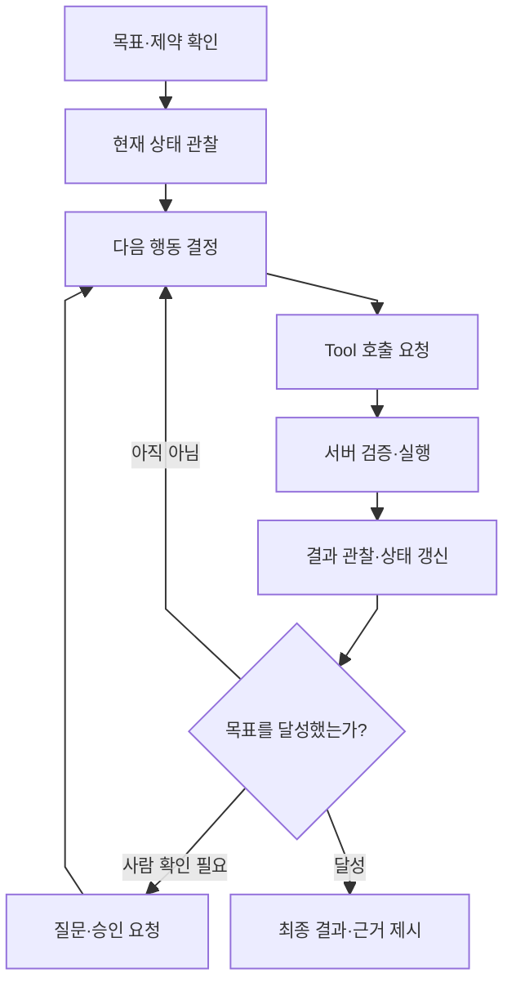

> 에이전트란 무엇이며, 기존의 단독 LLM 또는 단순 챗봇과 무엇이 다른가? 에이전트 내부에서는 어떤 단계가 진행되는가?

AI 에이전트는 **LLM을 판단 엔진으로 사용하면서, 목표와 현재 상태를 기준으로 다음 행동을 고르고, 행동의 결과를 다시 관찰하여 목표를 완료 할 때까지 경로를 수정하는 시스템**이다.

## 비교

| 구분     | 중심 기능              |          행동 |            경로 변화 |
| ------ | ------------------ | ----------: | ---------------: |
| LLM 단독 | 입력을 받아 문장을 생성      |          없음 |               없음 |
| 단순 챗봇  | 대화 문맥을 이어 응답       |       보통 없음 |       사용자 입력에 의존 |
| 에이전트   | 목표를 달성하도록 다음 행동 선택 | Tool을 통해 가능 | 관찰 결과에 따라 스스로 분기 |

대화를 여러 번 이어간다는 사실만으로는 에이전트가 아니다. 핵심은 **현재 상태에 따라 다음 실행 경로를 선택하는가**이다.

## 내부 작동의 핵심 루프

LLM은 어디까지나 **목표와 현태 상태를 해석**하고 이에 따른 **행동을 제안**하는 것만 할 뿐이다. 에이전트의 실행 흐름 관리, 스키마 검증, 서버(벡엔드)에 특정 실행을 요청하는 작업은 오케스트레이터가 담당한다.

오케스트레이터: 에이전트에서 판단을 검증하고 실제 실행 흐름 관리하는 시스템 부분
스키마: 입력값과 출력값의 종류와 형태를 지정하는 부분

## 설계 상에서 에이전트를 고려할 때 주의할 점

- 상황에 따라 이행해야 할 행동이 여러 개이며 각 행동이 실행되는 시점을 판단 해야 하는 업무라면 에이전트를 구축하는 것이 맞다.
- 그러나 상황을 따로 파악하지 않고 지정된 경로만 따라 가기만 하면 되는 작업은 고정 워크플로(아마 langchain같은)가 더 단순하고 안정적이다.
- 따라서 자동화 하고자 하는 **업무가 상황에 따라 판단을 해야 하는지 아닌 지를 구분**하는 것이 중요하다.

- 좋은 에이전트는 행동을 엄청 많이 하거나 무조건 오래 도는 시스템이 아니라, **필요한 행동하고 목표를 이루면 멈추는 시스템**이다.
- 이를 위해 **목표, 상태, 행동 등을 명확하게 정의**해야 한다.

## 결론

> 에이전트의 핵심은 ‘무언가 행동을 하느냐’가 아니라 목표가 주어졌을 때 ‘**현재의 상태를 확인**하고 **다음에 이행해야 할 행동을 판단** 하느냐’에 있다. 즉, 에이전트를 설계한다면 "이 일을 처리하기 위해서는 어떤 행동들을 해야하지?"를 명확히 해야한다.