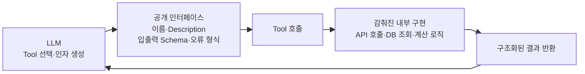
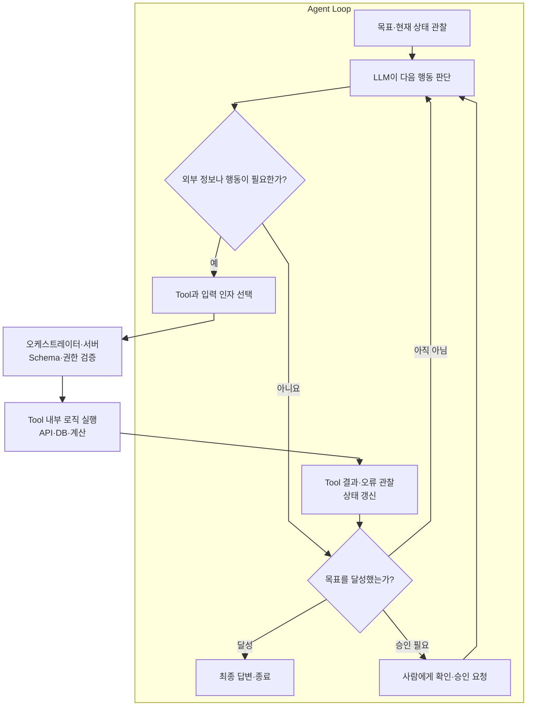

> 에이전트는 어떤 구조로 판단과 행동을 반복하며, 모델(LLM)의 판단을 실제 작업과 어떻게 연결하는가?

# 한 줄 요약

에이전트의 핵심은 **현재 상태를 바탕으로 다음 행동을 반복해서 결정**하는 **Loop 구조**와 그 판단을 데이터 조회나 작업과 같은 **행동으로 연결**하는 **Tool**이다.

## 두 요소의 역할과 설계 질문

| 요소 | 역할 | 반드시 정할 설계 질문 |
|---|---|---|
| Loop | 관찰–판단–행동 반복 | 언제 시작하고, 재시도하고, 사람에게 넘기고, 멈출 것인가? |
| Tool | 조회·검색·생성·변경을 수행하는 팔 | 어떤 기능을 어떤 권한과 검증을 거쳐 실행하게 할 것인가? |

- Loop는 무한 반복이 아니라 목표와 행동과, 그리고 종료 조건을 가진 **제어 구조**다.
- Tool은 LLM이 호출할 수 있도록 이름·Description·입출력 Schema·오류 형식과 실행 로직을 결합한 API 인터페이스이며, LLM과 실제 실행 시스템 사이의 접점이다.
API(Application Programming Interface)는 앱 사이에서 통신을 위한 지정된 형태의 인터페이스라는 의미이며 Tool도 API의 범주라고 볼 수 있다.

LLM은 Tool 내부의 API 호출이나 계산·DB 조회 로직을 전부 읽지 않는다. 대신 외부에 공개된 이름, Description과 Schema를 보고 Tool의 역할과 호출 방법을 판단한다.

즉, 내부 로직을 전부 알려주지 않고 **LLM이 현재 상태에 따른 판단·호출을 결정하는 데 필요한 사항만 보여 주는 것**이다.

## Loop 안에서 Tool이 호출되고 결과가 돌아오는 구조

Loop는 Tool 자체가 아니라 **Tool을 사용할지 결정하고, 실행 결과를 다시 관찰해 다음 행동을 고르는 제어 구조**다. Tool은 Loop가 외부 정보나 행동이 필요하다고 판단했을 때만 호출된다.

## 결론

> 에이전트는 Loop를 통해 다음 행동을 판단하고, Tool을 통해 그 판단을 실제 세계의 조회와 행동으로 연결한다.
