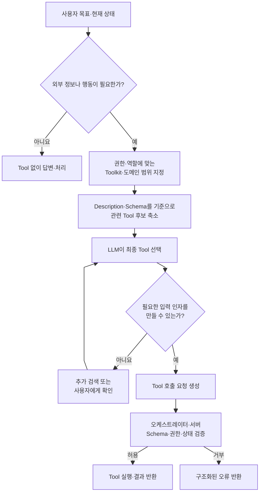

> Toolkit과 Tool은 무엇이 다른가? 사용자의 질문과 Description·Schema를 비교해 어떤 Tool을 쓸지 어떻게 결정하는가? Toolkit으로 1차 분류하고 임베딩 벡터로 후보를 좁히는가?

Tool은 에이전트가 외부 세계에 수행할 수 있는 **한 가지 능력**이고, Toolkit은 특정 기준에 따라 관련된 Tool들을 묶은 **기준 경계**다. Tool 선택은 필요성 판단, 후보 축소, 최종 선택, 실행 등의 여러 단계로 나뉜다.

## Tool의 구성

```text
Tool = 이름 + Description + 입출력 Schema + 오류의 형태 지정
       + 실행 로직
```

Description과 Schema를 **모델이 읽고 판단하는 데 활용**한다. 둘 중 하나만 있어서는 안전한 Tool이 되지 않는다.

## Tool과 Toolkit

| Tool | Toolkit |
|---|---|
| 검색, 특정 회의록 조회처럼 한 가지 업무 능력 | 회의, 문서, 일정처럼 관련 Tool의 묶음 |
| 모델이 실제로 호출 | 후보 Tool의 범위와 정책을 좁히는 데 사용 |
| 입력·출력·오류 계약이 핵심 | 도메인·권한·제품 경계가 핵심 |

Toolkit은 반드시 런타임에 모델이 먼저 고르는 별도 단계일 필요는 없다. Tool이 적으면 모두 직접 제공하는 편이 낫고, Tool이 많아져 선택 오류와 토큰 비용이 커질 때 계층 라우팅을 도입한다.

## Tool 선택 파이프라인



## 임베딩 검색의 정확한 위치

- 오프라인: Tool 이름·Description·Schema 요약을 임베딩하여 벡터 인덱스를 만든다.
- 런타임: 사용자 요청과 현재 계획을 임베딩해 가까운 Tool 후보 Top-K를 찾는다.
- 최종 선택: LLM 또는 규칙·재랭커가 후보 중 하나를 선택하고 인자를 만든다.

즉 임베딩은 대개 **정답 결정기**가 아니라 **후보 생성기**다. 의미가 비슷하지만 권한이나 상태가 맞지 않는 Tool을 걸러내려면 최종 판단과 서버 검증이 별도로 필요하다.

## 규모별 권장 구조

- Tool 3~10개: 모든 정의를 제공하고 직접 선택 성능부터 측정한다.
- 수십 개: Toolkit/권한으로 1차 필터링하고 lexical·embedding 검색을 혼합한다.
- 수백 개 이상: 하이브리드 후보 생성, 재랭킹, 캐시, 역할별 카탈로그를 검토한다.

## 결론

> Tool 선택은 ‘질문과 설명의 유사도 비교’ 하나가 아니라, 필요성–후보–선택–인자–권한 검증으로 이어지는 파이프라인이다.
