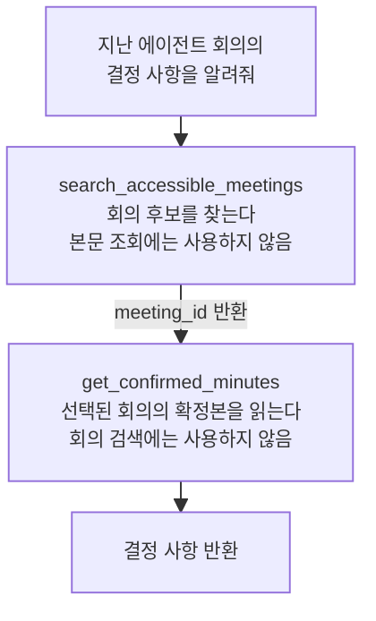
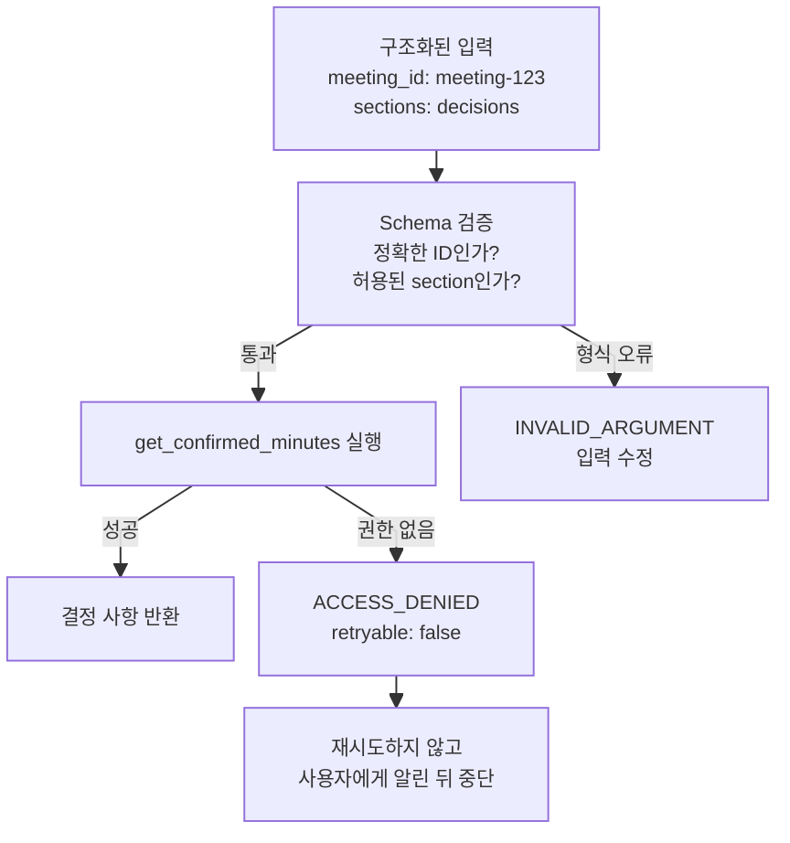

> 결국 Tool을 어떻게 잘 만들고 붙이는가? 특히 Tool Description은 어떻게 써야 하는가? 권한·보안은 어떻게 설계하고 실제 프로젝트에는 어떻게 적용하는가?

## 한 문장 답변

좋은 Tool은 모델이 목적과 경계를 쉽게 구분하고, 서버가 권한과 인자를 강제하며, 개발자가 선택·오류·비용을 측정할 수 있는 **작고 명확한 업무 인터페이스**다.

## 1. Tool 경계를 먼저 설계한다

- 범용 API를 그대로 노출하지 말고 모델이 이해할 업무 단위로 감싼다.
- 한 Tool은 한 문장으로 설명 가능한 목적을 갖게 한다.
- 읽기와 쓰기를 분리한다.
- Tool 실행 뒤 에이전트가 다음 판단을 할 수 있도록 구조화된 결과를 반환한다.
- 모델이 알 필요 없는 user_id, tenant_id, 권한 정보는 서버가 주입한다.

## 2. Description 작성 공식

```text
[무엇을 한다]
[언제 사용한다]
[언제 사용하지 않는다 / 유사 Tool과 차이]
[중요 입력의 의미와 제약]
[중요 출력·오류와 그다음 행동]
```

나쁜 설명: `회의 정보를 가져온다.`

좋은 설명의 방향: `현재 사용자가 접근 가능한 회의를 제목·날짜·채널로 찾는다. 회의 본문이나 전사 근거 조회에는 사용하지 않는다. meeting_id와 확정 상태를 반환한다.`

Description은 장황한 문서가 아니라 **경계를 명확히 하도록 하는 요소**이다. 비슷한 Tool끼리는 서로의 금지 조건을 대칭적으로 적는 것이 중요하다.

### 간단한 예시



첫 번째 Tool은 **회의를 찾는 역할**, 두 번째 Tool은 **찾은 회의의 확정 내용을 읽는 역할**로 선택 경계가 구분된다.

## 3. Schema는 설명을 실행 가능한 제약으로 바꾼다

- enum, required, format, 범위 제한으로 잘못된 호출을 줄인다.
- 단순 텍스트보다 ID와 구조화 필드가 좋다.
- 오류 코드는 `재시도`, `다른 Tool`, `사용자 신원`, `중단`을 구분할 수 있어야 한다.

### 간단한 예시



이렇게 하면 에이전트는 같은 요청을 무작정 재시도하지 않고, 권한이 없어 실행할 수 없다는 사실을 사용자에게 알린 뒤 중단할 수 있다.

## 4. 권한과 보안은 서버에서 강제한다

- 모델의 판단은 권한 검사가 아니다.
- 인증 사용자는 서버에서 가져온다.
- 외부 문서와 Tool 결과는 신뢰할 수 없는 데이터로 취급한다.
- 민감한 쓰기는 미리보기와 실행을 분리하고, 위험도에 따라 사람 승인을 요구한다.

## 결론

> 좋은 Tool은 모델이 쉽게 고르고, 서버가 안전하게 거부하며, 팀이 실제 결과로 개선할 수 있어야 한다.
