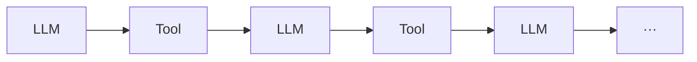

# 1. 에이전트의 진짜 원리: 개요

에이전트가 Loop를 도는 과정은 흔히 다음과 같이 설명된다.

> LLM과 Tool이 번갈아 가며 작동한다.

틀린 말은 아니지만, 이것만으로는 에이전트의 Loop가 돌아가는 원리를 완전히 이해했다고 보기 어렵다.

에이전트는 **목표가 주어졌을 때 판단하고 행동한다.**

그렇다면 다음과 같은 의문이 생긴다.

## 그래서 어떻게 판단하는 것인가?

LLM은 입력이 들어오면 그에 따른 출력값을 내보내는 구조일 뿐이다. 만약 LLM 옆에 붙은 Tool이 특정한 일만 수행한다면, 그 Tool을 사용할지 판단하는 또 다른 작은 에이전트가 존재하는 것일까?

하지만 이런 식으로 계속 들어가다 보면 다시 다음 질문에 도달한다.

> 그렇다면 최초의 에이전트는 어떻게 만들어지는가?

결국 에이전트가 판단하고 행동한다는 말이 실제로 어떤 구조를 의미하는지부터 이해해야 한다.

그 과정은 다음 문서에서 살펴본다.

→ [[02 AI 에이전트에서 LLM과 Tool이 동작하는 과정]]
