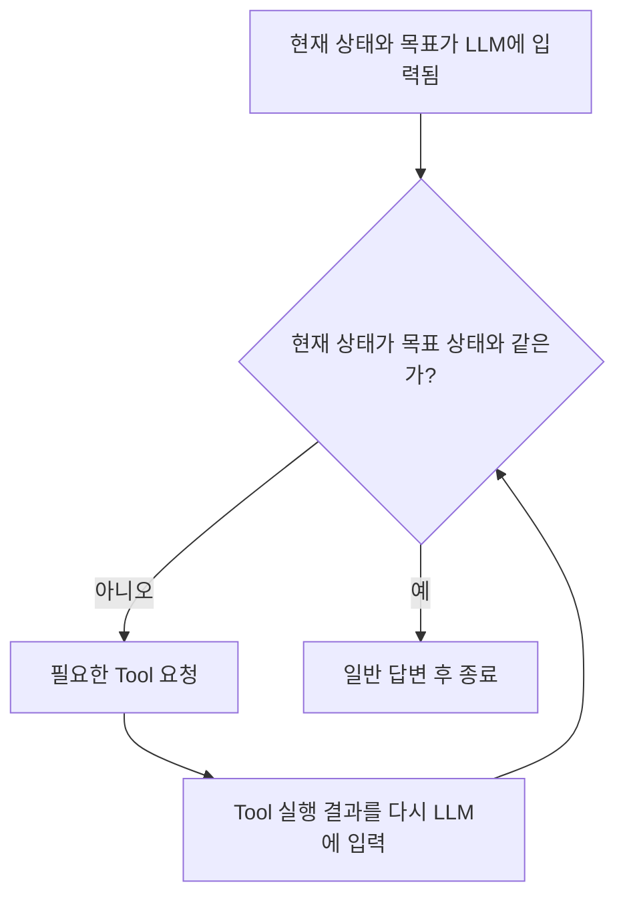

# 2. AI 에이전트에서 LLM과 Tool이 동작하는 과정

앞에서 말했듯이 **LLM은 입력이 들어오면 출력값을 내보내는 구조일 뿐이다.**

그렇다면 LLM에 붙어 있는 에이전트, 즉 오케스트레이션 쪽에서 에이전트가 동작하도록 구조를 만들어주고 있는 것이다.

오케스트레이션에서는 프롬프트 등을 통해 LLM이 다음 두 가지 중 하나로 응답하도록 만든다.

> Tool이 필요하면 Tool을 요청하고, 필요하지 않으면 일반 답변을 한다.

사실 일반 답변도 `finish`라는 이름의 Tool로 표현할 수 있다. 하지만 지금은 개념적인 이해를 위해 **Tool 호출**과 **일반 답변 및 종료**를 분리해서 생각한다.

현재 상태가 목표 상태와 같다면 일반 답변을 하고 종료한다. 현재 상태가 목표 상태와 다르다면 목표를 이루는 데 필요한 Tool을 요청한다.

## 예시: 오늘의 경제 뉴스 저장

오늘의 경제 뉴스 기사를 가져와 저장하는 간단한 에이전트를 만든다고 가정해 보자.

이 에이전트가 해야 할 일은 다음 세 가지다.

1. 특정 폴더에 오늘자 경제 뉴스 기사가 있는지 확인한다.
2. 없다면 네이버 뉴스에서 경제 뉴스 기사 하나를 가져온다.
3. 가져온 기사 내용을 Markdown 파일로 저장한다.

각각의 일을 Tool로 만든 뒤 에이전트에게 다음과 같이 요청한다.

> 오늘의 경제 뉴스 기사를 가져오고 저장해 줘.

LLM은 먼저 첫 번째 Tool을 호출하여 특정 폴더에 오늘자 경제 뉴스 기사가 있는지 확인한다.

Tool이 실행된 후 다음과 같은 결과가 다시 LLM으로 들어간다.

> 오늘자 경제 뉴스 기사가 없다.

여기서 중요한 점은 거의 모든 Tool의 실행 결과가 다시 LLM의 입력에 포함되도록 설계된다는 것이다. 그래야 LLM이 그 결과를 읽고 다음 Tool을 호출할지, 일반 답변을 하고 종료할지 다시 결정할 수 있다.

`오늘자 경제 뉴스 기사가 없다`는 정보가 입력에 포함되었으므로 LLM은 두 번째 Tool을 호출하여 네이버 뉴스에서 경제 뉴스 기사 하나를 가져온다.

두 번째 Tool의 실행이 끝나면 경제 뉴스 기사 내용이 다시 LLM의 입력에 포함된다.

LLM은 기사 내용이 들어온 것을 확인하고 세 번째 Tool을 호출하여 뉴스 내용을 Markdown 파일로 저장한다.

세 번째 Tool이 실행되면 다음 결과가 다시 LLM으로 들어간다.

> 저장을 완료했다.

이제 LLM은 저장까지 완료되었다는 내용을 읽고 더 이상 Tool을 호출하지 않는다. 대신 일반 답변을 반환하고 실행을 끝낸다.

## 에이전트가 실행되기 전에 주어진 행동 기준

이 에이전트의 LLM에는 시스템 프롬프트 등을 통해 다음과 같은 행동 기준이 주어져 있다고 볼 수 있다.

1. 처음에는 첫 번째 Tool로 현재 상태를 확인한다.
2. `저장되어 있지 않다`는 결과가 들어오면 두 번째 Tool로 뉴스 기사를 가져온다.
3. 뉴스 기사 내용이 들어오면 세 번째 Tool로 저장한다.
4. `저장이 완료되었다`는 결과가 들어오면 Tool을 호출하지 않고 답변한다.

## 핵심 정리

> 에이전트는 LLM이 `Tool 호출` 또는 `일반 답변` 중 하나를 선택하게 하고, 목표가 이루어질 때까지 Tool 호출 결과를 다시 LLM에 넣어주는 시스템이다.

그렇다면 왜 LLM이 직접 명령어를 만들어 실행하게 하지 않고, 굳이 Tool이라는 형태를 사용하게 된 것일까?

→ [[03 그렇다면 왜 Tool인가]]
