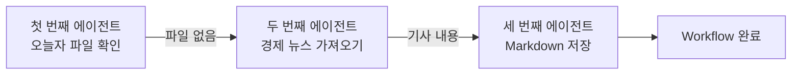
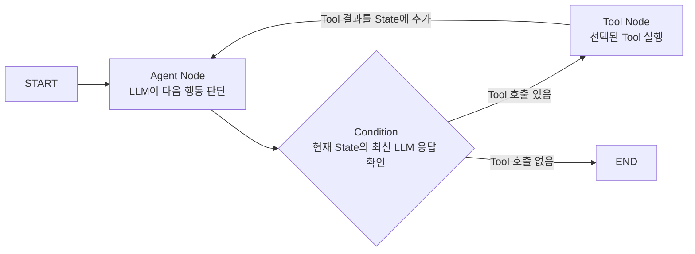

# 5. Graph Engineering

앞 문서에서는 범용 에이전트가 많은 Tool과 긴 컨텍스트를 사용하게 되는 한계를 살펴봤다.

그렇다면 이 문제를 어떻게 해결할 수 있을까?

우리 AI Lab 팀이 **특정한 작은 일만 수행하는 에이전트를 만들고, 그 에이전트들을 적절하게 이어 붙이는 것**이다.

이 과정은 두 단계로 나눌 수 있다.

## 첫 번째 단계: 작은 에이전트 만들기

먼저 한두 개 정도의 Tool만 붙이고, Loop를 많이 돌지 않으면서 특정한 작은 일만 수행하는 에이전트를 만든다.

`오늘의 경제 뉴스를 가져오고 저장하는 일`에 다시 적용해 보자.

### 오늘의 경제 뉴스 하나를 가져오는 에이전트

1. 뉴스를 검색하는 Tool을 만든다.
2. 시스템 프롬프트에 경제 뉴스를 가져오라는 요구가 들어오면 해당 Tool을 사용하도록 작성한다.

### 특정 폴더에 저장하는 에이전트

1. 파일을 저장하는 Tool을 만든다.
2. 저장할 내용과 경로가 들어오면 해당 Tool을 사용하도록 작성한다.

### 오늘자 뉴스 파일을 확인하는 에이전트

1. 특정 폴더에 오늘자 뉴스 Markdown 파일이 있는지 확인하는 Tool을 만든다.
2. 파일 존재 여부를 확인하라는 요구가 들어오면 해당 Tool을 사용하도록 작성한다.

이렇게 작은 일만 수행하도록 만들면 Codex 같은 범용 에이전트에 비해 Loop를 적게 돌릴 수 있고, 더 저렴한 모델을 사용할 수도 있다.

## 두 번째 단계: 작은 에이전트들을 Workflow로 연결하기

이제 앞에서 만든 에이전트들을 하나의 Workflow로 연결한다.

첫 번째 에이전트는 특정 폴더 안에 오늘자 뉴스가 Markdown 파일로 저장되어 있는지 확인한다. 그리고 그 결과가 첫 번째 에이전트로 돌아가는 것이 아니라 두 번째 에이전트의 LLM에 들어가도록 설계한다.

두 번째 에이전트는 `오늘자 뉴스가 없다`는 결과를 받으면 오늘의 경제 뉴스 하나를 가져오는 Tool을 실행한다. 이 Tool의 결과인 기사 내용은 세 번째 에이전트의 LLM에 들어간다.

세 번째 에이전트는 전달받은 기사 내용을 특정 폴더에 저장하는 Tool을 실행한다.



## 범용 에이전트와 비교했을 때의 장점

### 1. 각 에이전트가 해야 할 일이 명확하다

Workflow가 미리 지정되어 있고 각 에이전트가 담당하는 일이 작기 때문에, LLM은 시스템 프롬프트를 읽고 자신이 해야 할 일을 명확하게 알 수 있다.

그만큼 판단에 필요한 토큰을 줄일 수 있고, 목표와 관련 없는 Tool을 호출하는 할루시네이션의 가능성도 줄어든다.

### 2. Loop와 컨텍스트를 줄일 수 있다

하나의 범용 에이전트 안에서 전체 업무를 처리하지 않기 때문에 Loop가 지나치게 많이 반복되지 않는다. 각 작은 에이전트에는 해당 작업에 필요한 정보만 전달할 수 있으므로 컨텍스트와 토큰 비용도 줄일 수 있다.

즉, 특정 업무에 한해서는 Codex 같은 범용 에이전트로 해결할 때보다 더 저렴하게 같은 결과를 얻을 수 있다.

## Graph Engineering이란?

Graph Engineering은 업무를 여러 실행 단계로 나누고, 각 단계가 어떤 정보를 받아 무엇을 수행하며 다음 어느 단계로 이동할지를 Graph로 설계하는 방법이다.

작은 에이전트 여러 개를 연결하는 것도 Graph Engineering의 한 가지 형태지만, **Node가 항상 하나의 에이전트인 것은 아니다.** 하나의 에이전트 안에서 LLM 실행, Tool 실행, 권한 검사와 결과 저장을 각각 Node로 나누어 연결할 수도 있다.

Graph에서는 다음 개념을 사용한다.

- **Node**: 실제 작업을 수행하는 실행 단계
- **Edge**: 한 Node가 끝난 뒤 다음 Node로 이동하는 연결
- **Condition**: 현재 State를 확인하여 어느 Edge로 이동할지 결정하는 분기 규칙
- **State**: Node 사이에서 전달되는 현재 작업 정보

```text
Node = 무엇을 실행할 것인가
Edge = 다음 어디로 이동할 것인가
Condition = 어느 경로로 이동할 것인가
State = 판단과 실행에 필요한 현재 정보
```

### Node

Node 안에는 다음과 같은 다양한 작업이 들어갈 수 있다.

- 프롬프트와 현재 State를 LLM에 전달하여 다음 행동을 판단
- LLM이 선택한 Tool 실행
- 일반 Python 로직 실행
- DB 조회 또는 결과 저장
- 권한 검사
- 사람의 승인 대기

따라서 `LLM`과 `Tool`은 Node가 수행할 수 있는 작업의 종류이지, Graph의 고정 구성요소 자체를 뜻하지 않는다.

### State

State는 Node 사이에서 공유되는 **현재 작업 상태의 전체 묶음**이다. 대화 기록뿐만 아니라 Tool 결과, 처리 상태, 오류, 권한 검사 결과와 재시도 횟수처럼 다음 실행에 필요한 정보를 구조화하여 보관할 수 있다.

```python
State = {
    "messages": [...],       # 사용자·LLM·Tool 메시지
    "file_exists": False,   # 오늘자 파일 존재 여부
    "retry_count": 1,       # 현재 재시도 횟수
    "authorized": True,     # 권한 검사 결과
}
```

State의 모든 값이 실행할 때마다 계속 쌓이는 것은 아니다. 필드의 성격과 갱신 규칙에 따라 누적하거나 최신 값으로 덮어쓴다.

| State 필드 예시   | 갱신 방법                |
| ------------- | -------------------- |
| `messages`    | 새 메시지를 기존 목록에 계속 추가  |
| `file_exists` | 가장 최근 확인 결과로 덮어쓰기    |
| `retry_count` | 재시도할 때 계산한 값으로 갱신    |
| `authorized`  | 가장 최근 권한 검사 결과로 덮어쓰기 |

현재 경제 뉴스 Agent는 LangGraph의 `MessagesState`를 사용한다. 따라서 사용자 요청, LLM의 Tool-call, Tool 실행 결과와 LLM의 최종 답변이 `messages`에 순서대로 누적된다.

```text
초기 State
→ [사용자 요청]

Agent Node 실행 후
→ [사용자 요청, LLM의 check_today_news 호출]

Tool Node 실행 후
→ [사용자 요청, LLM의 Tool 호출, Tool 실행 결과]

Agent Node 재실행 후
→ [사용자 요청, LLM의 Tool 호출, Tool 실행 결과, 다음 LLM 응답]
```

State와 LLM의 컨텍스트가 항상 같은 것은 아니다. **State는 애플리케이션이 보관하는 전체 작업 정보**이고, 그중 Agent Node가 골라 LLM에 전달한 정보만 실제 LLM 컨텍스트가 된다.

```text
Graph State 전체
→ Agent Node가 필요한 항목 선택
→ 시스템 프롬프트와 함께 LLM에 전달
→ 이 부분만 LLM의 현재 컨텍스트가 됨
```

### Edge

Edge는 Tool이 아니라 한 Node가 끝난 뒤 다음 Node로 이동하는 경로다.

- `START → Agent`: Graph가 시작되면 Agent Node 실행
- `Tools → Agent`: Tool 결과를 관찰하고 다시 판단하도록 Agent Node로 복귀
- `Agent → END`: 더 실행할 Tool이 없으면 Graph 종료

`Tools → Agent`처럼 항상 같은 곳으로 이동하는 연결은 고정 Edge다. 반면 실행 결과에 따라 목적지가 달라지는 연결에는 Condition이 사용된다.

### Condition

Condition은 별도의 저장 공간이 아니라, **현재 State를 읽고 다음 어느 Edge로 이동할지 반환하는 분기 함수**다.

Condition은 State 전체를 읽을 수 있다. 반드시 최신 메시지만 확인해야 하는 것은 아니지만, 현재 경제 뉴스 Agent에서는 State의 마지막 LLM 응답만 확인하면 다음 경로를 결정할 수 있다.

```python
def route(state):
    latest_message = state["messages"][-1]

    if latest_message.tool_calls:
        return "tools"

    return "end"
```

경제 뉴스 단일 에이전트의 실제 분기는 다음과 같다.



실행 순서는 다음과 같다.

```text
1. Agent Node가 현재 State를 바탕으로 LLM을 실행한다.
2. LLM 응답을 State의 messages에 추가한다.
3. Condition이 갱신된 State의 최신 LLM 응답을 읽는다.
4. tool_calls가 있으면 Tools Node로 가는 Edge를 선택한다.
5. tool_calls가 없으면 END로 가는 Edge를 선택한다.
6. Tool Node가 실행된 경우 결과를 State에 추가하고 Agent Node로 돌아간다.
```

따라서 State가 스스로 다음 경로를 결정하는 것이 아니다. Node가 State를 갱신하고, Condition이 그 State를 읽어 이동할 Edge를 선택한다.

이 예시에서는 하나의 Agent Loop를 `Agent Node`와 `Tool Node`로 나누었다. 반대로 복잡한 업무에서는 하나의 Node가 독립된 작은 에이전트 전체를 실행하도록 설계할 수도 있다. 즉 Node의 크기와 책임은 해결하려는 업무에 맞게 정한다.

Graph Engineering을 통해 실행 단계, 정보의 흐름과 분기 조건을 명확하게 설계하면 범용 에이전트의 불필요한 Loop와 컨텍스트를 줄이고, 중요한 업무 규칙을 확정적인 코드 경로에 배치할 수 있다.

## 우리 AI Lab 팀의 핵심 비즈니스

앞의 경제 뉴스 예시는 원리를 설명하기 위한 매우 단순한 사례다.

향후 SAP MM 모듈의 구매 업무 Workflow를 에이전트로 자동화하는 것과 같은 큰 프로젝트에서는 Graph를 훨씬 치밀하게 설계해야 한다.

실제 비즈니스 Workflow와 비교하면서 다음 사항을 판단해야 한다.

- 어느 부분부터 어느 부분까지를 하나의 Task로 볼 것인가?
- 하나의 에이전트가 어디까지 담당하게 할 것인가?
- 단일 에이전트 안에서 어느 부분까지 LLM의 판단을 신뢰할 것인가?
- 민감한 정보나 반드시 지켜야 하는 규칙은 어디부터 Tool의 확정적인 로직으로 처리할 것인가?

이러한 경계를 설계하는 일에는 AI 기술뿐만 아니라 실제 업무에 대한 이해도 필요하다.

고객사가 이 중요한 **판단과 설계**를 전문가에게 맡길 수 있도록 하는 것이 우리 AI Lab 팀의 핵심 비즈니스가 될 수 있다.

## 핵심 정리

> Graph Engineering은 업무를 실행 단계인 Node로 나누고, State를 바탕으로 Edge와 Condition을 통해 실행 순서와 분기를 연결하여 하나의 Workflow를 만드는 설계 방법이다. 각 Node는 LLM, Tool, 일반 로직 또는 작은 에이전트 전체가 될 수 있다.
