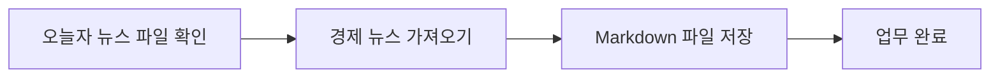
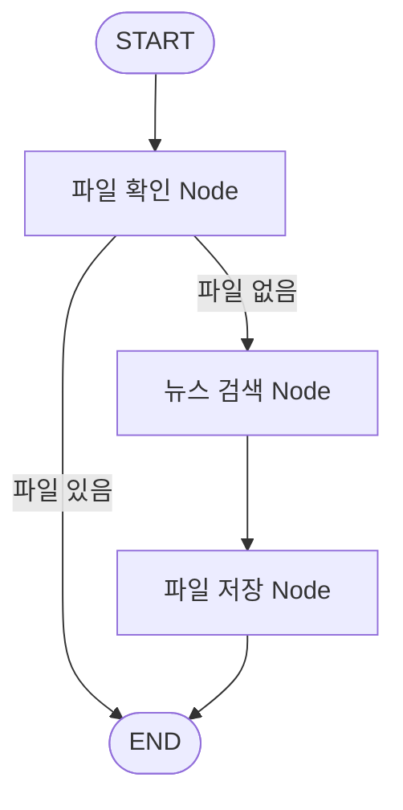
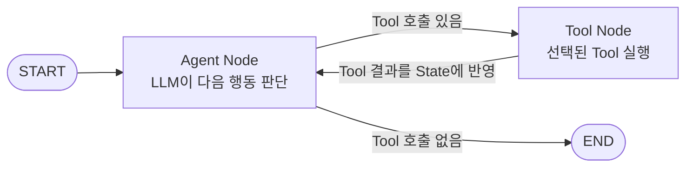
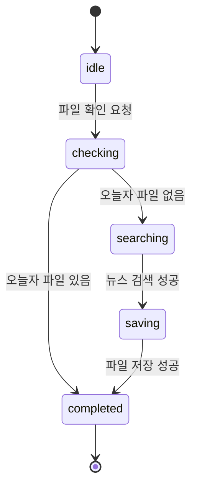
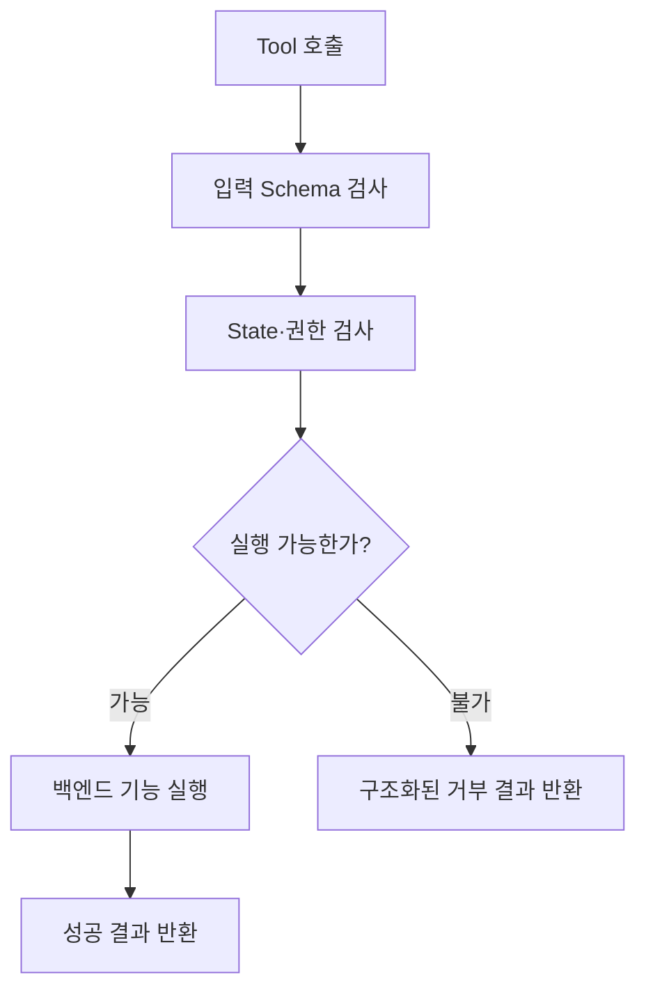

# 5. Graph Engineering

앞 문서에서는 하나의 범용 에이전트에 많은 Tool과 긴 컨텍스트를 붙였을 때 발생할 수 있는 한계를 살펴봤다.

그렇다면 복잡한 업무를 어떻게 더 명확하고 통제 가능한 구조로 만들 수 있을까?

업무를 책임 단위로 나누고, 각 단위를 일반 코드·Tool·LLM·Agent 중 무엇으로 구현할지 결정한 뒤, 실행 순서와 분기를 Graph로 설계할 수 있다. 이 문서에서는 이러한 설계 활동을 **Graph Engineering**이라고 부른다.

> **Graph Engineering은 LangGraph의 공식 구성요소 이름이 아니라, 업무를 실행 단위로 분해하고 State·Node·Edge를 이용해 실행 구조를 설계하는 방법을 설명하기 위해 이 문서에서 사용하는 표현이다.**

## Workflow와 Agent의 차이

두 개념을 먼저 구분해야 한다.

- **Workflow**: 실행 순서와 분기가 코드로 미리 정해져 있다.
- **Agent**: LLM이 현재 목표와 관찰 결과를 보고 다음 행동과 사용할 Tool을 동적으로 결정한다.

```text
Workflow
→ “파일이 없으면 검색한 뒤 저장한다”는 순서를 코드가 결정

Agent
→ 목표와 현재 결과를 보고 LLM이 검색할지, 저장할지, 다시 시도할지 결정
```

따라서 업무의 모든 단계를 Agent로 만들 필요는 없다. 결과가 확정적인 검증·조회·저장은 일반 Node나 Tool로 구현하고, 입력에 따라 판단 방법이 달라지는 부분에만 LLM 또는 Agent를 사용하는 것이 자연스럽다.

> [!note] 참고 — 범용 코딩 Agent와 Harness Engineering
> **Codex나 Claude Code 같은 범용 코딩 Agent는 사용자가 어떤 작업을 요청할지 사전에 특정하기 어렵다.** 따라서 정해진 업무 순서와 분기를 미리 구성하는 Graph Engineering만으로 전체 행동을 고정하기보다, Agent가 상황에 따라 파일·터미널·검색 등의 Tool을 선택하도록 하고 그 실행을 권한·격리·승인·추적 장치로 통제하는 **Harness Engineering 중심의 구조**가 적합하다.
>
> 반면 특정 업무 Workflow를 반복적으로 자동화하는 Agent는 실행 단계와 분기를 미리 정의할 수 있으므로 **Graph Engineering을 통한 명시적인 흐름 제어**가 효과적이다. 두 방법은 배타적이지 않으며, 범용 Harness 안에서 특정 업무를 Graph로 실행하는 식으로 함께 사용할 수도 있다.

## Graph Engineering에서 구분해야 할 네 가지 그림

네모와 화살표로 이루어졌다고 모두 같은 종류의 Graph는 아니다.

| 그림 | 무엇을 보여주는가 | 주요 표현 |
|---|---|---|
| **업무 워크플로우** | 사용자 관점의 업무 순서 | 회의 시작 → 진행 → 공유 |
| **Graph Engineering 관점의 실행 Graph** | 실제 실행 Node와 라우팅 Edge | LLM Node, Tool Node, Conditional Edge |
| **State 전이도** | State 값이 어떤 사건으로 바뀌는가 | `none → recording → pause` |
| **순서도** | 하나의 기능 내부에서 검사·처리가 어떻게 진행되는가 | 권한 검사 → 실행 → 결과 반환 |

업무 워크플로우와 State 전이도도 수학적으로는 Graph 구조를 가질 수 있다. 그러나 그것만으로 실제 Agent Runtime의 Node와 Edge를 정의한 **실행 Graph**가 되는 것은 아니다.

## 경제 뉴스 사례로 구분하기

`오늘의 경제 뉴스를 가져와 Markdown 파일로 저장한다`는 업무를 예로 들어보자.

### 1. 업무 워크플로우

먼저 사용자 관점의 업무 흐름만 표현한다.



이 그림은 **무슨 업무를 어떤 순서로 수행하는지**를 보여준다. 아직 각 상자가 일반 함수인지, Tool인지, Agent인지는 결정하지 않은 상태다.

### 2. 각 단위의 구현 방식 결정

각 단계에서 LLM의 동적 판단이 필요한지 확인한다.

| 업무 | 권장 구현 | 이유 |
|---|---|---|
| 오늘자 파일 존재 여부 확인 | 일반 코드 또는 Tool Node | 검사 방법과 결과가 결정적임 |
| 경제 뉴스 검색 | Tool Node 또는 Agent Node | 검색 조건을 LLM이 판단해야 하는지에 따라 결정 |
| Markdown 저장 | 일반 코드 또는 Tool Node | 입력과 저장 위치가 정해지면 동작이 결정적임 |

단순히 Tool 하나를 정해진 방식으로 호출하는 구성요소를 모두 독립 Agent로 만들면 LLM 호출과 State 관리만 늘어날 수 있다. 반대로 뉴스 주제 선정, 검색 전략 변경과 결과 평가가 필요하다면 해당 부분은 Agent로 구성할 수 있다.

### 3. 실행 Graph

파일이 없을 때만 뉴스를 검색하도록 실제 실행 Node와 Edge를 정의한다.



여기에서 `파일 있음`과 `파일 없음`은 파일 확인 결과를 읽는 **Conditional Edge의 분기 결과**다. Condition을 별도의 실행 Node로 만든 것이 아니다.

## Graph의 핵심 구성요소

LangGraph의 Graph는 크게 세 가지 요소로 구성된다.

```text
Graph
├─ State
├─ Node
└─ Edge
   ├─ 고정 Edge
   └─ Conditional Edge
      └─ 다음 경로를 반환하는 라우팅 함수
```

```text
State = 현재 실행 정보의 구조
Node = 실제 작업을 수행하는 함수
Edge = 다음에 실행할 Node를 정하는 연결
```

### State

State는 Node 사이에서 공유되는 **현재 애플리케이션 상태의 스냅샷**이다. 대화 기록, Tool 결과, 처리 상태와 재시도 횟수처럼 다음 실행에 필요한 정보를 구조화하여 보관할 수 있다.

```python
class State(TypedDict):
    messages: list
    file_exists: bool
    retry_count: int
```

State의 모든 값이 실행할 때마다 누적되는 것은 아니다. Node는 변경할 필드만 부분 Update로 반환하고, 각 필드의 **Reducer**가 기존 값과 Update를 어떻게 합칠지 결정한다.

| State 필드 | 갱신 방법 예시 |
|---|---|
| `messages` | 새 메시지를 기존 목록에 추가 |
| `file_exists` | 가장 최근 검사 결과로 덮어쓰기 |
| `retry_count` | 계산된 최신 값으로 갱신 |

State에 권한 검사 결과를 넣을 수는 있지만, 그 값만으로 실제 권한을 확정하면 안 된다. State의 권한 결과는 실행을 돕는 정보일 뿐이며 **실제 권한은 Tool 뒤의 백엔드에서 다시 강제**해야 한다.

#### State와 LLM 컨텍스트의 차이

State와 LLM의 컨텍스트는 항상 같지 않다.

```text
Graph State 전체
→ Agent Node가 필요한 항목 선택
→ 시스템 프롬프트와 함께 조립
→ 조립된 정보만 LLM 컨텍스트로 전달
```

State는 애플리케이션이 보관하는 전체 실행 정보이고, 그중 LLM 호출에 넣은 정보만 실제 컨텍스트가 된다. 따라서 Node가 전체 State 객체를 입력받더라도 LLM이 모든 State 필드를 읽는 것은 아니다.

### Node

Node는 State를 입력받아 계산이나 부수 효과를 수행하고 State Update를 반환하는 실행 함수다.

Node 안에는 다음과 같은 작업이 들어갈 수 있다.

- 현재 State와 프롬프트를 LLM에 전달
- LLM이 선택한 Tool 실행
- 일반 Python 로직 실행
- DB 조회 또는 결과 저장
- 백엔드 권한 검사 호출
- Human in the Loop 중단
- 독립된 하위 Agent 또는 Workflow 실행

따라서 LLM과 Tool은 Node가 수행할 수 있는 작업의 종류이며, Node 자체가 항상 LLM이나 Agent를 뜻하는 것은 아니다.

#### Node의 책임 범위

Node는 가능한 한 **하나의 명확한 실행 책임**을 갖도록 나눈다. 모든 함수를 잘게 Node로 만들 필요는 없으며, 함께 성공하거나 실패해야 하고 같은 입력·출력 계약을 사용하는 작업은 하나의 Node로 묶을 수 있다.

```text
Node를 나누는 기준
→ 독립적으로 분기하거나 재시도해야 하는가?
→ 별도의 Checkpoint·Human in the Loop 경계가 필요한가?
→ 입력·출력 책임이 다른가?
→ 다른 Workflow에서도 재사용할 단위인가?
```

### Edge

Edge는 한 Node가 끝난 뒤 다음에 어떤 Node를 실행할지 정의한다.

- **고정 Edge**: 항상 같은 Node로 이동
- **Conditional Edge**: 현재 State를 읽은 라우팅 함수의 결과에 따라 이동
- **Entry Point**: `START`에서 처음 실행할 Node로 이동
- **종료 Edge**: 더 실행할 작업이 없을 때 `END`로 이동

```text
START → Agent Node       고정 Edge
Tool Node → Agent Node   고정 Edge
Agent Node → Tool/END    Conditional Edge
```

하나의 Node에서 여러 고정 Edge가 나가면 다음 Node들이 병렬로 실행될 수 있다. 따라서 한 Node의 정적 라우팅과 동적 라우팅을 의도 없이 섞지 않아야 한다.

### Condition

Condition은 별도의 저장 공간이나 필수 Node가 아니다. **현재 State를 읽고 다음 목적지를 반환하는 라우팅 함수**다.

```python
def route(state):
    latest_message = state["messages"][-1]

    if latest_message.tool_calls:
        return "tools"

    return "end"
```

실행 Graph에서는 Condition을 별도 마름모 Node로 그리기보다, 실제 Node에서 목적지로 이어지는 Conditional Edge와 Edge 라벨로 표현하는 것이 정확하다.

### START와 END

`START`와 `END`는 업무를 수행하는 일반 Node가 아니라 Graph의 진입점과 종료점을 나타내는 특수 Terminal이다.

- `START`: 사용자 입력이 들어왔을 때 처음 실행할 Node를 지정
- `END`: 해당 Graph 실행에서 더 수행할 Node가 없음을 표시

`END`가 항상 Agent 세션의 삭제나 종료를 뜻하는 것은 아니다. 요청 한 번의 Graph 실행이 끝나고 다음 사용자 입력을 기다릴 수도 있다.

## 단일 Agent Loop의 올바른 실행 Graph

경제 뉴스 Agent가 현재 요청을 보고 Tool을 선택하는 구조는 다음과 같이 표현할 수 있다.



실행 순서는 다음과 같다.

```text
1. Agent Node가 필요한 State를 LLM 컨텍스트로 조립한다.
2. LLM을 호출하고 응답을 State의 messages에 반영한다.
3. Conditional Edge의 라우팅 함수가 최신 LLM 응답을 확인한다.
4. Tool 호출이 있으면 Tool Node로 이동한다.
5. Tool Node가 실행 결과를 State에 반영하고 Agent Node로 돌아간다.
6. Tool 호출이 없으면 END로 이동한다.
```

State가 스스로 다음 경로를 결정하는 것이 아니다. **Node가 State를 갱신하고 Conditional Edge의 라우팅 함수가 State를 읽어 다음 Node를 선택**한다.

## State 전이도는 별도로 그린다

실행 Graph와 State 전이도는 서로 다른 질문에 답한다.

```text
실행 Graph
→ 다음에 어떤 Node가 실행되는가?

State 전이도
→ 어떤 사건으로 State 값이 바뀌는가?
```

예를 들어 뉴스 파일 처리 상태를 다음처럼 정의했다면 State 전이도는 값의 변화만 보여준다.



이 그림의 `idle`, `checking`, `searching`은 State 값이다. 파일 확인 Node나 검색 Node 자체를 의미하지 않는다.

## 순서도는 Node·Tool 내부 처리에 사용한다

하나의 Tool 내부에서 State·권한·실제 리소스를 검사하는 과정은 순서도로 표현할 수 있다.



이 그림은 Tool의 내부 알고리즘을 설명하며, 각 상자가 반드시 LangGraph Node라는 뜻은 아니다.

## Subgraph

Subgraph는 **여러 Node와 Edge로 구성된 Graph 하나를 상위 Graph에서 하나의 Node처럼 사용하는 구조**다.

```text
Main Graph
├─ 일반 Node
├─ Tool Node
└─ Subgraph Node
   ├─ 하위 Node A
   ├─ 하위 Node B
   └─ 하위 Node C
```

Subgraph가 반드시 Agent인 것은 아니다.

- 여러 일반 Node를 묶은 재사용 Workflow
- LLM과 Tool Loop를 가진 하위 Agent
- 검색·검증·선택을 하나로 묶은 기능 Graph

모두 Subgraph가 될 수 있다.

### 다중 Agent에서의 Subgraph

하위 Agent가 자체 LLM·Tool Loop를 Graph로 가지고 있다면, 그 Agent 전체를 상위 Graph의 Subgraph Node로 사용할 수 있다.

```text
Main Agent Graph
│
├─ 회의록 Agent Subgraph
│  ├─ LLM Node
│  ├─ Tool Node
│  └─ LLM ↔ Tool Loop
│
└─ SAP 분석 Agent Subgraph
   ├─ LLM Node
   ├─ Tool Node
   └─ LLM ↔ Tool Loop
```

상위 Graph와 Subgraph의 State Schema가 같다면 컴파일된 Subgraph를 Node로 직접 추가할 수 있다. Schema가 다르면 Wrapper Node가 상위 State를 하위 입력으로 변환하고, 하위 결과를 다시 상위 State Update로 변환한다.

```text
Parent State
→ Wrapper가 Subgraph 입력으로 변환
→ Subgraph 실행
→ Wrapper가 결과를 Parent State Update로 변환
```

Subgraph를 사용하면 상위 Graph는 내부 Node의 세부 순서를 알지 않고도 하위 Workflow나 Agent를 하나의 책임 단위로 사용할 수 있다.

## 작은 Agent를 연결할 때의 판단 기준

복잡한 업무를 여러 작은 Agent로 나누는 것은 Graph Engineering의 한 가지 선택지다. 다음 조건에서는 작은 Agent 또는 Subgraph 분리가 유용할 수 있다.

- 서로 다른 전문 지식과 Tool 권한이 필요함
- 각 영역을 독립적으로 개발·평가·배포해야 함
- 서로 다른 시스템 프롬프트와 컨텍스트가 필요함
- 하나의 책임 단위로 재사용할 가능성이 높음

반대로 정해진 Tool 하나를 실행하는 단순 작업까지 Agent로 만들면 다음 비용이 증가할 수 있다.

- LLM 호출 횟수와 지연 시간
- Agent 간 컨텍스트 변환
- State·Checkpoint 관리
- 오류와 재시도 지점
- 전체 실행 추적 난이도

따라서 **작게 나누는 것 자체가 목적이 아니라, LLM 판단이 필요한 경계와 결정적인 코드로 고정할 경계를 올바르게 나누는 것**이 중요하다.

## Graph Engineering의 기대 효과

Graph Engineering을 적용한다고 비용과 Loop가 자동으로 줄어드는 것은 아니다. 실행 경로와 전달 컨텍스트를 명시적으로 제한했을 때 다음 효과를 얻을 수 있다.

### 1. 책임과 실행 경계 명확화

각 Node와 Subgraph가 맡은 책임, 입력과 출력을 명확하게 정의할 수 있다.

### 2. LLM 판단 범위 제한

확정할 수 있는 업무 규칙은 일반 코드와 Tool 백엔드에 두고, 불확실한 판단에만 LLM을 사용할 수 있다.

### 3. Loop와 컨텍스트 제어

각 실행 단위에 필요한 정보만 전달하고 반복 횟수와 종료 조건을 코드로 제한할 수 있다.

### 4. 추적·평가·복구 단위 확보

어느 Node에서 어떤 State를 읽고 무엇을 반환했는지 추적할 수 있으며, 중요한 업무 경계에 Checkpoint를 배치할 수 있다.

## 우리 AI Lab 팀의 핵심 비즈니스

경제 뉴스 예시는 원리를 설명하기 위한 단순한 사례다.

향후 SAP MM 모듈의 구매 업무 Workflow를 에이전트로 자동화하는 프로젝트에서는 실제 비즈니스 Workflow를 기준으로 다음 사항을 판단해야 한다.

- 어느 부분부터 어느 부분까지를 하나의 Task로 볼 것인가?
- 어떤 단계는 일반 코드·Tool·LLM·Agent 중 무엇으로 구현할 것인가?
- 하나의 Agent 또는 Subgraph가 어디까지 담당할 것인가?
- 어느 부분까지 LLM의 판단을 허용할 것인가?
- 민감한 정보와 반드시 지켜야 하는 규칙은 어디에서 백엔드 코드로 강제할 것인가?
- 어떤 State를 상위 Graph와 하위 Subgraph 사이에 전달할 것인가?

이러한 경계를 설계하는 일에는 AI 기술뿐 아니라 실제 업무에 대한 이해가 필요하다.

고객사가 이 중요한 **판단과 설계**를 전문가에게 맡길 수 있도록 하는 것이 우리 AI Lab 팀의 핵심 비즈니스가 될 수 있다.

## 핵심 정리

> **Graph Engineering은 업무를 실행 책임 단위로 나누고, 각 단위를 일반 코드·Tool·LLM·Agent 중 무엇으로 구현할지 결정한 뒤, State·Node·Edge로 실행 흐름을 구성하는 설계 방법이다.** 업무 워크플로우, 실행 Graph, State 전이도와 순서도는 서로 다른 목적의 그림이므로 구분해야 한다. Subgraph는 하위 Workflow나 Agent Graph를 상위 Graph에서 하나의 Node처럼 사용하는 구조다.

## 참고 자료

- [LangGraph Graph API overview](https://docs.langchain.com/oss/python/langgraph/graph-api)
- [LangGraph Workflows and agents](https://docs.langchain.com/oss/python/langgraph/workflows-agents)
- [LangGraph Subgraphs](https://docs.langchain.com/oss/python/langgraph/use-subgraphs)
- [LangChain Custom workflow](https://docs.langchain.com/oss/python/langchain/multi-agent/custom-workflow)
