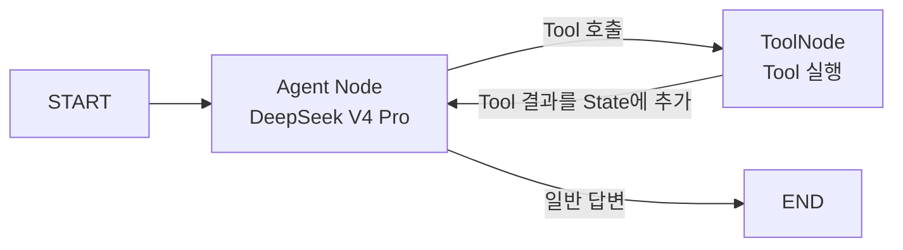

# 주제 선정 및 초기 구축

## 1. 프로젝트 목적

이 프로젝트의 목적은 복잡한 서비스를 만드는 것이 아니라, 에이전트가 다음 과정을 반복하는 원리를 직접 구현하고 확인하는 것이다.

> 목표 입력 → LLM의 판단 → Tool 실행 → 실행 결과 관찰 → 다음 행동 판단 → 목표 달성 후 종료

여러 에이전트를 연결하기 전, 몇 개의 Tool이 붙은 **단일 에이전트**부터 구축한다.

## 2. 선정한 주제

**오늘의 경제 뉴스 기사 한 건을 가져와 Markdown 파일로 저장하는 에이전트**를 구현한다.

사용자가 다음과 같이 목표를 전달한다.

> 오늘의 경제 뉴스 기사 하나를 가져와 Markdown 파일로 저장해 줘.

에이전트는 오늘자 파일이 있는지 먼저 확인한다. 파일이 없다면 경제 뉴스 한 건을 가져와 저장하고, 이미 있다면 중복 작업 없이 종료한다.

## 3. 이 주제를 선정한 이유

경제 뉴스 저장은 목표와 완료 상태가 명확하고, 에이전트가 판단하여 실행해야 할 행동도 단순하다.

- 오늘자 파일이 있는지 확인해야 한다.
- 파일이 없을 때만 뉴스를 가져와야 한다.
- 가져온 뉴스가 있을 때만 파일로 저장해야 한다.
- 저장이 완료되면 더 이상 Tool을 호출하지 않아야 한다.

따라서 Tool 실행 결과가 다음 LLM 입력으로 들어가고, LLM이 그 결과를 보고 다음 행동을 결정하는 Agent Loop를 쉽게 확인할 수 있다.

## 4. 기술 구성

- **언어**: Python 3.12
- **LLM**: DeepSeek V4 Pro
- **모델 ID**: `deepseek-v4-pro`
- **LLM 연동**: DeepSeek의 OpenAI 호환 API
- **오케스트레이션**: LangGraph
- **뉴스 입력**: 한국 경제 뉴스 Google News RSS
- **결과 저장**: 로컬 Markdown 파일

프로젝트 경로:

`C:\Users\염정운\project\ZEN-AI-Agent-Practice`

## 5. 단일 에이전트의 Graph



### Agent Node

현재까지의 사용자 요청과 Tool 실행 결과를 LLM에 전달한다. LLM은 다음 Tool을 호출할지, 일반 답변을 하고 종료할지 판단한다.

### Tool Node

LLM이 요청한 Tool을 실제로 실행한다. 실행 결과는 `ToolMessage`로 `MessagesState`에 추가된다.

### Conditional Edge

LLM 응답에 Tool 호출이 있으면 Tool Node로 이동하고, Tool 호출이 없으면 Graph를 종료한다.

### 반복 Edge

Tool 실행이 끝나면 다시 Agent Node로 돌아간다. 이를 통해 LLM이 Tool 결과를 관찰하고 다음 행동을 판단한다.

## 6. 구현한 Tool

### `check_today_news`

오늘자 경제 뉴스 Markdown 파일이 이미 있는지 확인한다.

### `fetch_economic_news`

오늘자 파일이 없을 때 경제 뉴스 RSS에서 최신 기사 한 건을 가져온다.

### `save_news_markdown`

가져온 기사 정보를 오늘 날짜의 Markdown 파일로 저장한다. 저장 경로는 Tool 내부에서 결정하며, 동일 날짜의 파일이 있으면 중복 저장하지 않는다.

## 7. 실제 실행 결과

### 첫 번째 실행

오늘자 파일이 없는 상태에서 다음 순서로 실행되었다.

```text
사용자 목표
→ check_today_news
→ 오늘자 파일 없음
→ fetch_economic_news
→ 경제 뉴스 기사 반환
→ save_news_markdown
→ 저장 완료
→ LLM 최종 답변
→ 종료
```

DeepSeek V4 Pro가 세 Tool을 순서대로 선택했고, 다음 파일이 실제로 생성되었다.

`data/news/2026-08-14-economic-news.md`

### 두 번째 실행

같은 목표를 다시 전달하자 다음 순서로 실행되었다.

```text
사용자 목표
→ check_today_news
→ 오늘자 파일이 이미 있음
→ 추가 Tool을 호출하지 않음
→ LLM 최종 답변
→ 종료
```

첫 번째 Tool의 결과를 관찰한 LLM이 뉴스 조회와 저장이 필요하지 않다고 판단하고 Loop를 종료했다.

## 8. 초기 구축 결과

- DeepSeek V4 Pro API 연결 완료
- LangGraph `StateGraph` 구성 완료
- LLM Node와 `ToolNode` 연결 완료
- Tool 호출 여부에 따른 조건부 종료 구현 완료
- 경제 뉴스 Tool 3개 구현 완료
- `.env`에 API Key 설정 완료
- `.env`와 생성된 뉴스 파일의 Git 제외 확인 완료
- Tool 단위 테스트 3개 통과
- 실제 Agent Loop 첫 실행 성공
- 기존 파일을 관찰한 두 번째 실행의 조기 종료 성공

## 9. 주요 파일

- [README.md](</C:/Users/염정운/project/ZEN-AI-Agent-Practice/README.md>): 설치, 실행 방법과 전체 구조
- [graph.py](</C:/Users/염정운/project/ZEN-AI-Agent-Practice/src/zen_news_agent/graph.py>): LangGraph Node와 Edge 구성
- [tools.py](</C:/Users/염정운/project/ZEN-AI-Agent-Practice/src/zen_news_agent/tools.py>): 경제 뉴스 Tool 3개
- [cli.py](</C:/Users/염정운/project/ZEN-AI-Agent-Practice/src/zen_news_agent/cli.py>): 실행과 Tool 경로 출력
- [test_tools.py](</C:/Users/염정운/project/ZEN-AI-Agent-Practice/tests/test_tools.py>): Tool 단위 테스트

## 핵심 정리

> 이번 초기 구축에서는 하나의 LLM이 현재 상태를 보고 Tool을 선택하고, Tool 결과를 다시 관찰한 뒤 다음 행동이나 종료를 선택하는 가장 단순한 LangGraph Agent Loop를 구현했다.
