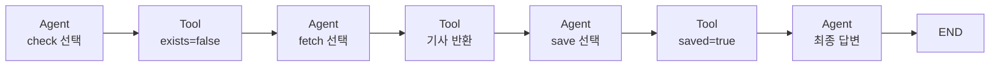
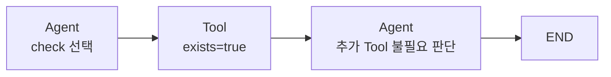

# 주제 선정 및 초기 구축 - 실제 실행 결과

  

## 1. 테스트 목적

  

`주제 선정 및 초기 구축.md`의 **7. 실제 실행 결과**에 작성된 다음 두 경로가 실제 Agent 실행에서도 동일하게 나타나는지 확인한다.

  

1. 오늘자 뉴스 파일이 없으면 `확인 → 뉴스 조회 → 저장 → 종료`를 수행하는가?

2. 오늘자 뉴스 파일이 이미 있으면 `확인 → 추가 작업 없이 종료`하는가?

  

이 테스트의 핵심은 단순히 파일이 생성됐는지만 확인하는 것이 아니다. DeepSeek V4 Pro가 현재 State와 Tool 결과를 보고 다음 행동을 선택하여 Agent Loop의 실행 경로가 달라지는지 확인하는 것이다.

  

## 2. 테스트 환경

  

- **실행일**: 2026-08-18

- **프로젝트 경로**: `C:\Users\염정운\project\ZEN-AI-Agent-Practice`

- **LLM**: DeepSeek V4 Pro

- **모델 ID**: `deepseek-v4-pro`

- **오케스트레이션**: LangGraph

- **실행 Python**: 프로젝트 가상환경 `.venv\Scripts\python.exe`

- **실행 명령**: `.\.venv\Scripts\python.exe main.py --verbose`

- **뉴스 입력**: Google News 경제 뉴스 RSS

- **실제 뉴스 폴더 변경**: 없음

  

이 프로젝트는 `src` 레이아웃을 사용한다. 따라서 `zen_news_agent`가 editable 설치된 프로젝트 가상환경으로 실행해야 한다. 가상환경을 활성화하지 않은 상태에서 시스템 Python으로 `python main.py`를 실행하면 `ModuleNotFoundError`가 발생할 수 있다.

  

기존 `data/news`에 영향을 주지 않도록 다음 격리 경로를 출력 폴더로 지정했다.

  

```text

data/security_lab/initial-build-report-20260818

```

  

PowerShell에서 사용한 실행 방식은 다음과 같다.

  

```powershell

$env:NEWS_OUTPUT_DIR='data/security_lab/initial-build-report-20260818'

.\.venv\Scripts\python.exe main.py --verbose

.\.venv\Scripts\python.exe main.py --verbose

```

  

첫 번째와 두 번째 실행은 같은 목표와 같은 출력 경로를 사용했다. 따라서 두 번째 실행에서는 첫 번째 실행이 만든 파일을 관찰해야 한다.

  

## 3. 테스트 1: 오늘자 파일이 없는 상태

  

### 사전 조건

  

실행 전 다음 오늘자 파일이 존재하지 않는 것을 확인했다.

  

```text

data/security_lab/initial-build-report-20260818/2026-08-18-economic-news.md

```

  

### 기대 결과

  

```text

사용자 목표

→ check_today_news

→ exists=false

→ fetch_economic_news

→ 기사 데이터 반환

→ save_news_markdown

→ saved=true

→ LLM 최종 답변

→ 종료

```

  

### 실제 핵심 로그

  

아래 로그는 `--verbose` 실행 결과에서 Tool 선택과 관찰에 필요한 필드만 남긴 것이다. 터미널 출력 과정에서 발생한 한글 표시 인코딩 문제는 생성된 UTF-8 파일과 구조화된 Tool 반환값을 기준으로 정상화했다.

  

```text

[1] 사용자 목표:

    오늘의 경제 뉴스 기사 하나를 가져와 Markdown 파일로 저장해 줘.

  

[2] LLM의 Tool 선택:

    check_today_news {}

  

[3] Tool 결과 (check_today_news):

    exists=false

    date=2026-08-18

    message="오늘의 경제 뉴스 파일이 없습니다."

  

[4] LLM의 Tool 선택:

    fetch_economic_news {}

  

[5] Tool 결과 (fetch_economic_news):

    title="[中경제, 두 개의 실험실④] 대만까지 68해리…푸젠성서 본 '양안교류' 현주소 | - 연합인포맥스"

    source="연합인포맥스"

    published_at="Tue, 18 Aug 2026 04:12:22 GMT"

  

[6] LLM의 Tool 선택:

    save_news_markdown {

      "title": "[中경제, 두 개의 실험실④] 대만까지 68해리…푸젠성서 본 '양안교류' 현주소 | - 연합인포맥스",

      "source": "연합인포맥스",

      "published_at": "Tue, 18 Aug 2026 04:12:22 GMT"

    }

  

[7] Tool 결과 (save_news_markdown):

    saved=true

    already_existed=false

    path=".../data/security_lab/initial-build-report-20260818/2026-08-18-economic-news.md"

    message="오늘의 경제 뉴스 기사를 Markdown 파일로 저장했습니다."

  

[8] LLM 최종 답변:

    오늘의 경제 뉴스 기사를 가져와 Markdown 파일로 저장했습니다.

    저장 경로를 함께 반환함.

```

  

긴 Google News URL과 RSS 요약은 Agent의 실행 경로 판단에 직접 필요하지 않아 로그에서 생략했다.

  

### 실제 생성 파일

  

- **파일명**: `2026-08-18-economic-news.md`

- **크기**: 807 bytes

- **생성 시각**: 2026-08-18 14:44:31 KST

- **수정 시각**: 2026-08-18 14:44:31 KST

- **SHA-256**: `88399960F64892AC5FF50692A7B0AD1E060D4AEDC27092D82E32656DE9AF96A2`

  

생성된 파일의 핵심 내용은 다음과 같다.

  

```markdown

# [中경제, 두 개의 실험실④] 대만까지 68해리…푸젠성서 본 '양안교류' 현주소 | - 연합인포맥스

  

- 출처: 연합인포맥스

- 게시 시각: Tue, 18 Aug 2026 04:12:22 GMT

- 저장 시각: 2026-08-18T14:44:31+09:00

  

## RSS 요약

  

[中경제, 두 개의 실험실④] 대만까지 68해리…푸젠성서 본 '양안교류' 현주소 | 연합인포맥스

```

  

### 테스트 결과

  

**통과**

  

DeepSeek V4 Pro가 `check_today_news → fetch_economic_news → save_news_markdown` 순서로 세 Tool을 선택했다. 각 Tool의 결과가 State에 추가된 뒤 다음 LLM 판단에 반영되었으며, `saved=true`를 관찰한 후 일반 답변을 반환하고 Graph가 종료됐다.

  

## 4. 테스트 2: 오늘자 파일이 이미 있는 상태

  

### 사전 조건

  

테스트 1에서 다음 오늘자 파일이 생성된 상태로 같은 목표를 다시 전달했다.

  

```text

data/security_lab/initial-build-report-20260818/2026-08-18-economic-news.md

```

  

### 기대 결과

  

```text

사용자 목표

→ check_today_news

→ exists=true

→ fetch_economic_news 호출하지 않음

→ save_news_markdown 호출하지 않음

→ LLM 최종 답변

→ 종료

```

  

### 실제 핵심 로그

  

```text

[1] 사용자 목표:

    오늘의 경제 뉴스 기사 하나를 가져와 Markdown 파일로 저장해 줘.

  

[2] LLM의 Tool 선택:

    check_today_news {}

  

[3] Tool 결과 (check_today_news):

    exists=true

    date=2026-08-18

    path=".../data/security_lab/initial-build-report-20260818/2026-08-18-economic-news.md"

    message="오늘의 경제 뉴스 파일이 이미 존재합니다."

  

[4] LLM 최종 답변:

    오늘의 경제 뉴스 파일이 이미 존재하여 추가 작업 없이 완료했습니다.

    기존 파일 경로를 함께 반환함.

```

  

두 번째 실행에는 다음 로그가 나타나지 않았다.

  

```text

LLM의 Tool 선택: fetch_economic_news

LLM의 Tool 선택: save_news_markdown

```

  

### 테스트 결과

  

**통과**

  

LLM은 `exists=true`를 관찰한 뒤 뉴스 조회와 저장이 필요하지 않다고 판단했다. 추가 Tool을 선택하지 않고 일반 답변을 반환했기 때문에 Condition은 `Tools Node`가 아니라 `END`로 가는 Edge를 선택했다.

  

## 5. 두 실행 비교

  

| 확인 항목 | 첫 번째 실행 | 두 번째 실행 |

|---|---|---|

| 시작 시 오늘자 파일 | 없음 | 있음 |

| `check_today_news` | 호출 | 호출 |

| 확인 결과 | `exists=false` | `exists=true` |

| `fetch_economic_news` | 호출 | 호출하지 않음 |

| `save_news_markdown` | 호출 | 호출하지 않음 |

| 새 파일 생성 | 생성 | 생성하지 않음 |

| LLM 판단 횟수 | Tool 결과마다 재판단 | 확인 결과 후 바로 종료 |

| 최종 Graph 경로 | Agent → Tools → Agent → Tools → Agent → Tools → Agent → END | Agent → Tools → Agent → END |

| 결과 | 통과 | 통과 |

  

## 6. State와 Condition 관점의 해석

  

### 첫 번째 실행

  



  

각 Tool 결과가 `MessagesState`에 추가되었고, Agent Node가 갱신된 State를 읽어 다음 Tool을 선택했다. LLM의 마지막 응답에 Tool-call이 없어진 시점에 Condition이 `END`를 선택했다.

  

### 두 번째 실행

  



  

Graph 구조 자체는 첫 번째 실행과 같지만 `check_today_news`가 State에 추가한 값이 달라졌기 때문에 실제 이동 경로와 Loop 횟수가 달라졌다.

  

## 7. 최종 판정

  

| 테스트 | 판정 |

|---|---|

| 파일이 없을 때 확인·조회·저장 수행 | 통과 |

| Tool 결과를 관찰한 뒤 다음 Tool 선택 | 통과 |

| 저장 성공 후 Tool 호출 종료 | 통과 |

| 파일이 있을 때 중복 조회 생략 | 통과 |

| 파일이 있을 때 중복 저장 생략 | 통과 |

| 같은 Graph에서 State에 따라 실행 경로 변경 | 통과 |

| 실제 `data/news`를 변경하지 않는 격리 실행 | 통과 |

  

## 핵심 결과

  

> 첫 실행에서는 파일이 없다는 Tool 결과를 관찰한 LLM이 조회와 저장을 순서대로 선택했다. 두 번째 실행에서는 파일이 있다는 결과를 관찰한 LLM이 추가 Tool을 호출하지 않고 종료했다. 이를 통해 단일 LangGraph Agent가 같은 목표와 같은 Graph에서도 State의 값에 따라 다른 Edge와 Loop 경로를 선택한다는 것을 실제 로그로 확인했다.