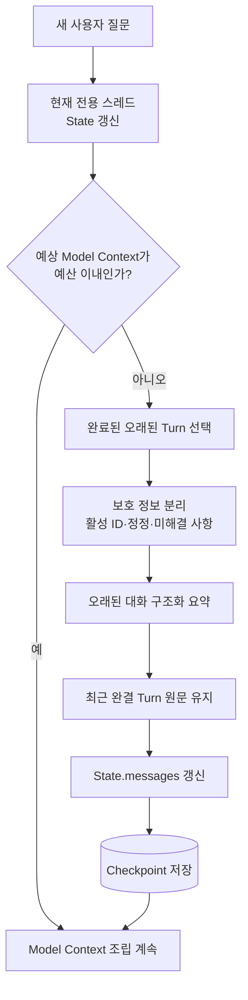

# 대화 컨텍스트 Compact 방법론 조사

> 조사 목적: 사용자별 회의 에이전트 전용 스레드에서 `messages`가 계속 증가할 때, 오래된 대화를 어떤 기준으로 유지·요약·검색·제거할지 정리한다.  
> 문서 범위: 대화 기록과 Agent Loop의 Compact만 다룬다. Tool 반환 형식과 Model Context 주입 방법은 [[2. Tool 결과와 Model Context 조립 방법론 조사]]에서 다룬다.  
> 문서 성격: 구현 확정안이 아니라 State Schema와 Compact 정책을 결정하기 위한 조사 문서다.

## 1. 조사 질문

회의록 에이전트의 State에는 다음 기록이 누적된다.

- 사용자의 과거 질문
- LLM의 과거 답변
- LLM이 생성한 Tool-call
- Tool 실행 결과의 요약·메타데이터
- 오류와 재시도 기록
- 이후 발언으로 정정되거나 폐기된 정보

질문은 단순히 “최근 메시지를 몇 개 남길 것인가?”가 아니다.

> 제한된 컨텍스트 윈도우 안에서 어떤 기록은 원문으로 남기고, 어떤 기록은 구조화해 압축하며, 어떤 기록은 모델 입력에서 제외한 뒤 필요할 때 다시 찾아야 하는가?

회의록 원문 자체는 `messages`에 저장하지 않으므로 이 문서의 Compact 대상이 아니다.

## 2. 핵심 결론

모든 상황에 통하는 하나의 Compact 방식은 없다. 가장 안정적인 방향은 다음 계층을 조합하는 것이다.

```text
최근 완결 대화 Turn
→ 원문 유지

오래된 대화의 핵심 상태
→ 구조화된 누적 요약으로 유지

오래됐지만 다시 필요할 수 있는 세부 내용
→ 원본 로그 또는 기억 저장소에서 필요할 때 검색

현재 활성 Tool Loop
→ Tool-call과 대응 결과를 완결된 묶음으로 원문 유지

명백히 불필요해진 중간 기록
→ Model Context에서 제거
```

즉, `전체 messages를 계속 전달`하거나 `오래된 대화를 하나의 산문 요약으로 모두 교체`하는 두 극단을 피한다.

## 3. 먼저 구분해야 하는 것

### 3-1. 원본 기록, State, Model Context

세 영역은 서로 다르다.

| 영역 | 목적 | 모델이 매번 보는가? |
|---|---|---:|
| 원본 대화 이벤트 로그 | 감사, 품질 분석, 요약 재생성 | 아니오 |
| 현재 전용 스레드 State | `messages`와 현재 실행 상태 | 일부만 |
| Model Context | 이번 LLM 호출에 실제로 전달할 입력 | 예 |

Model Context에서 오래된 기록을 제거하더라도 원본 이벤트를 반드시 삭제해야 하는 것은 아니다. 반대로 원본을 보존한다고 모든 기록을 매번 LLM에 보여줄 필요도 없다.

- [LangChain — Context engineering in agents](https://docs.langchain.com/oss/python/langchain/context-engineering)

### 3-2. 컨텍스트 윈도우는 주의력 예산

긴 컨텍스트를 지원하는 모델도 입력이 길어질수록 모든 정보를 동일하게 활용하지 못한다. `Lost in the Middle` 연구는 관련 정보가 긴 입력의 가운데에 있을 때 활용 성능이 떨어질 수 있음을 보였다.

따라서 기준은 다음과 같아야 한다.

```text
얼마나 많이 넣을 수 있는가?  X
이번 판단에 필요한 고신호 정보가 무엇인가?  O
```

- [Liu et al. — Lost in the Middle](https://arxiv.org/abs/2307.03172)

### 3-3. 사용자 Turn과 Agent 내부 Loop

하나의 사용자 질문 안에서도 다음 Loop가 여러 번 발생할 수 있다.

```text
사용자 질문
→ LLM Tool-call
→ Tool 결과
→ LLM 재판단
→ 최종 답변
```

활성 Loop의 Tool-call과 Tool 결과를 중간에서 나누거나 한쪽만 제거하면 메시지 이력이 깨질 수 있다. Compact의 최소 단위는 개별 메시지가 아니라 다음과 같은 완결된 상호작용 단위여야 한다.

```text
HumanMessage
+ Tool-call이 포함된 AIMessage
+ 대응하는 ToolMessage
+ 결과를 반영한 AIMessage
```

LangGraph에서도 Tool-call이 있는 AIMessage에는 같은 `tool_call_id`의 ToolMessage가 대응되어야 한다.

- [LangChain — Messages](https://docs.langchain.com/oss/python/langchain/messages)
- [LangGraph — INVALID_CHAT_HISTORY](https://docs.langchain.com/oss/python/langgraph/errors/INVALID_CHAT_HISTORY)

## 4. 주요 Compact 방법론

### 4-1. 최근 Window 유지

최근 N개 메시지 또는 최근 일정 토큰에 해당하는 완결 Turn을 원문으로 남기는 방법이다.

장점:

- 구현이 단순하다.
- 별도의 요약 호출이 없어 빠르고 저렴하다.
- 최신 질문의 대명사와 직전 흐름을 그대로 유지한다.
- 요약 모델의 왜곡 위험이 없다.

한계:

- Window 밖으로 밀린 중요한 결정과 정정이 사라진다.
- 메시지 개수만 기준으로 하면 거대한 Tool 결과 한 개의 크기를 반영하지 못한다.

최근 Window는 단독 해법보다 **단기 작업 기억**으로 사용하는 편이 적절하다.

- [LangGraph — Add and manage memory](https://docs.langchain.com/oss/python/langgraph/add-memory)

### 4-2. 재귀적·점진적 요약

이전 요약과 새로 오래된 대화 구간을 합쳐 요약을 갱신한다.

```text
이전 요약 + 새로 완료된 과거 Turn
→ 갱신된 누적 요약
```

장점:

- 매우 긴 대화를 일정한 크기에 가깝게 유지할 수 있다.
- 단순 삭제보다 오래된 정보의 Recall이 높다.

한계:

- 요약은 손실 압축이다.
- 요약을 다시 요약할수록 세부 조건과 예외가 약해질 수 있다.
- 한 번 생긴 오해가 다음 요약의 입력으로 누적될 수 있다.

- [LangChain — Short-term memory](https://docs.langchain.com/oss/python/langchain/short-term-memory)
- [Wang et al. — Recursively Summarizing Enables Long-Term Dialogue Memory](https://arxiv.org/abs/2308.15022)

### 4-3. 구조화된 기억

오래된 대화를 자유 산문 하나로만 요약하지 않고 업무상 다시 필요한 정보의 종류를 나눠 저장한다.

회의록 질의 대화에서 고려할 수 있는 항목은 다음과 같다.

```text
현재 사용자의 질문 목적
질의 대상으로 확정된 회의록 ID 집합
사용자가 추가한 조건과 표현 방식
이미 확인한 결론과 근거 ID
사용자가 정정한 내용
아직 답하지 못한 질문
실패한 Tool과 재시도 필요 여부
```

성격과 수명이 다른 정보를 같은 요약 문자열에 섞지 않는 것이 핵심이다.

- [LangChain — Memory overview](https://docs.langchain.com/oss/python/concepts/memory)

### 4-4. 오래된 대화 Retrieval

오래된 대화를 전부 누적 요약에 넣지 않고 원본 또는 추출된 기억을 별도 저장한 뒤 최신 질문과 관련된 내용만 검색한다.

장점:

- 현재 질문과 관련 없는 과거 대화를 모델에 넣지 않아도 된다.
- 요약에서 빠진 세부 정보를 원문으로 복구할 수 있다.

한계:

- 검색되지 않은 정보는 모델에게 존재하지 않는 것과 같다.
- 의미 유사도만으로는 정정, 시간 순서, 여러 Turn의 결합 정보를 놓칠 수 있다.
- 짧은 대화부터 적용하면 복잡도에 비해 이득이 작을 수 있다.

Retrieval은 요약을 대체하기보다 **요약에서 빠진 세부 정보를 복구하는 계층**으로 보는 편이 적절하다.

- [Wu et al. — LongMemEval](https://arxiv.org/abs/2410.10813)

### 4-5. 계층형 메모리

제한된 모델 컨텍스트와 더 큰 외부 기억을 나누는 방식이다.

| 계층 | 역할 | 회의록 에이전트 예시 |
|---|---|---|
| 고정 정책 | 항상 필요한 규칙 | 권한은 백엔드에서 검사한다는 지시 |
| 현재 작업 기억 | 최근 원문 | 최근 질문·답변, 활성 Tool Loop |
| 압축 기억 | 오래된 대화의 핵심 상태 | 조건, 정정, 미해결 질문 |
| 선택적 회수 기억 | 필요할 때만 검색 | 오래된 질문·답변과 근거 |
| 외부 원본 | 모델 입력과 분리 | 전체 대화 이벤트 로그, 회의록 원문 |

- [Packer et al. — MemGPT](https://arxiv.org/abs/2310.08560)

## 5. 방법별 비교

| 방법 | 토큰 절감 | 오래된 정보 보존 | 주요 위험 | 적합한 역할 |
|---|---:|---:|---|---|
| 최근 Window | 높음 | 낮음 | 오래된 중요 정보 소실 | 직전 흐름 유지 |
| 단순 삭제 | 높음 | 매우 낮음 | 복구 불가 | 명백히 불필요한 기록 제거 |
| 누적 요약 | 높음 | 중간 | 요약 왜곡·누적 오류 | 오래된 흐름 압축 |
| 구조화된 기억 | 중간~높음 | 높음 | Schema 누락·잘못된 갱신 | 목표·정정·미해결 사항 유지 |
| 과거 대화 Retrieval | 가변적 | 검색 성공 시 높음 | 검색 누락 | 오래된 세부 정보 복구 |
| 전체 기록 전달 | 낮음 | 겉보기에는 높음 | 주의력 분산·비용 증가 | 짧은 초기 Baseline |

현재 가장 타당한 조합은 다음과 같다.

```text
최근 완결 Turn 원문
+ 오래된 대화의 구조화된 요약
+ 필요할 때만 과거 대화 Retrieval
+ Model Context 밖에 보존한 원본 로그
```

## 6. 회의록 에이전트에 적용할 원칙

### 원칙 1. 회의록 원문과 대화 기억을 함께 Compact하지 않는다

회의록 원문은 답변의 근거 데이터이고, `messages`는 사용자가 무엇을 질문했고 에이전트가 어떻게 답했는지에 대한 기록이다.

Compact 대상은 `messages`다. 회의록 원문은 Tool 6이 기존 백엔드에서 질문마다 다시 가져오므로 대화 요약에 복사하지 않는다.

### 원칙 2. 현재 회의록 ID 집합을 보존한다

Tool 5가 반환한 회의록 ID 집합은 연속 질의에 필요하다. Compact 과정에서 이 값이 삭제되거나 모호한 자연어로만 요약되면 안 된다.

구현 전 다음 중 한 방법을 결정해야 한다.

- ID가 포함된 Tool 결과 메시지를 Compact 대상에서 제외
- 구조화된 요약의 보호 필드로 ID를 보존
- ID 전용 State 필드를 추가하는 별도 설계 검토

### 원칙 3. 최근 완결 Turn은 원문으로 남긴다

최근 대화는 지시 대상, 대명사, 정정의 뉘앙스를 위해 원문으로 유지한다. 메시지 하나가 아니라 완결된 Turn 묶음을 단위로 삼는다.

### 원칙 4. Trigger는 토큰 예산으로 판단한다

회의록 에이전트의 초기 기준은 전체 컨텍스트 윈도우의 약 50% 사용 시점이다. 다만 실제 Trigger는 다음 예산을 계산해 조정해야 한다.

```text
모델 전체 컨텍스트 한도
- 시스템 지시
- 이번 호출에 넣을 회의록 원문
- 응답 생성용 예약 공간
- Tool Schema와 활성 Tool Loop 여유
= 대화 기억에 사용할 수 있는 예산
```

OpenAI Agents SDK의 Compaction Session도 매번 압축하지 않고 후보가 Threshold를 넘었는지 확인한다. 낮은 지연시간이 중요하면 자동 압축 대신 Turn 사이 또는 Idle 시점에 실행할 수 있다.

- [OpenAI Agents SDK — Sessions and compaction](https://openai.github.io/openai-agents-python/sessions/)

### 원칙 5. 안전한 경계에서 Compact한다

권장 시점:

- 사용자 질문에 대한 최종 답변이 끝난 뒤
- Tool-call과 대응 Tool 결과가 모두 처리된 뒤
- HITL 재개에 필요한 입력과 선택이 State에 반영된 뒤
- 새 회의록 집합을 선택하기 전이나 선택 결과가 Checkpoint에 저장된 뒤

피해야 할 시점:

- Tool-call은 있지만 대응 ToolMessage가 없는 상태
- Tool 결과를 받았지만 LLM이 아직 해석하지 않은 상태
- 사용자 정정의 앞뒤가 분리되는 지점
- HITL 재개에 필요한 선택 정보가 아직 저장되지 않은 상태

### 원칙 6. 요약을 유일한 진실의 원천으로 만들지 않는다

요약이 의심되거나 중요한 세부 정보가 필요하면 원본 이벤트 로그에서 다시 확인하거나 요약을 재생성할 수 있어야 한다.

누적 요약을 계속 요약하기만 하지 않고, 일정 시점에 원본의 관련 구간에서 다시 만드는 Rebase도 평가할 수 있다.

### 원칙 7. 사용자별 전용 스레드 Scope를 유지한다

회의 생성자의 State·Checkpoint와 공유받은 사용자의 State·Checkpoint는 서로 다르다. Compact 기억도 전용 스레드별로 분리한다.

새 전용 스레드는 이전 스레드의 압축 기억을 자동으로 이어받지 않는다.

## 7. 개념적 Compact 흐름



## 8. 단순 Rolling Summary의 위험과 보완책

| 위험 | 발생 예 | 보완 방향 |
|---|---|---|
| 세부 조건 소실 | “재무팀 승인 후”가 “승인 후”로 축약 | 조건·예외 전용 필드와 원본 참조 유지 |
| 정정 충돌 | 과거 담당자 A가 남고 최신 B가 누락 | 최신값·폐기값·변경 시점 구분 |
| 요약 환각 누적 | 존재하지 않은 인과관계 생성 | 원본 근거와 주기적 Rebase |
| 미해결 작업 삭제 | 대기 질문이 완료로 요약 | 완료·진행·대기 상태 구조화 |
| 회의록과 대화 혼합 | Agent 해석이 회의 발언처럼 보임 | 원문과 대화 기억 분리 |
| 회의록 집합 혼선 | 이전 회의 정보가 새 집합에 등장 | 회의록 ID Scope 보존 |
| Tool Pair 손상 | Tool-call만 남고 결과가 제거 | 완결된 호출·결과 단위로 정리 |

## 9. 평가 방법

### 기억 정확성

- 오래된 사용자 조건을 정확히 기억하는가?
- 정정된 최신 정보가 이전 정보보다 우선하는가?
- 여러 Turn에 흩어진 내용을 합쳐 답할 수 있는가?
- 근거가 없을 때 모른다고 답하는가?

### 회의록 Scope 정확성

- 현재 선택한 회의록 ID 집합을 Compact 이후에도 유지하는가?
- 새 회의록 집합으로 바뀌었을 때 이전 회의 정보가 섞이지 않는가?
- 이전 Agent 답변의 오류를 회의록 사실로 재사용하지 않는가?

### Agent 실행 안정성

- Compact 전후 Tool 선택이 불필요하게 달라지지 않는가?
- 활성 Tool-call과 Tool 결과 연결이 보존되는가?
- HITL 중단 후 재개 정보가 남는가?
- 오류와 재시도 기록이 무한히 누적되지 않는가?

### 효율성

- LLM 호출별 입력 토큰 수
- 대화 길이에 따른 토큰 증가 기울기
- Compact 호출 비용과 빈도
- P50·P95 응답 지연시간
- 전체 기록 Baseline 대비 답변 품질 변화

## 10. 단계별 실험 방향

### 실험 A. Baseline

```text
전체 messages
```

현재 모델의 기본 장기 대화 성능과 비용을 측정한다.

### 실험 B. 최근 Window

```text
최근 완결 Turn 원문
+ 현재 활성 Tool Loop
```

가장 단순한 정리만으로 목표 품질을 달성하는지 확인한다.

### 실험 C. 구조화된 누적 요약

```text
오래된 대화의 구조화된 기억
+ 최근 완결 Turn 원문
+ 현재 활성 Tool Loop
```

오래된 조건·정정·미해결 사항의 보존 여부를 확인한다.

### 실험 D. 과거 대화 Retrieval

```text
구조화된 기억
+ 최신 질문과 관련된 과거 대화 검색 결과
+ 최근 완결 Turn 원문
```

요약에서 빠진 세부 정보가 실제로 복구되는지 평가한다.

## 11. 현재 회의록 에이전트에 대한 잠정적 방향

초기 구현은 다음 순서가 적절하다.

1. 전체 `messages`를 전달하는 Baseline을 측정한다.
2. 컨텍스트 사용량 약 50%를 초기 Trigger로 설정한다.
3. 활성 Tool Loop와 최근 완결 Turn을 보호한다.
4. 오래된 대화를 업무 항목별로 구조화해 요약한다.
5. Tool 5의 활성 회의록 ID 집합을 반드시 보존한다.
6. Compact 결과를 State와 Checkpoint에 저장한다.
7. 오래된 대화 Retrieval은 실제 기억 누락이 관찰될 때 추가한다.

## 12. 다음 설계 단계에서 결정할 항목

- 최근 원문을 유지할 Turn 수 또는 토큰 수
- 구조화된 압축 기억에 반드시 포함할 필드
- 활성 회의록 ID를 Compact에서 보호하는 방식
- 약 50% 기준을 실제 입력 예산으로 환산하는 방법
- 요약을 Node, Middleware, 백그라운드 작업 중 어디에서 수행할지
- 원본 대화 로그를 별도로 보존할지
- 요약 오류가 발견되었을 때 Rebase하는 절차
- 오래된 대화 Retrieval을 초기 버전에 포함할지

## 13. 주요 참고 자료

### 공식 문서·기술 자료

- [LangChain — Context engineering in agents](https://docs.langchain.com/oss/python/langchain/context-engineering)
- [LangChain — Short-term memory](https://docs.langchain.com/oss/python/langchain/short-term-memory)
- [LangGraph — Add and manage memory](https://docs.langchain.com/oss/python/langgraph/add-memory)
- [LangChain — Memory overview](https://docs.langchain.com/oss/python/concepts/memory)
- [LangGraph — Persistence](https://docs.langchain.com/oss/python/langgraph/persistence)
- [OpenAI Agents SDK — Sessions and compaction](https://openai.github.io/openai-agents-python/sessions/)

### 연구 자료

- [Liu et al. — Lost in the Middle](https://arxiv.org/abs/2307.03172)
- [Wang et al. — Recursively Summarizing Enables Long-Term Dialogue Memory](https://arxiv.org/abs/2308.15022)
- [Packer et al. — MemGPT](https://arxiv.org/abs/2310.08560)
- [Wu et al. — LongMemEval](https://arxiv.org/abs/2410.10813)
- [Maharana et al. — Evaluating Very Long-Term Conversational Memory](https://arxiv.org/abs/2402.17753)

## 핵심 정리

> Compact의 대상은 사용자별 전용 스레드의 `messages`다. 회의록 원문은 Compact하지 않고 질문마다 기존 백엔드에서 다시 가져온다. 활성 Tool Loop, 최근 완결 Turn, 사용자의 정정, Tool 5가 반환한 현재 회의록 ID 집합은 보호한다. 오래된 대화는 구조화된 요약으로 줄이고, 요약에서 빠진 세부 정보가 실제로 문제가 될 때 과거 대화 Retrieval을 추가한다.
