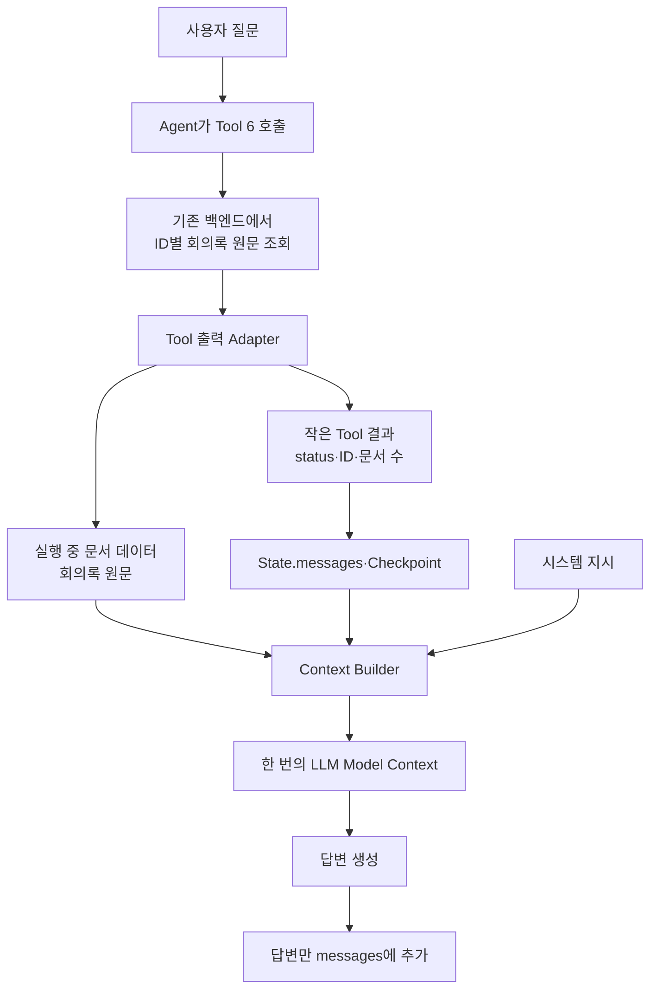

# Tool 결과와 Model Context 조립 방법론 조사

> 조사 목적: 회의록 에이전트의 Tool이 어떤 형식으로 결과를 반환하고, 그중 무엇을 State·Checkpoint에 저장하며, 무엇을 한 번의 LLM Model Context에만 넣을지 정리한다.  
> 문서 범위: Tool 출력 Schema, ToolMessage, 오류 결과, 큰 원문 외부화, Context Builder를 다룬다. 대화 기록 자체의 Compact는 [[1. 대화 컨텍스트 Compact 방법론 조사]]에서 다룬다.  
> 문서 성격: 구현 확정안이 아니라 Tool별 출력 계약과 컨텍스트 조립 방식을 결정하기 위한 조사 문서다.

## 1. 조사 질문

Tool이 값을 반환했다고 해서 그 전체가 항상 `messages`에 들어가야 하는 것은 아니다.

회의록 에이전트에서는 다음 질문을 분리해야 한다.

1. LLM이 다음 판단을 하기 위해 반드시 봐야 하는 값은 무엇인가?
2. 다음 Turn과 Checkpoint에 남겨야 하는 값은 무엇인가?
3. UI와 서버만 필요하고 LLM에는 필요하지 않은 값은 무엇인가?
4. 회의록 원문처럼 크지만 이번 답변에는 필요한 데이터를 어떻게 전달할 것인가?
5. Tool 오류를 어떤 구조로 반환해야 재시도·중단·사용자 확인을 구분할 수 있는가?

## 2. 핵심 결론

Tool 결과는 하나의 문자열이 아니라 용도에 따라 나눠야 한다.

```text
모델이 볼 작은 결과
→ ToolMessage의 간결한 content 또는 구조화된 결과

다음 Turn에도 필요한 참조값
→ State.messages와 Checkpoint에 보존

UI·추적·서버만 필요한 메타데이터
→ 애플리케이션 전용 데이터로 분리

회의록 원문 같은 큰 데이터
→ State에 저장하지 않고 이번 호출의 Context Builder에만 전달
```

회의록 에이전트에 가장 중요한 원칙은 다음과 같다.

> Tool 5의 선택된 회의록 ID는 State에 남기고, Tool 6이 ID로 가져온 회의록 원문은 일시적인 실행 데이터로만 사용한다.

## 3. Tool 호출과 결과의 기본 구조

일반적인 Tool Loop는 다음과 같다.

```text
사용자 요청
→ LLM이 AIMessage에 Tool-call 생성
→ 오케스트레이터가 Tool 실행
→ 같은 tool_call_id의 ToolMessage 생성
→ LLM이 Tool 결과를 읽고 다음 판단 또는 답변 생성
```

Tool-call이 있는 AIMessage에는 대응하는 ToolMessage가 있어야 한다. 대응 결과 없이 다음 모델 호출로 넘어가면 메시지 이력이 잘못된 상태가 될 수 있다.

- [LangChain — Messages와 ToolMessage](https://docs.langchain.com/oss/python/langchain/messages)
- [LangGraph — INVALID_CHAT_HISTORY](https://docs.langchain.com/oss/python/langgraph/errors/INVALID_CHAT_HISTORY)

## 4. Tool 결과를 나누는 네 계층

### 4-1. 모델 가시 결과

LLM이 다음 행동을 결정하거나 사용자에게 설명하기 위해 보는 정보다.

예:

```json
{
  "status": "success",
  "meeting_id": "meeting-123",
  "action": "pause",
  "meeting_state": "paused"
}
```

작고 명확한 결과는 문자열보다 구조화된 객체가 적합하다. LangChain Tool은 `dict`를 반환하면 모델이 읽을 수 있는 Tool 출력으로 직렬화한다.

- [LangChain — Tools](https://docs.langchain.com/oss/python/langchain/tools)

### 4-2. State·Checkpoint에 남길 지속 결과

다음 Turn에서 다시 필요한 참조값과 최소 상태다.

회의록 에이전트에서는 다음 값이 해당한다.

- Tool 실행 성공·실패
- 회의 상태
- 선택된 회의록 ID 집합
- 후보 수
- 재시도 또는 사용자 조치가 필요한 오류 코드

이 값은 `messages`의 Tool 결과로 남기고 해당 State를 Checkpoint에 저장할 수 있다.

### 4-3. 애플리케이션 전용 메타데이터

UI 렌더링, 추적, 디버깅에는 필요하지만 LLM이 볼 필요가 없는 정보다.

예:

- 전체 DB Record
- 내부 Trace ID
- 성능 측정값
- UI 전용 표시 데이터
- 원본 응답의 디버깅 정보

LangChain의 `ToolMessage.artifact`는 모델에 보내지 않는 데이터를 애플리케이션이 사용할 수 있게 한다. 다만 artifact도 Message 객체와 함께 State에 저장하면 Checkpoint에 포함될 수 있다.

따라서 현재 회의록 설계에서는 **회의록 원문 전체를 artifact에 넣어 State에 보존하는 방식은 사용하지 않는다.**

- [LangChain — ToolMessage artifact](https://docs.langchain.com/oss/python/langchain/messages)

### 4-4. 한 번의 호출에만 쓰는 큰 실행 데이터

회의록 원문처럼 다음 조건을 가진 데이터다.

- 크기가 크다.
- 이번 답변에는 필요하다.
- 다음 Turn에는 ID로 다시 가져올 수 있다.
- State와 Checkpoint에 복제할 필요가 없다.

이 데이터는 Tool 실행 결과를 처리하는 오케스트레이터가 일시적으로 보관하고, LLM 호출 직전 Context Builder에 전달한다.

## 5. Tool 반환 형식 방법론

### 5-1. 짧은 문자열

```text
"회의가 일시정지되었습니다."
```

적합한 경우:

- 결과가 매우 단순하다.
- 이후 로직이 별도 필드를 읽지 않는다.

한계:

- 상태와 오류 원인을 안정적으로 분리하기 어렵다.
- 문구 변경이 후속 파싱을 깨뜨릴 수 있다.

### 5-2. 구조화된 객체

```json
{
  "status": "success",
  "meeting_id": "meeting-123",
  "meeting_state": "ended",
  "error_code": null,
  "retryable": false
}
```

적합한 경우:

- Condition이 결과 필드를 읽어야 한다.
- UI와 에이전트가 같은 결과를 사용한다.
- 오류와 성공을 구분해야 한다.

MCP의 Tool 규격도 `outputSchema`와 `structuredContent`를 통해 Tool 결과를 검증할 수 있게 한다. 현재 프로젝트에서 MCP를 사용하지 않더라도 출력 Schema를 명시하는 설계 원칙은 그대로 적용할 수 있다.

- [Model Context Protocol — Tools](https://modelcontextprotocol.io/specification/2025-06-18/server/tools)

### 5-3. ToolMessage의 content와 artifact 분리

```text
content
→ 모델이 볼 간결한 결과

artifact
→ 애플리케이션이 사용할 추가 데이터
```

검색 결과의 표시용 메타데이터와 모델용 요약을 나누는 데 유용하다. 다만 artifact가 State에 들어가면 Checkpoint에도 남을 수 있으므로 데이터 크기와 민감도를 확인해야 한다.

### 5-4. Command를 이용한 State 갱신

Tool이 단순히 값을 반환하는 것을 넘어 State를 명시적으로 변경해야 할 때 사용할 수 있다.

예:

- 별도의 상태 필드를 갱신
- Tool 결과와 함께 특정 단계로 전환
- 사용자 설정을 State에 반영

LangChain Tool은 `Command`로 State를 갱신할 수 있으며, 모델이 결과를 봐야 한다면 같은 `tool_call_id`의 ToolMessage도 함께 제공해야 한다.

- [LangChain — Tools와 Command](https://docs.langchain.com/oss/python/langchain/tools)

현재 회의록 설계의 State는 `messages`만 사용하므로 초기 구현에서는 구조화된 ToolMessage 결과를 우선한다.

## 6. 오류 반환 방법론

Tool 오류를 자유 텍스트 한 줄로만 반환하면 Agent가 다음 행동을 안정적으로 선택하기 어렵다.

권장하는 최소 오류 구조는 다음과 같다.

```json
{
  "status": "error",
  "error_code": "PERMISSION_DENIED",
  "message": "회의 생성자만 종료할 수 있습니다.",
  "retryable": false,
  "required_action": "stop"
}
```

`required_action`은 다음과 같이 제한된 값으로 정의할 수 있다.

```text
retry
→ 같은 Tool을 다시 호출할 수 있음

ask_user
→ 사용자에게 입력 또는 선택을 요청

use_other_tool
→ 다른 Tool로 해결 가능

stop
→ 현재 실행을 중단
```

회의록 에이전트에서 고려할 오류 코드는 다음과 같다.

| 오류 코드 | 의미 | 일반적인 다음 행동 |
|---|---|---|
| `PERMISSION_DENIED` | 접근 또는 실행 권한 없음 | 중단·사용자 안내 |
| `INVALID_MEETING_STATE` | 현재 회의 상태에서 실행 불가 | 현재 상태 안내 |
| `MEETING_NOT_FOUND` | 회의 ID를 찾지 못함 | ID 재확인 또는 재검색 |
| `VALIDATION_ERROR` | Tool 인자 Schema 불일치 | 인자 수정 후 제한 재시도 |
| `TEMPORARY_FAILURE` | 일시적인 백엔드 실패 | 횟수 제한 재시도 |

오류를 모델이 볼 수 있는 Tool 결과로 반환하면 모델이 자기 수정할 수 있다. 다만 같은 오류를 무한히 반복하지 않도록 오류별 재시도 상한을 별도로 둬야 한다.

MCP 규격도 Tool 실행 오류를 `isError`가 설정된 Tool 결과로 반환하면 모델이 오류를 보고 스스로 수정할 수 있다고 설명한다.

- [MCP — Tool result와 오류](https://modelcontextprotocol.io/specification/2025-06-18/schema)

## 7. Tool 결과를 Model Context에 넣는 방법

### 방법 A. ToolMessage를 그대로 전달

```text
AIMessage의 Tool-call
+ 대응하는 작은 ToolMessage
→ 다음 LLM 호출
```

적합한 대상:

- 회의 제어 결과
- 확정·공유 결과
- 후보 수와 선택된 ID
- 작은 오류 결과

### 방법 B. 구조화 결과의 일부만 모델에 전달

백엔드 원본 결과를 출력 Adapter가 다음처럼 줄인다.

```text
백엔드 전체 응답
→ 출력 Adapter
→ 모델에 필요한 필드만 ToolMessage로 변환
```

UI·추적용 데이터는 애플리케이션 전용 메타데이터로 분리한다.

### 방법 C. 참조값만 저장하고 필요할 때 다시 조회

```text
큰 원본 데이터
→ 기존 백엔드에 그대로 유지

State.messages
→ ID와 최소 메타데이터만 저장
```

회의록 에이전트의 Tool 5가 이 방식이다.

### 방법 D. Context Builder에 큰 결과를 일시적으로 주입

```text
Tool 6이 ID로 원문 조회
→ 원문을 State에 저장하지 않음
→ Context Builder에 전달
→ 시스템 지시 + 원문 + messages 조립
→ 한 번의 LLM 호출
```

회의록 에이전트의 회의록 원문에는 이 방식이 적합하다.

### 방법 E. 오래된 Tool 결과를 모델 입력에서 Trim

이미 처리된 오래된 Tool 결과는 최근 Turn을 보호하면서 미리보기 또는 참조값으로 교체할 수 있다.

OpenAI Agents SDK의 `ToolOutputTrimmer`도 오래된 큰 Tool 출력을 줄이되 최근 Turn의 Tool 결과는 유지하는 입력 필터를 제공한다. Anthropic의 Context Editing 역시 오래된 `tool_result` 블록을 정리하는 방식을 제공한다.

- [OpenAI Agents SDK — Tool Output Trimmer](https://openai.github.io/openai-agents-python/ref/extensions/tool_output_trimmer/)
- [Claude Platform — Manage tool context](https://platform.claude.com/docs/en/agents-and-tools/tool-use/manage-tool-context)

## 8. 회의록 에이전트 Tool별 권장 반환 정책

| Tool | 모델·State에 남길 결과 | 일시적 또는 애플리케이션 전용 데이터 |
|---|---|---|
| Tool 1 회의 시작 | `status`, `meeting_id`, 시작 결과 | 모달 UI 상태, 내부 폼 메타데이터 |
| Tool 2 `control_meeting` | `status`, `meeting_id`, `action`, 현재 회의 상태, 오류 코드 | 기존 백엔드 원본 응답, Trace |
| Tool 3 확정·공유 | `status`, `meeting_id`, 공유 대상 채널, 오류 코드 | 게시 이벤트의 내부 상세값 |
| Tool 4 후보 검색 | 후보 수, 접근 가능한 후보의 ID·제목·일시 | UI 표시용 추가 메타데이터, 검색 Trace |
| Tool 5 ID 확정 | 선택된 회의록 ID 집합 | 없음 또는 선택 UI 메타데이터 |
| Tool 6 원문 조회 | 조회 성공 여부, 사용한 ID, 문서 수 | 회의록 원문 전체 |

### Tool 2 예시

```json
{
  "status": "success",
  "meeting_id": "meeting-123",
  "requested_action": "pause",
  "meeting_state": "paused",
  "error_code": null,
  "retryable": false
}
```

### Tool 4 예시

```json
{
  "status": "success",
  "candidate_count": 2,
  "candidates": [
    {"meeting_id": "meeting-101", "title": "프로젝트 A 주간 회의", "date": "2026-08-18"},
    {"meeting_id": "meeting-102", "title": "프로젝트 A 이슈 회의", "date": "2026-08-19"}
  ]
}
```

후보에는 백엔드 권한 필터를 통과한 회의록만 포함한다.

### Tool 5 예시

```json
{
  "status": "success",
  "selected_meeting_ids": ["meeting-101", "meeting-102"]
}
```

이 결과는 연속 질문과 Checkpoint 복구에 필요하므로 State에 남긴다.

### Tool 6 예시

State에 남길 결과:

```json
{
  "status": "success",
  "meeting_ids": ["meeting-101", "meeting-102"],
  "document_count": 2
}
```

State에 남기지 않을 결과:

```text
meeting-101 전체 회의록 원문
meeting-102 전체 회의록 원문
```

원문은 Context Builder에만 전달한다.

## 9. 회의록 원문의 Context 조립 구조



## 10. Model Context를 조립할 때의 원칙

### 10-1. 최신 사용자 질문을 중복 삽입하지 않는다

최신 질문이 이미 `state.messages`의 마지막 HumanMessage라면 다음처럼 다시 붙이지 않는다.

```text
state.messages 전체 + latest_question  X
```

다음 중 하나로 통일한다.

```text
과거 messages만 전달 + 최신 질문 별도 추가
또는
최신 질문을 포함한 messages를 그대로 전달
```

### 10-2. 시스템 지시와 회의록 원문을 분리한다

회의록 원문은 외부 데이터이지 Agent 지시가 아니다. 원문 안에 명령문처럼 보이는 문장이 있어도 시스템 지시로 취급하지 않도록 경계를 명확히 한다.

```text
[SYSTEM INSTRUCTIONS]
권한과 답변 규칙

[MEETING DOCUMENTS]
회의록 원문

[CONVERSATION]
현재 messages
```

### 10-3. 문서의 출처를 유지한다

여러 회의록을 동시에 넣을 때는 각 원문에 회의록 ID, 제목, 일시를 붙여 서로 섞이지 않게 한다.

```text
[MEETING meeting-101]
제목: 프로젝트 A 주간 회의
일시: 2026-08-18
원문: ...

[MEETING meeting-102]
제목: 프로젝트 A 이슈 회의
일시: 2026-08-19
원문: ...
```

### 10-4. 전체 토큰 예산을 먼저 계산한다

```text
모델 전체 컨텍스트 한도
- 시스템 지시
- 현재 messages와 Compact 기억
- 답변 생성용 예약 공간
= Tool 6 원문에 사용할 수 있는 예산
```

선택된 모든 회의록 원문이 예산을 넘으면 관련 구간 검색, 청크 조회 또는 부분 요약이 필요하다.

## 11. 권한과 보안

### 권한은 Tool 백엔드에서 강제

- Tool 4는 생성자·참여자·공유 대상자인 회의록만 후보로 반환한다.
- LLM이 생성한 임의의 회의록 ID를 그대로 신뢰하지 않는다.
- Tool 6에서 권한을 다시 검사할지는 구현 결정 사항이지만, 어떤 경우에도 LLM이 권한을 판단하지 않는다.

### 원문은 신뢰되지 않은 데이터로 취급

- 회의록 안의 명령문을 시스템 지시로 실행하지 않는다.
- 시스템 지시와 원문을 별도 구역으로 조립한다.
- 원문에서 추출한 Tool 인자를 서버 검증 없이 실행하지 않는다.

### 민감 데이터 최소화

- LLM에 필요하지 않은 사용자·채널 내부 정보는 Context에 넣지 않는다.
- 오류 결과에 내부 Stack, SQL, Storage 경로를 노출하지 않는다.
- Trace와 디버깅 정보는 애플리케이션 전용 데이터로 분리한다.

## 12. 평가 방법

### 결과 정확성

- Tool 결과 Schema가 모든 성공·오류 경로에서 유지되는가?
- Condition이 문자열 파싱 없이 구조화 필드를 읽을 수 있는가?
- Tool-call과 ToolMessage의 ID Pair가 유지되는가?

### 컨텍스트 정확성

- Tool 6의 원문이 `messages`와 Checkpoint에 남지 않는가?
- 선택된 회의록 ID는 다음 Turn과 복구 후에도 남는가?
- 여러 회의록의 출처와 내용이 섞이지 않는가?
- 최신 질문이 중복 삽입되지 않는가?

### 보안

- 권한이 없는 회의록 원문이 Model Context에 들어가지 않는가?
- 임의 ID 입력으로 권한 필터를 우회할 수 없는가?
- 회의록 원문의 명령문이 Tool 실행 지시로 취급되지 않는가?

### 효율성

- Tool 원본 대비 모델 가시 결과의 토큰 절감률
- Tool 6 원문을 포함한 호출별 입력 토큰
- Context Builder 처리 시간
- 오래된 Tool 결과 Trim 전후 토큰과 답변 품질

## 13. 단계별 실험 방향

### 실험 A. 모든 Tool 결과를 그대로 messages에 저장

현재 방식의 토큰 증가와 중복 문제를 측정하는 Baseline이다.

### 실험 B. 구조화된 작은 Tool 결과

각 Tool이 상태, ID, 오류 코드만 반환하도록 하여 Agent 판단 안정성을 비교한다.

### 실험 C. content와 애플리케이션 데이터 분리

모델 가시 결과와 UI·추적용 데이터를 나누어 Context 크기와 기능 차이를 측정한다.

### 실험 D. Tool 6 원문을 Context Builder에만 전달

원문을 State에 저장하지 않고 질문마다 조회했을 때 Checkpoint 크기, 토큰 증가와 답변 품질을 확인한다.

### 실험 E. 긴 회의록 구간 검색

전체 원문이 예산을 넘을 때 관련 구간만 넣는 방식과 전체 원문 Baseline을 비교한다.

## 14. 현재 회의록 에이전트에 대한 잠정적 방향

1. 모든 Tool은 구조화된 결과 Schema를 가진다.
2. 성공·오류·재시도 가능 여부를 문자열이 아닌 필드로 구분한다.
3. Tool-call과 ToolMessage의 `tool_call_id` Pair를 유지한다.
4. Tool 5의 선택된 회의록 ID는 State와 Checkpoint에 남긴다.
5. Tool 6의 회의록 원문은 State와 Checkpoint에 남기지 않는다.
6. Tool 6은 작은 메타데이터 결과와 실행 중 원문 데이터를 분리한다.
7. Context Builder가 시스템 지시, 원문, 현재 `messages`를 조립한다.
8. 여러 회의록에는 ID·제목·일시 경계를 붙인다.
9. 큰 과거 Tool 결과는 최근 Turn을 보호하면서 Trim한다.

## 15. 다음 설계 단계에서 결정할 항목

- 각 Tool의 실제 출력 Schema
- 공통 오류 코드와 `required_action` enum
- Tool 6 원문을 오케스트레이터에 전달하는 구체적인 자료구조
- Tool 4 후보 목록에서 모델 가시 필드와 UI 전용 필드의 구분
- Tool 6이 원문을 조회할 때 권한을 재검사할지
- 회의록 원문을 Model Context에서 어떤 Message 역할과 형식으로 전달할지
- 여러 회의록이 토큰 예산을 넘을 때 적용할 검색·청크·요약 정책
- Tool 결과 Trim 대상과 최근 보호 Turn 수

## 16. 주요 참고 자료

### 공식 문서·규격

- [LangChain — Messages와 ToolMessage](https://docs.langchain.com/oss/python/langchain/messages)
- [LangChain — Tools](https://docs.langchain.com/oss/python/langchain/tools)
- [LangChain — Context engineering](https://docs.langchain.com/oss/python/langchain/context-engineering)
- [LangGraph — INVALID_CHAT_HISTORY](https://docs.langchain.com/oss/python/langgraph/errors/INVALID_CHAT_HISTORY)
- [Model Context Protocol — Tools](https://modelcontextprotocol.io/specification/2025-06-18/server/tools)
- [Model Context Protocol — Schema](https://modelcontextprotocol.io/specification/2025-06-18/schema)
- [OpenAI Agents SDK — Tools](https://openai.github.io/openai-agents-python/tools/)
- [OpenAI Agents SDK — Tool Output Trimmer](https://openai.github.io/openai-agents-python/ref/extensions/tool_output_trimmer/)
- [Claude Platform — Manage tool context](https://platform.claude.com/docs/en/agents-and-tools/tool-use/manage-tool-context)

## 핵심 정리

> Tool 결과는 `LLM이 볼 작은 구조화 결과`, `State·Checkpoint에 남길 참조값`, `UI·서버만 사용할 메타데이터`, `한 번의 호출에만 쓸 큰 실행 데이터`로 나눈다. 회의록 에이전트에서는 Tool 5의 선택된 회의록 ID를 State에 보존하고, Tool 6의 원문은 Context Builder에만 일시적으로 전달한다. LLM 호출 후에는 답변과 최소 Tool 메타데이터만 `messages`에 남긴다.
