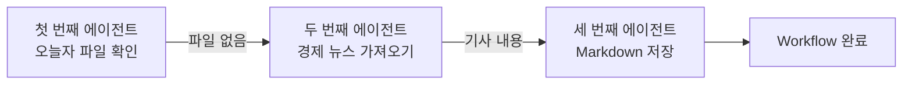

# 5. Graph Engineering

앞 문서에서는 범용 에이전트가 많은 Tool과 긴 컨텍스트를 사용하게 되는 한계를 살펴봤다.

그렇다면 이 문제를 어떻게 해결할 수 있을까?

우리 AI Lab 팀이 **특정한 작은 일만 수행하는 에이전트를 만들고, 그 에이전트들을 적절하게 이어 붙이는 것**이다.

이 과정은 두 단계로 나눌 수 있다.

## 첫 번째 단계: 작은 에이전트 만들기

먼저 한두 개 정도의 Tool만 붙이고, Loop를 많이 돌지 않으면서 특정한 작은 일만 수행하는 에이전트를 만든다.

`오늘의 경제 뉴스를 가져오고 저장하는 일`에 다시 적용해 보자.

### 오늘의 경제 뉴스 하나를 가져오는 에이전트

1. 뉴스를 검색하는 Tool을 만든다.
2. 시스템 프롬프트에 경제 뉴스를 가져오라는 요구가 들어오면 해당 Tool을 사용하도록 작성한다.

### 특정 폴더에 저장하는 에이전트

1. 파일을 저장하는 Tool을 만든다.
2. 저장할 내용과 경로가 들어오면 해당 Tool을 사용하도록 작성한다.

### 오늘자 뉴스 파일을 확인하는 에이전트

1. 특정 폴더에 오늘자 뉴스 Markdown 파일이 있는지 확인하는 Tool을 만든다.
2. 파일 존재 여부를 확인하라는 요구가 들어오면 해당 Tool을 사용하도록 작성한다.

이렇게 작은 일만 수행하도록 만들면 Codex 같은 범용 에이전트에 비해 Loop를 적게 돌릴 수 있고, 더 저렴한 모델을 사용할 수도 있다.

## 두 번째 단계: 작은 에이전트들을 Workflow로 연결하기

이제 앞에서 만든 에이전트들을 하나의 Workflow로 연결한다.

첫 번째 에이전트는 특정 폴더 안에 오늘자 뉴스가 Markdown 파일로 저장되어 있는지 확인한다. 그리고 그 결과가 첫 번째 에이전트로 돌아가는 것이 아니라 두 번째 에이전트의 LLM에 들어가도록 설계한다.

두 번째 에이전트는 `오늘자 뉴스가 없다`는 결과를 받으면 오늘의 경제 뉴스 하나를 가져오는 Tool을 실행한다. 이 Tool의 결과인 기사 내용은 세 번째 에이전트의 LLM에 들어간다.

세 번째 에이전트는 전달받은 기사 내용을 특정 폴더에 저장하는 Tool을 실행한다.

## 범용 에이전트와 비교했을 때의 장점

### 1. 각 에이전트가 해야 할 일이 명확하다

Workflow가 미리 지정되어 있고 각 에이전트가 담당하는 일이 작기 때문에, LLM은 시스템 프롬프트를 읽고 자신이 해야 할 일을 명확하게 알 수 있다.

그만큼 판단에 필요한 토큰을 줄일 수 있고, 목표와 관련 없는 Tool을 호출하는 할루시네이션의 가능성도 줄어든다.

### 2. Loop와 컨텍스트를 줄일 수 있다

하나의 범용 에이전트 안에서 전체 업무를 처리하지 않기 때문에 Loop가 지나치게 많이 반복되지 않는다. 각 작은 에이전트에는 해당 작업에 필요한 정보만 전달할 수 있으므로 컨텍스트와 토큰 비용도 줄일 수 있다.

즉, 특정 업무에 한해서는 Codex 같은 범용 에이전트로 해결할 때보다 더 저렴하게 같은 결과를 얻을 수 있다.

## Graph Engineering이란?

작은 에이전트들을 만들고, 그림판에서 선을 이어 Graph를 그리는 것처럼 서로 연결하여 하나의 Workflow를 구현하는 방법론이 Graph Engineering이다.

이 Graph에서는 다음과 같은 개념을 사용한다.

- **Node**: 각각의 작은 에이전트
- **Edge**: Tool 실행 결과가 다음 에이전트의 LLM으로 들어가도록 연결하는 부분

Graph Engineering을 통해 필요한 업무에 맞는 작은 에이전트들을 설계하고 연결하면, 범용 에이전트보다 적은 토큰과 비용으로 업무를 처리할 수 있다.

## 우리 AI Lab 팀의 핵심 비즈니스

앞의 경제 뉴스 예시는 원리를 설명하기 위한 매우 단순한 사례다.

향후 SAP MM 모듈의 구매 업무 Workflow를 에이전트로 자동화하는 것과 같은 큰 프로젝트에서는 Graph를 훨씬 치밀하게 설계해야 한다.

실제 비즈니스 Workflow와 비교하면서 다음 사항을 판단해야 한다.

- 어느 부분부터 어느 부분까지를 하나의 Task로 볼 것인가?
- 하나의 에이전트가 어디까지 담당하게 할 것인가?
- 단일 에이전트 안에서 어느 부분까지 LLM의 판단을 신뢰할 것인가?
- 민감한 정보나 반드시 지켜야 하는 규칙은 어디부터 Tool의 확정적인 로직으로 처리할 것인가?

이러한 경계를 설계하는 일에는 AI 기술뿐만 아니라 실제 업무에 대한 이해도 필요하다.

고객사가 이 중요한 **판단과 설계**를 전문가에게 맡길 수 있도록 하는 것이 우리 AI Lab 팀의 핵심 비즈니스가 될 수 있다.

## 핵심 정리

> Graph Engineering은 특정한 작은 일만 수행하는 에이전트들을 만들고 연결하여, 하나의 큰 비즈니스 Workflow를 더 적은 Loop와 컨텍스트로 수행하도록 설계하는 방법론이다.
