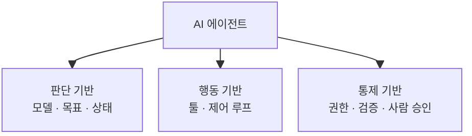
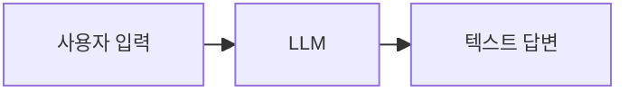
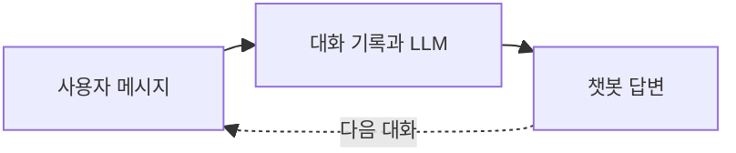
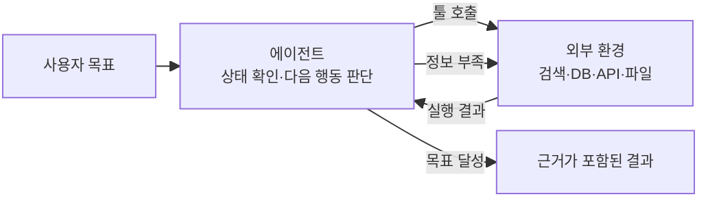
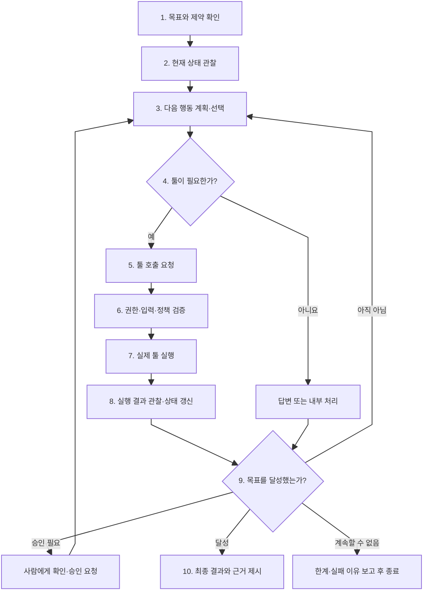
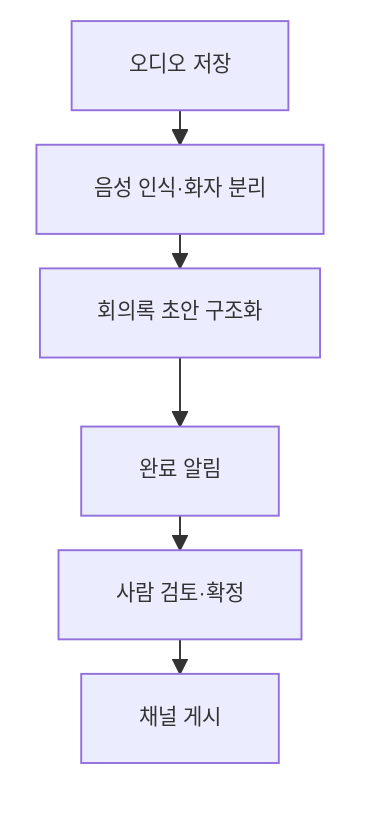
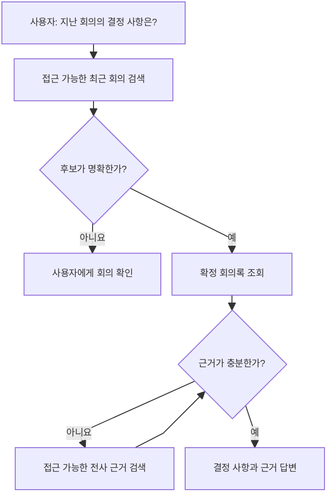

# AI 에이전트란 무엇인가

> 이 문서는 AI 에이전트를 처음 접하는 사람을 위한 입문 문서다. 먼저 에이전트의 의미를 정의하고, 기존의 단일 LLM 및 단순 챗봇과 무엇이 다른지 비교한 뒤, 에이전트가 목표를 수행할 때 내부에서 어떤 단계가 반복되는지 살펴본다.

---

## 1. AI 에이전트의 정의

### 1-1. 답변을 만드는 AI에서 목표를 수행하는 AI로

ChatGPT와 같은 대규모 언어 모델(LLM)은 사용자가 입력한 문장을 이해하고 그에 맞는 문장을 생성할 수 있다. 질문에 답하거나 글을 요약하고, 번역하거나 코드를 작성하는 일이 대표적이다.

AI 에이전트도 이러한 언어 모델을 두뇌로 사용할 수 있다. 그러나 에이전트의 역할은 한 번의 답변을 만드는 데서 끝나지 않는다. 에이전트는 주어진 **목표**를 확인하고, 현재 상황에서 무엇을 해야 하는지 판단하며, 필요하면 검색·데이터 조회·파일 저장 같은 **툴**을 사용한다. 그리고 그 결과를 다시 살펴본 뒤 다음 행동을 결정한다.

> **AI 에이전트는 주어진 목표를 달성하기 위해 현재 상태를 관찰하고, 다음 행동을 선택하며, 툴이나 외부 환경과 상호작용하고, 그 결과를 바탕으로 행동을 반복·수정하는 시스템이다.**

쉽게 표현하면 다음과 같다.

> 일반적인 LLM이 “무엇이라고 답할까?”를 중심으로 동작한다면, 에이전트는 “목표를 이루려면 지금 무엇을 해야 할까?”까지 판단한다.

### 1-2. 에이전트는 모델 하나가 아니라 시스템이다

언어 모델 하나를 곧바로 에이전트라고 부르기는 어렵다. 실제 에이전트는 모델을 중심으로 목표, 상태, 툴, 권한, 실행 제어 장치가 결합된 시스템이다.



각 구성 요소의 역할은 다음과 같다.

| 구성 요소 | 역할 |
|---|---|
| 모델 | 요청을 이해하고 다음 행동이나 툴을 선택한다. |
| 목표·지시사항 | 달성할 결과와 따라야 할 규칙을 정한다. |
| 상태·메모리 | 지금까지 수집한 정보와 현재 진행 위치를 보존한다. |
| 툴 | 모델만으로 할 수 없는 데이터 조회나 실제 작업을 수행한다. |
| 제어 루프 | 결과를 관찰하고 계속할지, 수정할지, 멈출지 결정한다. |
| 권한·안전장치 | 접근 가능한 데이터와 허용된 행동을 제한한다. |
| 검증·사람 승인 | 결과의 형식과 품질을 확인하고 위험한 행동을 통제한다. |

따라서 에이전트의 성능은 모델의 지능만으로 결정되지 않는다. 좋은 모델을 사용하더라도 잘못된 툴을 제공하거나, 종료 조건이 없거나, 권한을 과도하게 부여하면 좋은 에이전트가 될 수 없다.

### 1-3. 에이전트의 핵심은 ‘다음 행동의 선택’이다

여러 단계에서 AI를 사용한다고 해서 모두 에이전트인 것은 아니다. 다음 실행 단계가 개발자에 의해 미리 정해져 있다면 이는 일반적으로 **워크플로**에 가깝다.

예를 들어 회의록 생성 과정이 항상 아래 순서로 실행된다고 가정하자.

```text
오디오 저장 → 음성 인식 → 회의록 구조화 → 완료 알림
```

각 단계에서 AI를 사용하더라도 순서는 고정되어 있다. 반면 회의 내용을 묻는 사용자에게 답하기 위해 모델이 현재 검색 결과를 보고 다음 행동을 선택한다면 에이전트성이 생긴다.

```text
최근 회의를 검색할까?
→ 후보가 여러 개면 사용자에게 다시 물을까?
→ 확정 회의록을 조회할까?
→ 근거가 부족하면 전사 원문을 추가로 검색할까?
→ 정보가 충분하므로 이제 답변할까?
```

즉, 에이전트를 구분하는 핵심은 단순히 AI가 포함되었는지가 아니라 **현재 상태에 따라 모델이 다음 실행 경로를 선택하는가**에 있다.

---

## 2. 기존 LLM·단순 챗봇과 AI 에이전트의 차이

### 2-1. 단일 LLM 호출

가장 기본적인 형태는 사용자의 입력을 모델에 전달하고 한 번의 출력을 받는 것이다.



예를 들어 사용자가 회의 전사문을 직접 붙여 넣고 “이 내용을 요약해 줘”라고 요청하면, 모델은 주어진 입력만으로 요약문을 만든다. 처리 과정은 단순하고 예측하기 쉽지만 모델이 보지 못한 사내 데이터나 현재 시스템 상태를 스스로 확인할 수는 없다.

### 2-2. 단순 챗봇

단순 챗봇은 여러 차례 대화를 기억할 수 있지만, 기본적으로는 사용자의 메시지에 대한 답변을 생성하는 구조다.



대화 기록이 있기 때문에 앞서 말한 내용을 이어서 답할 수는 있다. 그러나 실제 회의 목록을 조회하거나 채널에 결과를 게시하려면 별도의 시스템 기능이 필요하다. 또한 대화가 여러 번 오간다는 사실만으로 에이전트가 되는 것은 아니다. 매번 입력에 반응해 답변만 만들고 있다면 여전히 대화형 LLM에 가깝다.

### 2-3. AI 에이전트

에이전트는 사용자의 요청을 단순한 질문이 아니라 달성해야 할 목표로 해석한다. 필요하면 외부 환경을 관찰하고 툴을 호출한 뒤, 그 결과에 따라 다음 행동을 선택한다.



예를 들어 사용자가 ZEN AI에 “지난 회의에서 결정된 방향을 알려 줘”라고 요청했다고 가정하자. 에이전트는 다음과 같이 행동할 수 있다.

1. 사용자가 열람할 수 있는 최근 회의를 검색한다.
2. “지난 회의”에 해당하는 후보를 고른다.
3. 후보가 모호하면 사용자에게 어느 회의인지 확인한다.
4. 선택한 회의의 확정 회의록을 조회한다.
5. 근거가 부족하면 관련 전사 세그먼트를 추가로 검색한다.
6. 충분한 정보를 얻으면 결정 사항과 근거를 함께 답한다.

중요한 점은 이 순서가 항상 똑같지 않다는 것이다. 검색 결과가 하나라면 바로 회의록을 조회할 수 있고, 후보가 여러 개라면 먼저 질문해야 한다. 확정 회의록에 충분한 근거가 있다면 전사 원문을 검색하지 않아도 된다. 에이전트는 **관찰한 결과에 따라 경로를 바꾼다.**

### 2-4. 한눈에 보는 비교

| 구분 | 단일 LLM | 단순 챗봇 | AI 에이전트 |
|---|---|---|---|
| 중심 목적 | 입력에 대한 출력 생성 | 대화를 이어 가며 답변 | 목표 달성 |
| 주요 입력 | 현재 프롬프트 | 현재 메시지와 대화 기록 | 목표, 상태, 관찰 결과 |
| 외부 데이터 조회 | 기본적으로 불가능 | 별도 연결 없이는 불가능 | 필요한 시점에 툴로 조회 |
| 실제 행동 수행 | 하지 않음 | 일반적으로 하지 않음 | 허용된 범위에서 수행 가능 |
| 실행 경로 | 한 번의 호출 | 메시지마다 응답 | 현재 상태에 따라 동적으로 선택 |
| 결과 피드백 | 다음 호출 전에는 반영하지 않음 | 다음 대화에서 반영 | 같은 작업 안에서 관찰하고 재판단 |
| 종료 기준 | 출력 생성 완료 | 답변 생성 완료 | 목표 달성, 한계 도달 또는 승인 필요 |

이 구분은 제품 이름이 아니라 실제 동작을 기준으로 해야 한다. 서비스가 자신을 ‘AI 에이전트’라고 소개하더라도 단순히 정해진 프롬프트에 한 번 답하는 구조일 수 있다. 반대로 화면은 평범한 챗봇처럼 보여도 내부에서 검색과 검증을 반복하고 실행 경로를 선택한다면 에이전트로 볼 수 있다.

> [!IMPORTANT]
> 에이전트가 챗봇보다 항상 더 좋은 것은 아니다. 한 번의 요약이나 번역처럼 실행 경로가 명확한 작업은 단일 LLM 호출이나 고정 워크플로가 더 단순하고 안정적이다. 상황에 따라 다음 행동을 바꿔야 할 때 에이전트가 의미를 가진다.

---

## 3. AI 에이전트 내부에서 진행되는 단계

### 3-1. 기본 실행 루프

에이전트의 내부 동작은 보통 **목표 확인 → 관찰 → 판단 → 행동 → 결과 관찰 → 재판단 또는 종료**의 반복으로 설명할 수 있다.



이 그림에서 모델이 모든 단계를 직접 수행하는 것은 아니다. 모델은 주로 목표를 해석하고 다음 행동과 툴을 선택한다. 실제 툴 실행, 권한 확인, 최대 실행 횟수 제한과 같은 통제는 에이전트 런타임과 서버가 담당해야 한다.

### 3-2. 각 단계에서 일어나는 일

#### 1) 목표와 제약 확인

에이전트는 먼저 사용자가 원하는 최종 결과가 무엇인지 파악한다. 동시에 다음 조건도 확인한다.

- 어떤 데이터에 접근할 수 있는가
- 사용할 수 있는 툴은 무엇인가
- 시간·토큰·비용·툴 호출 횟수 제한은 얼마인가
- 사람의 승인이 필요한 행동은 무엇인가
- 결과가 갖춰야 할 형식과 근거는 무엇인가

목표가 모호하거나 서로 충돌하는 조건이 있다면 바로 행동하기보다 먼저 사용자에게 확인해야 할 수 있다.

#### 2) 현재 상태 관찰

상태는 에이전트가 현재 작업에 대해 알고 있는 누적 정보다. 방금 받은 툴 결과인 **관찰**과 구분할 필요가 있다.

```json
{
  "goal": "지난 회의의 주요 결정 사항을 근거와 함께 답변",
  "selectedMeetingId": "meeting-123",
  "access": "allowed",
  "minutesStatus": "confirmed",
  "evidenceCollected": false,
  "remainingToolCalls": 4
}
```

상태를 명시적으로 관리하면 같은 검색을 반복하거나 이미 확인한 사실을 잊는 문제를 줄일 수 있다. 다만 인증 토큰이나 내부 데이터베이스 접속 정보처럼 모델이 알 필요가 없는 정보는 모델의 문맥에 넣지 않는다.

#### 3) 다음 행동 선택

모델은 목표와 현재 상태를 보고 다음 행동을 결정한다.

- 바로 답변할 수 있는가
- 외부 데이터가 필요하므로 툴을 사용해야 하는가
- 어떤 툴을 어떤 인자로 호출해야 하는가
- 정보가 모호하므로 사용자에게 다시 물어야 하는가
- 더 진행하기 전에 승인을 받아야 하는가

여기서 중요한 것은 모델이 툴을 직접 실행하지 않는다는 점이다. 일반적인 function calling 구조에서 모델은 사용할 툴의 이름과 입력 인자를 구조화해 **요청**한다.

#### 4) 실행 전 검증과 툴 실행

에이전트 런타임과 서버는 모델이 만든 요청을 그대로 믿지 않고 다음을 검사한다.

- 현재 사용자에게 실행 권한이 있는가
- 입력이 JSON Schema에 맞는가
- 현재 리소스 상태에서 허용되는 행동인가
- 삭제·게시·외부 전송처럼 승인이 필요한 행동인가
- 동일한 쓰기 작업이 중복 실행되고 있지는 않은가

검증을 통과하면 애플리케이션이 실제 함수, 데이터베이스 또는 외부 API를 실행한다. **권한은 모델이 올바르게 판단해 줄 것이라고 기대해서는 안 되며, 각 데이터·행동 툴이 서버에서 직접 강제해야 한다.**

#### 5) 결과 관찰과 상태 갱신

툴의 실행 결과는 다시 에이전트에 전달된다. 에이전트는 결과가 목표 달성에 충분한지, 오류가 발생했는지, 다른 행동이 필요한지를 판단한다.

예를 들어 `get_confirmed_minutes`의 결과가 “확정 회의록 없음”이라면 다음 선택지는 상황에 따라 달라진다.

- 접근 가능한 초안이 있는지 조회한다.
- 다른 회의를 선택했는지 사용자에게 확인한다.
- 확정본만 답변에 사용할 수 있다는 정책에 따라 작업을 중단한다.

#### 6) 완료·재시도·승인·중단 판단

에이전트는 무조건 계속 행동해서는 안 된다. 각 반복이 끝날 때 다음 중 하나를 선택해야 한다.

```text
목표 달성       → 최종 결과를 제시하고 종료
정보 부족       → 다른 검색이나 질문 수행
일시적 오류     → 허용된 횟수 안에서 재시도
위험한 행동     → 사람의 승인 요청
권한 없음       → 수행할 수 없는 이유를 설명하고 종료
예산·횟수 초과  → 현재까지의 결과와 한계를 보고하고 종료
반복 감지       → 같은 행동을 멈추고 대안을 찾거나 종료
```

좋은 에이전트는 오래 자율적으로 움직이는 시스템이 아니다. **필요한 행동을 선택하고, 결과를 검증하며, 충분할 때 또는 더 진행하면 안 될 때 멈출 줄 아는 시스템**이다.

### 3-3. ZEN AI에 적용하면

ZEN AI의 회의록 생성 전체를 자유로운 에이전트 루프로 만들 필요는 없다. 오디오 저장, 음성 인식, 회의록 구조화, 알림처럼 순서와 책임이 명확한 과정은 재시작 가능한 고정 워크플로가 더 적합하다.



반면 생성된 회의 지식을 검색하고 활용하는 과정에는 제한된 에이전트가 유용하다.



이와 같이 ZEN AI는 다음 원칙을 취할 수 있다.

> **회의록 생성은 결정론적이고 재개 가능한 워크플로를 뼈대로 삼고, 회의 검색·근거 탐색·후속 업무처럼 상황 판단이 필요한 구간에만 제한된 에이전트성을 도입한다.**

---

## 핵심 정리

1. LLM은 문장을 이해하고 생성하는 모델이며, 에이전트는 그 모델을 포함해 목표·상태·툴·제어·권한을 결합한 시스템이다.
2. 단순 챗봇은 대화를 이어 갈 수 있지만, 대화가 여러 번 오간다는 이유만으로 에이전트가 되지는 않는다.
3. 에이전트의 핵심은 현재 상태와 실행 결과를 보고 다음 행동 경로를 선택하는 데 있다.
4. 에이전트는 목표 확인, 관찰, 행동 선택, 툴 실행, 결과 관찰, 완료 판단의 루프를 수행한다.
5. 권한 검사와 실행 제한은 모델의 판단에 맡기지 않고 서버와 런타임에서 강제해야 한다.
6. 작업 경로가 명확하다면 고정 워크플로가 더 적합하며, 상황에 따라 경로를 바꿔야 할 때 제한적으로 에이전트를 사용한다.

---

## 참고 자료

- Yao et al., [ReAct: Synergizing Reasoning and Acting in Language Models](https://arxiv.org/abs/2210.03629)
- Schick et al., [Toolformer: Language Models Can Teach Themselves to Use Tools](https://arxiv.org/abs/2302.04761)
- Shinn et al., [Reflexion: Language Agents with Verbal Reinforcement Learning](https://arxiv.org/abs/2303.11366)
