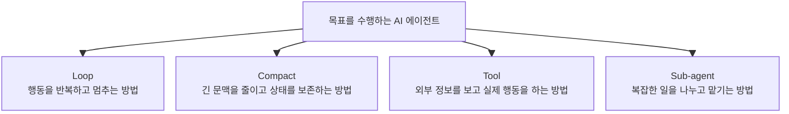
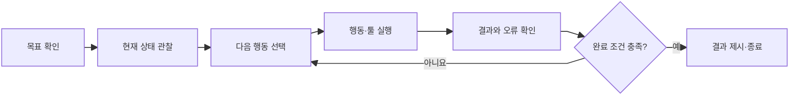
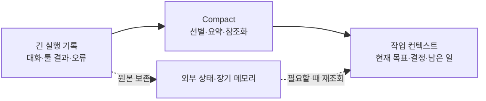
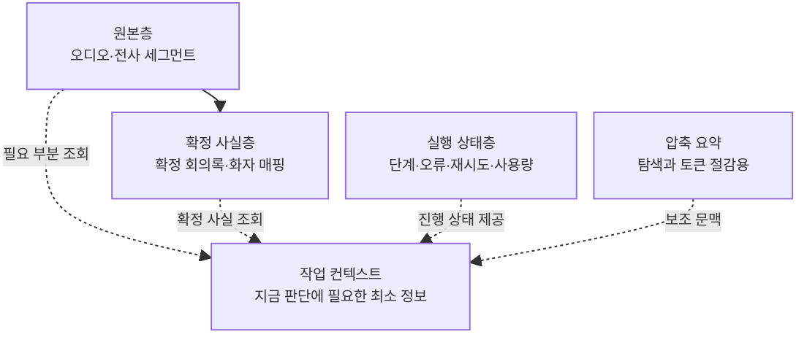
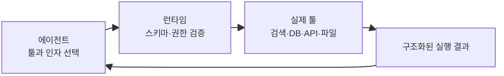
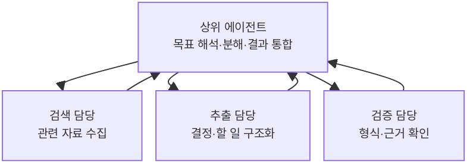
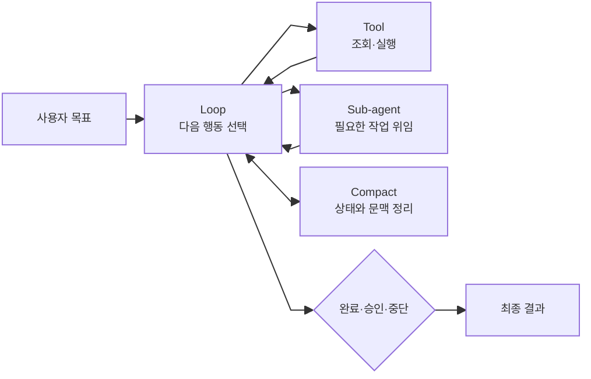

# AI 에이전트를 구성하는 핵심 요소

> 앞 문서인 [[01. AI 에이전트란 무엇인가]]에서는 에이전트가 목표를 확인하고, 상황을 관찰하며, 다음 행동을 선택하는 시스템이라는 점을 살펴보았다. 이번 문서에서는 최근 에이전트를 설계할 때 자주 강조되는 **Loop, Compact, Tool, Sub-agent**가 각각 어떤 문제를 해결하는지 알아본다.

---

## 1. 왜 이 네 가지 요소가 중요한가

일반적인 LLM은 입력을 받고 한 번의 출력을 만든다. 반면 에이전트는 목표를 달성할 때까지 여러 단계를 수행할 수 있다. 자율적으로 행동할 수 있는 범위가 넓어지는 만큼 새로운 설계 문제가 생긴다.

- 언제까지 행동을 반복해야 하는가?
- 대화와 작업 기록이 너무 길어지면 어떻게 관리하는가?
- 모델이 알 수 없는 정보나 실제 시스템에는 어떻게 접근하는가?
- 복잡한 일을 한 모델이 모두 처리해야 하는가?

Loop, Compact, Tool, Sub-agent는 각각 이 질문에 대응한다.



| 요소 | 해결하려는 핵심 문제 | 짧은 표현 |
|---|---|---|
| Loop | 다음 행동과 종료 시점을 어떻게 결정할 것인가 | 실행 제어 |
| Compact | 제한된 컨텍스트 안에 무엇을 남길 것인가 | 문맥 관리 |
| Tool | 모델을 실제 데이터와 행동에 어떻게 연결할 것인가 | 외부 연결 |
| Sub-agent | 일을 어떻게 분해하고 적합한 수행자에게 맡길 것인가 | 역할 분담 |

이 네 요소는 에이전트를 구성할 때 반드시 모두 사용해야 하는 필수 부품은 아니다. 작업이 단순하다면 고정 워크플로와 몇 개의 툴만으로 충분할 수 있다. 중요한 것은 기술을 많이 넣는 것이 아니라, 제품에서 실제로 발생하는 문제에 맞는 요소를 선택하는 것이다.

---

## 2. Loop: 행동을 반복하고 멈추는 구조

### 2-1. Loop란 무엇인가

Loop는 에이전트가 목표를 받은 뒤 **판단 → 행동 → 결과 관찰 → 재판단**을 반복하는 실행 구조다.



예를 들어 “지난 회의의 결정 사항을 찾아 줘”라는 요청을 받으면 에이전트는 회의를 검색하고, 검색 결과를 살펴보고, 확정 회의록을 조회하고, 필요하면 전사 근거를 추가로 찾는다. 한 번에 전체 경로를 완벽하게 정하는 것이 아니라, 매 단계의 결과에 따라 다음 행동을 바꿀 수 있다.

이러한 구조는 ReAct 연구에서 설명한 추론·행동·관찰의 결합과 유사하다. 모델은 외부 정보를 검색하면서 무엇을 더 찾아야 하는지 판단하고, 새로 얻은 정보로 판단을 수정한다.

### 2-2. 계속 처음부터 생각하면 왜 낭비인가

Loop가 있다고 해서 매번 목표 전체를 처음부터 다시 분석해야 하는 것은 아니다. 이미 확인한 결과와 현재 진행 위치를 상태로 저장하지 않으면 다음 문제가 발생한다.

- 같은 회의나 문서를 반복해서 검색한다.
- 성공한 단계를 다시 실행해 시간과 비용을 낭비한다.
- 같은 오류가 발생한 행동을 계속 반복한다.
- 앞에서 확정한 사용자 선택을 잊는다.
- 작업이 길어질수록 입력 토큰과 지연 시간이 증가한다.

따라서 효율적인 Loop에는 **누적 상태와 체크포인트**가 필요하다.

```json
{
  "goal": "지난 회의의 결정 사항 답변",
  "selectedMeetingId": "meeting-123",
  "minutesLoaded": true,
  "evidenceCollected": false,
  "completedSteps": ["search_meeting", "get_minutes"],
  "remainingToolCalls": 3
}
```

에이전트는 이 상태를 보고 이미 끝난 단계는 건너뛰고, 아직 부족한 근거 수집부터 이어갈 수 있다.

### 2-3. 좋은 Loop에는 경계가 있다

목표만 주고 완료할 때까지 무제한으로 돌게 하면 반복 오류, 비용 증가, 원치 않는 행동이 발생할 수 있다. 따라서 실제 제품의 Loop에는 다음 통제 장치가 필요하다.

| 통제 장치 | 역할 |
|---|---|
| 성공 조건 | 무엇이 갖춰지면 작업이 끝났는지 판정한다. |
| 최대 단계·호출 수 | 무한 반복을 막는다. |
| 시간·토큰·비용 예산 | 한 작업이 사용할 수 있는 자원을 제한한다. |
| 반복 행동 감지 | 같은 검색이나 실패를 되풀이하면 중단한다. |
| 오류별 재시도 정책 | 일시적 오류만 정해진 횟수 안에서 다시 시도한다. |
| 체크포인트 | 성공한 단계부터 작업을 재개한다. |
| 취소 전파 | 사용자가 취소하면 진행 중인 하위 작업도 멈춘다. |
| 사람 승인 | 위험하거나 되돌리기 어려운 행동 전에 확인한다. |

### 2-4. 무엇을 에이전트에게 맡기고 언제 사람에게 물을까

에이전트가 사람에게 질문하거나 승인을 요청해야 하는 지점도 Loop의 일부다. 모든 단계마다 물으면 자동화의 가치가 사라지고, 아무것도 묻지 않으면 위험한 행동까지 임의로 수행할 수 있다.

일반적으로 다음과 같이 나눌 수 있다.

```text
에이전트가 계속 진행하기 좋은 경우
→ 읽기 전용 검색, 되돌릴 수 있는 처리, 명확한 정책 안의 재시도

사람에게 확인하기 좋은 경우
→ 목표가 모호함, 후보가 여러 개임, 중요한 정보가 충돌함

사람의 승인이 필요한 경우
→ 외부 게시, 메시지 전송, 삭제, 결제, 권한 변경, 대량 수정
```

중요한 행동의 승인 여부를 모델의 선의에만 맡기면 안 된다. 런타임과 서버가 해당 행동을 승인 단계에서 반드시 차단해야 한다.

### 2-5. ZEN AI에서는

회의록 생성 파이프라인은 자유로운 무한 Loop보다 단계별 재시도 횟수가 정해진 워크플로가 적합하다.

```text
오디오 저장 → 전사 → 구조화 → 알림 → 사람 확정 → 게시
```

반면 “지난 회의” 후보 검색, 회의록과 전사 근거 중 무엇을 더 조회할지 판단하는 질의응답에는 제한된 Loop가 유용하다. 채널 게시와 외부 업무 생성은 사람 승인 경계로 두는 것이 안전하다.

---

## 3. Compact: 긴 문맥을 줄이고 중요한 상태를 남기는 방법

### 3-1. Compact란 무엇인가

에이전트가 오래 실행될수록 사용자 메시지, 모델 답변, 툴 요청, 툴 결과와 오류 기록이 계속 쌓인다. 이 기록을 매번 전부 모델에 전달하면 입력 토큰, 비용, 지연 시간이 증가하고 중요한 정보가 오래된 잡음에 묻힐 수 있다.

Compact는 긴 실행 기록에서 현재 판단에 필요한 핵심을 추출하고, 불필요하거나 다시 조회할 수 있는 내용을 줄여 **작업 컨텍스트를 작게 유지하는 과정**이다.

`Compact`는 모든 연구와 프레임워크가 동일한 뜻으로 사용하는 표준 용어는 아니다. 구현에 따라 context compaction, context compression, summarization, memory management 등으로 불린다. 이 문서에서는 긴 작업 기록을 줄이고 필요한 상태를 다시 구성하는 방법을 통칭해 Compact라고 부른다.



MemGPT는 제한된 컨텍스트 창을 운영체제의 메모리 계층처럼 관리하는 방식을 제안했고, LLMLingua 계열 연구는 프롬프트에서 덜 중요한 토큰을 줄여 비용과 지연을 낮추는 방법을 다뤘다. 구현 방식은 다르지만 공통된 목적은 **모든 과거 내용을 매번 모델의 입력에 넣지 않는 것**이다.

### 3-2. Compact가 지능을 회복시키는가

“세션을 압축하면 지능 수준이 회복된다”는 표현은 일부 현상을 직관적으로 설명하지만 정확한 보장은 아니다. 긴 컨텍스트에서 관련 없는 기록을 제거하면 모델이 현재 문제에 집중해 성능이 나아질 수 있다. 그러나 압축 자체가 모델의 본래 지능을 높이거나 잃어버린 정보를 자동으로 복원하는 것은 아니다.

> **Compact는 모델을 더 똑똑하게 만드는 기술이라기보다, 제한된 컨텍스트 안에 중요한 정보를 더 잘 배치하는 기술이다.**

잘못 압축하면 다음 정보가 사라질 수 있다.

- 결정의 근거와 예외 조건
- 실패한 방식과 다시 시도하면 안 되는 이유
- 화자, 담당자, 날짜 같은 식별 정보
- 사용자가 명시한 중요한 제약
- 아직 끝나지 않은 작업

따라서 압축 전후의 정확성을 평가해야 하며, 압축 요약 하나를 유일한 기억으로 사용해서는 안 된다.

### 3-3. 원본·상태·컨텍스트를 분리해야 한다



ZEN AI에서 오디오와 전사 세그먼트는 원본이고, 사람이 확정한 회의록과 화자 매핑은 신뢰할 수 있는 사실층이다. 이 자료를 압축 요약으로 덮어쓰면 안 된다. 압축본은 빠른 탐색과 현재 작업의 토큰 절감을 위해 사용하고, 중요한 답변을 만들 때는 원본 또는 확정 사실을 다시 조회해야 한다.

---

## 4. Tool: 에이전트를 외부 세계와 연결하는 수단

### 4-1. Tool은 에이전트의 팔인가

Tool을 에이전트의 “팔”이라고 표현하면 실제 행동을 수행한다는 점을 쉽게 이해할 수 있다. 다만 툴에는 정보를 가져오는 기능도 있으므로 **눈과 귀이자 팔과 손**이라고 표현하는 편이 더 정확하다.

> **Tool은 에이전트가 모델 내부의 지식과 텍스트 생성 능력만으로 수행할 수 없는 작업을 하기 위해 호출하는, 명확한 입출력 계약을 가진 외부 기능이다.**



모델은 일반적으로 데이터베이스나 API를 직접 실행하지 않는다. 사용할 툴 이름과 입력 인자를 구조화해 요청하고, 애플리케이션이 이를 검증한 뒤 실제 기능을 실행한다. Toolformer 연구도 모델이 **어떤 API를 언제 호출하고, 어떤 인자를 전달하며, 결과를 어떻게 이용할지** 판단하는 문제를 핵심으로 다뤘다.

### 4-2. 언제 Tool을 사용해야 하는가

다음과 같은 경우에는 모델의 기억이나 추측보다 툴을 사용해야 한다.

- 최신 정보가 필요하다.
- 사용자나 워크스페이스의 비공개 데이터가 필요하다.
- 실제 시스템의 현재 상태를 확인해야 한다.
- 정확한 계산이나 결정론적 검증이 필요하다.
- 파일 저장, 메시지 전송처럼 외부 상태를 변경해야 한다.
- 답변에 출처나 근거가 필요하다.

반대로 사용자가 제공한 짧은 글의 문체를 다듬거나 이미 주어진 내용을 요약하는 작업은 외부 툴 없이 모델만으로 처리할 수 있다. 툴 호출에는 지연, 비용, 실패 가능성이 있으므로 “쓸 수 있다”와 “써야 한다”를 구분해야 한다.

### 4-3. Tool이 많다고 좋은 에이전트는 아니다

툴이 많아지면 할 수 있는 일도 늘지만, 비슷한 툴 사이에서 잘못 선택하거나 관련 없는 툴 설명이 컨텍스트를 차지할 수 있다. 따라서 툴은 다음 기준으로 설계해야 한다.

- 이름과 사용 목적이 명확히 구분되는가
- 입력과 출력이 구조화되어 있는가
- 읽기와 쓰기 행동이 분리되어 있는가
- 오류와 재시도 가능 여부가 명확한가
- 현재 사용자 권한이 툴 내부에서 강제되는가
- 쓰기 작업이 중복 실행되어도 안전한가

ZEN AI 초기 단계에서 회의 검색, 확정 회의록 조회, 전사 근거 검색 정도만 필요하다면 세 툴을 모두 모델에 제공해도 된다. 툴 수가 실제로 늘고 선택 오류가 관찰될 때 툴 검색과 라우팅을 도입하는 편이 합리적이다.

### 4-4. 권한 검사는 모델에게 맡기지 않는다

에이전트가 권한 확인 툴을 먼저 호출하기를 기대해서는 안 된다. 권한 확인 전에 접근하면 안 되는 데이터가 이미 모델 컨텍스트에 들어갈 수 있기 때문이다.

```text
위험한 구조
search_all_meetings → 모델이 결과 확인 → check_access

권장 구조
search_accessible_meetings → 툴 내부에서 사용자·테넌트 권한 강제
```

모든 조회·행동 툴은 실행 시 서버에서 권한을 다시 확인해야 한다. 모델은 어떤 툴을 사용할지 제안하지만, 실제 허용 여부를 결정하는 보안 경계가 되어서는 안 된다.

---

## 5. Sub-agent: 일을 나누고 적합한 수행자에게 맡기는 구조

### 5-1. Sub-agent란 무엇인가

Sub-agent는 상위 에이전트가 전체 목표의 일부를 맡기기 위해 호출하는, **제한된 역할과 컨텍스트를 가진 별도의 에이전트 실행 단위**다.



상위 에이전트는 하위 작업의 목표, 제공할 정보, 사용할 수 있는 툴, 예산과 반환 형식을 정한다. Sub-agent는 맡은 범위 안에서 작업하고 결과를 상위 에이전트에 돌려준다.

### 5-2. 상위에는 좋은 모델, 아래에는 값싼 모델을 쓰면 되는가

상위에 고성능 모델을 두고, 분류·추출·형식 변환 같은 단순 하위 작업에 작고 저렴한 모델을 사용하는 것은 유용한 비용 최적화 전략이다. FrugalGPT와 RouteLLM 같은 모델 라우팅 연구도 요청의 난이도에 따라 강한 모델과 약한 모델을 선택해 품질과 비용의 균형을 맞추는 방향을 다룬다.

다만 이 연구들은 Sub-agent 구조 자체보다는 여러 모델 중 적절한 모델을 고르는 **모델 라우팅과 캐스케이드**의 근거에 가깝다. 모델 라우팅은 Sub-agent를 구현할 때 함께 사용할 수 있는 별도의 최적화 기법이다.

그러나 이것은 Sub-agent의 정의나 보편적인 규칙은 아니다.

- 전문적인 하위 작업이 상위 조정보다 더 어려울 수 있다.
- 작은 모델의 오류가 여러 단계에서 누적될 수 있다.
- 결과 검증이 어렵다면 비용을 아낀 만큼 재작업 비용이 생긴다.
- 같은 모델을 사용해도 역할과 컨텍스트를 분리하기 위해 Sub-agent를 둘 수 있다.
- 단순 작업은 별도 에이전트보다 일반 코드가 더 빠르고 정확할 수 있다.

따라서 “위는 똑똑한 모델, 아래는 값싼 모델”보다는 다음 원칙이 정확하다.

> **각 작업의 난이도, 위험도, 검증 가능성에 맞는 모델과 실행 방식을 배치한다.**

| 작업 특성 | 적합한 선택 예시 |
|---|---|
| 모호한 목표 해석·충돌 해결·최종 통합 | 고성능 모델 |
| 분류·후보 축소·단순 스키마 변환 | 작고 저렴한 모델 |
| 정확한 계산·고정 형식 검증 | 일반 코드 또는 전용 툴 |
| 전문 지식이 필요한 독립 작업 | 해당 영역에 강한 모델 또는 전문 에이전트 |

### 5-3. Sub-agent를 사용하면 좋은 경우

- 서로 독립적인 여러 하위 작업을 병렬로 처리할 수 있다.
- 역할별로 필요한 툴과 권한을 분리해야 한다.
- 한 에이전트의 컨텍스트에 모든 자료를 넣기 어렵다.
- 전문 영역별 지시사항과 평가 기준이 뚜렷하다.
- 하위 결과를 구조적으로 검증할 수 있다.

반면 하위 작업이 몇 개 없거나 서로 강하게 의존하고, 결과를 합치는 비용이 큰 경우에는 단일 에이전트나 고정 워크플로가 더 낫다. 에이전트 수가 증가한다고 성능이 비례해서 좋아지는 것은 아니며, 통신·중복 작업·충돌·지연 비용도 함께 증가한다.

### 5-4. ZEN AI에서는

ZEN AI v1의 회의록 생성은 단계가 명확하므로 여러 Sub-agent보다 다음과 같은 워크플로가 적합하다.

```text
STT 서비스 → 구조화 모델 → 스키마 검증 코드 → 사람 확정
```

향후 여러 회의와 채널을 동시에 조사하거나, 서로 독립적인 대규모 자료 수집·비교 작업이 생긴다면 검색, 근거 추출, 검증 역할을 분리할 수 있다. 그때도 실제 평가에서 단일 에이전트보다 품질·속도·비용이 개선되는지 확인한 뒤 도입해야 한다.

---

## 6. 네 요소는 어떻게 함께 작동하는가

네 요소는 각각 독립된 기능처럼 보이지만 실제 에이전트 안에서는 서로 연결된다.



1. **Loop**가 현재 상태를 보고 다음 행동을 결정한다.
2. 외부 정보나 행동이 필요하면 **Tool**을 사용한다.
3. 독립된 전문 작업이 필요하면 **Sub-agent**에게 범위를 정해 위임한다.
4. 실행 기록이 길어지면 **Compact**로 현재 판단에 필요한 문맥을 유지한다.
5. 목표 달성, 승인 필요, 예산 초과 같은 종료 조건을 확인하고 멈춘다.

이 과정에서 가장 중요한 것은 자율성 자체가 아니라 통제 가능성이다. 무엇을 했는지 기록할 수 있어야 하고, 권한 범위를 벗어난 행동은 서버가 차단해야 하며, 중요한 결과는 원본 근거로 다시 검증할 수 있어야 한다.

---

## 7. 처음의 표현을 더 정확하게 다듬으면

| 처음의 직관적 표현 | 보완한 표현 |
|---|---|
| Loop는 목표를 주면 계속 돈다. | 목표를 달성할 때까지 관찰과 행동을 반복하되, 성공·승인·실패·예산 조건에 따라 멈추는 제어 구조다. |
| 매번 맨 처음부터 하나하나 하면 낭비다. | 완료 상태와 체크포인트를 저장하고, 현재 결과에서 필요한 다음 단계만 판단해야 한다. |
| Compact는 세션을 압축해 지능을 회복한다. | 불필요한 문맥을 줄여 비용과 혼란을 낮출 수 있지만, 지능 회복을 보장하지 않으며 중요 정보 손실을 관리해야 한다. |
| Tool은 에이전트의 팔이다. | 툴은 외부 정보를 관찰하고 실제 행동을 수행하게 하는 눈·귀·팔이며, 명확한 입출력과 권한 계약이 필요하다. |
| 상위 에이전트는 좋은 모델, 하위는 값싼 모델을 쓴다. | 가능한 비용 전략 중 하나이며, 실제로는 작업 난이도·위험도·검증 가능성에 따라 모델과 역할을 배치한다. |

---

## 핵심 정리

1. Loop는 에이전트의 반복 실행 자체가 아니라 **다음 행동과 종료 조건을 통제하는 구조**다.
2. Compact는 모델의 지능을 높이는 것이 아니라 **제한된 컨텍스트에 중요한 정보를 남기는 방법**이다.
3. Tool은 모델의 판단을 실제 데이터와 행동에 연결하지만, **권한과 실행 검증은 서버가 담당**해야 한다.
4. Sub-agent는 역할 분담과 컨텍스트 격리를 위한 구조이며, **상위·하위 모델의 크기는 작업 특성에 따라 정한다.**
5. 좋은 에이전트는 네 요소를 많이 사용하는 시스템이 아니라, 필요한 요소만 사용하고 안전하게 멈출 수 있는 시스템이다.

> **좋은 에이전트는 가장 오래 자율적으로 움직이는 시스템이 아니라, 필요한 순간에 올바른 툴과 수행자를 선택하고, 중요한 상태를 보존하며, 허용된 범위 안에서 행동한 뒤 멈출 줄 아는 시스템이다.**

---

## 참고 자료

### Loop와 행동 제어

- Yao et al., [ReAct: Synergizing Reasoning and Acting in Language Models](https://arxiv.org/abs/2210.03629)
- Shinn et al., [Reflexion: Language Agents with Verbal Reinforcement Learning](https://arxiv.org/abs/2303.11366)
- Xie et al., [OSWorld: Benchmarking Multimodal Agents for Open-Ended Tasks in Real Computer Environments](https://arxiv.org/abs/2404.07972)

### Compact와 메모리

- Packer et al., [MemGPT: Towards LLMs as Operating Systems](https://arxiv.org/abs/2310.08560)
- Jiang et al., [LLMLingua: Compressing Prompts for Accelerated Inference of Large Language Models](https://arxiv.org/abs/2310.05736)
- Pan et al., [LLMLingua-2: Data Distillation for Efficient and Faithful Task-Agnostic Prompt Compression](https://arxiv.org/abs/2403.12968)

### Tool

- Schick et al., [Toolformer: Language Models Can Teach Themselves to Use Tools](https://arxiv.org/abs/2302.04761)

### Sub-agent와 모델 배치

- Chen et al., [FrugalGPT: How to Use Large Language Models While Reducing Cost and Improving Performance](https://arxiv.org/abs/2305.05176)
- Ong et al., [RouteLLM: Learning to Route LLMs with Preference Data](https://arxiv.org/abs/2406.18665)
