# Transformer와 Graph 기반 에이전트 설계

> [[02. AI 에이전트를 구성하는 핵심 요소]]에서는 Loop, Compact, Tool, Sub-agent를 살펴보았다. 이제 이 요소들을 실제 시스템으로 설계하려면 두 층을 구분해서 이해해야 한다. 하나는 LLM이 문맥을 처리하는 **Transformer 기반 모델 내부**, 다른 하나는 모델의 호출 순서와 상태·분기·승인을 통제하는 **실행 그래프**다.

이 문서에서는 먼저 Transformer가 어떤 방식으로 언어의 관계를 학습하는지 알아보고, 이어서 Graph Engineering이 그 모델을 어떻게 통제 가능한 에이전트로 구성하는지 살펴본다.

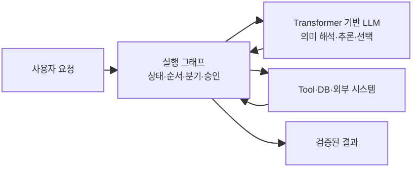

> **Transformer는 판단을 만드는 모델의 구조이고, Graph는 그 판단을 언제 어디에서 사용할지 정하는 시스템의 구조다.**

---

## 1. Transformer: LLM은 문맥을 어떻게 처리하는가

### 1-1. 먼저 용어부터 바로잡기

`트랜드 포머`가 아니라 **Transformer(트랜스포머)**가 올바른 명칭이다. 2017년 「Attention Is All You Need」 논문에서 제안된 신경망 구조이며, 현재 여러 LLM의 기반으로 사용된다.

Transformer의 핵심 직관은 문장을 무조건 앞에서부터 하나씩 기억하는 대신, 현재 처리하는 각 토큰이 문맥 안의 다른 토큰과 얼마나 관련 있는지를 계산해 정보를 섞는 것이다. 이 과정을 **Self-Attention**이라고 한다.

### 1-2. ‘문장의 구멍 맞히기’는 일부 모델의 학습 방식이다

다음과 같이 문장의 일부를 가리고 맞히는 학습을 생각할 수 있다.

```text
회의가 끝난 뒤 회의록을 [MASK]했다.
                       ↓
                    작성 / 확정 / 공유
```

BERT 계열은 실제로 입력 토큰 일부를 가리고 주변 문맥을 바탕으로 가려진 토큰을 예측하는 **Masked Language Modeling**을 사용했다.

하지만 모든 LLM이 같은 방식으로 학습되는 것은 아니다. GPT처럼 텍스트를 생성하는 Decoder-only 모델은 주로 앞의 토큰을 보고 **다음 토큰을 예측**한다.

```text
회의가 끝난 뒤 회의록을 → 작성 → 하고 → 채널에 → 공유했다
```

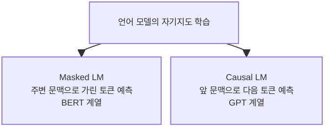

두 방식 모두 사람이 모든 문장에 정답표를 붙일 필요 없이 원문 자체에서 학습 문제를 만들 수 있다. 대규모 텍스트를 사용한 학습이 가능했던 중요한 이유다.

### 1-3. 단어가 아니라 Token을 처리한다

LLM은 문장을 사람이 보는 완전한 단어 단위로만 처리하지 않는다. 텍스트를 단어, 단어 조각, 기호 등으로 나눈 **Token**의 순서로 변환한다.

```text
“회의록을 공유했다”
→ [회의] [록] [을] [공유] [했다]
```

실제 분할 결과는 사용하는 Tokenizer마다 다르다. 각 Token ID는 먼저 고차원 숫자 벡터인 **Embedding**으로 변환된다. 여기에 Token의 위치 정보가 더해져 Transformer 층으로 들어간다.

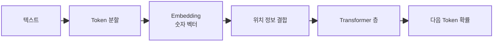

### 1-4. Self-Attention은 문맥에 따라 관계의 중요도를 계산한다

다음 문장을 보자.

```text
민수가 회의록을 검토한 뒤 그것을 채널에 공유했다.
```

`그것`을 이해하려면 `회의록`과의 관계가 중요하다. `공유했다`의 주체를 이해하려면 `민수`와의 관계가 중요하다. Self-Attention은 각 Token의 현재 표현으로부터 Query, Key, Value를 만들고, 어떤 다른 Token의 정보를 얼마나 참고할지 Attention weight를 계산한다.

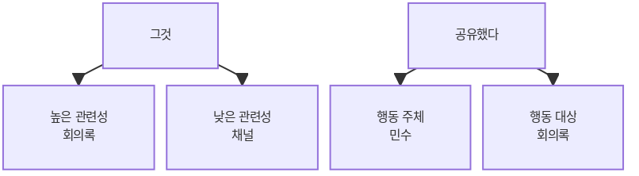

여러 Attention head는 서로 다른 관계를 포착할 수 있고, 여러 층을 지나며 각 Token의 표현은 주변 문맥을 반영한 표현으로 바뀐다.

### 1-5. ‘단어 관계의 가중치로 된 지식 맵’이라는 설명의 한계

Transformer를 “단어 사이의 관계를 가중치로 둔 지식 맵”이라고 표현하면 Self-Attention의 직관을 설명하는 데는 도움이 된다. 하지만 이를 문자 그대로 받아들이면 안 된다.

#### 맞는 부분

- Token은 벡터로 표현된다.
- 문맥 속 Token 사이의 관련성이 수치로 계산된다.
- 대규모 학습을 통해 문법, 의미, 사실과 패턴이 모델 파라미터에 분산되어 저장된다.
- 같은 Token도 문맥에 따라 다른 표현과 Attention 관계를 가진다.

#### 보완해야 할 부분

- Attention weight는 고정된 지식 그래프의 간선이 아니라 **현재 입력마다 다시 계산되는 값**이다.
- 모델 안에 사람이 읽을 수 있는 `서울 → 대한민국의 수도` 같은 명시적 지식 노드가 그대로 저장되는 것은 아니다.
- 지식은 수많은 파라미터와 중간 표현에 분산되어 있어 정확한 출처를 바로 추적하기 어렵다.
- 높은 Attention weight가 항상 사람이 말하는 설명 가능한 인과관계를 의미하지는 않는다.
- 학습 데이터가 늘어도 사실의 정확성과 최신성이 자동으로 보장되지는 않는다.

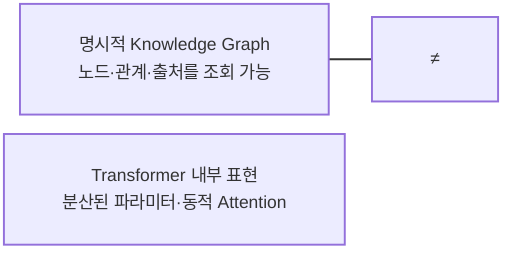

따라서 LLM을 “거대한 지식 DB”로 보고 내부에 저장된 사실을 그대로 꺼낸다고 생각하면 안 된다. LLM은 현재 문맥에서 다음 Token의 확률을 계산하도록 학습된 모델이며, 그 과정에서 유용한 언어·지식·추론 패턴이 나타난다.

### 1-6. 단순한 Token 예측에서 복잡한 능력이 나타나는 이유

다음 Token을 잘 예측하려면 모델은 단순히 단어 빈도만 외워서는 부족하다.

```text
대명사가 무엇을 가리키는가?
문장의 주어와 목적어는 무엇인가?
앞 문단의 주장과 뒤 문단의 결론은 어떻게 연결되는가?
질문의 의도에 맞는 답변 형식은 무엇인가?
코드의 다음 줄은 문법과 앞선 변수에 맞는가?
```

데이터, 모델 크기와 학습이 확장되면서 이런 예측을 잘하기 위한 내부 표현도 풍부해진다. 이후 Instruction tuning, 사람 또는 AI 피드백 기반 정렬, Tool-use 학습 등을 거치며 질문 응답과 지시 수행에 더 적합한 모델이 된다.

그러나 복잡한 능력이 생겼다는 사실과 결과가 항상 정확하다는 것은 별개다. 모델은 그럴듯하지만 틀린 내용을 만들 수 있고, 같은 입력에도 다른 결과를 낼 수 있다.

### 1-7. Transformer를 이해하면 에이전트 설계에서 무엇이 달라지는가

LLM의 특성을 이해하면 다음 책임을 모델 밖으로 빼야 하는 이유가 명확해진다.

| LLM의 특성 | 에이전트 설계 원칙 |
|---|---|
| 다음 Token을 확률적으로 생성 | 중요한 출력은 Schema와 코드로 검증 |
| 내부 지식의 출처를 직접 추적하기 어려움 | 실제 회의 데이터는 Tool로 조회하고 근거 ID 연결 |
| Context 안의 모든 텍스트에 영향을 받을 수 있음 | 외부 문서와 전사를 명령이 아닌 데이터로 격리 |
| 긴 기록에서 중요한 정보가 묻힐 수 있음 | 상태 저장과 Compact를 별도로 설계 |
| 권한 규칙을 이해해도 실수할 수 있음 | 서버와 DB가 권한을 강제 |
| 호출 사이에 영구 상태를 스스로 보장하지 않음 | 실행 상태와 체크포인트를 외부 저장소에 보존 |
| 같은 실패를 반복할 수 있음 | 최대 단계, 재시도와 반복 감지를 그래프에 명시 |

> **LLM은 의미 판단이 필요한 곳에 사용하고, 권한·상태 전이·검증·부작용은 결정론적인 시스템이 통제한다.**

---

## 2. Graph Engineering: 에이전트의 작동 방식을 설계하는 방법

### 2-1. Graph Engineering이란 무엇인가

에이전트 설계에서 Graph Engineering은 작업을 **Node, Edge, State와 조건부 전이**로 표현해 실행 흐름을 만드는 접근을 의미한다.

```text
Graph = Nodes + Edges + State + Transition conditions
```

| 요소 | 의미 | ZEN AI 예시 |
|---|---|---|
| Node | 하나의 작업 단계 | 회의 검색, 권한 검사, 회의록 조회 |
| Edge | 다음 단계로 이동하는 연결 | 검색 후 후보 판정으로 이동 |
| State | 단계 사이에 전달되는 누적 정보 | meeting_id, 권한, 근거 수집 여부 |
| Condition | 어느 Edge를 선택할지 정하는 규칙 | 후보가 여러 개면 사용자에게 질문 |
| Cycle | 결과가 부족할 때 이전 판단을 반복 | 근거 부족 시 전사 추가 검색 |
| Checkpoint | 중단 후 재개할 저장 지점 | 선택한 회의와 완료 단계 저장 |

### 2-2. 마인드맵과 비슷하지만 인공 신경망은 아니다

Graph Engineering을 “마인드맵의 인공 신경망 버전”이라고 표현하면 생각을 연결된 구조로 본다는 점에서는 직관적이다. 하지만 기술적으로는 서로 다르다.

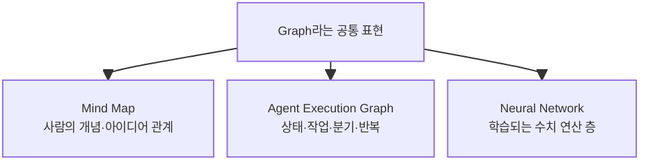

| 구분 | 마인드맵 | 에이전트 실행 그래프 | 인공 신경망 |
|---|---|---|---|
| 목적 | 생각과 개념 정리 | 프로그램 실행 흐름 통제 | 데이터에서 패턴 학습 |
| Node | 개념·주제 | 함수·LLM·Tool·승인 단계 | 수치 연산 단위 또는 층 |
| Edge | 의미적 연관 | 실행 순서와 조건 | 학습되는 수치 연결 |
| 변경 방식 | 사람이 편집 | 개발자가 설계하고 런타임이 실행 | 학습으로 파라미터 갱신 |
| 결과 | 이해를 돕는 그림 | 실제 상태 변화와 실행 | 입력에 대한 예측 |

에이전트 실행 그래프의 Node가 신경세포처럼 학습되는 것은 아니다. Node는 일반 코드, LLM 호출, Tool 호출, 검증기 또는 사람 승인 단계가 될 수 있다. Edge도 학습된 가중치라기보다 개발자가 정한 고정 연결이나 현재 State를 보고 선택하는 조건이다.

> **Graph Engineering은 AI의 뇌를 새로 만드는 일이 아니라, 이미 있는 LLM을 통제 가능한 업무 흐름 안에 배치하는 일이다.**

### 2-3. 왜 에이전트에 Graph가 필요한가

단순 에이전트는 다음과 같은 Loop로도 만들 수 있다.

```text
LLM 판단 → Tool 호출 → 결과 반환 → LLM 재판단
```

하지만 실제 제품에서는 다음 요구가 생긴다.

- 특정 단계는 반드시 코드가 실행해야 한다.
- 오류 유형에 따라 다른 재시도 정책이 필요하다.
- 쓰기 전에 사람 승인을 받아야 한다.
- 중단 후 같은 지점에서 재개해야 한다.
- 완료된 단계를 다시 실행하면 안 된다.
- 어떤 경로를 거쳤는지 감사 로그가 필요하다.
- 확정본과 초안을 섞으면 안 된다.

Graph는 이 규칙을 프롬프트 속 자연어 희망 사항이 아니라 실행 구조로 표현한다.

### 2-4. LangGraph는 무엇을 제공하는가

LangGraph는 에이전트 Workflow를 Graph로 모델링하기 위한 런타임이다. 공식 문서에서 핵심 구성은 State, Node와 Edge다.

- **State**: 전체 실행 과정에서 공유하고 갱신하는 데이터
- **Node**: State를 받아 작업하고 State 일부를 갱신하는 함수
- **Edge**: 다음에 실행할 Node를 결정하는 연결
- **Conditional Edge**: State에 따라 다음 Node를 선택
- **Persistence/Checkpoint**: 실행 상태 저장과 재개
- **Interrupt**: 사람 입력이나 승인을 기다리는 중단 지점

LangGraph의 Node에는 LLM만 들어가는 것이 아니다.

```text
일반 코드
LLM 한 번 호출
Tool 실행
입력·출력 검증
사람 승인
내부 Loop를 가진 하위 에이전트
```

라이브러리가 올바른 설계를 자동으로 만들어 주지는 않는다. 어떤 State를 저장하고, 어느 판단을 코드와 LLM 중 누가 담당하며, 승인 경계를 어디에 둘지는 설계자가 결정해야 한다.

### 2-5. Workflow와 Agentic Graph의 차이

Graph를 사용한다고 모두 자율 에이전트가 되는 것은 아니다.

#### 고정 Workflow Graph

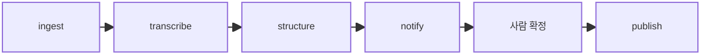

실행 순서가 코드로 정해져 있다. 실패 시 재시도나 사람 승인이 있어도 모델이 다음 경로를 자유롭게 선택하지 않는다면 Workflow다.

#### Agentic Graph

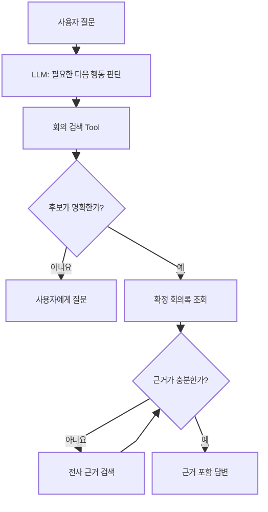

모델과 조건 함수가 현재 State를 보고 다음 경로를 선택한다. Graph는 고정 구조와 제한된 자율 판단을 한 시스템 안에서 섞을 수 있다.

---

## 3. Transformer와 Graph를 함께 이해해야 하는 이유

### 3-1. 확률적 판단과 결정론적 통제를 분리한다

에이전트의 모든 단계를 LLM에 맡길 필요가 없다.

| 작업 | 권장 담당 |
|---|---|
| “지난 회의”의 의미 해석 | LLM |
| 회의 후보 중 사용자 의도와 가까운 것 판단 | LLM 또는 명확한 규칙 |
| 인증 사용자와 테넌트 확인 | 서버 코드 |
| 회의 접근 권한 검사 | 서버·DB 정책 |
| JSON Schema 검증 | 코드 |
| 검색 결과가 비어 있는지 확인 | 코드 |
| 근거가 의미적으로 충분한지 판단 | LLM + 검증 규칙 |
| 최대 재시도 횟수 | Graph Runtime |
| 채널 게시 승인 | 사람 + 서버 |

LLM의 강점은 모호한 언어와 의미 판단이다. Graph의 강점은 순서, 상태, 예외와 권한 경계를 명시적으로 통제하는 것이다.

### 3-2. Prompt로 설명할 규칙과 Graph로 강제할 규칙을 나눈다

다음은 Prompt에 적을 수 있다.

```text
확정 회의록만으로 근거가 부족하면 전사 세그먼트를 검색한다.
```

그러나 다음은 Graph와 서버가 강제해야 한다.

```text
전사 검색은 선택된 meeting_id 안에서만 실행
사용자에게 접근 권한이 없으면 데이터 반환 금지
Tool 호출은 최대 5회
게시 Node는 approval=true일 때만 진입
```

> 모델이 지켜야 한다고 이해하는 규칙과 시스템이 어길 수 없게 만드는 규칙은 다르다.

### 3-3. Tool은 Graph의 Node가 될 수 있다

Tool과 Graph는 경쟁하는 개념이 아니다.

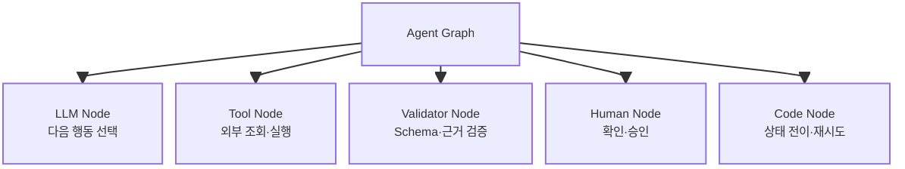

Tool Description과 Schema는 LLM이 Tool을 올바르게 선택하고 호출하도록 돕는다. Graph는 Tool을 언제 노출하고, 호출 전후에 무엇을 검사하며, 결과에 따라 어디로 이동할지를 통제한다.

### 3-4. Graph가 복잡할수록 좋은 것은 아니다

Graph의 Node를 세분화할수록 시각적으로 정교해 보이지만 운영 비용도 늘어난다.

- State 필드와 전이 규칙 증가
- Checkpoint와 버전 호환 문제
- 분기 조합에 따른 테스트 증가
- 디버깅과 관찰 가능성 복잡화
- LLM 호출과 Tool 왕복 증가

다음 조건에서만 Node나 분기를 추가하는 편이 좋다.

- 결과에 따라 실제 다음 행동이 달라진다.
- 별도 재시도·권한·승인 정책이 필요하다.
- 중단 후 해당 단계부터 재개해야 한다.
- 독립적으로 관찰하고 평가할 가치가 있다.

항상 같은 순서로 실행되는 작은 코드 조각은 하나의 Node나 Tool 내부에 두는 것이 낫다.

---

## 4. ZEN AI를 Graph로 설계하는 실용적인 방법

### 4-1. 두 개의 Graph를 구분한다

ZEN AI에는 성격이 다른 두 실행 흐름이 있다.

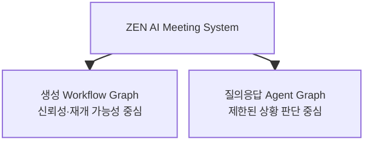

#### 회의록 생성 Graph

순서가 명확하므로 Durable Workflow로 설계한다.

```text
ingest → transcribe → structure → validate → notify
→ 사람 검토·확정 → publish
```

LLM은 `structure`에서 회의 내용을 구조화하지만 다음 Pipeline 단계를 자유롭게 선택하지 않는다.

#### 회의 질의응답 Graph

사용자의 표현과 검색 결과에 따라 다음 행동이 달라지므로 제한된 Agentic Graph로 설계한다.

```text
요청 해석 → 회의 후보 검색 → 모호성 판정
→ 확정 회의록 조회 → 근거 충분성 판정
→ 필요 시 전사 검색 → 답변
```

### 4-2. Q&A Graph의 State 초안

State에는 실행에 필요한 사실과 진행 상태를 명시적으로 저장한다.

```ts
type MeetingQaState = {
  requestId: string;
  userQuery: string;

  // 서버가 관리하며 모델이 수정하지 않는 보안 컨텍스트
  authenticatedUserId: string;
  communityId: string;

  // 검색과 선택 상태
  meetingCandidates: MeetingCandidate[];
  selectedMeetingId: string | null;
  ambiguityReason: string | null;

  // 근거 상태
  confirmedMinutes: ConfirmedMinutes | null;
  evidenceSegments: TranscriptSegment[];
  evidenceSufficient: boolean;

  // 실행 제어
  completedSteps: string[];
  toolCallCount: number;
  retryCountByNode: Record<string, number>;
  lastError: ToolError | null;
  status: "running" | "waiting_user" | "completed" | "failed";
};
```

인증 정보는 State에 존재할 수 있지만 모델이 보는 Context와는 분리한다. Node가 LLM을 호출할 때는 판단에 필요한 최소 필드만 선택해 전달한다.

### 4-3. Node의 책임 초안

| Node | 담당 | LLM 사용 |
|---|---|---:|
| `classify_request` | 실제 회의 데이터가 필요한 요청인지 판단 | 선택적 |
| `search_meetings` | 권한 적용 회의 검색 Tool 실행 | 아니요 |
| `resolve_meeting` | 후보의 모호성 판정 | 예 |
| `ask_user` | 후보 목록을 보여 주고 선택 대기 | 아니요 |
| `get_minutes` | 확정 회의록 Tool 실행 | 아니요 |
| `assess_evidence` | 질문에 답할 근거가 충분한지 판단 | 예 |
| `search_transcript` | 선택된 회의 안에서 전사 검색 | 아니요 |
| `compose_answer` | 근거 ID와 함께 답변 작성 | 예 |
| `validate_answer` | 근거 ID·권한·출력 형식 검사 | 코드 중심 |
| `handle_error` | 오류 유형에 따른 재시도·종료 | 아니요 |

### 4-4. 권한과 보안을 Graph에 반영하는 방법

Graph의 분기만으로 권한을 보장해서는 안 된다. 각 Tool이 서버에서 인가를 강제하되 Graph에도 안전한 경로를 둔다.

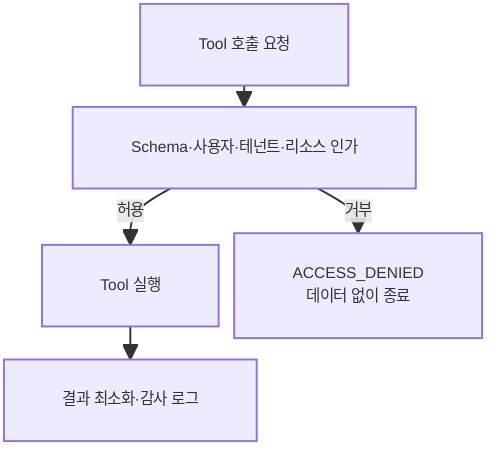

보안 원칙:

- `authenticatedUserId`와 `communityId`는 서버만 설정
- 모든 DB 조회는 Tool 내부에서 권한 필터 적용
- `ACCESS_DENIED` 결과에는 비공개 리소스의 제목이나 존재 여부를 불필요하게 노출하지 않음
- Tool 결과의 전사 텍스트는 명령이 아니라 신뢰할 수 없는 데이터로 취급
- 답변 Validator가 인용한 Segment가 선택된 회의에 속하는지 검사
- 쓰기 Graph를 추가할 때는 Preview와 Approval Node를 분리

### 4-5. LangGraph 도입 순서

처음부터 모든 기능을 복잡한 Graph로 만들 필요는 없다.

```text
1. State와 성공·실패 조건 정의
2. 결정론적 Node부터 구현
3. 세 개의 읽기 Tool 연결
4. 실제 의미 판단이 필요한 Node에만 LLM 추가
5. 조건부 Edge와 최대 반복 횟수 설정
6. Checkpoint와 사용자 질문 Interrupt 추가
7. Trace와 Node별 Evals 작성
8. 내부 베타 실패를 보고 Graph 수정
```

#### 1단계에서 먼저 답할 질문

- 최종 성공 상태는 무엇인가?
- 확정 회의록이 없으면 성공인가 실패인가?
- 회의 후보가 몇 개일 때 사용자에게 물을 것인가?
- 전사 검색은 최대 몇 번 허용할 것인가?
- 어떤 State가 Checkpoint에 저장되어야 하는가?
- 어떤 데이터는 LLM Context에 절대 넣지 않을 것인가?

LangGraph 코드를 먼저 작성하기보다 이 답을 먼저 정해야 한다.

### 4-6. Graph 평가 단위

최종 답변만 평가하면 실패 원인을 알기 어렵다. Node와 Edge 단위로 나눈다.

| 평가 대상 | 지표 예시 |
|---|---|
| 요청 분류 | Tool 필요성 정확도 |
| 회의 검색 | 필요한 회의 Recall@K, 권한 누출 0건 |
| 모호성 판정 | 불필요한 질문률, 잘못된 자동 선택률 |
| Tool 호출 | 선택·인자·실행 성공률 |
| 근거 충분성 | 불필요한 전사 검색률, 근거 누락률 |
| 답변 작성 | 사실·근거 일치율 |
| Loop | 평균 단계 수, 반복 감지 건수 |
| 전체 Graph | 성공률, 지연, 토큰, 비용 |

### 4-7. 현재 프로젝트에 대한 결론

ZEN AI에서 Transformer를 직접 새로 설계하거나 학습할 필요는 없다. Transformer에 대한 이해는 모델의 한계를 알고 책임을 올바르게 나누기 위해 필요하다.

Graph Engineering은 실제 구현에 직접 적용할 수 있다. 다만 LangGraph를 사용한다는 이유만으로 전체 Pipeline을 자율 에이전트로 만들지는 않는다.

```text
회의록 생성
→ 고정적이고 재개 가능한 Workflow Graph

회의 지식 검색과 근거 탐색
→ 소수 Tool을 사용하는 제한된 Agent Graph

권한·검증·게시
→ 서버 정책, Validator와 사람 승인으로 강제
```

---

## 5. 두 문장을 더 정확하게 다듬으면

| 처음의 직관 | 보완한 설명 |
|---|---|
| Transformer는 문장에 구멍을 뚫고 답을 맞히며 학습했다. | BERT 계열은 Masked Token을, GPT 계열 생성 모델은 주로 다음 Token을 예측한다. 두 방식 모두 원문에서 학습 신호를 만드는 자기지도 학습이다. |
| 데이터가 늘면서 단어 관계를 가중치로 둔 지식 맵이 되었다. | 학습이 확장되며 언어와 지식 패턴이 파라미터에 분산 저장되고, Self-Attention은 입력마다 Token 관계를 동적으로 계산한다. 이는 명시적 지식 그래프와 다르다. |
| Graph Engineering은 마인드맵의 인공 신경망 버전이다. | 마인드맵처럼 연결 구조를 사용하지만, 에이전트에서는 Node·Edge·State·조건으로 실제 실행 흐름을 설계한다. 신경망처럼 연결 가중치를 학습하는 구조는 아니다. |
| LangGraph를 알면 올바른 에이전트를 만들 수 있다. | LangGraph는 상태, 분기, 반복, Checkpoint와 승인을 구현하는 도구다. 올바른 책임 분리·권한·성공 조건·평가 설계는 개발자가 결정해야 한다. |

---

## 핵심 정리

1. Transformer는 Token 사이의 문맥적 관련성을 계산하는 Attention 기반 신경망 구조다.
2. ‘빈칸 맞히기’는 BERT 계열의 대표 방식이고, GPT 계열 LLM은 주로 다음 Token 예측으로 사전 학습한다.
3. LLM의 지식은 명시적 지식 맵이 아니라 수많은 파라미터와 문맥 표현에 분산되어 있다.
4. Attention weight는 입력마다 동적으로 계산되며 사실의 출처나 인과관계를 자동으로 보장하지 않는다.
5. Graph Engineering은 모델 내부 신경망이 아니라 에이전트의 State, Node, Edge, 분기와 반복을 설계하는 일이다.
6. LangGraph의 Node에는 LLM뿐 아니라 일반 코드, Tool, Validator와 사람 승인도 들어갈 수 있다.
7. 의미 판단은 LLM에, 권한·상태 전이·검증·부작용은 Graph Runtime과 서버에 맡긴다.
8. ZEN AI 생성 과정은 Workflow Graph로, 회의 검색과 근거 탐색은 제한된 Agent Graph로 설계하는 것이 적합하다.

> **Transformer를 이해하면 LLM에 무엇을 맡길지 알 수 있고, Graph를 이해하면 맡긴 일을 어떤 경계 안에서 실행시킬지 설계할 수 있다.**

---

## 참고 자료

### Transformer와 언어 모델

- Vaswani et al., [Attention Is All You Need](https://arxiv.org/abs/1706.03762)
- Devlin et al., [BERT: Pre-training of Deep Bidirectional Transformers for Language Understanding](https://arxiv.org/abs/1810.04805)
- Google Research, [BERT 공식 저장소와 Masked Language Modeling 설명](https://github.com/google-research/bert)

### Graph 기반 에이전트 설계

- LangChain, [LangGraph Graph API Overview](https://docs.langchain.com/oss/python/langgraph/graph-api)
- LangChain, [LangGraph Workflows and Agents](https://docs.langchain.com/oss/python/langgraph/workflows-agents)

