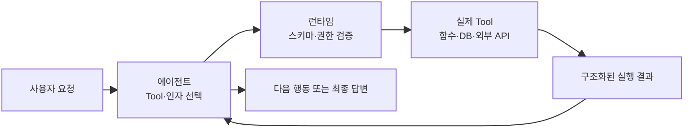
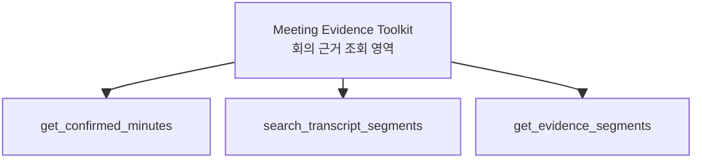
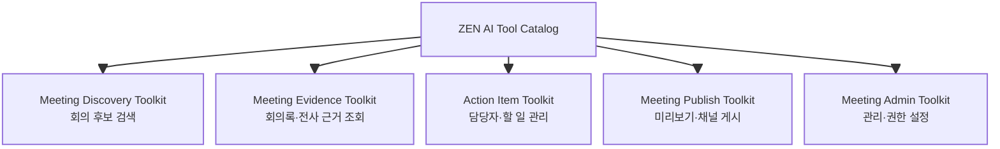
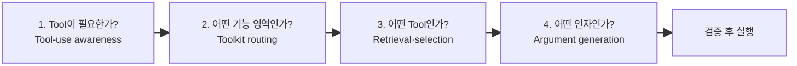
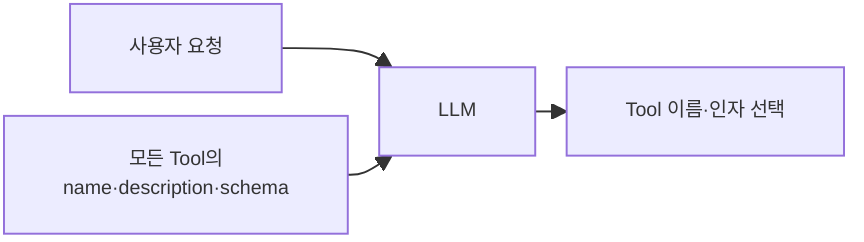
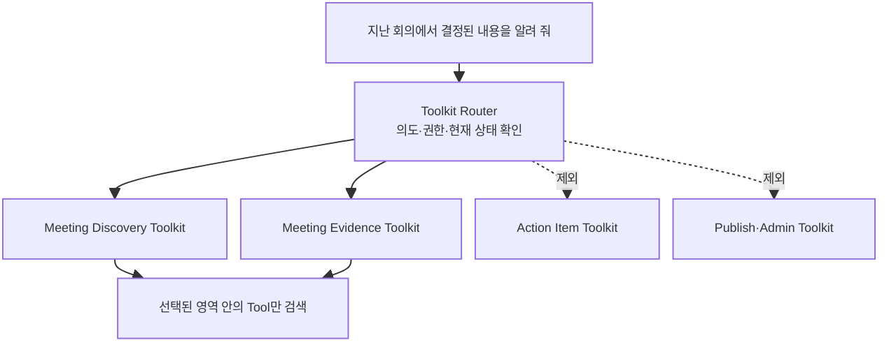
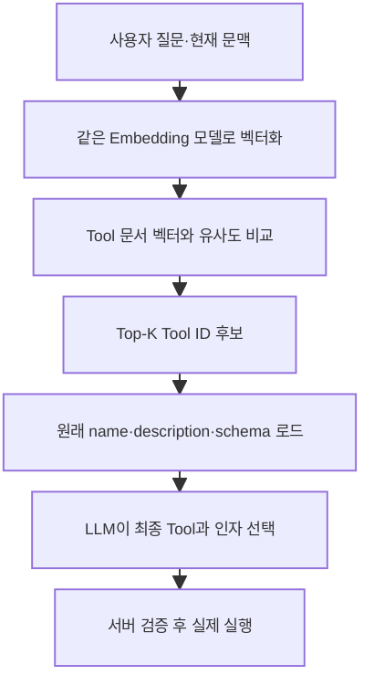
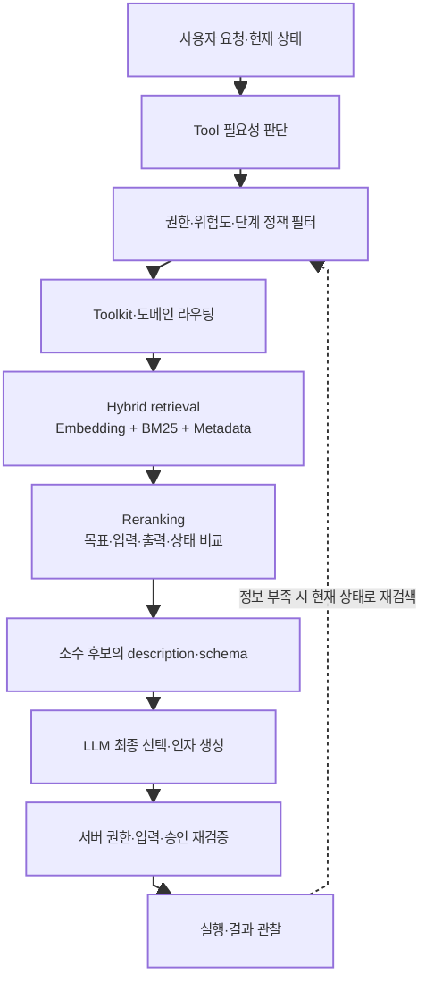
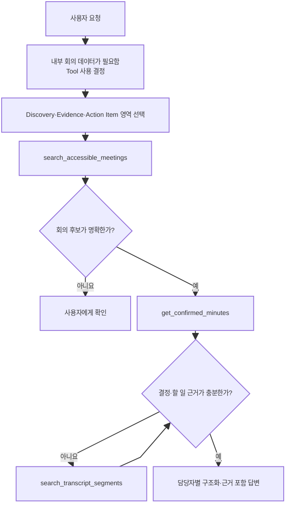

# 에이전트의 Tool과 선택 과정

> [[02. AI 에이전트를 구성하는 핵심 요소]]에서는 Tool을 에이전트가 외부를 관찰하고 실제 행동을 수행하게 하는 눈·귀·팔로 소개했다. 이번 문서에서는 Tool의 정확한 의미, Tool과 Toolkit의 차이, 그리고 에이전트가 많은 Tool 중 필요한 것을 찾아 호출하기까지의 의사결정 과정을 살펴본다.

---

## 1. Tool이란 무엇인가

### 1-1. 모델의 언어 능력을 실제 시스템과 연결하는 인터페이스

대규모 언어 모델은 문장을 이해하고 생성할 수 있지만, 모델 내부의 지식만으로는 다음 일을 신뢰성 있게 처리할 수 없다.

- 현재 사용자가 접근할 수 있는 최근 회의 조회
- 데이터베이스에 저장된 확정 회의록 확인
- 정확한 계산이나 파일 형식 검증
- 채널에 메시지 게시
- 외부 업무 관리 시스템에 할 일 생성

이때 사용하는 것이 Tool이다.

> **Tool은 에이전트가 모델 내부의 지식과 텍스트 생성 능력만으로 수행할 수 없는 작업을 하기 위해 호출하는, 명확한 입출력 계약을 가진 외부 기능이다.**

조금 더 기술적으로 표현하면 다음과 같다.

> **Tool은 이름, 설명, 입출력 스키마, 실행 로직, 권한 정책을 가진 인터페이스로서 모델의 판단을 실제 시스템의 데이터와 행동에 연결한다.**



모델이 직접 데이터베이스나 외부 API를 실행하는 것은 아니다. 모델은 일반적으로 사용할 Tool 이름과 입력 인자를 구조화해 **호출을 요청**한다. 애플리케이션 런타임이 요청을 검증하고 실제 기능을 실행한 뒤 결과를 모델에 돌려준다.

### 1-2. Tool을 구성하는 항목

```text
Tool =
  Name
  + Description
  + Input schema
  + Output contract
  + Execution code
  + Authorization policy
  + Side-effect semantics
  + Error semantics
  + Observability
```

| 구성 요소 | 역할 |
|---|---|
| Name | 모델과 개발자가 Tool을 식별하는 이름 |
| Description | 언제, 어떤 목적으로 사용해야 하는지 설명 |
| Input schema | 허용되는 입력 필드·자료형·필수 여부 정의 |
| Output contract | 성공 결과의 의미와 구조 정의 |
| Execution code | 실제 함수, DB 질의 또는 외부 API 실행 |
| Authorization policy | 누가 어떤 리소스에 사용할 수 있는지 통제 |
| Side-effect semantics | 읽기인지 쓰기인지, 어떤 상태가 변하는지 표시 |
| Error semantics | 오류 원인과 재시도 가능 여부 표현 |
| Observability | 호출자, 입력, 결과, 지연, 비용과 오류 기록 |

모델의 Tool 선택에 직접 제공되는 정보는 보통 `name`, `description`, `input schema`다. 하지만 안전한 실행을 위해서는 모델이 보지 않는 서버 측 권한과 검증 정책도 반드시 필요하다.

### 1-3. ZEN AI의 Tool 예시

```json
{
  "name": "search_accessible_meetings",
  "description": "현재 사용자가 열람할 수 있는 회의를 제목, 날짜, 참석자 또는 채널 조건으로 검색한다. 특정 회의의 전체 내용을 가져오는 용도로는 사용하지 않는다.",
  "inputSchema": {
    "type": "object",
    "properties": {
      "query": {
        "type": "string",
        "description": "회의 제목이나 주제를 찾기 위한 검색어"
      },
      "dateFrom": {
        "type": ["string", "null"],
        "format": "date",
        "description": "검색 시작일. 지정하지 않으면 null"
      },
      "dateTo": {
        "type": ["string", "null"],
        "format": "date",
        "description": "검색 종료일. 지정하지 않으면 null"
      }
    },
    "required": ["query", "dateFrom", "dateTo"],
    "additionalProperties": false
  }
}
```

이 정의를 본 모델은 “지난주 디자인 회의를 찾아 줘”라는 요청에 이 Tool이 적합하다고 판단하고 다음과 같은 호출을 요청할 수 있다.

```json
{
  "query": "디자인",
  "dateFrom": "2026-08-03",
  "dateTo": "2026-08-09"
}
```

서버는 현재 사용자의 신원과 테넌트를 모델 입력이 아닌 인증 세션에서 가져와 접근 가능한 회의만 반환한다. 사용자가 입력 인자에 다른 사용자 ID를 넣어 권한을 바꾸게 해서는 안 된다.

### 1-4. Tool의 종류

#### 읽기·관찰 Tool

외부 상태를 확인하고 모델이 다음 판단을 할 수 있도록 정보를 가져온다.

```text
search_accessible_meetings
get_confirmed_minutes
search_accessible_transcript_segments
```

#### 계산·검증·변환 Tool

결정론적으로 처리하는 편이 모델의 자유 생성보다 정확한 작업을 수행한다.

```text
validate_minutes_schema
merge_transcript_segments
resolve_due_date
```

#### 쓰기·행동 Tool

외부 시스템의 상태를 실제로 변경한다.

```text
save_minutes_draft
publish_minutes_to_channel
create_external_task
```

쓰기 Tool에는 권한 확인, 사람 승인, 멱등성, 감사 로그가 특히 중요하다. 읽기와 쓰기를 하나의 범용 Tool에 섞으면 모델이 의도하지 않은 상태 변경을 요청할 위험이 커진다.

### 1-5. API, RAG, MCP와 무엇이 다른가

| 개념 | 의미 | Tool과의 관계 |
|---|---|---|
| API | 소프트웨어 시스템 사이의 기술적 인터페이스 | API를 모델이 이해하기 쉬운 Tool로 포장할 수 있다. |
| RAG | 관련 자료를 검색해 모델 컨텍스트에 제공하는 패턴 | 검색 기능이 하나 이상의 Tool로 제공될 수 있다. |
| MCP | Tool과 Resource 등을 표준 방식으로 제공하는 프로토콜 | 하나의 MCP 서버가 여러 Tool을 제공할 수 있다. |
| Tool | 모델이 목적과 사용 조건을 이해하고 호출하는 의미적 인터페이스 | 내부 함수, API 또는 MCP를 통해 구현할 수 있다. |

모든 Tool이 RAG인 것은 아니며, Tool을 반드시 MCP로 구현해야 하는 것도 아니다. ZEN AI 내부 함수도 충분히 Tool이 될 수 있다.

---

## 2. Tool과 Toolkit

### 2-1. 기본 차이

> **Tool은 에이전트가 호출하는 개별 기능이고, Toolkit은 같은 업무 목적이나 권한 범위를 가진 관련 Tool을 묶어 관리하는 논리적 단위다.**



위 그림에서 `get_confirmed_minutes`는 하나의 Tool이고, 관련된 세 Tool을 묶은 `Meeting Evidence Toolkit`은 Toolkit이다.

모델이 일반적으로 직접 호출하는 것은 Toolkit이 아니라 그 안의 개별 Tool이다. Toolkit은 런타임이 현재 요청에 관련된 Tool만 묶어 제공하고, 공통 권한과 정책을 관리하기 위한 단위다.

### 2-2. Toolkit은 단순한 Tool 배열 이상이다

```text
Toolkit =
  관련 Tool 목록
  + 적용 업무 영역
  + 공통 인증·인가 정책
  + 공통 데이터 타입
  + 공통 오류 규칙
  + 위험도·승인 정책
  + 사용할 수 있는 에이전트 역할
  + 버전 정보
```

예를 들어 회의 조회 Toolkit은 읽기 권한만 허용하고, 회의 게시 Toolkit은 별도의 쓰기 권한과 사람 승인을 요구하도록 분리할 수 있다.



### 2-3. Toolkit이라는 용어는 완전히 표준화되어 있지 않다

프레임워크마다 비슷한 개념을 서로 다른 이름으로 부른다.

| 개념 | 사용되는 명칭 예시 |
|---|---|
| 개별 호출 기능 | Tool, Function, Action |
| 관련 기능 묶음 | Toolkit, Toolset, Plugin |
| 외부 제공 서비스 | MCP Server, Connector |
| 재사용 업무 능력 | Skill |

따라서 설계 문서에서는 용어의 범위를 먼저 선언하는 것이 좋다.

> 이 문서에서 Toolkit은 하나의 업무 영역을 지원하기 위해 관련 Tool과 공통 정책을 묶은 논리적 단위를 의미한다.

### 2-4. Tool이 적어도 Toolkit을 만들어야 하는가

그렇지 않다. 예를 들어 ZEN AI 질의응답 에이전트에 다음 세 Tool만 있고 각 용도가 명확하다면 모두 모델에 직접 제공해도 된다.

```text
search_accessible_meetings
get_confirmed_minutes
search_transcript_segments
```

코드 정리를 위해 `MeetingToolkit`이라는 묶음을 만들 수는 있지만, Tool 선택 성능을 높이기 위한 별도의 Toolkit 라우팅 단계는 필요하지 않다.

Toolkit 라우팅은 다음과 같은 문제가 실제로 생길 때 의미가 있다.

- 전체 Tool 정의가 컨텍스트를 많이 차지한다.
- 이름과 기능이 비슷한 Tool 사이에서 선택 오류가 발생한다.
- 요청마다 전체 Tool 중 대부분이 필요하지 않다.
- 읽기·쓰기·관리 권한을 기능 영역별로 분리해야 한다.
- Tool 카탈로그가 여러 서비스와 팀에 걸쳐 계속 확장된다.

`Tool이 N개 이상이면 Toolkit을 사용한다`와 같은 고정 기준은 없다. 개수보다 **의미적 충돌, 권한, 토큰 비용, 실제 평가 결과**가 중요하다.

---

## 3. Tool을 사용하겠다는 의사결정 과정

### 3-1. 하나의 선택이 아니라 네 단계다

에이전트가 Tool을 사용한다는 결정은 사실 다음 네 문제의 결합이다.



1. **Tool-use awareness**: 모델의 지식만으로 답할지 외부 기능을 사용할지 판단한다.
2. **Toolkit routing**: 어떤 업무 영역의 Tool 집단이 필요한지 좁힌다.
3. **Tool retrieval·selection**: 후보 Tool을 검색하고 실제 사용할 Tool을 선택한다.
4. **Argument generation**: 선택한 Tool의 스키마에 맞는 입력 인자를 만든다.

여러 Tool을 순서대로 사용해야 한다면 이 과정은 한 번으로 끝나지 않는다. 실행 결과와 현재 상태를 반영해 다시 반복한다.

### 3-2. 먼저 Tool이 필요한지 판단한다

다음 상황에서는 Tool 사용을 강제하거나 강하게 유도해야 한다.

- 최신 정보 또는 실제 서비스 상태가 필요하다.
- 사용자별 비공개 데이터가 필요하다.
- 모델의 학습 데이터에 존재할 수 없는 내부 정보가 필요하다.
- 정확한 계산·검증·변환이 필요하다.
- 외부 상태를 실제로 변경해야 한다.
- 출처와 근거를 제시해야 한다.

ZEN AI에서는 `내 회의`, `지난 회의`, `회의 결정`, `액션 아이템`처럼 실제 서비스 데이터가 필요한 요청에 모델 기억으로 답하면 안 된다. 권한이 내장된 회의 Tool을 반드시 사용하도록 시스템 정책으로 정해야 한다.

### 3-3. Tool이 적을 때: 모두 모델에 제공한다

가장 단순한 구조는 사용자 요청과 함께 모든 Tool의 `name`, `description`, `input schema`를 LLM에 제공하는 것이다.



이 방식은 폐기된 구식 방식이 아니다. Tool이 적고 용도가 명확할 때 가장 단순하고 신뢰하기 쉬운 방법이다.

장점:

- 별도의 검색 시스템이 필요 없다.
- 검색 단계에서 필요한 Tool을 누락할 위험이 없다.
- 디버깅과 평가가 쉽다.

Tool이 많아지면 모든 정의가 입력 토큰을 차지하고, 비슷한 Tool 사이에서 모델이 혼동하며, 관련 없는 위험한 Tool까지 노출되는 문제가 생긴다.

### 3-4. Tool이 많을 때: Toolkit으로 1차 범위를 좁힌다

사용자가 다음과 같이 요청했다고 가정하자.

```text
“지난 회의에서 결정된 내용을 알려 줘.”
```

전체 Tool 카탈로그에 회의 검색, 근거 조회, 액션 아이템, 채널 게시, 관리자 설정 Tool이 함께 있다면 먼저 관련 기능 영역을 좁힐 수 있다.



1차 라우팅은 규칙, 업무 분류 모델, LLM 또는 임베딩 검색으로 구현할 수 있다. 권한과 위험도처럼 반드시 지켜야 하는 조건은 유사도나 모델 판단보다 서버의 정책 필터로 먼저 제한한다.

Toolkit을 반드시 먼저 고른 뒤 Tool을 검색해야 하는 것은 아니다. 계층 구조가 명확한 대규모 카탈로그에서는 유용하지만, 어떤 시스템은 전체 Tool 문서에서 바로 후보를 검색한 뒤 메타데이터로 필터링한다. 중요한 것은 최종 LLM에 관련 있는 소수의 Tool 정의만 제공하는 것이다.

### 3-5. Description을 미리 임베딩 벡터로 만드는 방식

사용자가 말한 방식은 일반적으로 다음 이름으로 불린다.

- Tool retrieval
- Dynamic tool selection
- Tool search
- Contextual function selection

핵심은 Tool의 자연어 설명을 **미리 검색 가능한 벡터로 인덱싱**하고, 실행 시 사용자 요청과 의미적으로 가까운 Tool 후보를 찾는 것이다.

#### 준비 단계: Tool 검색 문서 생성과 인덱싱

각 Tool마다 검색 전용 문서를 만든다.

```json
{
  "toolId": "search_accessible_meetings",
  "toolkit": "meeting_discovery",
  "searchText": "현재 사용자가 열람 가능한 회의를 제목, 날짜, 참석자, 채널 조건으로 검색한다. 지난 회의나 특정 주제의 회의를 찾을 때 사용한다. 회의의 전체 내용이나 전사 근거 조회에는 사용하지 않는다.",
  "operation": "search",
  "risk": "read",
  "requiredScope": "meeting:read"
}
```

검색 문서에는 다음 정보를 넣을 수 있다.

- Tool 이름과 description
- 사용해야 하는 경우와 사용하지 말아야 하는 경우
- 입력과 출력의 의미
- 소속 업무 영역 또는 Toolkit
- 읽기·쓰기 구분과 위험도
- 사용자가 자주 쓰는 대표 표현

이 자연어 문서를 임베딩 모델로 벡터화해 vector index에 저장한다. Tool 정의가 바뀌면 벡터도 다시 생성해야 한다.

#### 실행 단계: 사용자 요청과 의미가 가까운 후보 검색



여기서 바로잡아야 할 중요한 점이 있다.

> **벡터가 자연어보다 LLM이 이해하기 쉬운 것이 아니다.**

임베딩 벡터는 별도의 검색기가 많은 Tool 중 의미적으로 가까운 후보를 빠르고 저렴하게 찾기 위한 수학적 표현이다. 벡터 숫자를 LLM에 직접 보여주는 것이 아니다. 최종 LLM은 검색된 Tool의 원래 `name`, `description`, `input schema`를 보고 실제 Tool과 인자를 선택한다.

Microsoft Semantic Kernel의 Contextual Function Selection도 현재 대화 문맥과 함수의 이름·description을 임베딩해 비교하고, 관련성이 높은 소수의 함수만 모델에 노출하는 방식을 제공한다. 공식 문서에 따르면 함수 임베딩의 기본 입력은 이름과 description의 결합이며, 필요하면 추가 메타데이터를 포함하도록 바꿀 수 있다.

### 3-6. Description과 Schema는 각각 어떻게 사용되는가

| 정보 | 후보 검색에서의 역할 | 최종 선택·호출에서의 역할 |
|---|---|---|
| Name | 정확한 업무 단어와 식별자 제공 | 호출할 Tool 식별 |
| Description | 사용 목적과 적용 조건의 핵심 의미 제공 | 유사 Tool 사이의 최종 판단 |
| Input schema | 필요한 입력과 호출 가능성을 보조 | 올바른 인자와 자료형 생성 |
| Output 설명 | 다음 단계에 필요한 결과인지 판단 | Tool 결과 해석과 후속 계획 |
| Metadata | Toolkit, 권한, 위험도 필터 | 실행 정책과 승인 판단 보조 |

임베딩 검색에는 보통 name과 description이 중심이 된다. 입력 필드 이름과 설명을 검색 문서에 포함하면 도움이 될 수 있지만, 거대한 JSON Schema 전체를 그대로 임베딩하면 검색 의미가 흐려질 수도 있다. 따라서 검색용 텍스트는 별도로 설계하고, 최종 후보가 정해진 뒤 전체 schema를 LLM에 제공하는 방식이 실용적이다.

Description은 다음 질문에 답할 수 있어야 한다.

```text
이 Tool은 무엇을 하는가?
언제 사용해야 하는가?
언제 사용하지 말아야 하는가?
비슷한 Tool과 무엇이 다른가?
실행하려면 어떤 정보가 필요한가?
결과로 무엇을 얻는가?
```

최근 연구에서는 Tool description의 작은 표현 차이만으로 모델의 선택 빈도가 크게 바뀔 수 있다는 결과도 보고되었다. 따라서 description을 광고 문구처럼 쓰지 말고, 서로 겹치지 않는 사용 조건을 명확히 작성한 뒤 실제 요청 세트로 평가해야 한다.

### 3-7. 임베딩 유사도만으로는 부족하다

다음 Tool들은 의미적으로 매우 비슷하지만 업무적으로는 다르다.

```text
get_draft_minutes        초안 조회
get_confirmed_minutes    확정본 조회
regenerate_minutes       새 초안 생성

preview_channel_card     게시 전 미리보기
publish_minutes_to_channel 실제 채널 게시
```

단순 벡터 유사도만으로는 다음 차이를 안정적으로 구분하기 어렵다.

- 읽기와 쓰기
- 초안과 확정본
- 미리보기와 실제 게시
- 현재 사용자가 가진 권한
- 필요한 입력이 현재 확보되어 있는지
- 하나의 Tool과 여러 Tool 조합
- 이전 Tool 결과에 따른 다음 단계

따라서 임베딩 검색은 최종 행동 결정이 아니라 **후보 생성 단계**로 사용해야 한다.

### 3-8. 최근의 발전된 Tool 선택 구조

실제 대규모 Tool 카탈로그에서는 다음 단계를 조합할 수 있다.



#### 정책·권한·상태 필터

사용자 권한, 에이전트 역할, 작업 단계, 읽기·쓰기 위험도와 승인 여부를 코드로 제한한다. 권한 없는 Tool은 검색 점수가 높아도 모델에 제공하지 않는다.

#### Hybrid retrieval

Dense embedding과 BM25 또는 키워드 검색을 결합한다. 임베딩은 “지난번에 얘기한 방향”과 “최근 회의 결정 사항”처럼 표현이 달라도 의미가 가까운 요청을 찾는 데 유리하다. 키워드 검색은 `확정`, `초안`, `게시` 같은 정확한 구분어를 보존하는 데 유리하다.

#### Retrieve-then-rerank

빠른 검색으로 수십 개 후보를 찾은 뒤, cross-encoder나 작은 LLM이 다음 기준으로 재순위를 매긴다.

- 사용자 목표와 정확히 일치하는가
- 현재 필요한 입력을 확보할 수 있는가
- 출력이 다음 단계에 필요한 형태인가
- 읽기·쓰기 의도가 맞는가
- 현재 리소스 상태에서 실행 가능한가

ToolRerank는 Tool 라이브러리의 계층 구조를 반영한 재순위화를 제안했다. ToolRet 연구는 일반 검색에서 강한 retrieval 모델도 Tool 검색에서는 낮은 성능을 보일 수 있으며, 검색 품질 저하가 최종 Tool 실행 성공률까지 떨어뜨릴 수 있음을 보여준다.

#### Query rewriting과 복합 요청 분해

사용자의 추상적인 표현을 Tool 문서에 가까운 검색 문장으로 바꿀 수 있다.

```text
사용자 표현
“지난번에 얘기한 방향이 뭐였지?”

검색용 표현
“접근 가능한 최근 회의를 검색하고 확정 회의록의 결정 사항을 조회한다.”
```

ToolDreamer는 현재 질문에 필요할 법한 가상의 Tool 설명을 먼저 생성해 실제 Tool 문서와 검색하는 방법을 제안한다. ToolQP는 복합 요청을 하위 작업으로 나누고 각 하위 작업에 대해 반복적으로 Tool 검색 쿼리를 만든다.

#### 실행 상태를 반영한 동적 재검색

최초 질문으로 Tool을 한 번만 검색하지 않고 실행 결과에 따라 다음 후보를 다시 찾는다.

```text
get_confirmed_minutes 결과: 확정 회의록 없음
→ 상태 갱신
→ 정책상 초안 조회가 가능한지 판단
→ 필요한 다음 Tool을 다시 검색
```

Dynamic Tool Dependency Retrieval은 초기 질문뿐 아니라 진행 중인 계획과 Tool 사이의 의존성을 반영하는 방향을 제안한다.

### 3-9. 전체 예시

사용자 요청:

```text
“지난 회의의 결정 사항을 찾아서 담당자별 할 일로 정리해 줘.”
```

가능한 내부 과정:



이 예시에서 Tool 선택은 최초 요청에서 한 번만 일어나지 않는다. 회의 검색 결과와 회의록의 근거 상태를 관찰하면서 다음 Tool을 선택한다. 또한 사용자가 “정리해 줘”라고 했을 뿐 실제 외부 업무 생성을 요청하지 않았으므로 쓰기 Tool은 제공하거나 호출하지 않는다.

---

### 3-10. ZEN AI에 대한 단계별 권장안

#### 초기 단계

```text
search_accessible_meetings
get_confirmed_minutes
search_transcript_segments
```

세 Tool 모두 모델에 직접 제공한다. 별도의 Toolkit 라우터나 vector index를 만들지 않는다. 대신 실제 회의 내용에 관한 질문에는 반드시 권한이 적용된 Tool을 사용하도록 정책을 둔다.

#### 기능이 늘어난 단계

```text
Meeting Discovery Toolkit
Meeting Evidence Toolkit
Action Item Toolkit
Meeting Publish Toolkit
Meeting Admin Toolkit
```

읽기와 쓰기 영역을 분리하고, 기본 질의응답 에이전트에는 게시·관리 Tool을 제공하지 않는다.

#### 실제 선택 오류가 관찰되는 단계

```text
정책 필터
→ Toolkit 또는 도메인 라우팅
→ Hybrid retrieval
→ Reranking
→ 소수 후보를 LLM에 제공
→ 실행 전 서버 검증
```

다음 지표로 도입 효과를 평가한다.

- Tool 필요성 판단 정확도
- 필요한 Tool이 후보 안에 들어오는 비율인 Recall@K
- 후보 중 올바른 Tool을 고르는 선택 정확도
- 입력 인자 정확도
- 실제 실행 성공률
- 불필요한 Tool 호출 수
- 권한 없는 Tool 노출·호출 건수
- 잘못된 쓰기 실행 건수
- 최종 답변의 근거 정확성
- 지연 시간, 토큰과 비용

ZEN AI 초기 제품에서는 복잡한 검색 인프라를 먼저 만드는 것보다, 작고 명확한 Tool 집합과 평가 데이터를 먼저 갖추는 것이 중요하다. 실제 실패 사례가 쌓였을 때 그 원인이 Tool 필요성 판단, 후보 검색, 최종 선택, 인자 생성 중 어디에 있는지 구분한 뒤 필요한 단계를 추가해야 한다.

---

## 핵심 정리

1. Tool은 모델의 판단을 실제 데이터와 행동에 연결하는 명확한 입출력 계약이다.
2. Toolkit은 관련 Tool과 공통 정책을 묶는 관리·라우팅 단위이며, 모델은 보통 그 안의 개별 Tool을 호출한다.
3. Tool 선택은 필요성 판단, Toolkit 라우팅, 후보 검색·선택, 인자 생성의 여러 단계로 나뉜다.
4. Tool이 적다면 모든 description과 schema를 LLM에 직접 제공하는 방식이 가장 단순하다.
5. Tool이 많다면 description 등을 미리 임베딩해 관련 후보를 검색할 수 있다.
6. 임베딩 벡터는 LLM이 직접 이해하는 입력이 아니라 별도 검색기가 후보를 좁히는 수단이다.
7. 최종 LLM은 검색된 소수 Tool의 자연어 description과 schema를 보고 Tool과 인자를 선택한다.
8. 임베딩 유사도만으로 권한, 위험도, 읽기·쓰기와 Tool 의존성을 판정해서는 안 된다.
9. 최신 방향은 정책 필터, 계층 라우팅, hybrid retrieval, reranking, 요청 분해와 동적 재검색을 함께 사용하는 것이다.

> **Tool retrieval은 최종 선택이 아니라 후보 생성 과정이다. 권한과 위험도는 코드가 먼저 제한하고, 검색기는 관련 후보를 좁히며, LLM은 소수 후보의 자연어 설명과 스키마를 보고 최종 행동을 선택한다.**

---

## 참고 자료

### Tool 사용의 기초

- Schick et al., [Toolformer: Language Models Can Teach Themselves to Use Tools](https://arxiv.org/abs/2302.04761)
- Patil et al., [Gorilla: Large Language Model Connected with Massive APIs](https://arxiv.org/abs/2305.15334)

### Tool 검색과 선택

- Zheng et al., [ToolRerank: Adaptive and Hierarchy-Aware Reranking for Tool Retrieval](https://aclanthology.org/2024.lrec-main.1413/)
- Shi et al., [Retrieval Models Aren’t Tool-Savvy: Benchmarking Tool Retrieval for Large Language Models](https://aclanthology.org/2025.findings-acl.1258/)
- Faghih et al., [Tool Preferences in Agentic LLMs are Unreliable](https://aclanthology.org/2025.emnlp-main.1060/)
- Liu et al., [ToolScope: Enhancing LLM Agent Tool Use through Tool Merging and Context-Aware Filtering](https://aclanthology.org/2026.acl-long.1573/)
- Fang and Glass, [Beyond Single-Shot: Multi-step Tool Retrieval via Query Planning](https://aclanthology.org/2026.findings-acl.2090/)
- Patel et al., [Dynamic Tool Dependency Retrieval for Lightweight Function Calling](https://aclanthology.org/2026.findings-acl.1680/)
- [ToolDreamer: Instilling LLM Reasoning Into Tool Retrievers](https://aclanthology.org/2026.eacl-long.254/)

### 공식 구현 참고

- Microsoft, [Semantic Kernel Contextual Function Selection](https://learn.microsoft.com/en-us/semantic-kernel/frameworks/agent/agent-contextual-function-selection)
- Microsoft, [Semantic Kernel Plugins](https://learn.microsoft.com/en-us/semantic-kernel/concepts/plugins/)
